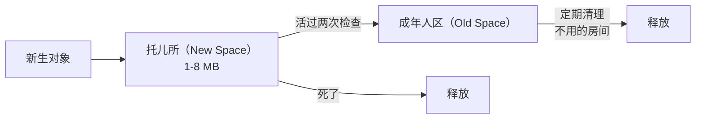

# Node.js V8 内存管理：你的内存去哪了

> 你的 Node.js 服务跑了三天，内存从 200MB 涨到 2GB。不是内存泄漏——是你不知道怎么查它到底吃了多少、吃在哪。

本文基于 Node.js v24。

## 先看清房子有多大

Node.js 进程的内存不是一整块——它像一栋多层建筑，每层住着不同的住户：

```text
整栋楼（RSS：OS 眼中的进程总内存）
├── 1 楼：V8 堆（JS 对象住这里）   ← process.memoryUsage().heapUsed
│   ├── 托儿所（New Space）       ← 刚出生的小对象，活不久的
│   └── 成年人区（Old Space）     ← 活过两次 GC 的长寿对象
├── 2 楼：Buffer 专区（External）  ← 大块数据，不在堆里！
├── 3 楼：编译后的机器码           ← 不怎么看
├── 4 楼：函数调用栈               ← 人来人往，自动清
└── 地下室：C++ 对象（libuv 等）   ← 基础管道，不怎么看
```

**最容易搞错的事**：`Buffer` 不住在堆里。你分配 2GB 的 Buffer，`heapUsed` 纹丝不动——但 `rss` 涨了 2GB。排查时看 `heapUsed` 觉得「没问题啊」，其实 Buffer 那层已经住满了。

```javascript
// 看各层住了多少人
console.log(process.memoryUsage());
// {
//   rss: 80_000_000,        // 整栋楼总建筑面积
//   heapTotal: 10_000_000,  // V8 堆占地面积
//   heapUsed: 6_000_000,    // V8 堆实际住了多少人
//   external: 2_000_000,    // Buffer 专区住户
//   arrayBuffers: 500_000   // ArrayBuffer 专项统计
// }
```

## 托儿所和成年人区

V8 管理堆内存的核心假设：**大多数对象都是短命的**。就像现实世界——刚出生的对象大部分很快就死了，活下来的才搬进成年人区。



### 托儿所怎么清

托儿所只有 1-8MB，很小——因为大部分婴儿对象活不过两次检查。清理方式是**搬家**：把还活着的对象从左边搬到右边，左边整个清空。

这个操作很快，因为只需要搬活的对象，死了的直接不管。**死的越多，清的越快**——这就是为什么短命对象对 GC 最友好。

### 成年人区怎么清

活过两次搬家的对象晋升到成年人区。这里不会天天清——V8 觉得「你都活这么久了，应该还要活很久」。

清理分三步：
1. **贴标签**——从门口出发，能走到的房间都贴个标签（Mark）
2. **清空**——没贴标签的房间直接清空（Sweep）
3. **搬家**——碎片太多了就整体搬一次，把所有空房间连成一片（Compact）

## 怎么查谁占了太多房间

### 1. 看人口增长趋势

```javascript
// 最简单的监控——每 5 秒看一次人数变化
setInterval(() => {
    const mu = process.memoryUsage();
    console.log({
        堆里的人数_MB: (mu.heapUsed / 1024 / 1024).toFixed(1),
        Buffer区人数_MB: (mu.external / 1024 / 1024).toFixed(1),
        整栋楼_MB: (mu.rss / 1024 / 1024).toFixed(1),
    });
}, 5000);
```

趋势向上、不下降 → 有人赖着不走。`heapUsed` 涨 → JS 对象有问题。`external` 涨 → Buffer 没释放。

### 2. 拍两张照片对比

```javascript
const v8 = require('v8');
const fs = require('fs');

// 拍照 1：请求前
fs.writeFileSync('before.heapsnapshot', v8.writeHeapSnapshot());

// ... 跑 10000 个请求 ...

// 拍照 2：请求后
fs.writeFileSync('after.heapsnapshot', v8.writeHeapSnapshot());
```

两张照片拖进 Chrome DevTools（Memory → Load），切到 Comparison 视图。按 `(Delta)` 列排序——**多出来的对象就是嫌疑犯**。

看一下 `Constructor` 列：如果多了 50000 个闭包（`(closure)`）或者 10000 个字符串——你就知道哪种对象在堆积。

### 3. 请保洁阿姨提前来一次

```bash
node --expose-gc app.js
```

```javascript
// 手动叫一次清洁工
global.gc();
console.log(process.memoryUsage().heapUsed);
// 人数降了 → 不是泄漏，只是保洁阿姨还没来
// 人数没降 → 真有人不交租赖着不走——内存泄漏
```

## 四种常见的囤积症

### 1. 永远不扔旧东西的储物柜

```javascript
// ❌ 储蓄柜（全局 cache），只存不扔，最终爆满
const cache = {};
app.get('/data/:id', (req, res) => {
    const id = req.params.id;
    if (!cache[id]) {
        cache[id] = heavyComputation(id);
        // 柜子只增不减——一年后 50 万个 key
    }
    res.json(cache[id]);
});

// ✅ 装一个定期清理机制——只保留最近用的 500 件
const { LRUCache } = require('lru-cache');
const cache = new LRUCache({ max: 500 });
```

### 2. 来了一次就不再走的客人

```javascript
// ❌ 每次请求给门卫（EventEmitter）加一个监听器
// 客人走了，门卫还站着
const emitter = new EventEmitter();
app.get('/stream', (req, res) => {
    emitter.on('data', (chunk) => res.write(chunk));
    // 请求结束 → 监听器还在，引着 res 不放
});

// ✅ 客人离店，门卫下班
app.get('/stream', (req, res) => {
    const handler = (chunk) => res.write(chunk);
    emitter.on('data', handler);
    req.on('close', () => emitter.removeListener('data', handler));
});
```

### 3. 自动流水线忘了关机

```javascript
// ❌ 一个永远在跑的生产线，引着 response 对象不放
app.get('/poll', (req, res) => {
    setInterval(() => res.write('data\n'), 1000);
    // 客户端断开 → 生产线还在空转 → response 永不释放
});
```

### 4. 仓库堆满大箱子

```javascript
// ❌ Buffer 不在堆里。堆只有 50MB，但仓库已经 2GB 了
const warehouse = [];
app.get('/upload', (req, res) => {
    const chunks = [];
    req.on('data', chunk => chunks.push(chunk));
    req.on('end', () => {
        warehouse.push(Buffer.concat(chunks));  // 大箱子只进不出
        res.end('ok');
    });
});
```

## 保持房子整洁的四招

### 1. 限制堆的大小——别让堆无限扩张

```bash
# 默认上限约 1.4GB（64位）。设小点，保洁阿姨来得更勤
node --max-old-space-size=512 app.js
```

### 2. 循环利用——别每次都买新的

```javascript
class ReusablePool {
    #spares = [];
    #factory;
    #reset;
    
    constructor(factory, reset, size = 100) {
        this.#factory = factory;
        this.#reset = reset;
        for (let i = 0; i < size; i++) this.#spares.push(factory());
    }
    
    get() { return this.#spares.pop() || this.#factory(); }
    
    release(obj) {
        this.#reset(obj);       // 洗干净
        this.#spares.push(obj); // 放回货架
    }
}
```

### 3. 预分配大箱子——别一个一个买

```javascript
// 高频场景：一次买断一托盘的大箱子，自己裁
const crate = Buffer.allocUnsafe(64 * 1024);  // 买一整托盘
let cursor = 0;

function allocBuf(size) {
    if (cursor + size > crate.length) cursor = 0;  // 用完了，从头循环
    const buf = crate.subarray(cursor, cursor + size);
    cursor += size;
    return buf;
}
```

### 4. 用便利贴而不是永久标记——WeakRef

```javascript
const cache = new Map();

function getCached(key) {
    const sticky = cache.get(key);
    if (sticky) {
        const value = sticky.deref();
        if (value !== undefined) return value;  // 东西还在
        cache.delete(key);  // 已经被保洁清走了，撕掉便利贴
    }
    const value = heavyWork(key);
    cache.set(key, new WeakRef(value));  // 贴一张便利贴——不阻止保洁
    return value;
}
```

`WeakRef` 就是给对象贴一张便利贴——你可以通过便利贴找到它，但保洁阿姨来的时候不因为它有便利贴就绕开。该清还是清。

## 小结

排查内存问题的三个步骤：

1. **看人口报表**（`process.memoryUsage()`）——堆人数在涨还是 Buffer 区在涨
2. **对比两张照片**（Heap Snapshot Comparison）——DevTools 里按 Delta 排序找嫌疑人
3. **提前请保洁**（`--expose-gc` + `global.gc()`）——清了还不降才是真泄漏

记住：**人口增长不等于人口过剩**。保洁阿姨有惰性——堆还有空间她就不急着来。但趋势一直往上不回头——那就是真有人赖着不走了。

---

**返回：** [Node.js 笔记](index.md)
