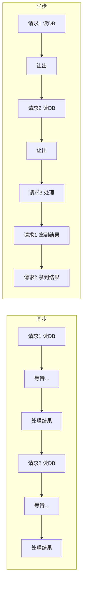

# Python 异步编程：从回调地狱到 async/await

> 本文基于 Python 3.12。

Python 的异步编程走了很长的路。从回调到 `yield from` 到 `async/await`——语法在进化，背后的核心思想始终如一：**等待 I/O 的时候让出线程去做别的事**。

## 为什么需要 async

Web 服务器 90% 的时间在等 I/O——等数据库返回、等网络包到达、等文件读完。同步代码在等待时线程闲置，操作系统切走还要保存上下文。异步代码在等待时**主动让出控制权**，同一个线程切换到另一个请求上——一秒钟能处理几百个并发连接，而同步多线程可能只处理几十个。



同步模型里等待时间白白浪费了。异步模型里等待的间隙切到别的任务上——线程利用率从 10% 提到接近 100%。

## async/await 基础

```python
import asyncio

async def fetch_data(url: str) -> str:
    print(f"开始请求 {url}")
    await asyncio.sleep(1)  # 模拟网络请求
    print(f"完成请求 {url}")
    return f"data from {url}"

async def main():
    # 并发跑两个
    results = await asyncio.gather(
        fetch_data("https://api1.example.com"),
        fetch_data("https://api2.example.com"),
    )
    print(results)

asyncio.run(main())
```

输出：

```
开始请求 https://api1.example.com
开始请求 https://api2.example.com
（1 秒后）
完成请求 https://api1.example.com
完成请求 https://api2.example.com
["data from https://api1.example.com", "data from https://api2.example.com"]
```

两个请求同时发出，一起等，一起返回——只花了 1 秒。同步版本两个 `requests.get()` 串行执行要 2 秒。

`async def` 定义一个协程（coroutine），`await` 在等待时将控制权交还给事件循环，`asyncio.gather` 并发跑多个协程。

## 一个并发爬虫

```python
import asyncio
import aiohttp
from typing import Any

async def fetch(session: aiohttp.ClientSession, url: str) -> str:
    async with session.get(url) as resp:
        return await resp.text()

async def crawl(urls: list[str]) -> list[str]:
    async with aiohttp.ClientSession() as session:
        tasks = [fetch(session, url) for url in urls]
        return await asyncio.gather(*tasks)

urls = [
    f"https://httpbin.org/delay/1?page={i}"
    for i in range(20)
]
results = asyncio.run(crawl(urls))
print(f"抓取完成，共 {len(results)} 页")
```

20 个页面——同步 `requests` 20 秒，异步 `aiohttp` 不到 2 秒。

关键：用 `aiohttp` 而非 `requests`，后者是同步库不支持 await。任何 `await` 点放同步调用，整个事件循环卡死——它等不到 IO 完成回调，因为 Python 线程被同步阻塞占死了。

## Task 与 gather：并发控制

`create_task` 不阻塞，返回一个 `Task` 对象——协程被调度到事件循环后台运行：

```python
async def main():
    task1 = asyncio.create_task(fetch_data("url1"))
    task2 = asyncio.create_task(fetch_data("url2"))

    # 做其他事情...
    print("tasks started, doing other work")

    # 等待全部完成
    result1 = await task1
    result2 = await task2
```

`asyncio.gather` 是 `create_task` + `await` 的简便封装，还支持异常策略：

```python
# 某个任务失败不影响其他
results = await asyncio.gather(
    *tasks,
    return_exceptions=True  # 异常作为结果返回而不是抛出
)
for r in results:
    if isinstance(r, Exception):
        print(f"失败：{r}")
    else:
        print(f"成功：{r}")
```

**注意**：`create_task` 不能随便用。它的生命周期绑定到创建它的事件循环——如果事件循环退出时 task 还没完成，它会报 `Task was destroyed but it is pending!`。要么 await 它，要么 cancel 它，不要造完不管。

## 异步上下文管理器

```python
class AsyncDB:
    async def __aenter__(self):
        self.conn = await create_async_connection()
        return self.conn

    async def __aexit__(self, *args):
        await self.conn.close()

async with AsyncDB() as conn:
    result = await conn.execute("SELECT ...")
```

`async with` 在进入和退出时分别 await。`aiohttp.ClientSession()` 是内置的异步上下文管理器——离开 `async with` 块时自动关闭连接池。

## 什么时候不该用 async

1. **CPU 密集型任务**——异步不加速计算，只加速 I/O 等待。`await asyncio.sleep(0)` 用来让出给其他协程，但不能让 10 秒的矩阵乘法变快。CPU 密集用 `asyncio.to_thread()` 丢到线程池。

2. **简单脚本**——只有一个请求、没有并发需求，`requests.get()` 比 `aiohttp.get()` 简单得多。

3. **非异步库的依赖链**——一旦代码里有一个函数是同步的，所有调用它且想用 `await` 的地方都必须转换成异步。

4. **同一线程上的协程切换有成本**——事件循环调度是协作式的，如果某个协程长时间不让出，它之后的所有协程都以等。这对几乎全部 I/O 工作负载是优点，但不是零成本抽象。

async 的真正适用场景：**减少 I/O 等待的线性累加，用并发把 O(n) 等待时间变成 O(1)**。

## async 和 yield 的关系

Python 3.5 之前的异步用 `@asyncio.coroutine` + `yield from`：

```python
@asyncio.coroutine
def old_style():
    data = yield from fetch_data()
```

`async/await` 本质上是 `yield from` 的语法糖——生成器可以暂停和恢复，协程是基于生成器实现的。在 async 的背后仍然是一个生成器的状态机机制——这一点我在这篇系列的 `yield-statement.md` 已有详细分析。

两者的核心逻辑打通：**`yield` 是协程的基础原语，`await` 是在此基础之上的高级抽象**。理解这个对 async 的理解比记语法深刻得多。

## 性能模型的直观理解

为什么 `asyncio.gather(20 tasks)` 时间约等于单个 task 而不是 20 倍？

同步调用：1s + 1s + 1s + ... (20 tasks) = 20s
异步调用：max(DB RTT, API RTT) ≈ 单个 RTT ≈ 1s

异步的性能增益来自等待时间重叠，而非任何计算加速。外部的延迟越高、I/O 越重，asyncio 的回报越大。但如果一个请求本身就只需要 1ms，且所有任务都是 CPU 计算，异步不会有任何加速。

**异步加速的是等待而不是计算。这是理解 async 性能的起点。**

> 适合有 Python 基础，准备在项目中使用异步编程的读者。
