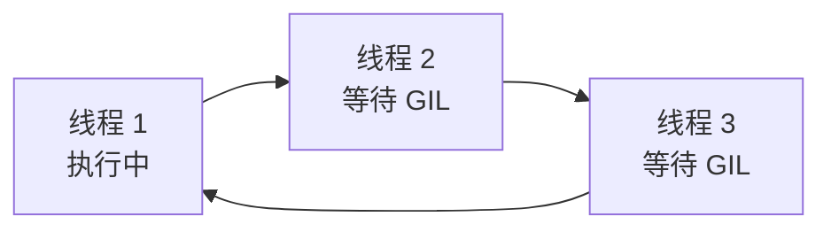
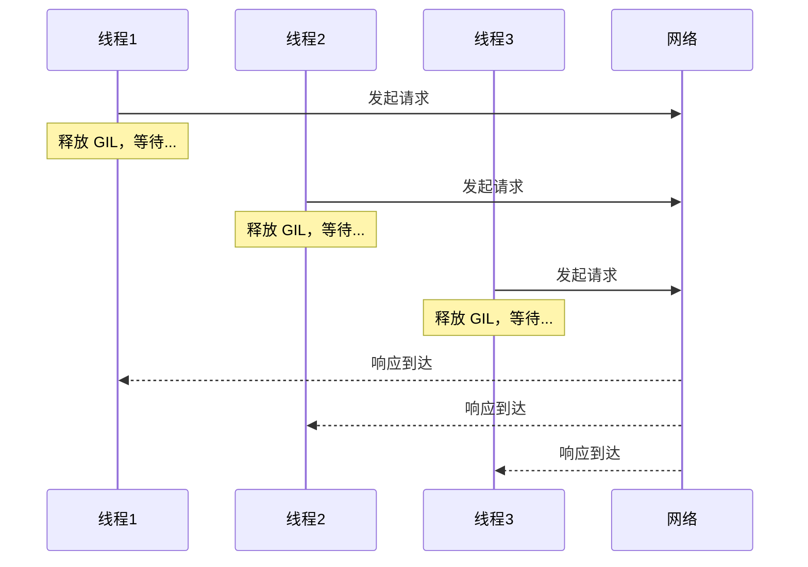
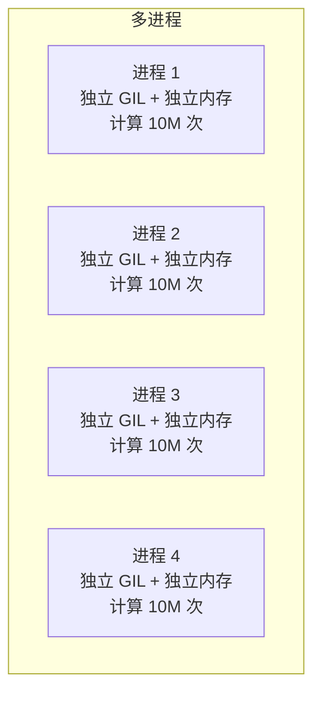
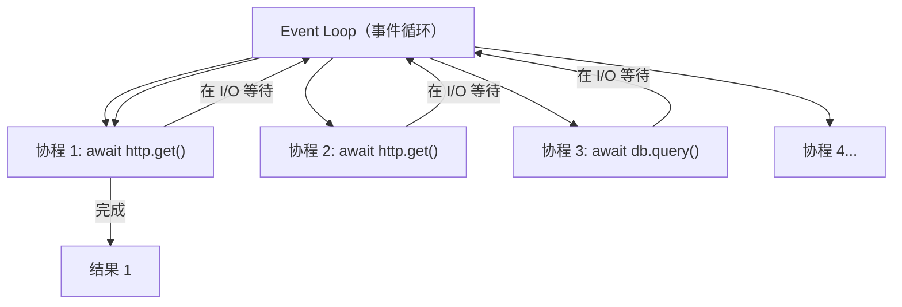
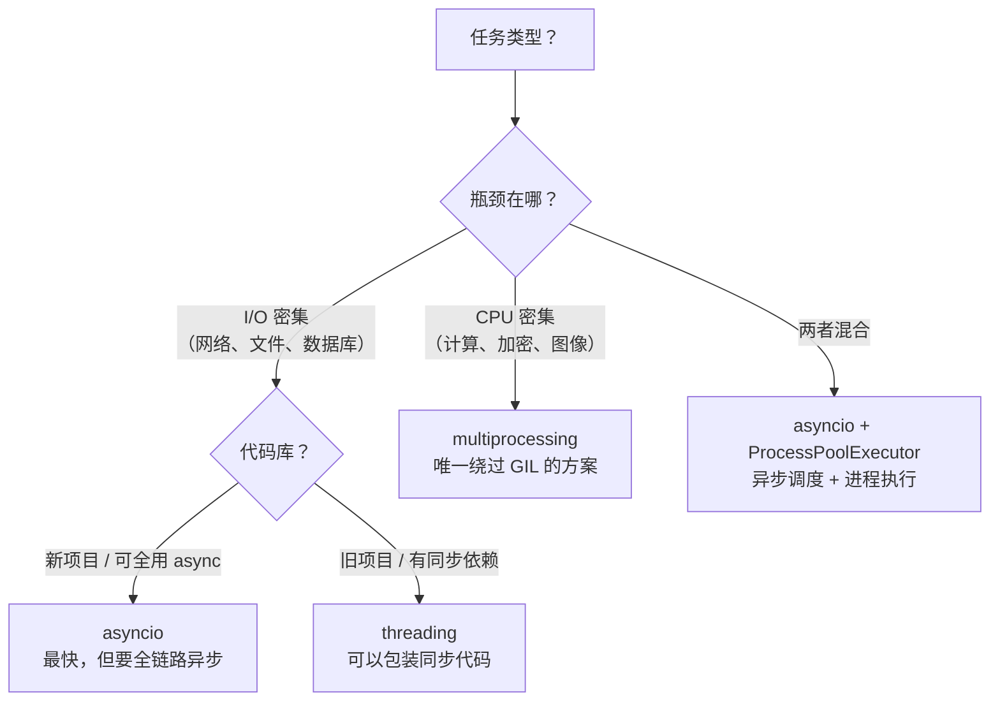

# Python 并发编程：threading、multiprocessing、asyncio 怎么选

> 本文基于 Python 3.12。

## 一个任务跑 10 秒，100 个任务要 1000 秒

```python
import time, requests

urls = [f"https://httpbin.org/delay/1" for _ in range(100)]

def download(url):
    resp = requests.get(url, timeout=10)
    return resp.status_code

start = time.time()
results = [download(url) for url in urls]
print(f"耗时: {time.time() - start:.1f}s")
# → 耗时: 102.3s
```

100 个请求，每个 1 秒——串行执行 100 秒。CPU 几乎全在等待网络，但 Python 的主线程只能等。

Python 给了三种并发方案。这篇文章讲清楚每种方案的底层原理、什么时候用、以及为什么 GIL 是你绕不过去的话题。

## 为什么需要 GIL 才能理解 Python 并发

GIL（Global Interpreter Lock，全局解释器锁）是 CPython 内存管理的核心机制——同一时刻，**只有一个线程能执行 Python 字节码**。



为什么需要 GIL？CPython 的内存管理（引用计数）不是线程安全的。两个线程同时修改同一个对象的引用计数会导致内存泄漏或 crash。GIL 让引用计数操作变成了事实上的原子操作——代价是**多线程无法并行执行 Python 代码**。

关键理解：GIL 锁的是**Python 字节码的执行**，不是 I/O 操作。I/O 操作（网络请求、文件读写）在等待时，GIL 会被释放。

```python
import threading, time

def io_task():
    time.sleep(1)  # sleep 期间 GIL 释放，其他线程可以运行

def cpu_task():
    total = 0
    for i in range(50_000_000):
        total += i      # Python 字节码——GIL 持有中
    return total
```

这就是三种方案的分叉点：

| 任务类型 | GIL 影响 | 最佳方案 |
|----------|---------|----------|
| I/O 密集（网络、文件） | 小——I/O 等待时 GIL 被释放 | threading 或 asyncio |
| CPU 密集（计算、加密） | 大——计算时始终持有 GIL | multiprocessing |

## threading — GIL 限制了并行，但没限制并发

```python
import threading, time, requests

urls = [f"https://httpbin.org/delay/1" for _ in range(100)]

def download(url):
    resp = requests.get(url, timeout=10)
    return resp.status_code

start = time.time()

# 创建 100 个线程
threads = []
for url in urls:
    t = threading.Thread(target=download, args=(url,))
    t.start()
    threads.append(t)

# 等待所有线程完成
for t in threads:
    t.join()

print(f"耗时: {time.time() - start:.1f}s")
# → 耗时: 2.1s（100 个线程并发等待网络）
```

为什么快？因为 `requests.get()` 底层调用 socket，socket 等待数据时操作系统挂起线程、释放 GIL——100 个线程**交替**执行，每个都卡在 I/O 等待上，2 秒全回来。



### 线程池 — 别自己管理线程

```python
from concurrent.futures import ThreadPoolExecutor, as_completed

with ThreadPoolExecutor(max_workers=20) as pool:
    futures = {pool.submit(download, url): url for url in urls}
    for future in as_completed(futures):
        try:
            result = future.result()
            print(f"{futures[future]} → {result}")
        except Exception as e:
            print(f"{futures[future]} 失败: {e}")
```

- `max_workers=20`——最多同时 20 个线程。不是越多越好——线程切换也有开销，I/O 密集任务 10-50 个线程就够了
- `as_completed`——哪个先完成先处理哪个，不用等最慢的

### threading 在 CPU 密集任务上反而更慢

```python
def cpu_intensive(n):
    total = 0
    for i in range(n):
        total += i
    return total

# 串行
start = time.time()
[cpu_intensive(10_000_000) for _ in range(4)]
print(f"串行: {time.time() - start:.2f}s")  # → 1.2s

# 多线程
start = time.time()
with ThreadPoolExecutor(max_workers=4) as pool:
    list(pool.map(cpu_intensive, [10_000_000] * 4))
print(f"多线程: {time.time() - start:.2f}s")  # → 1.4s（更慢！）
```

多线程反而更慢——4 个线程抢一个 GIL，上下文切换的额外开销让总时间超过了串行。

## multiprocessing — 绕过 GIL

`multiprocessing` 启动**独立进程**——每个进程有自己的 Python 解释器，GIL 互不干扰。

```python
from concurrent.futures import ProcessPoolExecutor
import time

def cpu_intensive(n):
    total = 0
    for i in range(n):
        total += i
    return total

start = time.time()
with ProcessPoolExecutor(max_workers=4) as pool:
    results = list(pool.map(cpu_intensive, [10_000_000] * 4))
print(f"多进程: {time.time() - start:.2f}s")  # → 0.4s（4 个核心并行）
```



### 进程间的数据传递有代价

```python
# 每个任务的输入和输出都要序列化（pickle）
def process_big_data(data):
    # data 从主进程序列化 → 子进程反序列化
    result = expensive_computation(data)
    # result 从子进程序列化 → 主进程反序列化
    return result
```

大数据（几 MB 的 DataFrame）在进程间传递时，序列化开销可能超过计算开销。**多进程适合计算量远大于数据量的场景。**

### 共享内存——避免序列化

```python
from multiprocessing import shared_memory
import numpy as np

# 主进程创建共享内存
data = np.random.rand(1000, 1000)      # 1000×1000 的数组
shm = shared_memory.SharedMemory(create=True, size=data.nbytes)
shared_array = np.ndarray(data.shape, dtype=data.dtype, buffer=shm.buf)
np.copyto(shared_array, data)

# 子进程直接读共享内存——不需要 pickle
def process_chunk(start_row, end_row):
    existing_shm = shared_memory.SharedMemory(name=shm.name)
    arr = np.ndarray((1000, 1000), dtype=np.float64, buffer=existing_shm.buf)
    chunk_sum = arr[start_row:end_row].sum()
    existing_shm.close()
    return chunk_sum

with ProcessPoolExecutor(max_workers=4) as pool:
    chunks = [(i, i + 250) for i in range(0, 1000, 250)]
    results = pool.map(process_chunk, chunks)
    # ↑ 传的是 (int, int) 不是数据本身

print(f"总和: {sum(results)}")
shm.close()
shm.unlink()  # 释放共享内存
```

`multiprocessing.shared_memory`（Python 3.8+）绕过了 pickle——多个进程直接读写同一块物理内存。适合 numpy 数组、图像数据等需要大量共享数据的场景。

## asyncio — 单线程的并发

`threading` 是操作系统帮你切换线程，`asyncio` 是你在代码里**显式标记**哪里可以切换。

```python
import asyncio
import aiohttp

async def download(session, url):
    async with session.get(url, timeout=10) as resp:
        return resp.status

async def main():
    urls = [f"https://httpbin.org/delay/1" for _ in range(100)]
    async with aiohttp.ClientSession() as session:
        tasks = [download(session, url) for url in urls]
        results = await asyncio.gather(*tasks)   # 100 个请求并发
    return results

start = time.time()
results = asyncio.run(main())
print(f"耗时: {time.time() - start:.1f}s")  # → 1.5s
```

### async/await 的底层模型



`await` 的意思是："我这里要等 I/O，你去处理别的协程吧"。事件循环在多个协程之间切换——**所有协程跑在同一个线程里**，没有 GIL 竞争，没有锁。

### asyncio 的关键规则

```python
# ✅ 在 async 函数里用 await
async def good():
    async with aiohttp.ClientSession() as s:
        async with s.get(url) as resp:    # 异步 I/O
            return await resp.text()

# ❌ 在 async 函数里用同步 I/O——阻塞整个事件循环
async def bad():
    import requests
    resp = requests.get(url)  # 同步阻塞！其他协程全部等
    return resp.text

# ✅ 用 asyncio.to_thread 把同步代码丢到线程池
async def fixed():
    import requests
    resp = await asyncio.to_thread(requests.get, url)
    return resp.text
```

**async 函数里不能放同步阻塞代码。** 一放，事件循环就卡住了——所有协程都在等这一个同步调用返回。

## 三种方案的实测对比

同一个任务——下载 100 个 URL，每个 1 秒延迟：

```python
import time, requests
from concurrent.futures import ThreadPoolExecutor, ProcessPoolExecutor
import asyncio, aiohttp

URLS = [f"https://httpbin.org/delay/1" for _ in range(100)]

# 串行
def serial():
    return [requests.get(u).status_code for u in URLS]

# 多线程
def threaded():
    with ThreadPoolExecutor(max_workers=20) as pool:
        return list(pool.map(lambda u: requests.get(u).status_code, URLS))

# 多进程
def multiprocessed():
    with ProcessPoolExecutor(max_workers=4) as pool:
        return list(pool.map(lambda u: requests.get(u).status_code, URLS))

# asyncio
async def asynced():
    async with aiohttp.ClientSession() as s:
        tasks = [asyncio.create_task(s.get(u)) for u in URLS]
        responses = await asyncio.gather(*tasks)
        return [r.status for r in responses]
```

实测：

| 方案 | 耗时 | 说明 |
|------|------|------|
| 串行 | 102s | 一个接一个 |
| 多线程（20 workers） | 5.8s | 线程并发等待 I/O |
| 多进程（4 workers） | 28s | 进程启动开销大 |
| asyncio | 1.5s | 单线程、纯异步——最快 |

对于 I/O 密集任务，**asyncio > threading >> multiprocessing > 串行**。

把任务换成 CPU 密集型（计算斐波那契）：

| 方案 | 耗时 | 说明 |
|------|------|------|
| 串行 | 3.2s | 单核 |
| 多线程（4） | 3.8s | GIL 竞争——更慢 |
| 多进程（4） | 0.9s | 4 核并行 |
| asyncio | 3.2s | 等于串行——没有 I/O 等待 |

对于 CPU 密集任务，**multiprocessing 是唯一选择**。

## 选型决策



最后的混合方案：

```python
async def handle_request(data):
    loop = asyncio.get_running_loop()

    # I/O 密集部分——asyncio 处理
    async with aiohttp.ClientSession() as s:
        external_data = await s.get(url)

    # CPU 密集部分——丢给进程池
    result = await loop.run_in_executor(
        process_pool,        # ProcessPoolExecutor 实例
        heavy_computation,
        external_data
    )

    return result
```

## 小结

Python 并发的三种方案不是因为"太多了不知道怎么选"——是因为 GIL 的存在让每种方案只擅长一类任务。理解 GIL 的那句话就够了：**GIL 让多线程不能并行计算，但 I/O 等待期间 GIL 是释放的**。剩下的就是对着任务类型选方案——I/O 密集走 asyncio，CPU 密集走 multiprocessing，外部命令走 subprocess。
