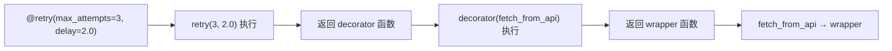
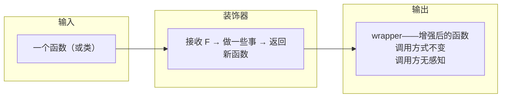

# Python 装饰器：从函数到可调用对象的完整理解

> 本文基于 Python 3.12，涉及语法特性会标注最低支持版本。

## 为什么需要装饰器

假设你在维护一个微服务，需要给 20 个 API 函数加上日志、计时、权限检查。直接改代码会变成这样：

```python
def get_user(user_id):
    log_start("get_user", user_id)
    start = time.time()
    result = db.query(...)
    log_end("get_user", time.time() - start)
    return result

def update_user(user_id, data):
    log_start("update_user", user_id)
    start = time.time()
    result = db.update(...)
    log_end("update_user", time.time() - start)
    return result

# ... 重复 18 次
```

日志和计时与业务逻辑毫无关系，但占据了函数体的一半。更麻烦的是，如果哪天要加一个「错误重试」——20 个函数全部要改。

装饰器解决的就是这个问题：**在不修改原函数的前提下，给函数包裹额外行为**。上面的代码装饰器化之后：

```python
@log_and_time
def get_user(user_id):
    return db.query(...)

@log_and_time
def update_user(user_id, data):
    return db.update(...)
```

业务逻辑和横切关注点分离了。但 `@log_and_time` 到底做了什么？要理解它，需要先理解两个前置概念。

## 前置一：函数是一等公民

在 Python 里，函数就是对象——可以赋值给变量、可以当参数传、可以从函数里返回：

```python
def greet(name):
    return f"Hello, {name}"

# 赋值给变量
say_hello = greet
say_hello("World")          # 'Hello, World'

# 当参数传
def call_twice(func, arg):
    return func(arg), func(arg)

call_twice(greet, "Python")  # ('Hello, Python', 'Hello, Python')

# 从函数里返回
def make_multiplier(n):
    def multiplier(x):
        return x * n
    return multiplier          # 返回的是函数本身

times_3 = make_multiplier(3)
times_3(10)                    # 30
```

最后这个 `make_multiplier` 里面定义了一个函数并返回它——这就是闭包。

## 前置二：闭包——函数带着它的环境一起走

```python
def make_multiplier(n):        # n 是外部函数的参数
    def multiplier(x):          # multiplier 记住了 n
        return x * n
    return multiplier
```

`multiplier` 在 `make_multiplier` 调用结束后仍然能访问 `n`。Python 把 `n` 的值「闭合」在了 `multiplier` 的内部作用域里。可以验证：

```python
times_3 = make_multiplier(3)
times_5 = make_multiplier(5)

print(times_3.__closure__[0].cell_contents)  # 3
print(times_5.__closure__[0].cell_contents)  # 5
```

`__closure__` 就是存储被闭合变量的地方。每个闭包实例持有自己捕获的值，互不影响。

有了「函数是一等公民」和「闭包」两个基础，装饰器的原理就只剩下一步。

## 装饰器的本质：一个接收函数、返回函数的函数

```python
def log_and_time(func):
    def wrapper(*args, **kwargs):
        print(f"[LOG] calling {func.__name__} with args={args}, kwargs={kwargs}")
        start = time.time()
        result = func(*args, **kwargs)
        elapsed = time.time() - start
        print(f"[LOG] {func.__name__} returned in {elapsed:.3f}s")
        return result
    return wrapper
```

逐行理解：

1. `log_and_time` 接收一个函数 `func` 作为参数
2. 在内部定义一个新的函数 `wrapper`——它先打日志、再调用 `func`、再打日志、最后返回结果
3. `log_and_time` 把 `wrapper` 作为返回值

使用时：

```python
def heavy_computation(n):
    total = sum(i * i for i in range(n))
    return total

# 手动装饰——等价于 @log_and_time
heavy_computation = log_and_time(heavy_computation)

result = heavy_computation(1000000)
# [LOG] calling heavy_computation with args=(1000000,), kwargs={}
# [LOG] heavy_computation returned in 0.087s
```

`heavy_computation` 变量现在指向的不是原来的函数了，而是 `log_and_time` 返回的 `wrapper`。但调用方不需要知道这件事——`heavy_computation(1000000)` 的调用方式完全没变。

这就是 **`@` 语法糖**的实际含义（Python 2.4+，PEP 318）：

```python
@log_and_time
def heavy_computation(n):
    ...

# 等价于：
# heavy_computation = log_and_time(heavy_computation)
```

## 这个朴素实现有什么问题

用上面这个版本跑一个月，你会遇到两个反直觉的 bug：

```python
@log_and_time
def add(a, b):
    """Return the sum of a and b."""
    return a + b

print(add.__name__)      # 'wrapper'  ← 不是 'add'！
print(add.__doc__)        # None        ← docstring 丢了！
print(add(1, 2))          # 功能正常
```

**装饰器替换了原函数**。`add` 现在指向 `wrapper`，而 `wrapper` 的名字是 `wrapper`，docstring 是空的。依赖 `__name__` 的框架（Flask 路由、pytest 测试发现）会直接出 bug。

### 修复：functools.wraps

```python
from functools import wraps

def log_and_time(func):
    @wraps(func)    # ← 把 func 的元数据复制到 wrapper
    def wrapper(*args, **kwargs):
        print(f"[LOG] calling {func.__name__}")
        result = func(*args, **kwargs)
        print(f"[LOG] {func.__name__} returned")
        return result
    return wrapper

@log_and_time
def add(a, b):
    """Return the sum of a and b."""
    return a + b

print(add.__name__)   # 'add'
print(add.__doc__)    # 'Return the sum of a and b.'
```

`@wraps(func)` 做了三件事：
- 复制 `__name__`、`__doc__`、`__module__`
- 复制 `__qualname__`（Python 3.3+ 的限定名）
- 把原函数的 `__wrapped__` 属性指向 `func`——可以通过 `add.__wrapped__` 拿到未装饰的原始函数

**永远在写装饰器时加上 `@wraps(func)`**。不算是惯例——是防御 bug 的必需操作。

## 带参数的装饰器

上面的 `@log_and_time` 不带参数。如果需要配置行为（比如日志级别、重试次数），需要**再加一层函数**：

```python
def retry(max_attempts=3, delay=1.0):
    """带参数的装饰器——返回一个装饰器函数。"""
    def decorator(func):
        @wraps(func)
        def wrapper(*args, **kwargs):
            last_exception = None
            for attempt in range(1, max_attempts + 1):
                try:
                    return func(*args, **kwargs)
                except Exception as e:
                    last_exception = e
                    if attempt < max_attempts:
                        print(f"[RETRY] attempt {attempt}/{max_attempts} "
                              f"for {func.__name__}, waiting {delay}s")
                        time.sleep(delay)
            raise last_exception
        return wrapper
    return decorator

@retry(max_attempts=3, delay=2.0)
def fetch_from_api(url):
    response = requests.get(url, timeout=5)
    response.raise_for_status()
    return response.json()
```

调用链路：



关键理解：**`retry` 不是装饰器，`retry()` 的返回值才是**。三层嵌套的命名建议：

| 层 | 名称 | 职责 |
|----|------|------|
| 最外层 | `retry` | 接收配置参数，返回装饰器 |
| 中间层 | `decorator` | 接收被装饰函数，返回 wrapper |
| 最内层 | `wrapper` | 增强后的函数，实际被调用的 |

## 类作为装饰器

不只函数可以做装饰器——**任何可调用对象**都可以。类实现 `__call__` 就成了可调用对象（Python 3.9+ 支持 `@dataclass` 减少样板代码）：

```python
class CountCalls:
    """统计函数被调用次数的装饰器——类实现更适合有状态的场景。"""
    def __init__(self, func):
        self.func = func
        self.count = 0
        wraps(func)(self)        # 手动调用 wraps

    def __call__(self, *args, **kwargs):
        self.count += 1
        print(f"[COUNT] {self.func.__name__} called {self.count} times")
        return self.func(*args, **kwargs)

@CountCalls
def ping():
    return "pong"

ping()  # [COUNT] ping called 1 times
ping()  # [COUNT] ping called 2 times
ping()  # [COUNT] ping called 3 times
print(ping.count)  # 3——状态保存在实例上
```

函数式装饰器和类式装饰器的选择：

| | 函数式 | 类式 |
|------|--------|------|
| 简单无状态装饰 | ✅ 首选 | 杀鸡用牛刀 |
| 需要维护状态（计数、缓存） | 用闭包 + `nonlocal` | ✅ 更清晰的 `self.xxx` |
| 需要多个方法（如 `reset()`） | 不适用 | ✅ 实例方法天然支持 |

对于带参数 + 有状态的类装饰器：

```python
class RateLimit:
    def __init__(self, max_per_second=10):
        self.max_per_second = max_per_second
        self.calls = []

    def __call__(self, func):
        @wraps(func)
        def wrapper(*args, **kwargs):
            now = time.time()
            # 清理 1 秒前的记录
            self.calls = [t for t in self.calls if now - t < 1.0]
            if len(self.calls) >= self.max_per_second:
                raise RuntimeError(f"Rate limit exceeded for {func.__name__}")
            self.calls.append(now)
            return func(*args, **kwargs)
        return wrapper

@RateLimit(max_per_second=5)
def api_call(data):
    return requests.post("https://api.example.com", json=data)
```

注意这里 `__init__` 接收配置参数，`__call__` 接收被装饰函数并返回 wrapper。三层结构变成了类的两层：`__init__` 是参数层，`__call__` 是装饰层，`wrapper` 仍然是实际执行层。

## 装饰器的叠加

多个装饰器可以从下往上叠加：

```python
@retry(max_attempts=3)     # ③ 最外层：如果内层抛异常，重试
@log_and_time              # ② 中间层：计时 + 日志
@CountCalls                # ① 最内层：计数 → 日志 → 重试
def critical_operation(data):
    return db.commit(data)
```

执行顺序是**从下往上装饰，从上往下执行**：

```python
# 等价于：
critical_operation = retry(max_attempts=3)(log_and_time(CountCalls(critical_operation)))

# 调用 critical_operation("xxx") 的实际执行顺序：
# 1. retry.wrapper 开始（try 包裹）
#   2. log_and_time.wrapper 开始（打印 start log）
#     3. CountCalls.__call__（count += 1）
#       4. 原始 critical_operation 执行
#     3. CountCalls.__call__ 返回
#   2. log_and_time.wrapper 结束（打印 end log）
# 1. retry.wrapper 结束
```

可以用这段代码实际验证叠加顺序：

```python
def make_decorator(name):
    def decorator(func):
        @wraps(func)
        def wrapper(*args, **kwargs):
            print(f"  → entering {name}")
            result = func(*args, **kwargs)
            print(f"  ← leaving {name}")
            return result
        return wrapper
    return decorator

@make_decorator("A")
@make_decorator("B")
@make_decorator("C")
def hello():
    print("    hello!")

hello()
#   → entering A
#     → entering B
#       → entering C
#           hello!
#       ← leaving C
#     ← leaving B
#   ← leaving A
```

洋葱模型：A 包 B，B 包 C，C 包原函数。

## 常用的内置装饰器

Python 标准库自带了一批值得了解的装饰器：

### @property——把方法变成属性访问

```python
class Circle:
    def __init__(self, radius):
        self._radius = radius

    @property
    def area(self):           # circle.area——不用加括号
        return 3.14159 * self._radius ** 2

    @property
    def radius(self):         # 读
        return self._radius

    @radius.setter             # 写
    def radius(self, value):
        if value <= 0:
            raise ValueError("Radius must be positive")
        self._radius = value
```

### @staticmethod / @classmethod——方法的两种绑定方式

```python
class DateParser:
    @staticmethod
    def is_valid(date_str):            # 不访问实例，不访问类
        return bool(re.match(r'\d{4}-\d{2}-\d{2}', date_str))

    @classmethod
    def from_iso(cls, date_str):       # 接收类作为第一个参数
        year, month, day = date_str.split('-')
        return cls(int(year), int(month), int(day))  # cls() 是构造函数
```

### @functools.lru_cache——记忆化，用空间换时间

```python
from functools import lru_cache

@lru_cache(maxsize=128)
def fibonacci(n):
    """没有缓存的 fib(35) 耗时数秒，加了缓存秒出。"""
    if n < 2:
        return n
    return fibonacci(n - 1) + fibonacci(n - 2)

print(fibonacci(100))      # 354224848179261915075——瞬间
print(fibonacci.cache_info())  # CacheInfo(hits=98, misses=101, maxsize=128, currsize=101)
```

### @dataclass——自动生成 `__init__`、`__repr__`、`__eq__`

```python
from dataclasses import dataclass

@dataclass(frozen=True)    # frozen=True → 不可变
class Trade:
    symbol: str
    price: float
    quantity: int

t = Trade("BTC/USDT", 68000.0, 1)
print(t)  # Trade(symbol='BTC/USDT', price=68000.0, quantity=1)
```

## 实战场景

### 场景一：API 调用超时控制

```python
import signal

def timeout(seconds):
    """给函数加上超时限制——超时抛 TimeoutError（仅 Unix）。"""
    def decorator(func):
        def handler(signum, frame):
            raise TimeoutError(f"{func.__name__} timed out after {seconds}s")

        @wraps(func)
        def wrapper(*args, **kwargs):
            old = signal.signal(signal.SIGALRM, handler)
            signal.alarm(seconds)
            try:
                return func(*args, **kwargs)
            finally:
                signal.alarm(0)
                signal.signal(signal.SIGALRM, old)
        return wrapper
    return decorator

@timeout(5)
def fetch_slow_endpoint():
    return requests.get("https://httpstat.us/200?sleep=10000")

# fetch_slow_endpoint()  # 5 秒后抛出 TimeoutError
```

### 场景二：参数校验

```python
def validate(**checks):
    """声明式的参数校验——@validate(age=(int, 0, 150), email=str)"""
    def decorator(func):
        @wraps(func)
        def wrapper(*args, **kwargs):
            # 把位置参数和关键字参数合并
            import inspect
            bound = inspect.signature(func).bind(*args, **kwargs)
            bound.apply_defaults()

            for param, specs in checks.items():
                if param not in bound.arguments:
                    continue
                value = bound.arguments[param]
                if isinstance(specs, tuple):
                    expected_type = specs[0]
                    if not isinstance(value, expected_type):
                        raise TypeError(f"{param} must be {expected_type.__name__}")
                    if len(specs) > 1 and value < specs[1]:
                        raise ValueError(f"{param} must be >= {specs[1]}")
                    if len(specs) > 2 and value > specs[2]:
                        raise ValueError(f"{param} must be <= {specs[2]}")
            return func(*args, **kwargs)
        return wrapper
    return decorator

@validate(age=(int, 0, 150), name=str)
def register_user(name, age):
    return f"Registered {name}, age {age}"

register_user("Alice", 30)         # OK
# register_user("Bob", -5)         # ValueError: age must be >= 0
# register_user(None, 25)          # TypeError: name must be str
```

### 场景三：注册表模式——Flask 路由的底层原理

```python
# 这是一个极简的 Flask 路由实现
class MiniWeb:
    def __init__(self):
        self.routes = {}

    def route(self, path):
        """装饰器：把函数注册到 routes 字典。不修改函数本身。"""
        def decorator(func):
            self.routes[path] = func
            return func           # ← 注意：直接返回原函数！
        return decorator

    def dispatch(self, path, *args):
        if path in self.routes:
            return self.routes[path](*args)
        return "404 Not Found"

app = MiniWeb()

@app.route("/hello")
def hello():
    return "Hello, World!"

@app.route("/user/<name>")
def user(name):
    return f"User: {name}"

print(app.routes)           # {'/hello': <function hello>, '/user/<name>': <function user>}
print(app.dispatch("/hello"))           # Hello, World!
print(app.dispatch("/user/Alice"))      # User: Alice
```

这个例子揭示了一个容易忽略的事实：**装饰器不一定非要返回 wrapper**。`app.route("/hello")` 把函数注册到路由表后，原封不动地返回了原函数——它的副作用（注册）在装饰时就完成了，不需要在运行时每次调用都再做一次。

## 几个容易踩的坑

### 装饰器在模块加载时执行，不是在调用时

```python
REGISTRY = []

def register(func):
    REGISTRY.append(func.__name__)
    return func

@register
def foo(): pass       # ← 这行代码被 Python 解析时就已经注册了

print(REGISTRY)        # ['foo']——还没调用 foo
```

### 类方法的装饰器要注意 self

如果装饰器把类方法替换成了普通函数，`self` 不会自动传递。`@wraps` 不能解决这个问题——需要确保 `wrapper` 也是定义在正确位置的函数（或用描述符协议）。

### `@wraps` 只复制 `__dict__` 中的属性，不包括 `__annotations__`

Python 3.12 中 `__annotations__` 的行为有变化——如果你依赖类型注解做运行时验证，需要在 `@wraps` 之后手动复制 `wrapper.__annotations__ = func.__annotations__`。

## 总结：装饰器的本质



装饰器是 Python 对 AOP（面向切面编程）最简洁的表达——用 `@` 一个符号，把横切关注点从业务代码中分离出去。理解它需要的不是记忆 `@` 的语法，而是先理解函数是一等公民、再理解闭包——剩下的都是这两个概念的组合。

- **无参装饰器**：一个接收函数返回函数的函数
- **有参装饰器**：一个接收参数返回装饰器的函数（三层嵌套）
- **类装饰器**：`__init__` 接收函数，`__call__` 执行增强逻辑
- **`@wraps(func)`**：永远记得加——这不是建议，是防御 bug
