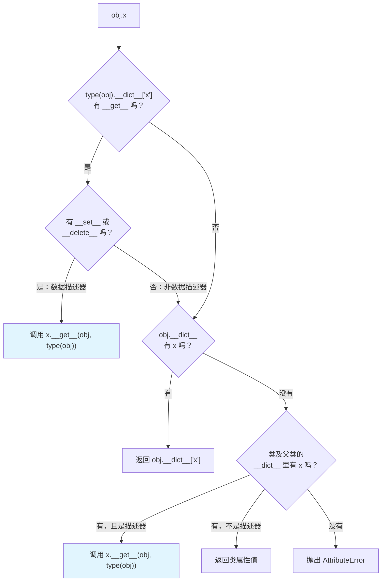

# Python 描述器：`obj.x` 背后究竟发生了什么

> 本文基于 Python 3.12，涉及语法特性会标注最低支持版本。

## 一个奇怪的现象

```python
class Temperature:
    def __init__(self, celsius=0):
        self.celsius = celsius

    @property
    def fahrenheit(self):
        return self.celsius * 9 / 5 + 32

    @fahrenheit.setter
    def fahrenheit(self, value):
        self.celsius = (value - 32) * 5 / 9


t = Temperature()
t.fahrenheit = 212
print(t.celsius)    # → 100
print(t.fahrenheit)  # → 212.0
```

`fahrenheit` 看起来像个属性——`t.fahrenheit` 直接读写，不用括号。但赋值时它做了换算，取值时它做了计算。它不是普通的数据属性，也不是普通的方法。**它是描述器（descriptor）。**

描述器是 Python 对象模型里最核心的协议之一。`property`、`classmethod`、`staticmethod`、甚至 `obj.method()` 的绑定行为，底层全是描述器在驱动。理解了它，你就理解了 Python 属性访问的完整机制。

## 属性查找的真相

当你写 `obj.x`，Python 不是简单地在 `obj.__dict__` 里找 `x`。实际查找顺序是这样的：



关键规则只有两条：

1. **数据描述器（定义了 `__set__` 或 `__delete__`）优先于实例属性**——即使实例 `__dict__` 里有同名键，也会被描述器拦截。
2. **非数据描述器（只定义了 `__get__`）优先级低于实例属性**——实例属性会"遮住"它。

这个优先级差异是理解描述器的钥匙。

## 描述器协议：三个魔法方法

```python
class Descriptor:
    def __get__(self, obj, objtype=None):
        """访问属性时调用。obj 是实例（类访问时为 None），objtype 是类"""

    def __set__(self, obj, value):
        """设置属性时调用。obj 是实例，value 是新值"""

    def __delete__(self, obj):
        """删除属性时调用。obj 是实例"""
```

只要一个对象定义了 `__get__`，它就是描述器。再定义 `__set__` 或 `__delete__`，它就成了数据描述器。

注意参数里没有 `self` 的位置——`self` 当然还在，但描述器协议关注的是 **宿主对象** `obj`。描述器本身是类属性，但它操作的是实例的数据。

### 最小描述器：只读属性

```python
class TypedField:
    """确保属性类型正确的描述器"""
    def __init__(self, name, expected_type):
        self.name = name
        self.expected_type = expected_type

    def __get__(self, obj, objtype=None):
        if obj is None:
            return self  # 类访问时返回描述器自身
        return obj.__dict__.get(self.name)

    def __set__(self, obj, value):
        if not isinstance(value, self.expected_type):
            raise TypeError(
                f"{self.name} 需要 {self.expected_type.__name__}，"
                f"收到 {type(value).__name__}"
            )
        obj.__dict__[self.name] = value


class User:
    name = TypedField("name", str)
    age = TypedField("age", int)

    def __init__(self, name, age):
        self.name = name  # 触发 __set__
        self.age = age


u = User("Alice", 30)
print(u.name)  # → "Alice"（触发 __get__）

u.age = "thirty"
# TypeError: age 需要 int，收到 str
```

两件值得注意的事：

1. **数据存在 `obj.__dict__` 里，不在描述器里**。描述器是类属性，所有实例共享同一个描述器对象。如果把数据存在描述器自己的属性里，多个实例会互相覆盖。
2. **`obj is None` 的判断不能省**。`User.name` 这种类访问会传 `obj=None`，此时应该返回描述器自身，方便调试和内省。

## 数据描述器 vs 非数据描述器：优先级的实验

```python
class DataDescriptor:
    """数据描述器——定义了 __set__"""
    def __get__(self, obj, objtype=None):
        return "来自数据描述器"

    def __set__(self, obj, value):
        pass  # 允许赋值但不存储


class NonDataDescriptor:
    """非数据描述器——只有 __get__"""
    def __get__(self, obj, objtype=None):
        return "来自非数据描述器"


class Demo:
    data_desc = DataDescriptor()
    non_data_desc = NonDataDescriptor()


d = Demo()

# 往实例 __dict__ 里塞同名键
d.__dict__["data_desc"] = "实例属性"
d.__dict__["non_data_desc"] = "实例属性"

print(d.data_desc)      # → "来自数据描述器"（数据描述器赢了）
print(d.non_data_desc)  # → "实例属性"（实例属性赢了）
```

**数据描述器的优先级高于实例属性，非数据描述器的优先级低于实例属性。** 这就是为什么 `property`（数据描述器）总能拦截赋值，而普通方法（非数据描述器）可以被实例属性遮住。

## 实战：用描述器实现 lazy 属性

`functools.cached_property`（3.8+）用描述器实现了惰性计算——第一次访问时计算并缓存，后续直接返回缓存值。我们手写一个来理解它的原理：

```python
class lazy:
    """惰性属性描述器——首次访问时计算，之后缓存到实例 __dict__"""
    def __init__(self, func):
        self.func = func
        self.attrname = func.__name__
        self.__doc__ = func.__doc__

    def __get__(self, obj, objtype=None):
        if obj is None:
            return self
        # 计算并写入实例 __dict__
        value = self.func(obj)
        obj.__dict__[self.attrname] = value
        return value


class DatabasePool:
    def __init__(self, config):
        self.config = config

    @lazy
    def connection(self):
        """首次访问时才建立连接"""
        print("正在建立数据库连接...")
        # 模拟连接过程
        return f"Connection({self.config['host']})"


pool = DatabasePool({"host": "db.example.com"})
print("对象已创建，连接尚未建立")
print(pool.connection)  # → 正在建立数据库连接... Connection(db.example.com)
print(pool.connection)  # → Connection(db.example.com) ——第二次不再触发
```

为什么第二次不触发了？因为第一次 `__get__` 执行时，值被写入了 `obj.__dict__["connection"]`。而 `lazy` 是**非数据描述器**（没有 `__set__`），实例属性优先级更高，第二次访问直接从 `__dict__` 取到了缓存值。

这就是 `cached_property` 的核心技巧：**利用优先级差异，让描述器只执行一次，之后被实例属性"遮住"。**

## 实战：validator 描述器——声明式字段校验

在实际项目中，字段校验是描述器最自然的应用场景。不用在每个 `__init__` 或 `__setattr__` 里写 `if not isinstance`，用描述器把校验逻辑和业务逻辑分离：

```python
class Validator:
    """字段校验描述器基类"""
    def __init__(self, name=None):
        self.name = name

    def __set_name__(self, owner, name):
        # Python 3.6+：类定义时自动调用，获取属性名
        if self.name is None:
            self.name = name

    def __get__(self, obj, objtype=None):
        if obj is None:
            return self
        return obj.__dict__.get(self.name)

    def __set__(self, obj, value):
        self.validate(value)
        obj.__dict__[self.name] = value

    def validate(self, value):
        raise NotImplementedError


class String(Validator):
    def __init__(self, min_len=0, max_len=None, **kwargs):
        self.min_len = min_len
        self.max_len = max_len
        super().__init__(**kwargs)

    def validate(self, value):
        if not isinstance(value, str):
            raise TypeError(f"{self.name} 需要 str，收到 {type(value).__name__}")
        if len(value) < self.min_len:
            raise ValueError(f"{self.name} 长度不能小于 {self.min_len}")
        if self.max_len and len(value) > self.max_len:
            raise ValueError(f"{self.name} 长度不能超过 {self.max_len}")


class Integer(Validator):
    def __init__(self, min_val=None, max_val=None, **kwargs):
        self.min_val = min_val
        self.max_val = max_val
        super().__init__(**kwargs)

    def validate(self, value):
        if not isinstance(value, int):
            raise TypeError(f"{self.name} 需要 int，收到 {type(value).__name__}")
        if self.min_val is not None and value < self.min_val:
            raise ValueError(f"{self.name} 不能小于 {self.min_val}")
        if self.max_val is not None and value > self.max_val:
            raise ValueError(f"{self.name} 不能超过 {self.max_val}")


class Employee:
    name = String(min_len=1, max_len=50)
    age = Integer(min_val=18, max_val=65)
    department = String(min_len=1)

    def __init__(self, name, age, department):
        self.name = name
        self.age = age
        self.department = department


e = Employee("Alice", 30, "Engineering")
print(e.name)  # → "Alice"

e.age = 17
# ValueError: age 不能小于 18

e.name = ""
# ValueError: name 长度不能小于 1
```

注意 `__set_name__`（3.6+）——类定义时 Python 自动调用它，把属性名传给描述器。不需要再手写 `name = String("name", min_len=1)` 了，描述器自己知道自己的名字。

这种模式的核心价值：**校验逻辑写一次，声明式使用，业务类保持干净。** Django 的 `models.Field`、SQLAlchemy 的 `Column`、Pydantic 的字段验证，底层都是这个思路。

## 你一直在用的描述器

### `property` 就是描述器

`property` 的等价实现：

```python
class property:
    def __init__(self, fget=None, fset=None, fdel=None, doc=None):
        self.fget = fget
        self.fset = fset
        self.fdel = fdel
        self.__doc__ = doc

    def __get__(self, obj, objtype=None):
        if obj is None:
            return self
        if self.fget is None:
            raise AttributeError("不可读")
        return self.fget(obj)

    def __set__(self, obj, value):
        if self.fset is None:
            raise AttributeError("不可写")
        self.fset(obj, value)

    def __delete__(self, obj):
        if self.fdel is None:
            raise AttributeError("不可删除")
        self.fdel(obj)

    def setter(self, fset):
        return type(self)(self.fget, fset, self.fdel, self.__doc__)
```

`property` 是数据描述器——它定义了 `__set__`，所以赋值总是走 `__set__`，实例属性无法遮住它。

### 方法绑定也是描述器

```python
class Greeter:
    def hello(self):
        return "Hello"


g = Greeter()

# 看起来一样，但机制完全不同
print(type(Greeter.hello))  # → <class 'function'>
print(type(g.hello))        # → <class 'method'>
```

`Greeter.hello` 是一个函数（非数据描述器），`g.hello` 是一个绑定方法。从函数到方法的转换，发生在 `__get__` 里：

```python
# 函数的 __get__ 等价于：
def __get__(self, obj, objtype=None):
    if obj is None:
        return self  # 类访问 → 返回原始函数
    return MethodType(self, obj)  # 实例访问 → 返回绑定方法
```

绑定方法把实例和函数绑在一起，调用时自动把实例作为第一个参数（`self`）传入。**Python 里没有 Java 那样的隐式 `this`——方法绑定完全靠描述器协议实现。**

### `classmethod` 和 `staticmethod`

```python
class MyClass:
    @classmethod
    def from_config(cls, config):
        return cls(config)

    @staticmethod
    def helper():
        return "帮助信息"
```

- `classmethod`：描述器的 `__get__` 返回绑定到**类**的方法（`objtype` 而不是 `obj`）
- `staticmethod`：描述器的 `__get__` 返回原始函数，不做任何绑定

## 什么时候该用描述器

| 场景 | 用描述器？ | 替代方案 |
|---|---|---|
| 一个属性的 getter/setter 有复杂逻辑 | ✅ `property` | 直接用 `property` |
| 同样的校验逻辑要在多个类/字段复用 | ✅ 自定义描述器 | `__init__` 里重复写 / 用 Pydantic |
| 惰性计算且需要缓存 | ✅ `functools.cached_property` | `@property` + 手动缓存 |
| 需要拦截类级别的属性访问 | ✅ 元类 + 描述器 | `__init_subclass__` |
| 单个类的某个属性需要计算 | ❌ | `@property` 更简洁 |
| 数据建模和序列化 | ❌ | Pydantic / dataclasses |

**判断标准：逻辑是否需要复用。** 一个类里用一次，`property` 就够了。多个类、多个字段要做同样的事，抽象成描述器。

## 小结

描述器协议本质上是 Python 对属性访问的"钩子机制"：

- **`__get__`**：拦截读取，`obj.x` 时触发
- **`__set__`**：拦截赋值，`obj.x = value` 时触发（有它就是数据描述器）
- **`__delete__`**：拦截删除，`del obj.x` 时触发

三个优先级规则决定了属性查找的结果：

1. 数据描述器 > 实例属性 > 非数据描述器
2. 数据描述器总能拦截——`property` 之所以"霸道"，就是因为它定义了 `__set__`
3. 非数据描述器可以被实例属性遮住——`cached_property` 正是利用了这一点

你不需要经常写描述器，但理解它之后，`property` 不再是魔法、方法绑定不再神秘、`cached_property` 的缓存机制一目了然。Python 的对象模型，从 `obj.x` 这一行代码开始，全部串起来了。
