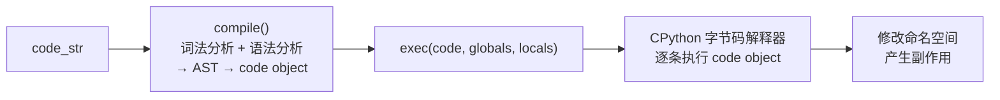

# Python exec 与 eval：危险的动态代码执行，以及你什么时候真的需要它

> 本文基于 Python 3.12。

## 一句话总结

`eval()` 执行**表达式**，返回结果。`exec()` 执行**语句块**，只干活不返回。两者都接收字符串或编译后的 code object，在运行时动态执行——这是 Python 最强大的能力，也是最危险的后门。

但只讲"别用 eval"太肤浅了。这篇文章讲清楚三个问题：**底层机制**、**安全边界**、**什么场景下它是正确的选择**。

## `eval` vs `exec`：一眼区分

```python
# eval → 表达式，有返回值
result = eval("3 + 5")
print(result)   # → 8

result = eval("[x**2 for x in range(5)]")
print(result)   # → [0, 1, 4, 9, 16]

# exec → 语句块，无返回值（或者说永远返回 None）
result = exec("x = 3 + 5")
print(result)   # → None
print(x)        # → 8  ← 副作用发生在调用者的命名空间里

# eval 不能执行语句
eval("x = 3 + 5")
# SyntaxError: invalid syntax
```

本质区别在于 CPython 将 Python 源码编译成的**两种 code object 类型**：eval 对应表达式编译模式（`'eval'`），exec 对应模块编译模式（`'exec'`）。

```python
# 看 compile 参数
code_eval = compile("3 + 5", "<string>", "eval")   # eval 模式，只能有表达式
code_exec = compile("x = 3 + 5", "<string>", "exec")  # exec 模式，可以有任意语句
```

## `compile`：真正干活的函数

`exec` 和 `eval` 内部都调用了 `compile()`——先编译成 code object，再执行：

```python
# 这个过程等价于 exec(code_str)
code = compile("print('hello')", "<string>", "exec")
exec(code)

# 编译一次，执行多次——适合动态生成的逻辑复用的场景
def make_adder(n):
    code = compile(f"result = x + {n}", "<adder>", "exec")
    def adder(x):
        namespace = {"x": x}
        exec(code, namespace)
        return namespace["result"]
    return adder

add_5 = make_adder(5)
add_10 = make_adder(10)
print(add_5(10))   # → 15
print(add_10(10))  # → 20
```

编译是重量级操作——如果同一段动态代码要执行很多次，先 compile 再反复 exec 比每次传字符串快一个数量级。

## 命名空间控制：全局和局部可以分别指定

这是 exec 最容易被忽略但最重要的参数：

```python
globals_dict = {}
locals_dict = {}

exec("x = 100", globals_dict, locals_dict)

print(globals_dict)  # → {'__builtins__': {...}}  ← x 不在 globals 里
print(locals_dict)   # → {'x': 100}               ← x 在 locals 里
```

当只传一个 namespace 时，它同时充当 globals 和 locals：

```python
namespace = {}
exec("x = 100", namespace)
print(namespace["x"])  # → 100
```

这就是为什么 `exec` 能向调用者的命名空间写入变量——如果你不传 namespace，它默认使用调用者的 `globals()` 和 `locals()`。

### 怎么"沙箱化" exec

```python
# 一个受限的执行环境——只暴露安全的内置函数
safe_globals = {
    "__builtins__": {
        "print": print,
        "range": range,
        "len": len,
        "int": int,
        "str": str,
        "list": list,
        "dict": dict,
        "True": True,
        "False": False,
        "None": None,
    }
}

try:
    exec("open('/etc/passwd')", safe_globals)
except NameError as e:
    print(e)  # → name 'open' is not defined
```

但这是**假安全**。即使清空了 `__builtins__`，攻击者仍有多种逃逸手段：

```python
# 逃逸法 1：从内置类型的特殊属性回溯
safe_globals["__builtins__"] = {}
exec("""
result = [x for x in ().__class__.__base__.__subclasses__()
         if x.__name__ == 'BuiltinImporter'][0].load_module('os').system('whoami')
""", safe_globals)
# → 读到了子类 → 找到了 import 机制 → 导入了 os → 执行了任意命令

# 逃逸法 2：通过字面量的 __class__ 链回溯
exec("().__class__.__bases__[0].__subclasses__()", safe_globals)
# → 拿到了全部内置类型的子类列表
```

结论：**别试图用 exec 做沙箱。做不到。** 如果你需要执行不可信代码，用真正的沙箱——Docker 容器、gVisor、或者 Python 的 `multiprocessing` + 操作系统级隔离。

## `ast.literal_eval`：当你只需要字面量

绝大多数人用 `eval` 的场景其实只需要解析字面量——字符串、数字、列表、字典、元组。`ast.literal_eval` 只解析 Python 字面量语法，不执行任何函数调用：

```python
import ast

# ✅ 安全的字面量解析
data = ast.literal_eval("[1, 2, 3]")          # → [1, 2, 3]
data = ast.literal_eval("{'key': 'value'}")     # → {'key': 'value'}
data = ast.literal_eval("(1, (2, 3))")          # → (1, (2, 3))

# ❌ 不能执行函数调用或表达式
ast.literal_eval("1 + 2")      # → ValueError: malformed node
ast.literal_eval("len([1,2])") # → ValueError: malformed node
ast.literal_eval("__import__('os')")  # → ValueError
```

`ast.literal_eval` 的原理是先 `ast.parse()` 得到 AST，然后只允许 `Constant`、`List`、`Dict`、`Tuple`、`Set`、`NameConstant` 等字面量节点——任何函数调用节点直接抛 ValueError。

## 三种合法的使用场景

### 1. 配置 DSL 引擎

```python
# 动态定义计算规则
rules = {
    "tax_rate": "0.13",
    "discount": "price * 0.8 if price > 500 else price",
    "shipping": "15 if weight > 1 else 5",
}

def compile_rule(rule_str, params):
    """将规则字符串编译为可执行函数"""
    code = compile(rule_str, "<rule>", "eval")
    def evaluator(**kwargs):
        return eval(code, {"__builtins__": {}}, kwargs)
    return evaluator

discount_fn = compile_rule(rules["discount"], {"price"})
print(discount_fn(price=600))  # → 480
print(discount_fn(price=300))  # → 300
```

注意：这里传给 eval 的 globals 里 **故意没有 `__builtins__`**——业务规则不需要调用 `open()` 或 `__import__()`。这是 exec/eval 最小权限原则的实践。

### 2. 动态类/函数生成

```python
def make_dataclass(name, **fields):
    """运行时根据配置动态创建数据类"""
    lines = [f"class {name}:",
             "    __slots__ = {fields}",
             "    def __init__(self, {params}):",
             *[f"        self.{f} = {f}" for f in fields],
             "    def __repr__(self):",
             f'        return f"{name}({{self.{', self.'.join(fields)}}})"']
    namespace = {}
    fields_tuple = repr(tuple(fields))
    params_str = ", ".join(fields)
    exec_code = "\n".join(lines).format(
        fields=fields_tuple, params=params_str
    )
    exec(exec_code, namespace)
    return namespace[name]

# 一行代码生成一个有类型的数据类
Config = make_dataclass("Config", host="str", port="int", debug="bool")
cfg = Config("localhost", 8080, True)
print(cfg)  # → Config(host=localhost, port=8080, debug=True)
```

但你大概率不需要这样做——Python 3.7+ 有 `dataclasses.dataclass`，3.12+ 的 `type` 语句也够用。这个例子更多是为了展示 exec 的动态生成能力。

### 3. 交互式调试和 REPL

这是 `exec` 最无可争议的合法场景——你应该已经用过 `python -c` 或 `pdb` 里的交互式执行：

```python
# 自定义轻量级表达式调试器
import code

def debug_context(**variables):
    """创建一个预填变量的交互式 REPL"""
    shell = code.InteractiveConsole(locals=variables)
    shell.interact(banner=f"调试中，可用变量: {list(variables.keys())}")

# debug_context(data={"user": "Alice"}, request_id="abc123")
```

`code.InteractiveConsole` 内部就是 `exec()`。当你需要运行时交互式检查状态时，exec 是最正确的工具。

## exec 的实际工作流程：从字符串到执行



`compile` 做了三步：
1. **词法分析**（tokenizer）：字符串 → token 流
2. **语法分析**（parser）：token 流 → AST（抽象语法树）
3. **代码生成**（code generator）：AST → code object（字节码 + 常量表 + 变量名表）

exec 只是把 code object 扔给 CPython 的字节码解释器，解释器在给定的命名空间中执行它。

## eval/exec 和 `input()`：最常见的漏洞模式

```python
# ❌ 经典漏洞：用户输入直接送 eval
def calculator():
    expression = input("输入算式: ")
    result = eval(expression)  # 输入 __import__('os').system('rm -rf /')
    print(f"结果: {result}")
```

这不是虚构的例子——真实世界的 Python 应用中，这种模式导致过生产事故。修复方法取决于你想要什么：

```python
# 方案 1：想要计算器 → 用 ast.literal_eval（只支持字面量，太受限）
# 方案 2：想要数学表达式 → 用 operator + 解析器
import operator

ops = {
    "+": operator.add, "-": operator.sub,
    "*": operator.mul, "/": operator.truediv,
    "**": operator.pow, "%": operator.mod,
}

# 更安全的做法：只解析你知道的格式
def safe_calc(expr):
    """只支持 'number op number' 的简单格式"""
    parts = expr.split()
    if len(parts) != 3:
        raise ValueError("格式：数字 运算符 数字")
    a, op, b = parts
    return ops[op](float(a), float(b))
```

## 什么时候你不该用 exec/eval

```python
# ❌ 访问属性 → 用 getattr
value = eval(f"obj.{attr_name}")   # 坏
value = getattr(obj, attr_name)    # 好

# ❌ 动态导入 → 用 importlib
exec(f"from {module} import {name}")   # 坏
module_obj = __import__(module, fromlist=[name])  # 好

# ❌ 读取配置文件 → 用 json / toml / yaml
settings = eval(open("config.py").read())  # 坏
settings = json.load(open("config.json"))  # 好

# ❌ 解析字面量 → 用 ast.literal_eval
data = eval("[1, 2, 3]")              # 坏
data = ast.literal_eval("[1, 2, 3]")  # 好
```

## 小结

| 函数 | 输入 | 返回 | 安全替代 |
|---|---|---|---|
| `eval()` | 表达式 | 值 | `ast.literal_eval`（仅字面量） |
| `exec()` | 任意语句块 | `None` | `importlib`、`getattr`、专用解析器 |
| `compile()` | 源码 + 模式 | code object | 框架 DSL → 专用 parser |

三个核心认识：

1. **沙箱是不可能的**。清空 `__builtins__` 也不行——Python 的对象模型给攻击者留下了太多回溯路径。
2. **绝大多数场景不需要 exec/eval**。`getattr`、`importlib`、`json`、专用解析器分别覆盖了 95% 的"动态执行"需求。
3. **剩下的 5%**——配置 DSL、动态代码生成、交互式调试——exec/eval 是正确工具，但需要在**受控环境**、**最小权限**、**已知输入**三个条件下使用。
