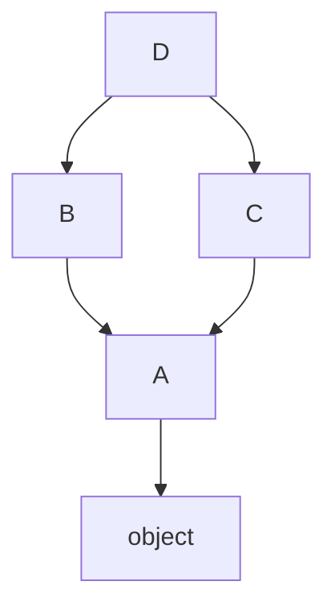

# Python 面向对象：从 class 到 metaclass 的系统理解

> 本文基于 Python 3.12，涉及语法特性会标注最低支持版本。

Python 的面向对象不是 Java/C++ 的翻版。它有独特的规则——没有真正的 private、多继承靠 C3 线性化、类本身也是对象。这篇文章从 `class` 关键字一路讲到 metaclass，每一层都回答「为什么这样设计」。

## 一、类和对象——Python 版的 OOP 长什么样

### 一个起点

```python
class Account:
    """银行账户"""

    # 类属性——所有实例共享
    bank_name = "Python Bank"
    _total_accounts = 0        # 约定私有（单下划线）

    def __init__(self, owner, balance=0):
        # 实例属性——每个实例独有
        self.owner = owner
        self._balance = balance # 约定私有
        Account._total_accounts += 1

    def deposit(self, amount):
        if amount <= 0:
            raise ValueError("存款金额必须 > 0")
        self._balance += amount
        return self._balance

    def withdraw(self, amount):
        if amount <= 0:
            raise ValueError("取款金额必须 > 0")
        if amount > self._balance:
            raise ValueError("余额不足")
        self._balance -= amount
        return self._balance

    @property
    def balance(self):
        """余额——只读属性"""
        return self._balance

    @classmethod
    def total_accounts(cls):
        return cls._total_accounts

    @staticmethod
    def is_valid_amount(amount):
        return isinstance(amount, (int, float)) and amount > 0

    def __repr__(self):
        return f"Account(owner={self.owner!r}, balance={self._balance!r})"
```

这段代码已经把 Python OOP 的大部分部件展示出来了。逐个拆解。

### `__init__` 不是构造函数

```python
a = Account("Alice", 100)
# 实际发生的事情：
# 1. Account.__new__(Account)  → 创建一个空的 Account 实例
# 2. Account.__init__(a, "Alice", 100) → 给实例填充属性
```

`__new__` 才是真正创建对象的——但它几乎从不被重写（除了继承不可变类型和 singleton 模式）。`__init__` 是初始化器——对象已经有了，你往里填数据。大部分时候你只需要关心 `__init__`。

### 实例属性 vs 类属性——查找链

```python
a1 = Account("Alice", 100)
a2 = Account("Bob", 200)

print(a1.bank_name)     # "Python Bank"——来自类属性
print(a2.bank_name)     # "Python Bank"——同上
print(Account.bank_name)# "Python Bank"——直接从类访问

# 关键：给实例赋值不会覆盖类属性
a1.bank_name = "My Bank"  # 在 a1 上创建同名的实例属性
print(a1.bank_name)     # "My Bank"——实例属性遮蔽了类属性
print(a2.bank_name)     # "Python Bank"——a2 没有实例属性，继续找到类
print(Account.bank_name)# "Python Bank"——类属性没变
```

属性的查找链：`instance.__dict__` → `class.__dict__` → 父类 `.__dict__`（沿 MRO 链上溯）。实例属性遮蔽了类属性但没有覆盖它——这是 Python 数据模型的核心机制。

### `self` 是什么

`self` 不是关键字——只是一个参数名约定。你完全可以用 `this`：

```python
class Foo:
    def bar(this):       # 合法，但别这么做
        print(this)

Foo.bar(Foo())           # 显式传 self
Foo().bar()              # 语法糖——实例自动作为第一个参数
```

方法调用 `obj.method(arg)` 在底层等价于 `Class.method(obj, arg)`。Python 通过描述符协议（descriptor protocol）把函数「绑定」到实例上，自动填充第一个参数。

### 方法类型

```python
class Demo:
    def instance_method(self):    # 普通方法——访问 self
        return self

    @classmethod
    def class_method(cls):        # 类方法——访问 cls，常用于工厂模式
        return cls()

    @staticmethod
    def static_method():          # 静态方法——不访问 self 也不访问 cls
        return "just a function"  # 就是放在类命名空间里的普通函数
```

装饰器 `@classmethod` 和 `@staticmethod` 改变了方法的描述符行为——如何绑定、绑什么作为第一个参数。

**什么时候用哪个**：

- 需要读写实例数据？`instance method`
- 需要创建实例的替代构造函数？`@classmethod`（如 `datetime.fromisoformat`）
- 函数逻辑上属于这个类但不需要访问实例/类？`@staticmethod`（如上面的 `is_valid_amount`）

## 二、封装——Python 没有真正的 private

```python
class BankAccount:
    def __init__(self):
        self._balance = 0       # 约定：别碰
        self.__secret = "xyz"   # name mangling：变成 _BankAccount__secret

a = BankAccount()
print(a._balance)               # 0——可以访问，约定不保证
print(a._BankAccount__secret)   # "xyz"——name mangling 也不保证
```

Python 的封装哲学是「我们都是成年人」——**约定优于强制**：

- `_single_leading_underscore`：约定私有。`from module import *` 不会导入。你在 IDE 里看到下划线前缀，就别用
- `__double_leading_underscore`：name mangling。编译器把 `__foo` 重写成 `_ClassName__foo`。目的不是防黑客——是**防止子类无意覆盖父类的同名属性**

Name mangling 的正确使用场景：

```python
class Base:
    def __init__(self):
        self.__cache = {}   # 不想被子类覆盖的内部状态

class Child(Base):
    def __init__(self):
        super().__init__()
        self.__cache = []   # 这是 _Child__cache，不会覆盖 Base 的 _Base__cache
```

它不是安全机制——是避免命名冲突的机制。

## 三、属性——`@property` 让方法看起来像属性

```python
class Temperature:
    def __init__(self, celsius):
        self._celsius = celsius

    @property
    def celsius(self):
        """读——像属性一样访问"""
        return self._celsius

    @celsius.setter
    def celsius(self, value):
        """写——带验证"""
        if value < -273.15:
            raise ValueError("温度不能低于绝对零度")
        self._celsius = value

    @property
    def fahrenheit(self):
        """计算属性——不存，每次算"""
        return self._celsius * 9/5 + 32

t = Temperature(25)
print(t.celsius)      # 25    ——不用写 ()
print(t.fahrenheit)   # 77.0  ——计算属性
t.celsius = 30        # 赋值触发 setter 验证
# t.celsius = -500    # ❌ ValueError
```

核心价值：**先用简单的属性访问，后期需要加验证/计算时，改成 property——调用方代码零改动**。这就是「统一访问原则」——调用方不关心背后是存还是算。

## 四、继承与 MRO——多继承不是魔法

### 单继承

```python
class SavingsAccount(Account):
    """储蓄账户——有利息"""
    interest_rate = 0.02

    def __init__(self, owner, balance=0, interest_rate=None):
        super().__init__(owner, balance)
        if interest_rate is not None:
            self.interest_rate = interest_rate

    def add_interest(self):
        self._balance += self._balance * self.interest_rate

    def withdraw(self, amount):
        """储蓄账户取款有最低余额限制"""
        if self._balance - amount < 10:   # 至少保留 10 元
            raise ValueError("储蓄账户至少保留 10 元")
        return super().withdraw(amount)    # 委托父类
```

### `super()` 做了什么

```python
super().__init__(owner, balance)
# 不等价于 Account.__init__(self, owner, balance)
```

在多继承场景下，`super()` 按 MRO 顺序找下一个类，不一定是「父类」。它在单继承中看起来多余，但在多继承的菱形结构中不可或缺。

### 多继承与 MRO

```python
class A:
    def method(self):
        print("A")

class B(A):
    def method(self):
        print("B")
        super().method()

class C(A):
    def method(self):
        print("C")
        super().method()

class D(B, C):
    def method(self):
        print("D")
        super().method()

D().method()
# D → B → C → A
```

MRO 可以通过 `D.__mro__` 查看：

```python
print(D.__mro__)
# (<class 'D'>, <class 'B'>, <class 'C'>, <class 'A'>, <class 'object'>)
```



Python 用 **C3 线性化算法** 来确保 MRO 满足三条规则：
1. 子类在父类之前
2. 父类的顺序保持（`class D(B, C)` 中 B 在 C 前面）
3. 每个类只出现一次

如果继承结构不满足 C3——比如 `class X(A, B)` 和 `class Y(B, A)` 同时作为父类——Python 直接拒绝创建这个类。不是静默 bug，是硬错误。

### Mixin——多继承的正确用法

```python
class JSONSerializableMixin:
    """给任何类加上 JSON 序列化能力"""
    def to_json(self):
        import json
        return json.dumps(self.__dict__)

    def from_json(self, json_str):
        import json
        data = json.loads(json_str)
        self.__dict__.update(data)
        return self

class LoggingMixin:
    """给任何类加上日志能力"""
    def log(self, message):
        print(f"[{self.__class__.__name__}] {message}")

class SavingsAccount(Account, JSONSerializableMixin, LoggingMixin):
    pass

a = SavingsAccount("Alice", 1000)
print(a.to_json())       # {"owner": "Alice", "_balance": 1000, ...}
a.log("Interest added")  # [SavingsAccount] Interest added
```

Mixin 的约定：
- 类名带 `Mixin` 后缀——明确这不是一个独立类
- 功能单一——一个 Mixin 只做一件事
- 不定义 `__init__`——避免初始化链的复杂性
- 放在 MRO 的前面——Mixin 要在「真正的父类」之前，以便 `super()` 链正确

Mixin 是 Python 里替代多重继承的利器——**用组合的方式获得多继承的能力，但不引入复杂的 is-a 关系**。

## 五、魔法方法——你的类可以和内置类型一样工作

```python
class Vector:
    def __init__(self, x, y):
        self.x = x
        self.y = y

    def __repr__(self):               # 给开发者看的
        return f"Vector({self.x!r}, {self.y!r})"

    def __str__(self):                # 给用户看的
        return f"({self.x}, {self.y})"

    def __eq__(self, other):          # ==
        if not isinstance(other, Vector):
            return NotImplemented
        return self.x == other.x and self.y == other.y

    def __hash__(self):               # 可放进 set/dict key
        return hash((self.x, self.y))

    def __add__(self, other):         # +
        return Vector(self.x + other.x, self.y + other.y)

    def __mul__(self, scalar):        # *
        return Vector(self.x * scalar, self.y * scalar)

    def __rmul__(self, scalar):       # 标量 * Vector
        return self.__mul__(scalar)

    def __abs__(self):                # abs()
        return (self.x ** 2 + self.y ** 2) ** 0.5

    def __bool__(self):               # bool()
        return self.x != 0 or self.y != 0

    def __len__(self):                # len()——Vector 没有长度概念
        return 2                       # 但有维度概念。不推荐这样实现

    def __getitem__(self, index):     # v[0]
        return (self.x, self.y)[index]

    def __iter__(self):               # for x in v
        yield self.x
        yield self.y

v1 = Vector(3, 4)
v2 = Vector(3, 4)
print(v1)                # (3, 4)
print(v1 == v2)          # True
print(v1 + v2)           # Vector(6, 8)
print(v1 * 2)            # Vector(6, 8)
print(2 * v1)            # Vector(6, 8) —— __rmul__
print(abs(v1))           # 5.0
print(bool(Vector(0, 0))) # False
print({v1, v2})          # {Vector(3, 4)} —— __hash__ + __eq__
```

不需要实现所有魔法方法——按需选择。但 `__repr__` 几乎永远该写——没有它时 `print(obj)` 输出 `<__main__.Vector object at 0x...>`，对调试毫无帮助。

### 上下文管理器——`__enter__` + `__exit__`

```python
class Transaction:
    def __init__(self, account):
        self.account = account
        self.original_balance = account._balance

    def __enter__(self):
        print("事务开始")
        return self

    def __exit__(self, exc_type, exc_val, exc_tb):
        if exc_type is not None:
            # 异常发生——回滚
            self.account._balance = self.original_balance
            print(f"事务回滚: {exc_val}")
        else:
            print("事务提交")
        return False  # False = 不吞异常

with Transaction(savings):
    savings.deposit(100)
    savings.withdraw(50)
    raise ValueError("Something went wrong")
# 事务回滚: Something went wrong
# 余额恢复到事务开始前
```

## 六、`__slots__`——用空间换灵活性的反向操作

```python
class Point:
    __slots__ = ('x', 'y')        # 只允许这两个属性

    def __init__(self, x, y):
        self.x = x
        self.y = y

p = Point(1, 2)
p.x = 3     # ✅
# p.z = 4   # ❌ AttributeError: 'Point' object has no attribute 'z'
```

默认每个 Python 实例有一个 `__dict__` 字典来存属性——灵活但占用内存（每个实例 ~100+ bytes 的字典开销）。`__slots__` 用 C 级别的数组存储替代字典：

| | 默认 | `__slots__` |
|---|---|---|
| `__dict__` | ✅ | ❌（除非手动加到 `__slots__`） |
| 动态加属性 | ✅ | ❌ |
| 内存占用 | 高（每个实例 ~104 bytes 字典开销） | 低（每个 slot ~8 bytes） |
| 属性访问速度 | 字典查找 | 数组索引——更快 |
| 适用场景 | 少量实例、属性不定 | 百万级实例、属性固定 |

**不是优化工具——除非你真的创建了海量实例**。对大多数代码来说，`__slots__` 是过早优化。NumPy 数组元素、大量小数据对象（如金融交易记录）是合理场景。

## 七、抽象基类——定义接口契约

```python
from abc import ABC, abstractmethod

class PaymentProcessor(ABC):
    @abstractmethod
    def charge(self, amount: float) -> bool:
        """扣款——子类必须实现"""
        ...

    @abstractmethod
    def refund(self, transaction_id: str) -> bool:
        """退款——子类必须实现"""
        ...

    def log_transaction(self, amount: float):
        """日志——提供默认实现，子类可选覆盖"""
        print(f"[Payment] {amount} processed")

class StripeProcessor(PaymentProcessor):
    def charge(self, amount):
        print(f"Stripe charged {amount}")
        return True

    def refund(self, transaction_id):
        print(f"Stripe refunded {transaction_id}")
        return True

# processor = PaymentProcessor()  # ❌ 不能实例化抽象类
processor = StripeProcessor()     # ✅
```

ABC 的真正价值不在于「强制子类实现方法」——Python 的鸭子类型不关心这个。价值在于**让 IDE 和类型检查器在你不小心的时候发出警告**，以及**用 `isinstance(obj, PaymentProcessor)` 做结构化判断**。

## 八、`@dataclass`——停止手写 `__init__`（Python 3.7+）

```python
from dataclasses import dataclass, field
from typing import ClassVar

@dataclass
class Trade:
    symbol: str
    price: float
    quantity: int
    side: str = "buy"                            # 默认值
    timestamp: float = field(default_factory=lambda: __import__('time').time())
    tags: list = field(default_factory=list)     # 可变默认值必须用 default_factory
    _id: int = field(default=0, repr=False)      # 不出现在 __repr__ 里

    # 类变量——所有实例共享，不计入字段
    exchange: ClassVar[str] = "NASDAQ"

    def value(self):
        return self.price * self.quantity

# 自动生成：__init__, __repr__, __eq__, __hash__（如果 frozen=True）
t1 = Trade("AAPL", 185.5, 100)
t2 = Trade("AAPL", 185.5, 100)
print(t1)              # Trade(symbol='AAPL', price=185.5, quantity=100, side='buy', timestamp=..., tags=[])
print(t1 == t2)        # True
print(t1.value())      # 18550.0
print(Trade.exchange)  # "NASDAQ"
```

**但 dataclass 的 `frozen=True` 需要小心**：

```python
@dataclass(frozen=True)
class ImmutableConfig:
    host: str
    tags: list = field(default_factory=list)

c = ImmutableConfig("localhost")
c.host = "remote"   # ❌ FrozenInstanceError
c.tags.append("x")  # ✅ 这居然可以——list 是可变对象，frozen 只保护引用不变
```

`frozen=True` 是浅不可变——字段引用不能改，但引用指向的可变对象内容仍然可以改。和 Rust 的所有权语义完全不同。

## 九、metaclass——类本身也是对象

```python
class Meta(type):
    def __new__(mcs, name, bases, namespace):
        """创建类时调用——在 class 语句执行完之后"""
        # 自动给所有方法加上日志
        for attr_name, attr_value in namespace.items():
            if callable(attr_value) and not attr_name.startswith('_'):
                namespace[attr_name] = mcs._wrap_with_log(attr_value)
        return super().__new__(mcs, name, bases, namespace)

    @staticmethod
    def _wrap_with_log(func):
        def wrapper(*args, **kwargs):
            print(f"[LOG] Calling {func.__name__}")
            return func(*args, **kwargs)
        return wrapper

class Service(metaclass=Meta):
    def process(self):
        print("Processing...")

s = Service()
s.process()
# [LOG] Calling process
# Processing...
```

metaclass 的调用时机：


metaclass 是 Python 最底层的钩子——你可以在它上面实现 ORM（Django models）、接口注册（abc.ABCMeta）、单例模式。**但绝大多数代码不需要 metaclass**。如果可以用类装饰器、`__init_subclass__` 或普通继承实现，就不要引入 metaclass。

一个更实用的替代是 `__init_subclass__`（Python 3.6+）：

```python
class PluginBase:
    _registry = {}

    def __init_subclass__(cls, **kwargs):
        """子类定义时自动调用——不需要 metaclass"""
        super().__init_subclass__(**kwargs)
        PluginBase._registry[cls.__name__] = cls

class PDFExporter(PluginBase):
    pass

class CSVExporter(PluginBase):
    pass

print(PluginBase._registry)
# {'PDFExporter': <class 'PDFExporter'>, 'CSVExporter': <class 'CSVExporter'>}
```

## 十、组合 vs 继承——什么时候不该用继承

```python
# ❌ 用继承表达了错误的关系
class Stack(list):           # Stack is a list？不是——Stack 有一个 list
    def push(self, item):
        self.append(item)
    def pop(self):
        return super().pop()

# 问题：Stack 继承了 list 的所有方法——insert、remove、sort——
# 它们都暴露在外面，破坏了 Stack 的 LIFO 语义

s = Stack()
s.push(1)
s.insert(0, 99)   # 栈可以从中间插入？语义崩坏

# ✅ 组合
class Stack:
    def __init__(self):
        self._items = []     # Stack 有一个 list，不是 list

    def push(self, item):
        self._items.append(item)

    def pop(self):
        return self._items.pop()

    def __len__(self):
        return len(self._items)
```

判断该用继承还是组合的规则：**如果可以说「B 是一个 A」，用继承。如果只能说「B 有一个 A」，用组合。**

## 总结

```mermaid
mindmap
  Python OOP
    基础
      class 语句
      __init__ 初始化器
      self 不是关键字
    封装
      单下划线约定
      name mangling
      @property
    继承
      super() 和 MRO
      C3 线性化
      Mixin 模式
    魔法方法
      __repr__ __str__
      __eq__ __hash__
      __enter__ __exit__
    进阶
      __slots__
      dataclass
      ABC
      metaclass
      __init_subclass__
```

Python 的面向对象核心思想可以浓缩为一句：**类和实例都是运行时可修改的对象——class 语句不是蓝图，是运行时代码**。这意味着你可以做到很多静态语言做不到的事（运行时动态修改类、用 metaclass 截获类创建过程），但也意味着你不能依赖编译器来保证封装和继承的安全性——约定和测试是 Python 的世界里代替编译器检查的保障。

---

Rust 和 Python 系列的对比挺有意思——Rust 的文章在讲编译器怎么检查你，Python 的文章在讲运行时的灵活度有多大。两种语言的 OOP 放在一起读，能清晰感觉到「静态编译时保证」和「动态运行时灵活」两种设计哲学的分野。
