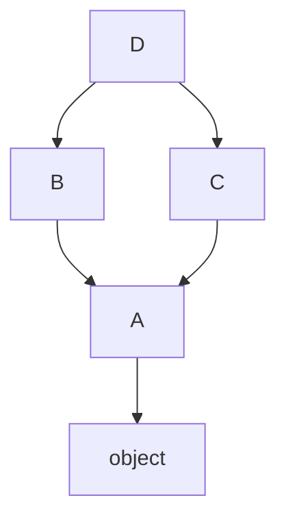

# Python 面向对象（三）：继承与 MRO——super() 和多继承的底层逻辑

> 本文基于 Python 3.12，涉及语法特性会标注最低支持版本。

上一篇讲完封装，这一篇进入继承体系——单继承、`super()` 的正确理解、多继承为什么不会乱（C3 线性化）、以及 Mixin 模式。

## 单继承

```python
class Account:
    def __init__(self, owner, balance=0):
        self.owner = owner
        self._balance = balance

    def deposit(self, amount):
        if amount <= 0:
            raise ValueError("存款金额必须 > 0")
        self._balance += amount
        return self._balance

    def withdraw(self, amount):
        if amount <= 0:
            raise ValueError("取款金额必须 > 0")
        if amount > self._balance:
            raise ValueError("余额不足")
        self._balance -= amount
        return self._balance

class SavingsAccount(Account):
    """储蓄账户——有利息和最低余额限制"""
    interest_rate = 0.02

    def __init__(self, owner, balance=0, interest_rate=None):
        super().__init__(owner, balance)
        if interest_rate is not None:
            self.interest_rate = interest_rate

    def add_interest(self):
        self._balance += self._balance * self.interest_rate

    def withdraw(self, amount):
        """覆写父类方法——添加最低余额检查"""
        if self._balance - amount < 10:
            raise ValueError("储蓄账户至少保留 10 元")
        return super().withdraw(amount)  # 委托父类执行实际逻辑
```

单继承很直观——子类复用父类的属性和方法，覆写需要定制的部分。

## `super()` 的正确理解

```python
super().__init__(owner, balance)
# 不等价于
# Account.__init__(self, owner, balance)
```

在单继承中两者结果相同，但在多继承中完全不同。`super()` 不指向「父类」——它指向 **MRO 中的下一个类**。

可以用一个小例子验证：

```python
class A:
    def method(self):
        print("A")
        super().method()   # ← A 的 method 里也调了 super()！

class B(A):
    def method(self):
        print("B")
        super().method()

B().method()
# B
# A
# ... 然后报错 AttributeError: 'super' object has no attribute 'method'
# 因为 A 的 MRO 下一个是 object，而 object 没有 method
```

`A.method()` 里的 `super().method()` 调的不是「A 的父类」，而是 MRO 中 A 的下一个类——通常是 `object`，而 `object` 没有 `method`，所以报错。这说明 `super()` 的行为完全取决于调用它的实例的 MRO，而不取决于它写在哪个类里。

## 多继承与 MRO

```python
class A:
    def method(self):
        print("A")

class B(A):
    def method(self):
        print("B")
        super().method()

class C(A):
    def method(self):
        print("C")
        super().method()

class D(B, C):
    def method(self):
        print("D")
        super().method()

D().method()
# D → B → C → A
```



Python 用 **C3 线性化算法**确定 MRO。三条规则：

1. 子类在父类之前
2. 父类的声明顺序保持（`class D(B, C)` 中 B 在 C 前面）
3. 每个类只出现一次

```python
print(D.__mro__)
# (<class 'D'>, <class 'B'>, <class 'C'>, <class 'A'>, <class 'object'>)
```

如果继承结构本身矛盾——比如 `class X(A, B)` 和 `class Y(B, A)` 同时作为父类——Python 直接拒绝创建这个类：

```python
class X(A, B): pass
class Y(B, A): pass
# class Z(X, Y): pass   # ❌ TypeError: Cannot create a consistent MRO
```

不是静默 bug——是硬错误。C3 在类定义时就检查，不一致的继承结构根本通不过编译。

## `super()` 不跳过任何类

```python
class A:
    def __init__(self):
        print("A.__init__")
        super().__init__()   # object.__init__（无输出）

class B(A):
    def __init__(self):
        print("B.__init__")
        super().__init__()   # 沿 MRO 找下一个——C.__init__

class C(A):
    def __init__(self):
        print("C.__init__")
        super().__init__()   # A.__init__

class D(B, C):
    def __init__(self):
        print("D.__init__")
        super().__init__()   # B.__init__

D()
# D.__init__
# B.__init__
# C.__init__
# A.__init__
```

MRO 是 `D → B → C → A → object`。`super()` 严格按这个顺序传递，不会跳过任何类。这就是所谓的「协作式多重继承」——每个类在 `__init__` 末尾调 `super()`，把接力棒交给 MRO 中的下一个类。

## Mixin——多继承的正确用法

不是所有多继承都是 `is-a` 关系。有时候你只是想给类「混入」一些功能：

```python
import json

class JSONSerializableMixin:
    """给任何类加上 JSON 序列化能力"""
    def to_json(self):
        return json.dumps(self.__dict__, default=str)

    @classmethod
    def from_json(cls, json_str):
        data = json.loads(json_str)
        obj = cls.__new__(cls)      # 不走 __init__，避免参数问题
        obj.__dict__.update(data)
        return obj

class LoggingMixin:
    """给任何类加上日志能力"""
    def log(self, message):
        print(f"[{self.__class__.__name__}] {message}")

# 组合：储蓄账户 + JSON 序列化 + 日志
class SavingsAccount(Account, JSONSerializableMixin, LoggingMixin):
    pass

a = SavingsAccount("Alice", 1000)
print(a.to_json())       # {"owner": "Alice", "_balance": 1000}
a.log("Interest added")  # [SavingsAccount] Interest added
```

Mixin 的约定：

- 类名带 `Mixin` 后缀——明确这不是一个独立类，而是「调料」
- 功能单一——一个 Mixin 只做一件事（序列化、日志、缓存…）
- 不定义 `__init__`——避免初始化链混乱
- 放在 MRO 前面——`class MyClass(MyMixin, BaseClass)`，这样 `super()` 链才正确

Mixin 是 Python 对多重继承问题的优雅解法——**你不说 B 是一个 A，你说 B 是我额外增加了某种能力**。这和 Java 的 interface default method 或 Rust 的 trait 有异曲同工之处。

## 总结

1. `super()` 不指向父类——它指向 MRO 中的下一个类
2. MRO 由 C3 线性化决定——不一致的继承直接拒绝编译
3. 协作式多继承要求每个类都调 `super()`——接力棒沿 MRO 传递
4. Mixin 解决了「我想复用功能但不是 is-a 关系」的问题

第四篇讲魔法方法——如何让你的自定义类像 Python 内置类型一样工作。

→ [（四）魔法方法：像内置类型一样工作](04-magic-methods.md)
