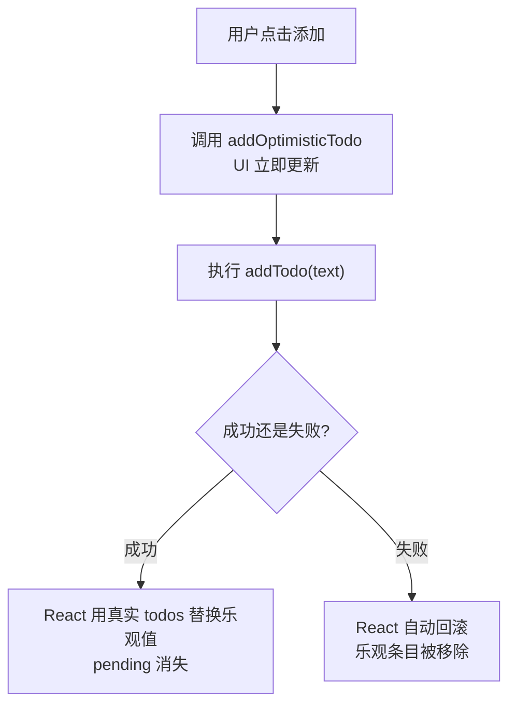
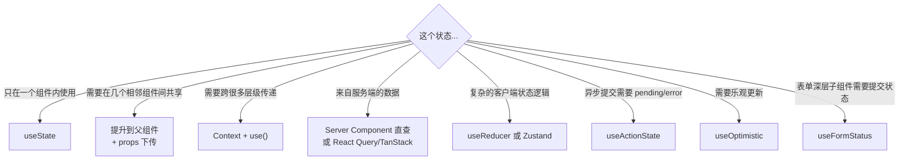

# React 19 新 API 全景：Actions 与状态管理新范式

> 本文基于 React 19.2。Actions、`useActionState`、`useFormStatus`、`useOptimistic`、`use()` 均为 React 19 新增 API，`ref as prop` 自 React 19 开始支持（不再需要 `forwardRef`）。

## Actions：不只是 form action，是一个新概念

React 19 引入了一个贯穿多个 API 的概念——**Actions**。它的定义很简单：

> Action 是一个异步函数，React 自动在其中管理提交状态（pending）、乐观更新和错误处理。

在 React 19 之前，你手动管理：

```jsx
// 手动管理 async 的状态——每次都要写
const [loading, setLoading] = useState(false);
const [error, setError] = useState(null);

async function handleSubmit(data) {
  setLoading(true);
  setError(null);
  try {
    await submitData(data);
  } catch (e) {
    setError(e.message);
  } finally {
    setLoading(false);
  }
}
```

React 19 内置了这个模式——通过 `useActionState` 和 `useFormStatus` 两个 Hook。

## useActionState：异步操作的完整状态管理

```jsx
import { useActionState } from 'react';

async function updateName(prevState, formData) {
  const name = formData.get('name');
  // 模拟服务端校验
  if (name.length < 2) {
    return { error: '名字至少 2 个字符' };
  }
  await saveToDatabase(name);
  return { success: true, name };
}

function NameForm() {
  const [state, formAction, isPending] = useActionState(updateName, {
    success: false,
    error: null
  });

  return (
    <form action={formAction}>
      <input name="name" placeholder="输入新名字" />
      <button type="submit" disabled={isPending}>
        {isPending ? '保存中...' : '保存'}
      </button>
      {state.error && <p className="error">{state.error}</p>}
      {state.success && <p>已更新为 {state.name}</p>}
    </form>
  );
}
```

`useActionState` 的签名：

```
useActionState(actionFn, initialState)
```

返回三个值：

| 返回值 | 说明 |
|--------|------|
| `state` | 当前状态——`actionFn` 每次返回的值 |
| `formAction` | 传给 `<form action={...}>` 的函数，或 `<button formAction={...}>` |
| `isPending` | 是否有正在执行的 Action |

`actionFn` 接收两个参数：上一次的 `state` 和当前的 `formData`。这和 `useReducer` 的 `(state, action) → newState` 模式很像——但它是异步的。

## useFormStatus：从子组件读取表单提交状态

`useFormStatus` 让你在表单的深层子组件中读取提交状态，不需要通过 props 逐层传递：

```jsx
"use client";

import { useFormStatus } from 'react-dom';

function SubmitButton() {
  const { pending, data, method, action } = useFormStatus();

  return (
    <button type="submit" disabled={pending}>
      {pending ? '提交中...' : '提交'}
    </button>
  );
}

// 父组件——不需要传 isPending prop 给 SubmitButton
function Form() {
  return (
    <form action={someAction}>
      <input name="title" />
      <textarea name="body" />
      <SubmitButton />
    </form>
  );
}
```

它返回四个值：

| 值 | 说明 |
|----|------|
| `pending` | 是否有正在执行的 Action |
| `data` | 正在提交的 FormData 对象 |
| `method` | HTTP 方法（"get" 或 "post"） |
| `action` | 正在执行的 Action 函数引用 |

注意：`useFormStatus` 读取的是**最近的祖先 `<form>` 的状态**。这要求组件在 `<form>` 内部。

## useOptimistic：先改 UI，出事再说

乐观更新的本质是：**你假设操作会成功，立即更新 UI。如果失败了，回滚**。这在聊天应用、点赞、拖拽等场景非常常见。

React 19 之前你需要自己管理两套状态（真实值 + 乐观值），React 19 内置了：

```jsx
import { useOptimistic } from 'react';

function TodoList({ todos, addTodo }) {
  const [optimisticTodos, addOptimisticTodo] = useOptimistic(
    todos,                                            // 真实数据
    (state, newTodo) => [...state, newTodo]           // 乐观更新函数
  );

  async function handleAdd(formData) {
    const text = formData.get('text');
    addOptimisticTodo({ id: crypto.randomUUID(), text, pending: true });
    await addTodo(text);  // 如果失败，React 自动回滚 optimisticTodos
  }

  return (
    <form action={handleAdd}>
      <input name="text" />
      <button>添加</button>
      <ul>
        {optimisticTodos.map(todo => (
          <li key={todo.id} className={todo.pending ? 'pending' : ''}>
            {todo.text}
          </li>
        ))}
      </ul>
    </form>
  );
}
```

流程：



以前需要 Redux 或 Zustand + 手动 try/catch 实现的事，现在一个 Hook 搞定。

## use()：在渲染中读取异步数据

`use()` 是 React 19 最特别的新 API——它**不是 Hook**（不以 `use` 开头要遵守的规则跟其他 Hooks 不同）。它可以在条件、循环中使用，因为它在内部使用了不同的机制。

```jsx
// ❌ 过去的做法——useEffect + useState
function Article({ id }) {
  const [article, setArticle] = useState(null);
  useEffect(() => { fetchArticle(id).then(setArticle); }, [id]);
  if (!article) return <div>Loading...</div>;
  return <ArticleView article={article} />;
}

// ✅ use()——直接 await 一个 Promise
function Article({ id }) {
  const article = use(fetchArticle(id));
  // fetchArticle 返回 Promise——use() 在它 resolve 前暂停渲染
  return <ArticleView article={article} />;
}
```

`use()` 可以读 Promise 和 Context：

```jsx
const article = use(fetchArticle(id));   // 读 Promise
const theme = use(ThemeContext);         // 读 Context（不再是 useContext）
```

`use()` 读 Context 的最大区别——**可以在条件或循环中使用**：

```jsx
function Section({ type }) {
  if (type === 'admin') {
    const adminConfig = use(AdminContext);  // ✅ 条件里的 use()
    return <AdminPanel config={adminConfig} />;
  }
  return <UserPanel />;
}
```

这解决了 `useContext` 长期以来最烦人的限制——组件必须渲染整个 Context，即使只在某个分支需要。

**但是**，`use()` 读 Promise 主要是给 Server Components 和框架（如 Next.js）使用的。如果你直接在 Client Component 里 `use(fetch(...))`，每次渲染都会创建新的 Promise，导致无限循环。正确用法是配合框架的缓存机制（如 Next.js 的 `cache()`），或将 Promise 存在 `useRef` 中。

## ref 可以直接当 prop 传了

React 19 终于不需要 `forwardRef` 了：

```jsx
// React 18 —— 必须用 forwardRef
const MyInput = React.forwardRef(function MyInput(props, ref) {
  return <input ref={ref} {...props} />;
});

// React 19 —— ref 就是普通 prop
function MyInput({ ref, ...props }) {
  return <input ref={ref} {...props} />;
}
```

`forwardRef` 没有废弃，但不再必须。如果你不需要在运行时拿到 ref 做特殊逻辑，直接当 prop 传就行。

## React 19 状态管理全景

在新的 API 出来之后，React 的状态管理选型变成了这样：



几个判断原则：

1. **不要过早引入状态管理库**。React 19 内置的 `useState` + `useReducer` + Context + `useActionState` 已经覆盖了大部分场景。

2. **Context 适合读多写少的数据**（主题、locale、用户信息）。不适合频繁变化的数据——每个 context 值变化都会触发所有消费者重渲染。

3. **Zustand 适合需要细粒度订阅的场景**。它不会像 Context 那样触发全量重渲染——组件只订阅自己需要的切片。

4. **React Query / TanStack Query 不是状态管理库，是服务端缓存层**。你从服务端获取的大部分「状态」其实都适合放这里——它自动处理缓存失效、后台刷新、乐观更新等问题。

5. **Server Components 减少了对客户端状态管理的需求**。以前你需要把数据从 API 拉到客户端再放进状态库——现在数据在服务端就查好了，直接传给 Client Component 作为 props。

## 实战：React 19 搭建一个带实时更新的评论系统

```jsx
// page.jsx — Server Component
import { db } from '@/lib/db';
import { CommentList } from './comment-list';

export default async function CommentsPage({ params }) {
  const comments = await db.comment.findMany({
    where: { postId: params.id },
    orderBy: { createdAt: 'desc' }
  });

  return (
    <CommentList
      postId={params.id}
      initialComments={comments}
    />
  );
}
```

```jsx
// comment-list.jsx — Client Component
"use client";

import { useState, useOptimistic, useActionState } from 'react';
import { useFormStatus } from 'react-dom';
import { addComment } from './actions';

function SubmitButton() {
  const { pending } = useFormStatus();
  return <button disabled={pending}>{pending ? '发送中...' : '发送'}</button>;
}

export function CommentList({ postId, initialComments }) {
  const [comments, setComments] = useState(initialComments);
  const [optimisticComments, addOptimistic] = useOptimistic(
    comments,
    (state, newComment) => [newComment, ...state]  // 新评论放最前面
  );

  async function handleSubmit(prevState, formData) {
    const text = formData.get('text');
    const optimisticId = crypto.randomUUID();

    // 乐观更新——立即显示
    addOptimistic({ id: optimisticId, text, pending: true });

    try {
      const newComment = await addComment(postId, formData);
      setComments(prev => [newComment, ...prev]);  // 用服务端返回的真实数据
      return { error: null };
    } catch {
      return { error: '发送失败' };
    }
  }

  const [state, formAction] = useActionState(handleSubmit, { error: null });

  return (
    <div>
      <form action={formAction}>
        <textarea name="text" required />
        <SubmitButton />
        {state.error && <p className="error">{state.error}</p>}
      </form>

      <ul>
        {optimisticComments.map(c => (
          <li key={c.id} className={c.pending ? 'opacity-50' : ''}>
            {c.text}
          </li>
        ))}
      </ul>
    </div>
  );
}
```

一个组件覆盖了：服务端数据直查 → 客户端接收为 props → 乐观更新 → Server Action 提交 → 错误处理——没有 Redux，没有 useEffect + fetch，没有手动 API 路由。

## 小结

React 19 的新 API 方向很明确：**把 Web 开发中反复出现的手动模式（loading、error、乐观更新、表单提交状态）变成框架内置的原语**。这不只是在减少样板代码——是在让这些模式的实现方式从「每个团队自己发明一套」收敛到「React 定义的标准方式」。

```mermaid
mindmap
  root((React 19 新 API))
    Actions 概念
      异步操作的统一抽象
      自动管理 pending / error
    useActionState
      替代手动的 loading + error state
      (prevState, formData) → newState
    useFormStatus
      深层子组件读取表单状态
      不需要 props 透传
    useOptimistic
      先改 UI，失败自动回滚
      替代手动的乐观状态管理
    use()
      渲染中读 Promise / Context
      非 Hook，可在条件循环中使用
    ref as prop
      不再需要 forwardRef
```

这个系列到此结束。React 的心智模型（声明式 UI）、Hooks（副作用管理）、渲染机制（reconciliation 和 Fiber）、Server Components（服务端/客户端分层）、新 API（Actions 与状态管理）——五篇串下来，你应该对「React 19 的思路是什么」有一个立体的理解，而不仅仅是「React 19 有什么新功能」。
