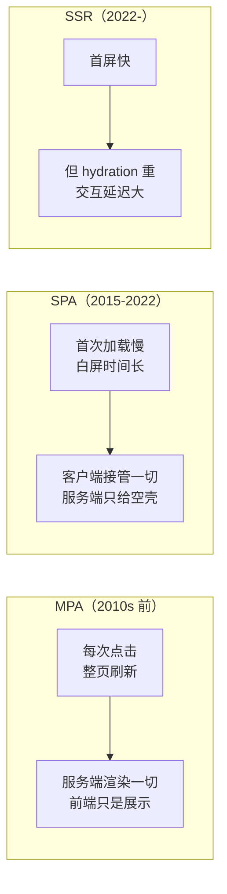
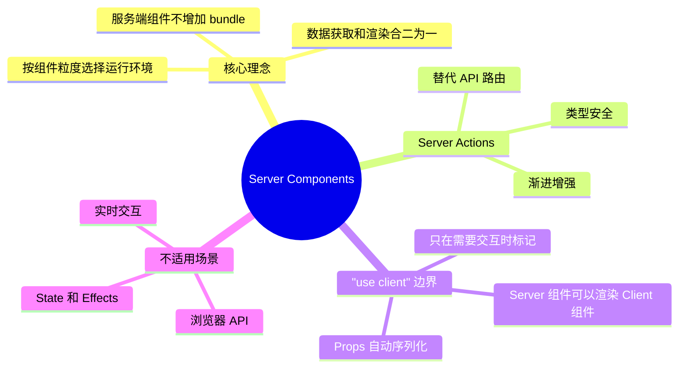

# React 19：Server Components 是对 Web 架构的重新分层

> 本文基于 React 19.2。Server Components 自 React 18 实验性引入，React 19 稳定，推荐配合 Next.js 15+ 或 React Router 7+ 使用。

## 一个矛盾：SPA 的尽头是 SSR

过去十年，前端架构在两个极端之间来回摇摆：



SPA 解决了 MPA 的页面切换闪烁，但带来了首屏白屏和 SEO 问题。SSR（Next.js 的 `getServerSideProps` 等）解决了首屏问题，但引入了新的开销：**hydration**。

**Hydration 是什么？** 服务端生成了 HTML 发给浏览器。但 HTML 是死的——没有事件监听、没有 state、不能响应用户交互。Hydration 就是 React 在客户端重新执行一遍组件树，把事件绑定到已有的 DOM 上，让页面「活过来」。

问题在于：**即使页面 90% 的内容是静态的（文章正文、导航、页脚），React 也要为所有组件执行一次 hydration**。服务端渲染的 HTML 已经完全可用，但用户点不了按钮，因为 React 还在跑 JS。

Server Components 要解决的就是这个矛盾。

## Server Components 的核心思想

**不是所有组件都需要在客户端运行。** 有些组件只负责读取数据、渲染 HTML——它们可以在服务端运行一次，结果直接序列化给客户端，不需要 hydration。

```mermaid
flowchart TD
    subgraph "服务端"
        SC["Server Components<br/>可以访问数据库<br/>可以读文件系统<br/>不会被发到客户端"]
    end
    subgraph "边界"
        B[""use client" 边界"]
    end
    subgraph "客户端"
        CC["Client Components<br/>有状态、有交互<br/>标准的 React 组件"]
    end
    SC --> B --> CC
```

一个具体的例子：

```jsx
// app/page.jsx — 这是一个 Server Component（默认）
import { db } from '@/lib/db';
import { AddToCartButton } from './add-to-cart-button';  // Client Component

export default async function ProductPage({ params }) {
  // 直接在服务端查数据库——不需要 API 路由、不需要 useEffect + fetch
  const product = await db.product.findUnique({
    where: { id: params.id }
  });

  return (
    <div>
      <h1>{product.name}</h1>
      <p>{product.description}</p>
      <AddToCartButton productId={product.id} />
      {/* ↑ 这是 "use client" 组件——有交互，需要在客户端运行 */}
    </div>
  );
}
```

```jsx
// add-to-cart-button.jsx — Client Component
"use client";

import { useState } from 'react';

export function AddToCartButton({ productId }) {
  const [loading, setLoading] = useState(false);

  return (
    <button onClick={async () => {
      setLoading(true);
      await addToCart(productId);
      setLoading(false);
    }}>
      {loading ? '添加中...' : '加入购物车'}
    </button>
  );
}
```

关键变化：

- Server Component 可以直接 `await` 数据库查询——不需要 `useEffect`、不需要 API 路由、不需要 Redux
- Server Component 不会被打包进客户端 JS bundle——零客户端 JS 成本
- `AddToCartButton` 需要 `useState`（交互），所以必须显式标记 `"use client"`
- `product` 对象从服务端序列化传给客户端组件——React 自动处理

## 为什么 Server Components 不是倒退

你可能会觉得：这跟 PHP 模板渲染有什么区别？有三个根本差异：

### 1. 不是全有或全无——是组件级别的选择

PHP 时代，整个页面要么全在服务端，要么全在客户端（用 JS 增强）。RSC 让你**按组件粒度**决定——静态内容服务端渲染，交互部分客户端渲染。一个页面里可以同时存在两种组件。

### 2. 不用刷新页面就能更新服务端数据

传统 SSR 要获取新数据就得刷新页面或发起 API 请求。RSC + Server Actions 让服务端组件在无刷新的情况下重新获取数据——因为 React 在客户端维护了 RSC 树的内存表示。

### 3. 序列化格式不是 HTML——是 React 树的中间表示

RSC 输出的不是 HTML 字符串，而是一种特殊的序列化格式（RSC Payload），包含：
- （Server Component 渲染结果的）React 元素
- props 数据（传给 Client Components）
- Client Component 的引用（告诉浏览器渲染哪个组件）

这使得 React 可以在客户端把 Server Component 的输出和 Client Component 无缝拼接成一棵树——而不是「先渲染 HTML，再在客户端重新执行」这种低效模式。

## "use server" 与 Server Actions

React 19 引入了 `"use server"` 指令——标记一个函数在服务端执行：

```jsx
// actions.js
"use server";

import { db } from '@/lib/db';

export async function createPost(formData) {
  const title = formData.get('title');
  const content = formData.get('content');

  await db.post.create({
    data: { title, content, authorId: getCurrentUser().id }
  });

  // 不需要 res.status(201).json(...)
  // React 自动处理序列化和错误传播
}
```

```jsx
// page.jsx — Client Component
"use client";

import { createPost } from './actions';

export function NewPostForm() {
  return (
    <form action={createPost}>
      <input name="title" />
      <textarea name="content" />
      <button type="submit">发布</button>
    </form>
  );
}
```

注意：**`<form action={createPost}>` 在 JS 未加载时也能工作**（它会退化为标准 HTML form submit）。这是 React 19 的一个关键设计——渐进增强，不依赖 JS。

Server Action 的好处：

- **不需要手动创建 API 路由**。函数本身就是端点
- **类型安全**。如果你的 `createPost` 用 TypeScript，客户端 import 时有完整的类型推导
- **自动处理 CSRF**。React 在 Server Action 调用中自动加入安全校验
- **渐进增强**。JS 未加载时退化为标准 form POST

## Server Components 不是银弹——什么不应该放服务端

服务端组件不能有 `useState`、`useEffect`、`onClick`、`useContext` 等任何交互逻辑。如果你在 Server Component 里写了 `useState`，构建会报错。

另外，Server Component 在服务端只运行一次（首次渲染或路由导航时），不会在客户端 state 变化时重新渲染。所以：

| 适合 Server Component | 适合 Client Component |
|-----------------------|-----------------------|
| 从数据库读取数据 | 表单输入、状态管理 |
| 渲染静态内容 | 动画、拖拽、实时交互 |
| 访问文件系统 | 浏览器 API（localStorage、geolocation） |
| 导入重型库（不在客户端执行） | 第三方交互库（图表、地图） |
| 组件树中的「数据层」 | 组件树中的「交互层」 |

一个经验法则：**尽量把组件写成 Server Component，只在需要交互时加 `"use client"` 边界**。不是反过来——不要默认所有组件都是 Client Component。

## 实战对比：同一个功能，三种写法

「从数据库加载一篇文章，下面有评论区可以发评论」。

### 传统 SPA 写法（React 17）

```jsx
function ArticlePage({ articleId }) {
  const [article, setArticle] = useState(null);
  const [comments, setComments] = useState([]);

  useEffect(() => {
    fetch(`/api/articles/${articleId}`).then(r => r.json()).then(setArticle);
  }, [articleId]);

  const handleComment = async (text) => {
    await fetch('/api/comments', {
      method: 'POST',
      body: JSON.stringify({ articleId, text })
    });
    // 重新拉取评论
    const r = await fetch(`/api/articles/${articleId}/comments`);
    setComments(await r.json());
  };

  if (!article) return <div>Loading...</div>;
  return <Article article={article} comments={comments} onComment={handleComment} />;
}
```

需要三个 API 路由、两套 `useEffect`、手动处理加载态和错误。

### React 19 RSC + Server Actions

```jsx
// page.jsx — Server Component（默认）
import { db } from '@/lib/db';
import { CommentSection } from './comment-section';

export default async function ArticlePage({ params }) {
  const article = await db.article.findUnique({
    where: { id: params.id },
    include: { comments: true }
  });

  return (
    <div>
      <h1>{article.title}</h1>
      <article>{article.content}</article>
      <CommentSection
        articleId={article.id}
        initialComments={article.comments}
      />
    </div>
  );
}
```

```jsx
// comment-section.jsx — Client Component
"use client";

import { useState } from 'react';
import { addComment } from './actions';

export function CommentSection({ articleId, initialComments }) {
  const [comments, setComments] = useState(initialComments);

  return (
    <form action={async (formData) => {
      const newComment = await addComment(formData);
      setComments(prev => [...prev, newComment]);
    }}>
      <textarea name="text" />
      <button type="submit">评论</button>
      <ul>
        {comments.map(c => <li key={c.id}>{c.text}</li>)}
      </ul>
    </form>
  );
}
```

```jsx
// actions.js
"use server";

export async function addComment(formData) {
  const text = formData.get('text');
  return await db.comment.create({
    data: { text, articleId: formData.get('articleId') }
  });
}
```

零个 API 路由。文章内容永远不会出现在客户端 JS bundle 里。`addComment` 服务器函数在前端直接调用——类型安全、自动序列化。表单在没有 JS 的环境下也能提交。

## 小结



Server Components 不是又一个 SSR 方案——它是 React 对「代码应该在哪运行」这个问题的重新回答。十年前所有人都把代码从服务端搬到客户端（SPA），现在 React 说：**不是搬回服务端，而是让每一行代码去它该去的地方。**

下一篇讲 React 19 的新 API：`useActionState`、`useOptimistic`、`use()`、`ref as prop`——以及它们在状态管理全景中的位置。
