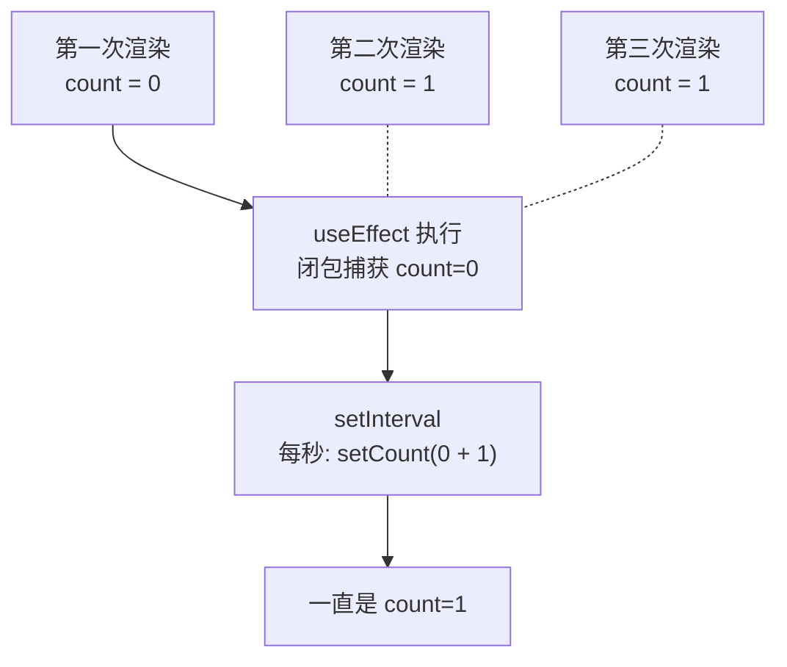
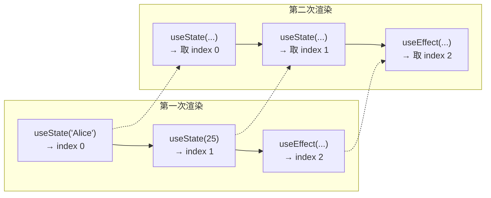
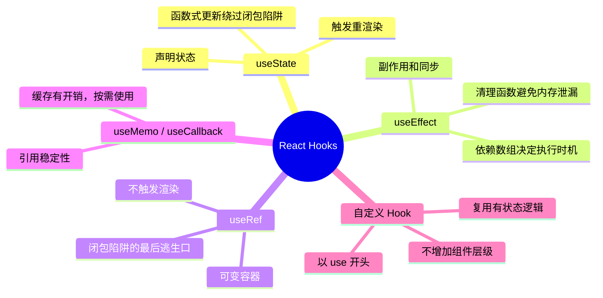

# React Hooks 不完全设计史：闭包陷阱与依赖数组

> 本文基于 React 19.2。Hooks 自 React 16.8 引入，本文覆盖至今的所有 Hooks 行为。

## Class 组件的三种死法

在 Hooks 出现之前，React 用 Class 组件。看起来和面向对象一样，但用着用着你会发现三个无解的问题。

### 问题一：生命周期里的逻辑是散装的

```jsx
class ChatRoom extends React.Component {
  componentDidMount() {
    this.subscribe(this.props.roomId);     // 订阅房间
    this.startHeartbeat();                  // 心跳
    document.addEventListener('keydown', this.handleShortcut);  // 快捷键
  }

  componentDidUpdate(prevProps) {
    if (prevProps.roomId !== this.props.roomId) {
      this.unsubscribe(prevProps.roomId);   // 取消旧订阅
      this.subscribe(this.props.roomId);    // 新订阅
    }
  }

  componentWillUnmount() {
    this.unsubscribe(this.props.roomId);    // 取消订阅
    this.stopHeartbeat();                   // 停心跳
    document.removeEventListener('keydown', this.handleShortcut);  // 解绑快捷键
  }
}
```

订阅房间的逻辑散落在 `componentDidMount`、`componentDidUpdate`、`componentWillUnmount` 三个地方。你想删掉这个功能？三个生命周期里各找一行删——少删一个就是内存泄漏。

### 问题二：this 是个陷阱

```jsx
class Toggle extends React.Component {
  state = { on: false };

  handleClick() {
    this.setState({ on: !this.state.on });  // this 是谁？取决于怎么被调用的
  }

  render() {
    return <button onClick={this.handleClick}>Toggle</button>;
    //                        ↑ 这样传，this 是 undefined（strict mode）
  }
}
```

你需要在 constructor 里写 `this.handleClick = this.handleClick.bind(this)`，或者用 arrow function。每一个 Class 组件都带着这些样板代码——不是 bug，但每次都要写。

### 问题三：逻辑无法复用

假设你写了一个「窗口大小变化时更新组件」的逻辑：

```jsx
// 这段逻辑想复用到另一个组件？没门。
componentDidMount() {
  window.addEventListener('resize', this.onResize);
}
componentWillUnmount() {
  window.removeEventListener('resize', this.onResize);
}
```

React 给过几个方案：Higher-Order Components（HOC）、Render Props。但每一个都增加了组件树的层级，导致「Wrapper Hell」——你的组件被套了五六层 HOC，DevTools 里看着像千层饼。

## Hooks 做了什么：让函数组件有了「记忆」

Hooks 的设计目标不是「比 Class 更好用的 API」，而是**让逻辑可以按关注点聚合，而不是按生命周期分散**。

同样的 ChatRoom，用 Hooks：

```jsx
function ChatRoom({ roomId }) {
  useEffect(() => {
    const sub = subscribe(roomId);
    return () => sub.unsubscribe();
  }, [roomId]);

  useEffect(() => {
    const timer = startHeartbeat();
    return () => clearInterval(timer);
  }, []);

  useEffect(() => {
    document.addEventListener('keydown', handleShortcut);
    return () => document.removeEventListener('keydown', handleShortcut);
  }, []);

  return <div>...</div>;
}
```

三个 `useEffect`，每个封装了一个独立关注点。订阅逻辑的订阅和取消放在同一个函数里——删掉整个 `useEffect` 就删掉了整个功能。

更关键的是，你可以把逻辑抽成**自定义 Hook**：

```jsx
function useWindowSize() {
  const [size, setSize] = useState({ width: window.innerWidth, height: window.innerHeight });

  useEffect(() => {
    const onResize = () => setSize({ width: window.innerWidth, height: window.innerHeight });
    window.addEventListener('resize', onResize);
    return () => window.removeEventListener('resize', onResize);
  }, []);

  return size;
}

// 任何组件都可以用
function MyComponent() {
  const { width, height } = useWindowSize();
  return <div>{width} x {height}</div>;
}
```

这就是 Hooks 给 React 带来的最大改变：**逻辑组合代替了组件组合**。不需要 HOC，不需要 Render Props，不需要增加组件层级。

## 闭包陷阱：Hooks 的代价

但 Hooks 不是白送的。它引入了 Class 组件没有的问题——闭包陷阱。

```jsx
function Counter() {
  const [count, setCount] = useState(0);

  useEffect(() => {
    const timer = setInterval(() => {
      console.log(count);        // 永远打印 0
      setCount(count + 1);       // 永远是 0 + 1 = 1
    }, 1000);
    return () => clearInterval(timer);
  }, []);                        // ← 空依赖数组
}
```

你期望它每秒 +1，实际上它只加了一次就不动了。原因：

1. 组件第一次渲染时，`count = 0`
2. `useEffect` 的回调创建了一个闭包，捕获了 `count = 0`
3. 因为依赖数组是 `[]`，这个 effect 永远不会重新执行
4. `setInterval` 的回调里，`count` 永远是 0



不是 React 的 bug——是 JavaScript 闭包的运作方式。每次渲染都有它自己的 props 和 state，effect 回调里看到的是**创建那次渲染时的值**。

### 解法一：把 count 放进依赖数组

```jsx
useEffect(() => {
  const timer = setInterval(() => {
    setCount(count + 1);
  }, 1000);
  return () => clearInterval(timer);
}, [count]);  // 每次 count 变，重建 interval
```

能工作，但每秒都在销毁 + 重建定时器，不够优雅。

### 解法二：用函数式更新

```jsx
useEffect(() => {
  const timer = setInterval(() => {
    setCount(c => c + 1);   // 不读外部 count，用 React 传入的最新值
  }, 1000);
  return () => clearInterval(timer);
}, []);                      // 空依赖，定时器只创建一次
```

`setState` 支持传函数——React 保证传入的永远是最新值。这是 React 给闭包陷阱开的后门。

### 解法三（React 19）：用 `useRef` 但不要滥用

```jsx
const countRef = useRef(count);
countRef.current = count;  // 每次渲染同步最新值

useEffect(() => {
  const timer = setInterval(() => {
    console.log(countRef.current);  // 永远是最新的
  }, 1000);
  return () => clearInterval(timer);
}, []);
```

`useRef` 像一个盒子，`.current` 是可变的，不触发重渲染。它绕过了闭包的不可变性——但也绕过了 React 的数据流模型。只在必要时用。

## 依赖数组为什么不能自动推导

你可能会问：React 为什么不能自动检测 effect 里用了哪些变量，自动填入依赖数组？

技术上完全可以——React 团队甚至做了 `eslint-plugin-react-hooks` 的 `exhaustive-deps` 规则来自动检测遗漏。但他们刻意不把自动推导做进运行时，原因有二：

1. **显式 > 隐式**。依赖数组是效果触发的契约。看到 `[roomId]`，你知道这个 effect 在 `roomId` 变化时重新执行。自动推导下你看不到这个契约。

2. **有些情况下你想要「不正确的」依赖**。比如你只想在组件挂载时执行一次——空数组 `[]` 表达的就是这个意图。

## Hooks 的调用规则：为什么不能放条件里

```jsx
// ❌ 不行
if (condition) {
  const [value, setValue] = useState(0);
}
```

原因很简单：React 靠**调用顺序**来识别 Hooks。第一次渲染时 Hook 的调用顺序是 `[useState#0, useState#1, useEffect#0]`——React 内部用链表存储它们。第二次渲染时如果顺序变了（比如条件分支导致某个 useState 被跳过），React 会拿错对应的状态。



所以顺序必须稳定。这是 Hooks 规则中唯一一条没有商量余地的：**只在函数组件顶层调用 Hooks，不要在循环、条件或嵌套函数中调用**。

## useEffect 的三种语义

`useEffect` 不是 `componentDidMount` + `componentDidUpdate` + `componentWillUnmount` 的合体。它有不同的语义取决于依赖数组：

| 依赖数组 | 执行时机 | 清理函数执行时机 |
|----------|----------|------------------|
| 不传 | 每次渲染后 | 每次渲染前 |
| `[a, b]` | 首次渲染后 + a 或 b 变化时 | a 或 b 变化前 + 卸载前 |
| `[]` | 首次渲染后（仅一次） | 卸载前 |

最常见的误解是把 `useEffect(() => {...}, [])` 当成 `componentDidMount`——它不是。它是「这个效果不依赖任何 props/state，所以只需要执行一次」。语义的出发点是**数据依赖**，不是**生命周期时间点**。

## useMemo 和 useCallback：缓存不是免费的

```jsx
// useMemo：缓存计算结果
const sorted = useMemo(() => items.sort(compareFunc), [items, compareFunc]);

// useCallback：缓存函数引用
const handleClick = useCallback(() => {
  doSomething(id);
}, [id]);
```

它们的本质是**引用稳定性**——确保前后两次渲染返回同一个引用，避免下游组件的无效重渲染。

但缓存本身也有开销：React 要存储依赖数组和上一次的值，每次渲染时做浅比较。对于简单计算（如 `a + b`），`useMemo` 的开销可能超过重新计算。**只在以下情况用：**

1. 计算结果在循环或递归中有大量开销
2. 返回的引用被传给 `React.memo` 包裹的子组件
3. 返回的引用是其他 Hook（如 `useEffect`）的依赖

不要在所有变量上无差别地包 `useMemo` / `useCallback`——你在增加复杂度和内存占用，而不一定换来性能提升。

## 自定义 Hook：React 最被低估的抽象能力

自定义 Hook 没有特殊的 API。它只是一个以 `use` 开头的函数，里面可以调用其他 Hooks：

```jsx
function useDebounce(value, delay = 300) {
  const [debounced, setDebounced] = useState(value);

  useEffect(() => {
    const timer = setTimeout(() => setDebounced(value), delay);
    return () => clearTimeout(timer);
  }, [value, delay]);

  return debounced;
}

// 使用
function SearchBox() {
  const [query, setQuery] = useState('');
  const debouncedQuery = useDebounce(query, 500);

  useEffect(() => {
    if (debouncedQuery) fetchResults(debouncedQuery);
  }, [debouncedQuery]);
}
```

自定义 Hook 共享的是**有状态的逻辑**，不是状态本身。两个组件各调用 `useDebounce`，各自的 debounced 值是独立的。

这是 React Hooks 最强大的设计：你可以把任何有状态逻辑封装成 Hook，在任何组件里复用——不需要改组件层级。

## 小结



Hooks 解决了 Class 组件的三个死穴——逻辑分散、this 陷阱、复用困难——但它引入了自己的复杂度：闭包陷阱、依赖数组、调用顺序。理解 Hooks 的关键不是背 API，而是理解每次渲染都是一个独立的闭包捕获了当次渲染的 props 和 state。下一篇讲 React 什么时候重渲染——你会看到这套机制的另一面。
