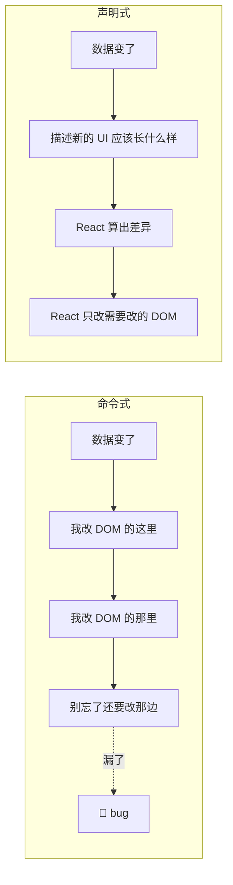
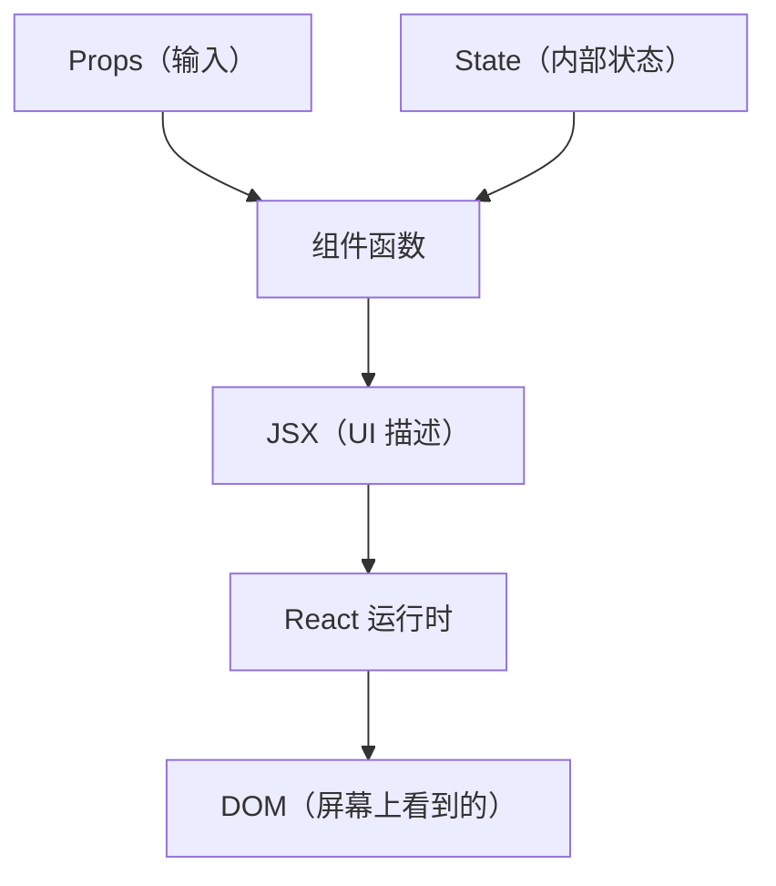
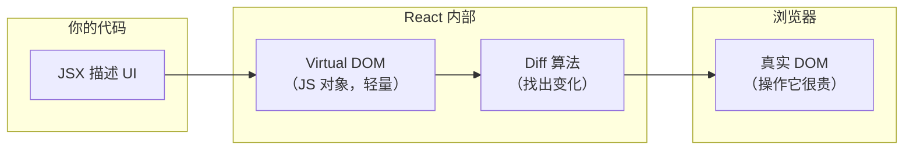
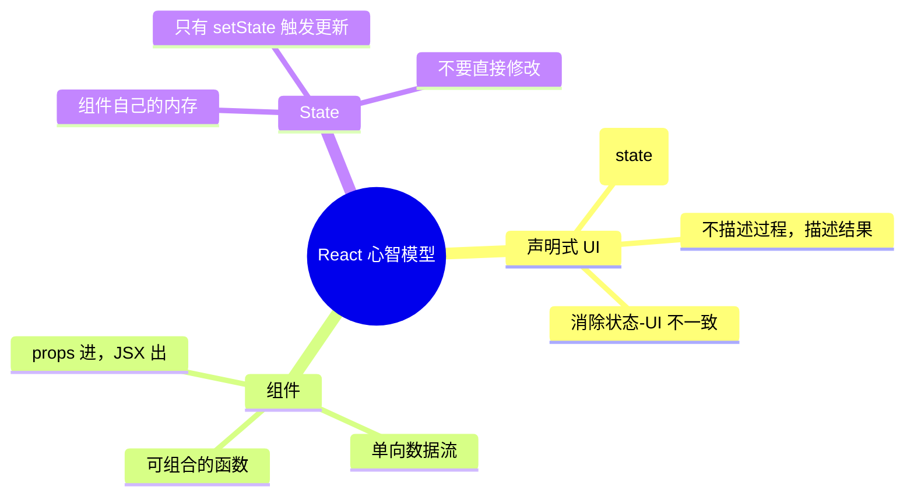

# React 心智模型：声明式 UI 到底改变了什么

> 本文基于 React 19.2。

## 你写过这样的代码吗

```javascript
// 一个待办列表——用原生 JS 或 jQuery 写的
function addTodo(text) {
  const li = document.createElement('li');
  li.textContent = text;
  li.onclick = () => li.classList.toggle('done');
  document.getElementById('todo-list').appendChild(li);
  updateCount();  // 别忘了更新计数
}

function removeTodo(li) {
  li.remove();
  updateCount();  // 又忘了更新计数——bug
}
```

每加一个操作，都要手动找到 DOM 节点、修改它、然后记得同步所有相关的 UI 状态。DOM 是真相来源，你的 JS 代码只是在上面做手术——切一刀是一刀。当应用复杂到几十个交互时，「当前 UI 到底应该长什么样」这个问题的答案散落在几十个函数里，谁也说不清。

React 做的事情可以用一句话概括：**你描述 UI 应该长什么样，React 负责把它变成 DOM**。这就是声明式。

## 声明式 vs 命令式：不只是语法糖

```javascript
// 命令式（jQuery 时代）：告诉浏览器每一步怎么做
function renderTodos(todos) {
  $('#todo-list').empty();                    // 1. 清空列表
  todos.forEach(todo => {                     // 2. 遍历
    const $li = $('<li>').text(todo.text);    // 3. 创建 li
    if (todo.done) $li.addClass('done');      // 4. 根据状态加样式
    $li.click(() => toggle(todo.id));         // 5. 绑定事件
    $('#todo-list').append($li);              // 6. 插入 DOM
  });
  $('#count').text(todos.filter(t => !t.done).length);  // 7. 更新计数
}
```

每一步都是你对浏览器的精确指令。如果 `toggle` 被调用，你需要再次执行这 7 步——或者更可能的是，你只更新了 li 的 class 但忘了更新计数，于是 UI 出现了不一致。

```jsx
// 声明式（React）：描述结果，不管过程
function TodoList({ todos, onToggle }) {
  const remaining = todos.filter(t => !t.done).length;

  return (
    <div>
      <ul>
        {todos.map(todo => (
          <li
            key={todo.id}
            className={todo.done ? 'done' : ''}
            onClick={() => onToggle(todo.id)}
          >
            {todo.text}
          </li>
        ))}
      </ul>
      <span>剩余 {remaining} 项</span>
    </div>
  );
}
```

你不再描述「先清空、再创建、再插入」的过程。你描述的是「给定这些数据，UI 应该长这样」。数据变了？重新调用一次 `TodoList`，React 负责算出 DOM 的哪些部分需要更新。



声明式不只是少写代码——它消除了**状态和 UI 不同步的可能性**。因为 UI 永远是数据的纯函数：`UI = f(state)`。

## 组件：UI 的基本单元

React 中一切皆组件。组件就是返回 UI 描述的函数：

```jsx
function Greeting({ name }) {
  return <h1>Hello, {name}!</h1>;
}
```

你可能会想：这不就是个函数？没错。React 组件的本质就是 **`props → UI 描述` 的函数**。这是理解 React 最重要的一件事。



有三个关键推论：

1. **组件只应该依赖 props 和 state 来决定 UI**。如果组件去读 `localStorage`、`window.location`、或某些全局变量，UI 就不再是数据的可靠函数了——同一个 props+state 可能产出不同的 UI，调试变成噩梦。

2. **父组件通过 props 向下传递数据，子组件通过回调向上传递事件**。数据单向流动，没有双向绑定。这看起来更啰嗦，但意味着数据变化的方向是唯一确定的。

3. **组件是可组合的**。小函数组合成大函数，小组件组合成大页面。

## State：唯一让你需要重新理解的东西

Props 是父组件给你的，你不能改。State 是组件自己的内存——改了，React 就重新调用你的组件，给你一页新的 UI。

```jsx
function Counter() {
  const [count, setCount] = useState(0);   // 声明：我需要一个叫 count 的状态

  return (
    <button onClick={() => setCount(count + 1)}>
      点击了 {count} 次
    </button>
  );
}
```

关键点：**不要直接改 state**。`count++` 不会触发重渲染。`setCount(count + 1)` 才会——它告诉 React「状态变了，请重新调用这个组件」。

这背后是 React 最核心的一条规则：

> **要更新 UI，必须通过 setState 触发。React 不监听变量变化——它只在 setState 被调用时重新执行组件函数。**

为什么不用 `Proxy` 或 `Object.defineProperty` 来自动追踪变化（像 Vue 那样）？React 团队的选择是：**给开发者显式的控制权**。自动追踪意味着每次修改变量都触发渲染，这在大型应用中会导致不可控的性能问题。React 让你自己决定何时触发更新——调用 `setState` 那一刻。

## Virtual DOM 只是一个实现细节

很多人误解 Virtual DOM 是 React 的核心。它不是。React 的核心是「UI 是状态的函数」这套心智模型。Virtual DOM 只是实现这套模型的一种方式：



Virtual DOM 的价值不是「比真实 DOM 快」——操作 JS 对象当然比操作 DOM 快，但真正的价值在于：

1. **跨平台**：Virtual DOM 是对 UI 的抽象描述，可以在 DOM、Native、Canvas、终端上实现
2. **批量更新**：React 可以在内存中计算完所有变化，一次性提交到 DOM
3. **开发者不需要关心 DOM 操作**：你只和 Virtual DOM（JSX）打交道

实际上，React 19 的 Server Components 已经在探索超越 Virtual DOM 的范式——Server Components 只在服务端运行，不产生 Virtual DOM，直接输出可序列化的 UI 树。这说明 Virtual DOM 从来不是 React 的教条，只是一个实现手段。

## JSX：就是 JavaScript，不是模板语言

```jsx
// 你写的
const element = <h1 className="greeting">Hello, {name}</h1>;

// Babel/TS 编译后
import { jsx as _jsx } from "react/jsx-runtime";
const element = _jsx("h1", {
  className: "greeting",
  children: ["Hello, ", name]
});
```

JSX 不是字符串模板，也不是一种独立的模板语言。它就是 `React.createElement`（或 React 17+ 的 `jsx` 运行时）的语法糖。这意味着：

- 你可以在 JSX 里写任何 JS 表达式：`{todos.filter(t => !t.done).length}`
- 你可以用 `&&`、`? :`、`map`、`filter`——不需要学 `v-if`、`v-for` 之类的指令
- JSX 的类型检查就是 TypeScript 的类型检查——不需要额外的模板类型系统

## 一个完整的实战：搜索筛选列表

把上面的概念串起来，实现一个带搜索和筛选的列表：

```jsx
function SearchableList({ items }) {
  const [query, setQuery] = useState('');              // 搜索关键词
  const [filter, setFilter] = useState('all');          // 筛选条件

  // 过滤逻辑：纯计算，不涉及 state
  const filtered = items.filter(item => {
    const matchQuery = item.name.toLowerCase().includes(query.toLowerCase());
    const matchFilter = filter === 'all' || item.category === filter;
    return matchQuery && matchFilter;
  });

  return (
    <div>
      <input
        type="text"
        value={query}
        onChange={e => setQuery(e.target.value)}
        placeholder="搜索..."
      />

      <select value={filter} onChange={e => setFilter(e.target.value)}>
        <option value="all">全部</option>
        <option value="book">书</option>
        <option value="tool">工具</option>
      </select>

      <ul>
        {filtered.map(item => (
          <li key={item.id}>
            {item.name} — {item.category}
          </li>
        ))}
      </ul>

      <p>共 {filtered.length} 条结果</p>
    </div>
  );
}
```

注意这个模式：

1. **State 在顶部**（`query`、`filter`）
2. **派生数据在中间**（`filtered`，计算出来的）
3. **UI 描述在 return 里**（声明式的 JSX）

数据的流向是单一方向的：`state → 计算 → UI`。你不会在 `onChange` 里手动去改某个 `<li>` 的样式——你只改 state，UI 自动跟随。

## 小结

React 的心智模型只有三件事：



这三件事搞明白了，再去看 Hooks、渲染优化、Server Components——它们都是在这个模型上的延伸，而不是推翻。下一篇讲 Hooks，本质上是在回答一个问题：**在 `UI = f(state)` 这个模型里，副作用（网络请求、定时器、DOM 操作）应该放在哪里？**
