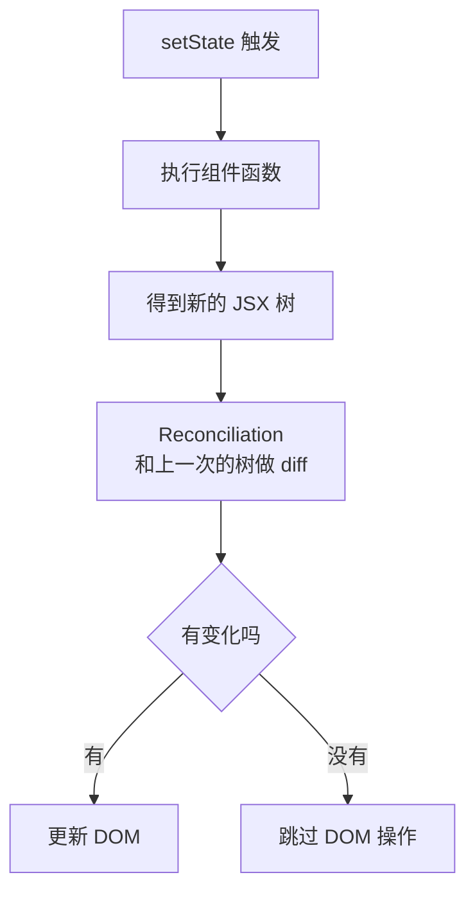
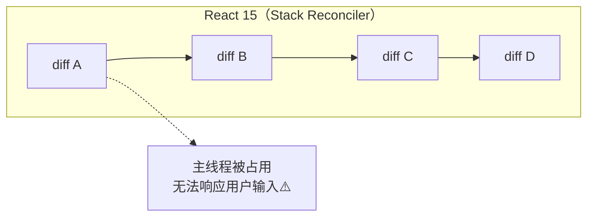
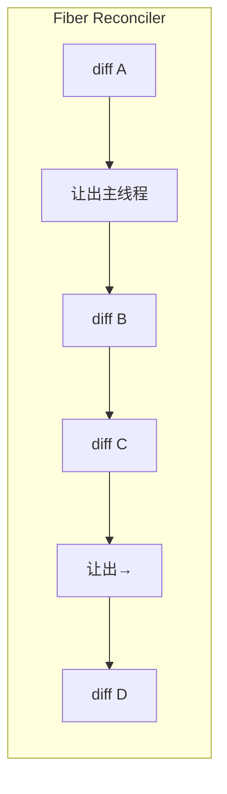
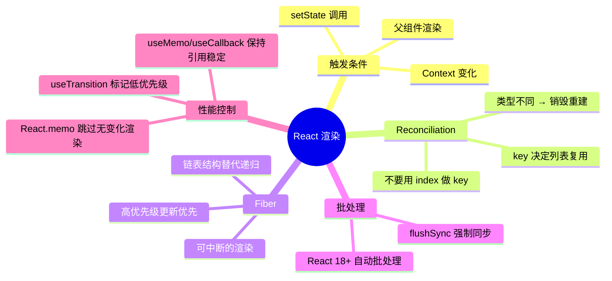

# React 渲染机制：Virtual DOM、Fiber 与批量更新

> 本文基于 React 19.2。Fiber 架构自 React 16 引入，React 18 加入自动批处理，React 19 进一步优化了并发特性。

## 一个让你怀疑人生的现象

```jsx
function App() {
  const [count, setCount] = useState(0);

  console.log('App 渲染了');

  return (
    <div>
      <button onClick={() => setCount(1)}>设为 1</button>
      <button onClick={() => setCount(1)}>还是设为 1</button>
    </div>
  );
}
```

连续点击第一个按钮两次——`count` 从 0 变成 1，再从 1 变成...还是 1。`console.log` 不会再执行第二次。但如果你把 `setCount` 换成 `setCount(count + 1)`，每次点击都会触发渲染。

这背后是 React 的渲染规则：**如果 setState 传入的值和当前 state 相同（Object.is 比较），React 会跳过该组件及其子组件的渲染**。这叫 **bailout**。

但在讨论 bailout 之前，要先搞清楚 React 到底怎么判断「该不该渲染」。

## 什么触发了渲染

React 组件的渲染（重新执行函数体）只由三件事触发：

1. **`setState` 被调用**（即使值是同一个，函数体也会被调用，但 DOM 不会更新）
2. **父组件渲染了**（除非子组件被 `React.memo` 保护）
3. **Context 的值变了**（所有消费该 Context 的组件都会渲染）

理解了这三点，你就会明白为什么 React 的默认行为是「宁可多渲染，也不少渲染」——React 的哲学是让渲染廉价，让开发者在不需要优化的时候不考虑优化。

## Reconciliation：React 怎么决定改什么 DOM

每次组件函数体执行后，React 拿到了一个新的 JSX 树（Virtual DOM）。下一步是把它和上一次的 JSX 树比较——这个过程叫 **Reconciliation**（协调）。



Diff 算法的核心规则——React 用了两个假设来把 O(n³) 降到 O(n)：

### 规则一：不同类型，整棵子树重建

```jsx
// 之前
<div>
  <Counter />
</div>

// 之后——div 变 span，Counter 直接被卸载再挂载，state 丢失
<span>
  <Counter />
</span>
```

只要是不同类型的元素（`div` → `span`，`button` → `a`），React 不会比较子元素——整棵树全部销毁重建。

### 规则二：key 决定列表项的复用

```jsx
// ❌ 没有 key——React 只能按顺序比较
{todos.map(todo => <li>{todo.text}</li>)}

// ✅ 有 key——React 知道哪个元素变了、哪个是新增的
{todos.map(todo => <li key={todo.id}>{todo.text}</li>)}
```

没有 `key` 时，React 按索引比较。如果列表头部插入了一条新数据，所有 DOM 节点都可能被错误地修改而不是移动。有了 `key`，React 能精确匹配同一元素在新旧列表中的位置变化。

一个容易踩的坑：**用 index 做 key 等于没做**：

```jsx
{todos.map((todo, index) => <li key={index}>{todo.text}</li>)}
```

如果在头部插入一条 todo，所有 index 都变了，React 会认为每个 `<li>` 都是新的。正确的做法是用稳定且唯一的标识——数据库 ID、生成的 UUID 等。

## Fiber：让渲染可以被打断

在 Fiber 之前（React 15），React 的 Reconciliation 是**同步递归**的：开始 diff 一棵子树，就必须一次性 diff 完。如果树很大，主线程会被长时间占用——动画掉帧、输入无响应。



Fiber（React 16+）把 Reconciliation 变成了可中断的：



React 把每个组件的 diff 工作装进一个「Fiber 节点」，构成一个链表。渲染时 React 遍历这个链表，每处理完一个节点就检查一下是否有更高优先级的任务（用户点击、输入）需要处理。有就让出线程，没有就继续。

Fiber 是一个数据结构，也是一个调度单元。每个组件实例对应一个 Fiber 节点，记录着：

```
{
  type: Counter,           // 组件类型
  stateNode: 组件实例,      // 对应的 DOM 节点或类实例
  child: 第一个子节点,      // 指向第一个子 Fiber
  sibling: 下一个兄弟节点,  // 兄弟 Fiber
  return: 父节点,          // 父 Fiber
  alternate: 上一次的 Fiber // 用于 diff 比较
}
```

这棵树让 React 可以在任一个节点处暂停，之后再从那里恢复——因为这个链表结构不依赖调用栈。

## 批量更新：React 18 的自动批处理

React 18 之前，只有在 React 事件处理器里的 `setState` 调用才会被批处理：

```jsx
// React 17：只在 React 事件里批处理
function handleClick() {
  setCount(c => c + 1);
  setName('Alice');
  // ↑ 两次 setState，一次渲染
}

// 但 setTimeout/Promise 里不会批处理
setTimeout(() => {
  setCount(c => c + 1);     // 触发渲染①
  setName('Alice');          // 触发渲染②
}, 1000);
```

React 18 引入了**自动批处理**——所有 `setState` 调用自动合并成一次渲染，不论它们在什么上下文中：

```jsx
// React 18+：任何地方都批处理
setTimeout(() => {
  setCount(c => c + 1);
  setName('Alice');
  // ↑ 一次渲染
}, 1000);

fetch('/api').then(() => {
  setCount(c => c + 1);
  setName('Alice');
  // ↑ 也是一次渲染
});
```

这减少了很多意外的不必要渲染。但在极少数你需要「立即拿到更新后的 DOM」的场景，可以用 `flushSync` 强制同步渲染（React 19 仍支持）：

```jsx
import { flushSync } from 'react-dom';

flushSync(() => {
  setCount(c => c + 1);  // 立即提交到 DOM
});
// 此时 DOM 已经更新
```

## React.memo：选择性阻止渲染

默认情况下，父组件渲染会导致所有子组件也渲染——即使子组件的 props 没变：

```jsx
function Parent() {
  const [count, setCount] = useState(0);
  return (
    <div>
      <button onClick={() => setCount(c => c + 1)}>+1</button>
      <ExpensiveChild name="Alice" />
      {/* ↑ count 变化 → Parent 渲染 → ExpensiveChild 也渲染 */}
    </div>
  );
}
```

`React.memo` 给了你一个控制点：**如果 props 没变，就别重渲染**：

```jsx
const ExpensiveChild = React.memo(function ExpensiveChild({ name }) {
  console.log('ExpensiveChild 渲染了');
  return <div>{name}</div>;
});
```

`React.memo` 对 props 做浅比较（`Object.is`）。但注意：

```jsx
// ❌ memo 失效——每次都是新对象
<ExpensiveChild style={{ color: 'red' }} />

// ❌ memo 失效——每次都是新函数
<ExpensiveChild onClick={() => doSomething()} />

// ✅ 稳定引用——memo 能正常工作
const style = useMemo(() => ({ color: 'red' }), []);
const onClick = useCallback(() => doSomething(), []);
<ExpensiveChild style={style} onClick={onClick} />
```

这就是 `useMemo` 和 `useCallback` 真正的使用场景——不是为了「缓存计算」，而是为了**保持引用稳定，让 `React.memo` 能正常工作**。

## React 19 的并发渲染增强

React 19 没有大幅度改变 Fiber 架构，但在并发调度层面做了改进：

- **`useTransition` 更细粒度的优先级**：标记某些更新为低优先级（可以被更高优先级的更新打断）
- **`useDeferredValue` 延迟渲染**：给旧值和新值之间加一个延迟，避免大列表在输入时卡顿
- **自动批处理的边界更清晰**：明确区分了「微任务内部」和「宏任务内部」的批处理行为

```jsx
function SearchPage() {
  const [query, setQuery] = useState('');
  const [isPending, startTransition] = useTransition();

  function handleChange(e) {
    startTransition(() => {
      setQuery(e.target.value);  // 低优先级：可以被打断
    });
  }

  return (
    <div>
      <input onChange={handleChange} />
      {isPending && <span>搜索中...</span>}
      <SearchResults query={query} />
    </div>
  );
}
```

效果：用户快速输入时，React 会丢弃过时的渲染、只处理最新的 `query` 值——输入框不会卡顿，因为输入框的 UI 更新是同步的（高优先级），而搜索结果可以延迟。

## 小结



理解 React 渲染的关键收获：**React 默认渲染很多，但你不需要默认优化很多**。绝大多数组件即使重渲染了也不会有性能问题——DOM 操作被 React 的 diff 算法最小化了。只有当你真正测出性能瓶颈时，再考虑 `React.memo`、`useMemo`、`useCallback`。

这个原则的反面是：如果你在代码里无差别地加 `memo`/`useMemo`/`useCallback`，你获得的是**更复杂的代码、更难找的 bug（比如 memo 因为引用不稳定而失效），而不是更好的性能**。

下一篇讲 React 19 最大的变化——Server Components。它要改变的不只是 React 的 API，而是前端代码在服务端和客户端之间的分工方式。
