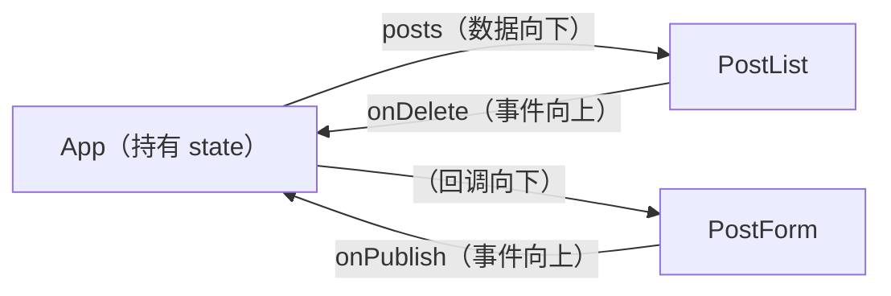
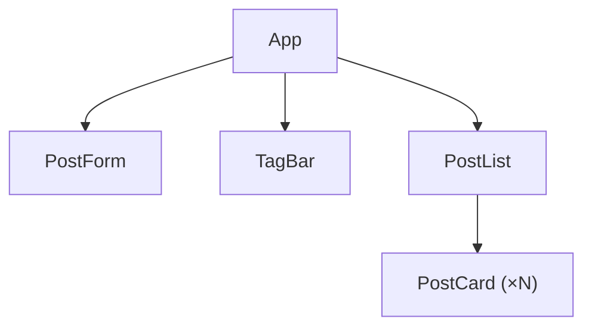

# 第 3 篇：Props、组件组合与数据流

> 本文基于 React 19.2，代码承接第 2 篇。

## Props 不只是"传参数"

第 2 篇末尾我们把 `App` 拆成了 `PostForm` 和 `PostList`，中间通过 props 传数据：

```tsx
function App() {
  const [posts, setPosts] = useState<Post[]>([]);

  return (
    <>
      <PostForm onPublish={post => setPosts([post, ...posts])} />
      <PostList posts={posts} onDelete={id => setPosts(posts.filter(p => p.id !== id))} />
    </>
  );
}
```

`PostForm` 收到 `onPublish` 回调，`PostList` 收到 `posts` 数据和 `onDelete` 回调。这就是 React 的数据流：



- **数据向下流（props）**：父组件通过 props 传递数据给子组件
- **事件向上冒（回调）**：子组件通过调用 props 中的回调函数，通知父组件

没有双向绑定。没有事件总线。数据流的方向是唯一确定的。当你 debug 时，你只需要顺着 props 往回找——数据从哪来，事件往哪去。

## Props 是只读的

React 有一条铁律：**组件必须像纯函数一样对待 props——不能修改它们。**

```tsx
// ❌ 不要改 props
function PostList({ posts, onDelete }: Props) {
  posts.push(newPost);        // 改了 props
  posts[0].title = 'new';     // 也改了 props

// ✅ props 只读
function PostList({ posts, onDelete }: Props) {
  const sorted = [...posts].sort(byDate);  // 创建副本再处理
```

这条规则让 React 的数据流是可预测的——你永远知道数据来自父组件，不会被某个子组件偷偷改了。

## 组合 vs 继承

React 的组件复用模型是**组合**，不是继承。你不需要 `class PostList extends BaseList` 这种东西。

```tsx
// 组合：Card 定义外观框架，内容通过 children 传入
function Card({ children }: { children: React.ReactNode }) {
  return <div className="card">{children}</div>;
}

// 使用
<Card>
  <h2>文章标题</h2>
  <p>文章内容...</p>
</Card>
```

`children` 是 React 内置的特殊 prop——它自动接收组件标签之间的所有内容。类型是 `React.ReactNode`，可以是 JSX 元素、字符串、数字、null、数组等。

### 不止 children——多个插槽

当你需要不止一个"洞"时，直接用 props 传 JSX：

```tsx
function PostCard({
  header,
  footer,
  children
}: {
  header: React.ReactNode;
  footer: React.ReactNode;
  children: React.ReactNode;
}) {
  return (
    <div className="card">
      <div className="card-header">{header}</div>
      <div className="card-body">{children}</div>
      <div className="card-footer">{footer}</div>
    </div>
  );
}

// 使用
<PostCard
  header={<><span className="tag">React</span><span className="tag">TS</span></>}
  footer={<span className="meta">Wei · 2026-06-10</span>}
>
  <h2>文章标题</h2>
  <p>文章正文...</p>
</PostCard>
```

这比"传一个 `renderHeader` 函数"或"定义一个 `HeaderComponent` prop"更直观——**传 JSX 就是传一段已经渲染好的 UI 片段**。

## 条件渲染的 N 种写法

### if 语句（在组件顶层）

```tsx
function PostList({ posts }: { posts: Post[] }) {
  if (posts.length === 0) {
    return <p className="empty">还没有文章。</p>;
  }

  return posts.map(post => <article key={post.id}>...</article>);
}
```

### 三元运算符（在 JSX 里）

```tsx
<div>
  {posts.length === 0
    ? <p className="empty">还没有文章。</p>
    : posts.map(post => <article key={post.id}>...</article>)
  }
</div>
```

### && 短路（只渲染有值时）

```tsx
{showBanner && <Banner />}
{error && <p className="error">{error}</p>}
```

但注意：`0` 会被 React 渲染出来！因为 `0 && <Component />` 返回 `0`，React 会把它当成文本节点。

```tsx
// ❌ 如果 items.length 为 0，页面显示 "0"
{items.length && <ItemList items={items} />}

// ✅ 转成布尔值
{items.length > 0 && <ItemList items={items} />}
```

### 条件赋值（选择不同的 JSX）

```tsx
let content: React.ReactNode;
if (loading) {
  content = <Spinner />;
} else if (error) {
  content = <ErrorBanner message={error} />;
} else {
  content = posts.map(post => <article key={post.id}>...</article>);
}

return <div className="app">{content}</div>;
```

哪种最好？看场景：
- 一整块 UI 的切换 → `if` 语句
- 单个位置的切换 → 三元运算符
- 只有显示/隐藏 → `&&`
- 复杂的状态机（loading / error / empty / data）→ 条件赋值

## 实战：给博客加上标签筛选

现在回到第 2 篇的博客应用，用组合和条件渲染做标签筛选。

```tsx
import { useState } from 'react';

interface Post {
  id: number;
  title: string;
  body: string;
  tags: string[];
}

let nextId = 0;

function App() {
  const [posts, setPosts] = useState<Post[]>([]);
  const [selectedTag, setSelectedTag] = useState<string | null>(null);

  // 收集所有不重复的标签
  const allTags = [...new Set(posts.flatMap(p => p.tags))];

  // 筛选文章
  const filteredPosts = selectedTag
    ? posts.filter(p => p.tags.includes(selectedTag))
    : posts;

  return (
    <div className="app">
      <h1>我的博客</h1>

      <PostForm onPublish={post => setPosts([post, ...posts])} />

      <TagBar
        tags={allTags}
        selected={selectedTag}
        onSelect={setSelectedTag}
      />

      <PostList
        posts={filteredPosts}
        onDelete={id => setPosts(posts.filter(p => p.id !== id))}
      />
    </div>
  );
}

function PostForm({ onPublish }: { onPublish: (post: Post) => void }) {
  const [title, setTitle] = useState('');
  const [body, setBody] = useState('');
  const [tagInput, setTagInput] = useState('');

  function handleSubmit(e: React.FormEvent) {
    e.preventDefault();
    if (!title.trim() || !body.trim()) return;

    const tags = tagInput
      .split(',')
      .map(t => t.trim())
      .filter(Boolean);

    onPublish({ id: nextId++, title: title.trim(), body: body.trim(), tags });
    setTitle('');
    setBody('');
    setTagInput('');
  }

  return (
    <form onSubmit={handleSubmit} className="form">
      <input value={title} onChange={e => setTitle(e.target.value)} placeholder="标题" />
      <textarea value={body} onChange={e => setBody(e.target.value)} placeholder="内容" rows={4} />
      <input value={tagInput} onChange={e => setTagInput(e.target.value)} placeholder="标签（逗号分隔）" />
      <button type="submit">发布</button>
    </form>
  );
}

function TagBar({
  tags,
  selected,
  onSelect
}: {
  tags: string[];
  selected: string | null;
  onSelect: (tag: string | null) => void;
}) {
  if (tags.length === 0) return null;  // 没有标签时不渲染

  return (
    <div className="tag-bar">
      <button
        className={`tag ${selected === null ? 'active' : ''}`}
        onClick={() => onSelect(null)}
      >
        全部
      </button>
      {tags.map(tag => (
        <button
          key={tag}
          className={`tag ${selected === tag ? 'active' : ''}`}
          onClick={() => onSelect(selected === tag ? null : tag)}
        >
          {tag}
        </button>
      ))}
    </div>
  );
}

function PostList({ posts, onDelete }: { posts: Post[]; onDelete: (id: number) => void }) {
  if (posts.length === 0) {
    return <p className="empty">还没有文章，写一篇吧。</p>;
  }

  return (
    <>
      {posts.map(post => (
        <PostCard key={post.id} post={post} onDelete={() => onDelete(post.id)} />
      ))}
    </>
  );
}

function PostCard({ post, onDelete }: { post: Post; onDelete: () => void }) {
  return (
    <article className="card">
      <h2>{post.title}</h2>
      <p>{post.body}</p>
      <div className="tags">
        {post.tags.map(tag => (
          <span key={tag} className="tag">{tag}</span>
        ))}
      </div>
      <button className="delete-btn" onClick={onDelete}>删除</button>
    </article>
  );
}

export default App;
```

### 组件树



每个组件只管一件事：

| 组件 | 职责 |
|------|------|
| `App` | 持有 posts 和 selectedTag，提供增删和筛选逻辑 |
| `PostForm` | 收集标题、内容、标签，提交时回调父组件 |
| `TagBar` | 展示标签列表，点击时通知父组件 |
| `PostList` | 展示文章列表（或空状态） |
| `PostCard` | 展示单篇文章 |

### 追加样式

```css
.tag-bar {
  display: flex;
  flex-wrap: wrap;
  gap: 8px;
  margin-bottom: 20px;
}

.tag-bar .tag {
  background: white;
  border: 1px solid #ddd;
  color: #666;
  padding: 4px 14px;
  border-radius: 16px;
  font-size: 0.85rem;
  cursor: pointer;
  font-family: inherit;
}

.tag-bar .tag.active {
  background: #1a73e8;
  color: white;
  border-color: #1a73e8;
}

.tag-bar .tag:hover:not(.active) {
  border-color: #1a73e8;
  color: #1a73e8;
}

.card .tags {
  display: flex;
  gap: 6px;
  margin-bottom: 12px;
}

.card .tags .tag {
  background: #e8f0fe;
  color: #1a73e8;
  padding: 2px 10px;
  border-radius: 12px;
  font-size: 0.8rem;
}
```

## 一个容易踩的坑：派生状态

现在 `filteredPosts` 是从 `posts` 和 `selectedTag` 派生出来的：

```tsx
// ✅ 派生自 posts 和 selectedTag——不需要单独存
const filteredPosts = selectedTag
  ? posts.filter(p => p.tags.includes(selectedTag))
  : posts;
```

错误的写法是再建一个 state：

```tsx
// ❌ 冗余的 state——posts 和 selectedTag 变化时需要手动同步
const [filteredPosts, setFilteredPosts] = useState(posts);
```

这就引入了一个 bug 的温床：当你改 `posts` 时必须记得同时更新 `filteredPosts`，否则 UI 就不同步了。

**原则：能通过计算得到的值，不要存成 state。** state 应该是最小化的原始数据，其他一切都算出来。

## 本篇要点

| 概念 | 一句话 |
|------|--------|
| 单向数据流 | props 向下，回调向上——方向唯一，可追溯 |
| props 只读 | 子组件不修改 props，创建副本再处理 |
| 组合 | 用 `children` 和 props 传 JSX，不是继承 |
| 条件渲染 | `if` / 三元 / `&&` / 条件赋值——各有所长 |
| 派生状态 | 能算出来的就别存——state 是最小化的原始数据 |

下一篇解决数据来源的问题——用 `useEffect` 从 API 取数据、处理加载和错误状态、封装可复用的数据获取逻辑。
