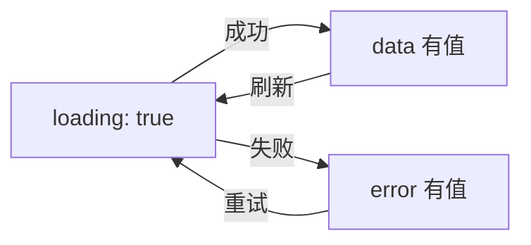

# 第 4 篇：useEffect、自定义 Hook 与 API 调用

> 本文基于 React 19.2，代码承接第 3 篇。

## 副作用：React 不去的地方

React 的核心循环很干净：`props + state → UI`。但真实应用不干净——你需要从 API 拉数据、读 localStorage、设置定时器、操作 DOM。这些事和「渲染 UI」没有直接关系，React 管它们叫**副作用（Side Effects）**。

`useEffect` 是放置副作用的地方。它的名字就是这个意思：**在渲染（render）完成之后，执行它的效果（effect）**。

## 基础用法：从 API 取数据

在第 3 篇的博客应用里，文章数据存在 `useState` 里——刷新就没了。现在改造成从后端 API 加载：

```tsx
import { useState, useEffect } from 'react';

interface Post {
  id: number;
  title: string;
  body: string;
  tags: string[];
}

function App() {
  const [posts, setPosts] = useState<Post[]>([]);
  const [loading, setLoading] = useState(true);
  const [error, setError] = useState<string | null>(null);

  useEffect(() => {
    async function fetchPosts() {
      try {
        setLoading(true);
        setError(null);
        const res = await fetch('/api/posts');
        if (!res.ok) throw new Error(`HTTP ${res.status}`);
        const data = await res.json();
        setPosts(data);
      } catch (e) {
        setError(e instanceof Error ? e.message : '未知错误');
      } finally {
        setLoading(false);
      }
    }

    fetchPosts();
  }, []);  // 空数组：只在首次渲染后执行

  if (loading) return <div className="empty">加载中...</div>;
  if (error) return <div className="empty">出错了：{error}</div>;

  return (
    // 之前的组件树...
  );
}
```

### 三个状态组成的"状态机"

几乎每个数据请求都需要三个 state：`data`、`loading`、`error`。它们构成了一个简单的状态机：



### 依赖数组 `[]` 的含义

- **`[]`** — effect 只在组件首次挂载后执行一次
- **`[id]`** — `id` 变化时重新执行
- **不传** — 每次渲染后都执行（几乎不用）

`[]` 是最常见的——"加载数据"这件事在组件创建时做一次就够了。

## 依赖数组的动态数据

如果博客需要根据选中的标签切换数据：

```tsx
const [selectedTag, setSelectedTag] = useState<string | null>(null);
const [posts, setPosts] = useState<Post[]>([]);

useEffect(() => {
  const url = selectedTag
    ? `/api/posts?tag=${encodeURIComponent(selectedTag)}`
    : '/api/posts';

  fetch(url)
    .then(res => res.json())
    .then(setPosts);
}, [selectedTag]);  // selectedTag 变化 → 重新 fetch
```

每当 `selectedTag` 变化，React 会：
1. 执行上一次 effect 的**清理函数**（如果有的话）
2. 用新的 `selectedTag` 重新执行 effect

## 清理副作用：别留下定时器和事件监听

```tsx
useEffect(() => {
  const timer = setInterval(() => {
    console.log('ping');
  }, 5000);

  // 清理函数：组件卸载、或依赖变化重新执行前调用
  return () => clearInterval(timer);
}, []);
```

没有清理函数的后果：组件卸载后定时器还在跑，`console.log` 一直输出——内存泄漏 + 逻辑错误。

另一个常见场景是事件监听：

```tsx
useEffect(() => {
  function handleScroll() {
    console.log(window.scrollY);
  }
  window.addEventListener('scroll', handleScroll);
  return () => window.removeEventListener('scroll', handleScroll);
}, []);
```

## 自定义 Hook：把可复用的逻辑封装起来

现在每个要取数据的组件都得写三件套：`posts`、`loading`、`error` + `useEffect`。抽成一个自定义 Hook：

```tsx
// useFetch.ts
import { useState, useEffect } from 'react';

interface FetchState<T> {
  data: T | null;
  loading: boolean;
  error: string | null;
}

export function useFetch<T>(url: string): FetchState<T> {
  const [data, setData] = useState<T | null>(null);
  const [loading, setLoading] = useState(true);
  const [error, setError] = useState<string | null>(null);

  useEffect(() => {
    let cancelled = false;  // 用于避免在组件已卸载后 setState

    async function doFetch() {
      setLoading(true);
      setError(null);
      try {
        const res = await fetch(url);
        if (!res.ok) throw new Error(`HTTP ${res.status}`);
        const json = await res.json();
        if (!cancelled) setData(json);
      } catch (e) {
        if (!cancelled) setError(e instanceof Error ? e.message : '未知错误');
      } finally {
        if (!cancelled) setLoading(false);
      }
    }

    doFetch();

    return () => {
      cancelled = true;
    };
  }, [url]);

  return { data, loading, error };
}
```

现在任何组件都可以直接用：

```tsx
function App() {
  const { data: posts, loading, error } = useFetch<Post[]>('/api/posts');

  if (loading) return <div className="empty">加载中...</div>;
  if (error) return <div className="empty">出错了：{error}</div>;
  if (!posts) return null;

  return <PostList posts={posts} />;
}
```

### `cancelled` 标志的作用

网络请求是异步的。如果请求发出后组件被卸载了（用户导航走了），`.then()` 回调里的 `setData` 会尝试更新一个已卸载组件的 state。React 会在控制台警告："Can't perform a React state update on an unmounted component"。

`cancelled` 标志解决的就是这个 race condition。

### 自定义 Hook 的命名规则

- 必须以 `use` 开头——React 靠这个前缀检查 Hook 规则（必须在函数组件顶层调用）
- 命名应该描述这个 Hook **做什么**，不是**怎么做**：`useFetch` ✅、`useWindowSize` ✅、`useDebounce` ✅

## 另一个实战 Hook：useLocalStorage

把 state 持久化到 localStorage：

```tsx
export function useLocalStorage<T>(key: string, initialValue: T) {
  const [value, setValue] = useState<T>(() => {
    // 惰性初始化——只在首次渲染时读 localStorage
    try {
      const stored = localStorage.getItem(key);
      return stored ? JSON.parse(stored) : initialValue;
    } catch {
      return initialValue;
    }
  });

  useEffect(() => {
    localStorage.setItem(key, JSON.stringify(value));
  }, [key, value]);

  return [value, setValue] as const;
}
```

用 `useLocalStorage` 替代 `useState`——文章的增删改自动持久化到 localStorage：

```tsx
function App() {
  const [posts, setPosts] = useLocalStorage<Post[]>('blog-posts', []);

  // 其他逻辑不变
}
```

现在刷新页面，文章还在。

## useEffect 的三个常见误用

### 1. 用它做计算

```tsx
// ❌ 用 useEffect + setState 做派生——绕远路
const [fullName, setFullName] = useState('');
useEffect(() => {
  setFullName(`${firstName} ${lastName}`);
}, [firstName, lastName]);

// ✅ 直接算——不需要额外的 state 和 effect
const fullName = `${firstName} ${lastName}`;
```

### 2. 依赖数组里写对象字面量

```tsx
// ❌ 每次渲染都是新对象——effect 每次都会执行
useEffect(() => { ... }, [{ name, age }]);

// ✅ 写原始值
useEffect(() => { ... }, [name, age]);
```

### 3. 用 effect 串联 state 更新

```tsx
// ❌ state 串联——A 变 → effect 更新 B → B 变 → 另一个 effect 更新 C
const [a, setA] = useState(0);
const [b, setB] = useState(0);
const [c, setC] = useState(0);
useEffect(() => { setB(a * 2); }, [a]);
useEffect(() => { setC(b + 1); }, [b]);

// ✅ 在事件处理器里一次性完成
function handleChange(val: number) {
  setA(val);
  setB(val * 2);
  setC(val * 2 + 1);
}
```

## 本篇要点

| 概念 | 一句话 |
|------|--------|
| `useEffect` | 渲染之后执行的副作用——API 调用、定时器、事件监听 |
| 依赖数组 | `[]` 只执行一次，`[a,b]` a/b 变时重新执行，不传每次都执行 |
| 清理函数 | 清除定时器、解绑事件、取消请求——避免内存泄漏 |
| 自定义 Hook | 用 `use` 前缀，把可复用的有状态逻辑封装成函数 |
| 惰性初始化 | `useState(() => expensive())` — 只在首次渲染时执行 |

下一篇是最后一篇——加上 React Router 实现多页面，把整个博客变成一个可部署的完整应用。
