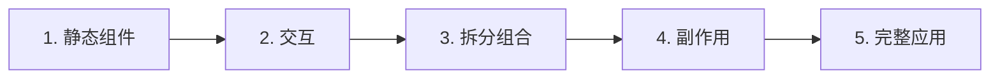

# 第 5 篇：React Router 与实战——构建完整的博客应用

> 本文基于 React 19.2 + React Router 7 + Vite 6，代码承接第 4 篇。

## 为什么需要路由

前 4 篇的博客只有一个页面——文章列表。真实应用需要多个页面：首页、文章详情、关于页、404。浏览器 URL 变化时，React 切换不同的组件——这就是客户端路由。

React Router 是 React 生态里的事实标准。2026 年最新版本是 v7。

## 安装 React Router

```bash
npm install react-router-dom
```

```
added 4 packages in 2s
```

React Router v7 的 API 和 v6 兼容，包名仍然是 `react-router-dom`。

## 路由的基本结构

```tsx
// main.tsx
import { StrictMode } from 'react';
import { createRoot } from 'react-dom/client';
import { BrowserRouter } from 'react-router-dom';
import App from './App';

createRoot(document.getElementById('root')!).render(
  <StrictMode>
    <BrowserRouter>
      <App />
    </BrowserRouter>
  </StrictMode>,
);
```

`BrowserRouter` 用 HTML5 History API 管理 URL（干净的路径如 `/posts/1`，没有 `#`）。

```tsx
// App.tsx
import { Routes, Route, Link } from 'react-router-dom';

function App() {
  return (
    <div className="app">
      <nav className="nav">
        <Link to="/">首页</Link>
        <Link to="/about">关于</Link>
      </nav>

      <Routes>
        <Route path="/" element={<HomePage />} />
        <Route path="/about" element={<AboutPage />} />
        <Route path="/post/:id" element={<PostDetailPage />} />
        <Route path="*" element={<NotFoundPage />} />
      </Routes>
    </div>
  );
}
```

几个概念：

| 概念 | 说明 |
|------|------|
| `<Routes>` | 路由容器——只渲染第一个匹配的 `<Route>` |
| `<Route path="/" element={...}>` | 路径匹配规则 |
| `<Link to="/">` | 替代 `<a href>`——不刷新页面，只换组件 |
| `path="/post/:id"` | 动态参数——`/post/1`、`/post/2` 都匹配 |
| `path="*"` | 通配符——放在最后，匹配所有未匹配的路径（404） |

### 读取 URL 参数

```tsx
import { useParams } from 'react-router-dom';

function PostDetailPage() {
  const { id } = useParams<{ id: string }>();

  return <h1>文章 #{id}</h1>;
}
```

### 编程式导航

```tsx
import { useNavigate } from 'react-router-dom';

function NewPostButton() {
  const navigate = useNavigate();

  return (
    <button onClick={() => navigate('/post/new')}>
      写文章
    </button>
  );
}
```

`useNavigate` 返回一个函数，调用它等同于 `<Link>`——但可以在事件处理、异步回调等非 JSX 环境中使用。

## 布局组件：共享导航和页脚

每个页面都有相同的顶部导航和页脚——用 `<Outlet>` 定义布局：

```tsx
// App.tsx
import { Routes, Route, Link, Outlet } from 'react-router-dom';

function App() {
  return (
    <Routes>
      <Route element={<Layout />}>
        <Route path="/" element={<HomePage />} />
        <Route path="/about" element={<AboutPage />} />
        <Route path="/post/:id" element={<PostDetailPage />} />
        <Route path="*" element={<NotFoundPage />} />
      </Route>
    </Routes>
  );
}

function Layout() {
  return (
    <div className="app">
      <nav className="nav">
        <Link to="/">📝 我的博客</Link>
        <div className="nav-links">
          <Link to="/">首页</Link>
          <Link to="/about">关于</Link>
        </div>
      </nav>

      <main className="main">
        <Outlet />  {/* 子路由在这里渲染 */}
      </main>

      <footer className="footer">
        <p>© 2026 Wei. 每一行代码都有它的理由。</p>
      </footer>
    </div>
  );
}
```

`<Outlet>` 是路由的"洞"——匹配到的子路由组件会渲染在这个位置。

## 完整实战：可发布的博客

把前 4 篇的代码组装成一个完整的博客应用。

### 项目结构

```
src/
├── main.tsx               # 入口 + BrowserRouter
├── App.tsx                # 路由 + 布局
├── index.css
├── hooks/
│   └── useLocalStorage.ts # 自定义 Hook
├── pages/
│   ├── HomePage.tsx       # 首页：文章列表 + 标签筛选
│   ├── PostDetailPage.tsx # 文章详情
│   └── AboutPage.tsx      # 关于页面
└── types.ts               # 共享类型
```

### types.ts

```tsx
export interface Post {
  id: number;
  title: string;
  body: string;
  tags: string[];
  createdAt: string;
}

export interface Comment {
  id: number;
  postId: number;
  body: string;
  author: string;
  createdAt: string;
}
```

### hooks/useLocalStorage.ts

```tsx
import { useState, useEffect } from 'react';

export function useLocalStorage<T>(key: string, initialValue: T) {
  const [value, setValue] = useState<T>(() => {
    try {
      const stored = localStorage.getItem(key);
      return stored ? JSON.parse(stored) : initialValue;
    } catch {
      return initialValue;
    }
  });

  useEffect(() => {
    localStorage.setItem(key, JSON.stringify(value));
  }, [key, value]);

  return [value, setValue] as const;
}
```

### App.tsx

```tsx
import { Routes, Route, Link, Outlet } from 'react-router-dom';
import HomePage from './pages/HomePage';
import PostDetailPage from './pages/PostDetailPage';
import AboutPage from './pages/AboutPage';

function Layout() {
  return (
    <div className="app">
      <nav className="nav">
        <Link to="/" className="nav-brand">📝 我的博客</Link>
        <div className="nav-links">
          <Link to="/">首页</Link>
          <Link to="/about">关于</Link>
        </div>
      </nav>
      <main className="main">
        <Outlet />
      </main>
      <footer className="footer">
        <p>© 2026 Wei. 每一行代码都有它的理由。</p>
      </footer>
    </div>
  );
}

function NotFoundPage() {
  return (
    <div className="empty">
      <h2>404</h2>
      <p>页面不存在</p>
      <Link to="/">回首页</Link>
    </div>
  );
}

export default function App() {
  return (
    <Routes>
      <Route element={<Layout />}>
        <Route path="/" element={<HomePage />} />
        <Route path="/post/:id" element={<PostDetailPage />} />
        <Route path="/about" element={<AboutPage />} />
        <Route path="*" element={<NotFoundPage />} />
      </Route>
    </Routes>
  );
}
```

### pages/HomePage.tsx

```tsx
import { useState } from 'react';
import { Link } from 'react-router-dom';
import { useLocalStorage } from '../hooks/useLocalStorage';
import type { Post } from '../types';

let nextId = Date.now();

export default function HomePage() {
  const [posts, setPosts] = useLocalStorage<Post[]>('blog-posts', []);
  const [selectedTag, setSelectedTag] = useState<string | null>(null);
  const [title, setTitle] = useState('');
  const [body, setBody] = useState('');
  const [tagInput, setTagInput] = useState('');

  const allTags = [...new Set(posts.flatMap(p => p.tags))];
  const filteredPosts = selectedTag
    ? posts.filter(p => p.tags.includes(selectedTag))
    : posts;

  function handleSubmit(e: React.FormEvent) {
    e.preventDefault();
    if (!title.trim() || !body.trim()) return;
    const tags = tagInput.split(',').map(t => t.trim()).filter(Boolean);
    const newPost: Post = {
      id: nextId++,
      title: title.trim(),
      body: body.trim(),
      tags,
      createdAt: new Date().toISOString().slice(0, 10),
    };
    setPosts([newPost, ...posts]);
    setTitle('');
    setBody('');
    setTagInput('');
  }

  function handleDelete(id: number) {
    setPosts(posts.filter(p => p.id !== id));
  }

  return (
    <div>
      {/* 发布表单 */}
      <form onSubmit={handleSubmit} className="form">
        <input
          value={title}
          onChange={e => setTitle(e.target.value)}
          placeholder="文章标题"
        />
        <textarea
          value={body}
          onChange={e => setBody(e.target.value)}
          placeholder="写点什么..."
          rows={4}
        />
        <input
          value={tagInput}
          onChange={e => setTagInput(e.target.value)}
          placeholder="标签（逗号分隔）"
        />
        <button type="submit">发布</button>
      </form>

      {/* 标签筛选栏 */}
      {allTags.length > 0 && (
        <div className="tag-bar">
          <button
            className={`tag ${selectedTag === null ? 'active' : ''}`}
            onClick={() => setSelectedTag(null)}
          >
            全部
          </button>
          {allTags.map(tag => (
            <button
              key={tag}
              className={`tag ${selectedTag === tag ? 'active' : ''}`}
              onClick={() => setSelectedTag(selectedTag === tag ? null : tag)}
            >
              {tag}
            </button>
          ))}
        </div>
      )}

      {/* 文章列表 */}
      {filteredPosts.length === 0 ? (
        <p className="empty">还没有文章，写一篇吧。</p>
      ) : (
        filteredPosts.map(post => (
          <article key={post.id} className="card">
            <Link to={`/post/${post.id}`} className="card-title-link">
              <h2>{post.title}</h2>
            </Link>
            <p className="card-body">{post.body.slice(0, 150)}{post.body.length > 150 ? '...' : ''}</p>
            <div className="tags">
              {post.tags.map(tag => (
                <span key={tag} className="tag">{tag}</span>
              ))}
            </div>
            <div className="card-meta">
              <span>{post.createdAt}</span>
              <button className="delete-btn" onClick={() => handleDelete(post.id)}>删除</button>
            </div>
          </article>
        ))
      )}
    </div>
  );
}
```

### pages/PostDetailPage.tsx

```tsx
import { useParams, Link } from 'react-router-dom';
import { useLocalStorage } from '../hooks/useLocalStorage';
import type { Post, Comment } from '../types';

let commentId = Date.now();

export default function PostDetailPage() {
  const { id } = useParams<{ id: string }>();
  const [posts] = useLocalStorage<Post[]>('blog-posts', []);
  const [comments, setComments] = useLocalStorage<Comment[]>('blog-comments', []);
  const post = posts.find(p => p.id === Number(id));

  if (!post) {
    return (
      <div className="empty">
        <h2>文章不存在</h2>
        <Link to="/">回首页</Link>
      </div>
    );
  }

  const postComments = comments.filter(c => c.postId === post.id);

  function handleAddComment(e: React.FormEvent<HTMLFormElement>) {
    e.preventDefault();
    const form = e.currentTarget;
    const formData = new FormData(form);
    const body = formData.get('body') as string;
    const author = formData.get('author') as string;
    if (!body.trim() || !author.trim()) return;

    setComments([...comments, {
      id: commentId++,
      postId: post.id,
      body: body.trim(),
      author: author.trim(),
      createdAt: new Date().toISOString().slice(0, 10),
    }]);
    form.reset();
  }

  return (
    <div>
      <Link to="/" className="back-link">← 返回首页</Link>

      <article className="post-detail">
        <h1>{post.title}</h1>
        <div className="meta">
          <span>{post.createdAt}</span>
        </div>
        <div className="tags">
          {post.tags.map(tag => (
            <span key={tag} className="tag">{tag}</span>
          ))}
        </div>
        <div className="content">{post.body}</div>
      </article>

      <section className="comments">
        <h3>评论 ({postComments.length})</h3>

        {postComments.map(c => (
          <div key={c.id} className="comment">
            <div className="comment-header">
              <strong>{c.author}</strong>
              <span>{c.createdAt}</span>
            </div>
            <p>{c.body}</p>
          </div>
        ))}

        <form onSubmit={handleAddComment} className="comment-form">
          <input name="author" placeholder="你的名字" />
          <textarea name="body" placeholder="写评论..." rows={3} />
          <button type="submit">发表评论</button>
        </form>
      </section>
    </div>
  );
}
```

### pages/AboutPage.tsx

```tsx
export default function AboutPage() {
  return (
    <div className="about">
      <h1>关于</h1>
      <p>这是一个用 React 19 构建的极简博客。</p>
      <p>没有数据库，没有后端——数据存在浏览器的 localStorage 里。</p>
      <p>但它的架构模式和真实应用一模一样：路由、状态管理、组件组合、副作用隔离。</p>
      <h2>技术栈</h2>
      <ul>
        <li>React 19.2</li>
        <li>TypeScript</li>
        <li>Vite 6</li>
        <li>React Router 7</li>
      </ul>
    </div>
  );
}
```

### 完整样式（index.css）

```css
* { margin: 0; padding: 0; box-sizing: border-box; }
body {
  font-family: -apple-system, BlinkMacSystemFont, 'Segoe UI', Roboto, sans-serif;
  background: #f5f5f5;
  color: #333;
  line-height: 1.6;
}

/* 布局 */
.app { max-width: 720px; margin: 0 auto; padding: 0 16px; min-height: 100vh; display: flex; flex-direction: column; }
.main { flex: 1; padding: 24px 0; }

/* 导航 */
.nav { display: flex; justify-content: space-between; align-items: center; padding: 16px 0; border-bottom: 1px solid #e0e0e0; }
.nav-brand { font-size: 1.2rem; font-weight: 700; text-decoration: none; color: #333; }
.nav-links { display: flex; gap: 20px; }
.nav-links a { text-decoration: none; color: #666; font-size: 0.95rem; }
.nav-links a:hover { color: #1a73e8; }

/* 页脚 */
.footer { text-align: center; padding: 24px 0; color: #999; font-size: 0.85rem; border-top: 1px solid #e0e0e0; margin-top: 40px; }

/* 卡片 */
.card { background: white; border-radius: 8px; padding: 24px; margin-bottom: 16px; box-shadow: 0 1px 3px rgba(0,0,0,0.1); }
.card-title-link { text-decoration: none; color: inherit; }
.card-title-link h2 { font-size: 1.2rem; margin-bottom: 8px; }
.card-title-link h2:hover { color: #1a73e8; }
.card-body { color: #555; margin-bottom: 12px; }
.card-meta { display: flex; justify-content: space-between; align-items: center; color: #999; font-size: 0.85rem; }

/* 标签 */
.tags { display: flex; gap: 6px; margin-bottom: 12px; }
.tag { background: #e8f0fe; color: #1a73e8; padding: 2px 10px; border-radius: 12px; font-size: 0.8rem; }
.tag-bar { display: flex; flex-wrap: wrap; gap: 8px; margin-bottom: 20px; }
.tag-bar .tag { background: white; border: 1px solid #ddd; color: #666; padding: 4px 14px; border-radius: 16px; font-size: 0.85rem; cursor: pointer; font-family: inherit; }
.tag-bar .tag.active { background: #1a73e8; color: white; border-color: #1a73e8; }

/* 表单 */
.form { background: white; border-radius: 8px; padding: 24px; margin-bottom: 24px; box-shadow: 0 1px 3px rgba(0,0,0,0.1); display: flex; flex-direction: column; gap: 12px; }
.form input, .form textarea { padding: 10px 12px; border: 1px solid #ddd; border-radius: 6px; font-size: 0.95rem; font-family: inherit; outline: none; }
.form input:focus, .form textarea:focus { border-color: #1a73e8; }
.form button { align-self: flex-end; background: #1a73e8; color: white; border: none; padding: 8px 20px; border-radius: 6px; font-size: 0.9rem; cursor: pointer; }
.form button:hover { background: #1557b0; }

/* 文章详情 */
.post-detail { background: white; border-radius: 8px; padding: 32px; box-shadow: 0 1px 3px rgba(0,0,0,0.1); }
.post-detail h1 { font-size: 1.8rem; margin-bottom: 16px; }
.post-detail .meta { color: #999; font-size: 0.9rem; margin-bottom: 16px; }
.post-detail .content { margin-top: 24px; font-size: 1.05rem; line-height: 1.8; white-space: pre-wrap; }
.back-link { display: inline-block; margin-bottom: 20px; color: #1a73e8; text-decoration: none; font-size: 0.9rem; }

/* 评论 */
.comments { margin-top: 32px; }
.comments h3 { margin-bottom: 16px; }
.comment { background: white; border-radius: 8px; padding: 16px; margin-bottom: 12px; box-shadow: 0 1px 3px rgba(0,0,0,0.05); }
.comment-header { display: flex; justify-content: space-between; margin-bottom: 8px; font-size: 0.85rem; color: #888; }
.comment p { color: #444; }
.comment-form { background: white; border-radius: 8px; padding: 20px; margin-top: 16px; box-shadow: 0 1px 3px rgba(0,0,0,0.1); display: flex; flex-direction: column; gap: 10px; }
.comment-form input, .comment-form textarea { padding: 10px 12px; border: 1px solid #ddd; border-radius: 6px; font-size: 0.9rem; font-family: inherit; outline: none; }
.comment-form input:focus, .comment-form textarea:focus { border-color: #1a73e8; }
.comment-form button { align-self: flex-end; background: #1a73e8; color: white; border: none; padding: 8px 20px; border-radius: 6px; font-size: 0.9rem; cursor: pointer; }

/* 关于页面 */
.about { background: white; border-radius: 8px; padding: 32px; box-shadow: 0 1px 3px rgba(0,0,0,0.1); }
.about h1 { margin-bottom: 16px; }
.about p { color: #555; margin-bottom: 12px; }
.about h2 { margin-top: 24px; margin-bottom: 8px; }
.about ul { padding-left: 20px; color: #555; }

/* 通用 */
.delete-btn { background: none; border: none; color: #e53935; cursor: pointer; font-size: 0.85rem; padding: 0; }
.delete-btn:hover { text-decoration: underline; }
.empty { text-align: center; color: #999; margin-top: 60px; }
.empty a { color: #1a73e8; }
```

### main.tsx

```tsx
import { StrictMode } from 'react';
import { createRoot } from 'react-dom/client';
import { BrowserRouter } from 'react-router-dom';
import App from './App';
import './index.css';

createRoot(document.getElementById('root')!).render(
  <StrictMode>
    <BrowserRouter>
      <App />
    </BrowserRouter>
  </StrictMode>,
);
```

## 运行完整应用

```bash
npm run dev
```

```
VITE v6.x.x  ready in 280 ms

➜  Local:   http://localhost:5173/
```

打开浏览器，你有一个完整的多页面博客：

- **首页 `/`** — 写文章、看列表、按标签筛选、删文章
- **文章详情 `/post/:id`** — 看全文、写评论
- **关于 `/about`** — 静态页面
- **404** — 不存在的路径显示找不到页面
- **数据持久化** — 所有文章和评论存在 localStorage，刷新不丢

## 路线图：从 demo 到上线

这个博客可以当作真实产品的基础，需要加的东西：

```
当前状态（demo）
  ├── 数据持久化（localStorage）    ← 已完成
  ├── 多页面路由                    ← 已完成
  └── 评论功能                      ← 已完成

走向上线
  ├── 后端 API（Next.js API Routes 或 Hono）  → 替换 localStorage
  ├── 数据库（SQLite/PostgreSQL）              → 持久化存储
  ├── 认证（NextAuth / Clerk）                 → 用户登录 + 作者身份
  ├── 富文本编辑器（TipTap / MDX）             → Markdown 写作
  ├── SEO（React Helmet / Next.js metadata）  → 搜索引擎可见
  └── 部署（Vercel / Cloudflare Pages）       → 公开访问
```

## 系列总结

五篇文章，从零到一写了什么：

| 篇 | 新增能力 | 对应的 React 概念 |
|----|----------|-------------------|
| 1 | 跑起项目，显示静态卡片 | JSX、组件、Vite |
| 2 | 交互页面，表单增删 | `useState`、事件、受控组件 |
| 3 | 组件拆分，标签筛选 | Props、组合、条件渲染、数据流 |
| 4 | 数据持久化，自定义 Hook | `useEffect`、`useLocalStorage` |
| 5 | 多页面，完整应用 | React Router、URL 参数、布局 |



这些概念不是 React 的全部，但它们是 React 的基本骨架。真实项目里的 Redux、React Query、Server Components、SSR——都是在这套骨架上添砖加瓦。

如果想继续深入，看同目录下的[深度系列](../index.md)——那里没有「怎么写」，只有「为什么这样设计」。
