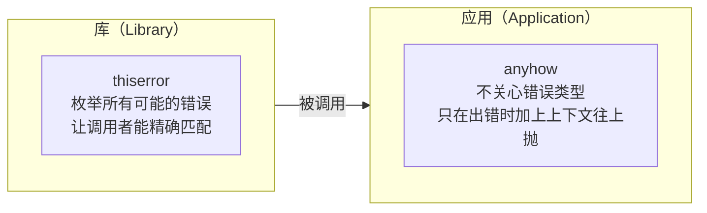

# Rust anyhow：应用层错误处理的最简方案

> 本文基于 Rust 1.85，anyhow 1.0。

## 为什么需要 anyhow

先看一段标准库的错误处理代码：

```rust
use std::fs;
use std::io;
use std::num::ParseIntError;

fn read_number_from_file(path: &str) -> Result<i32, Box<dyn std::error::Error>> {
    let content = fs::read_to_string(path)?;
    let num: i32 = content.trim().parse()?;
    Ok(num)
}
```

`Box<dyn std::error::Error>` 这行太长了。而且「从文件读一个数字」这种应用层逻辑，你根本不关心具体是什么错误——文件不存在、权限不够、格式不对，直接往上抛就行。

anyhow 就是干这个的：

```rust
use anyhow::{Context, Result};

fn read_number_from_file(path: &str) -> Result<i32> {
    let content = fs::read_to_string(path)
        .with_context(|| format!("读取文件失败: {path}"))?;
    let num: i32 = content
        .trim()
        .parse()
        .with_context(|| format!("解析数字失败，文件内容: '{content}'"))?;
    Ok(num)
}
```

`anyhow::Result<T>` 就是 `Result<T, anyhow::Error>` 的别名。一行 use 就够了。

## anyhow vs thiserror：什么时候用哪个

这是 Rust 错误处理中最常被问到的问题：



| | anyhow | thiserror |
|---|---|---|
| 面向场景 | 应用层、二进制程序 | 库、公开 API |
| 错误类型 | `anyhow::Error`，不透明 | 自定义 enum，透明 |
| 调用者能 match | ❌（只能 downcast） | ✅ |
| 添加上下文 | `.context()` / `.with_context()` | 手动实现 |
| 从多种错误构造 | 自动 `From` 转换 | `#[from]` 属性 |

一句话：**库用 thiserror，二进制程序用 anyhow**。写 CLI 工具、脚本、Web 服务——这些地方用 anyhow，错误处理的代码量减少一半以上。

## 核心 API

### `Result<T>` 类型别名

```rust
use anyhow::Result;

// 等价于
use anyhow::Error;
type Result<T> = std::result::Result<T, Error>;
```

### `anyhow!` 宏——创建错误

```rust
use anyhow::anyhow;

fn validate_age(age: u8) -> anyhow::Result<()> {
    if age < 18 {
        return Err(anyhow!("年龄 {} 不满足最低 18 岁要求", age));
    }
    Ok(())
}
```

`anyhow!` 的语法和 `format!` 一样：

```rust
let err = anyhow!("请求 {} 失败，状态码: {}", url, status);
```

### `bail!` 宏——提前返回

```rust
use anyhow::bail;

fn transfer(from: u32, to: u32, amount: u64) -> anyhow::Result<()> {
    if amount == 0 {
        bail!("转账金额不能为 0");
    }
    if from == to {
        bail!("不能给自己转账");
    }
    // ...
    Ok(())
}
```

`bail!` 等价于 `return Err(anyhow!(...))`——它省掉了一行 `return Err(...)`。

### `ensure!` 宏——断言

```rust
use anyhow::ensure;

fn divide(a: f64, b: f64) -> anyhow::Result<f64> {
    ensure!(b != 0.0, "除数不能为 0");
    ensure!(a.is_finite() && b.is_finite(), "参数必须是有限数");
    Ok(a / b)
}
```

`ensure!` 等价于 `if !condition { bail!(...) }`。

三个宏的适用场景：

| 宏 | 用途 | 等价写法 |
|---|---|---|
| `anyhow!()` | 构造错误值 | `anyhow::Error::msg(...)` |
| `bail!()` | 条件成立时返回错误 | `return Err(anyhow!(...))` |
| `ensure!()` | 条件不成立时返回错误 | `if !cond { bail!(...) }` |

## Context：给你的错误加上「在哪发生的」

这是 anyhow 最值钱的功能。标准库的 `?` 只能传播错误，不会告诉你错误发生在哪一步：

```rust
// ❌ 标准库——你只知道出错了，不知道在哪一步
fn process(path: &str) -> std::io::Result<String> {
    let data = std::fs::read_to_string(path)?;     // 哪一行？不知道
    let parsed = serde_json::from_str(&data)?;      // 哪一行？不知道
    Ok(parsed)
}
```

anyhow 的 Context trait 给 `Result` 加了两个扩展方法：

```rust
use anyhow::Context;

fn process(path: &str) -> anyhow::Result<Config> {
    let data = std::fs::read_to_string(path)
        .context("读取配置文件失败")?;                // ← 标注了
    let config: Config = serde_json::from_str(&data)
        .with_context(|| format!("解析 JSON 失败: {path}"))?; // ← 标注了
    Ok(config)
}
```

终端输出会是这样：

```
Error: 读取配置文件失败

Caused by:
    0: 解析 JSON 失败: config.json
    1: expected value at line 3 column 1
```

每一层错误都被保留了，上下文清晰、可追溯。

### `.context()` vs `.with_context()`

```rust
// .context() — 静态字符串
fn step1() -> anyhow::Result<()> {
    let f = File::open("data.txt").context("打开文件失败")?;
    Ok(())
}

// .with_context() — 动态计算（惰性求值）
fn step2(path: &str) -> anyhow::Result<()> {
    let f = File::open(path)
        .with_context(|| format!("打开文件 {} 失败", path))?;
    //               ^^ 闭包——只有出错时才执行
    Ok(())
}
```

`.with_context()` 用闭包的原因是**惰性求值**——只有出错时闭包才会执行。如果成功，不会做字符串拼接。

## 实战：命令行工具的完整错误处理

以一个读取 CSV、过滤、输出的 CLI 为例：

```rust
use anyhow::{bail, Context, Result};
use serde::Deserialize;
use std::path::PathBuf;

#[derive(Deserialize, Debug)]
struct Record {
    name: String,
    age: u8,
    city: String,
}

fn main() -> Result<()> {
    let path = std::env::args()
        .nth(1)
        .context("用法: csv-filter <文件路径>")?;

    let records = read_csv(&path)?;

    let adults: Vec<_> = records.iter()
        .filter(|r| r.age >= 18)
        .collect();

    for r in &adults {
        println!("{} ({} 岁) — {}", r.name, r.age, r.city);
    }
    println!("共 {} 条记录", adults.len());
    Ok(())
}

fn read_csv(path: &str) -> Result<Vec<Record>> {
    let content = std::fs::read_to_string(path)
        .with_context(|| format!("无法读取文件: {path}"))?;

    let mut records = Vec::new();
    let mut reader = csv::Reader::from_reader(content.as_bytes());

    for (line_no, result) in reader.deserialize().enumerate() {
        let record: Record = result
            .with_context(|| format!("第 {} 行解析失败", line_no + 2))?;
        // line_no + 2：+1 因为 enumerate 从 0 开始，+1 因为 CSV 有表头
        records.push(record);
    }

    if records.is_empty() {
        bail!("文件中没有有效记录");
    }
    Ok(records)
}
```

运行效果：

```bash
$ cargo run -- data.csv
张三 (25 岁) — 北京
李四 (30 岁) — 上海
共 2 条记录

$ cargo run -- missing.csv
Error: 无法读取文件: missing.csv

Caused by:
    No such file or directory (os error 2)

$ cargo run -- bad.csv
Error: 第 5 行解析失败

Caused by:
    CSV deserialization error: record 4...
```

## downcast：取回具体错误类型

anyhow 把错误封装成了不透明的 Error。但有时候你需要知道底层是什么错误：

```rust
use std::io;

fn handle(path: &str) -> anyhow::Result<()> {
    let result = std::fs::read_to_string(path);

    match result {
        Ok(data) => { /* 正常处理 */ Ok(()) }
        Err(e) => {
            if e.kind() == io::ErrorKind::NotFound {
                // 文件不存在——创建默认配置
                println!("配置文件不存在，使用默认配置");
                Ok(())
            } else {
                // 其他 IO 错误——用 anyhow 包装
                Err(anyhow::Error::from(e)
                    .context("读取配置文件时发生未预期的 IO 错误"))
            }
        }
    }
}
```

如果你已经有 `anyhow::Error`，想检查它是否包含某个具体错误：

```rust
fn handle_anyhow_err(err: &anyhow::Error) {
    // downcast_ref —— 尝试取出底层类型
    if let Some(io_err) = err.downcast_ref::<std::io::Error>() {
        if io_err.kind() == std::io::ErrorKind::PermissionDenied {
            eprintln!("权限不足，请用 sudo 运行");
        }
    }
}
```

`downcast_ref::<T>()` 返回 `Option<&T>`——如果底层错误确实是 `T`，就能取到引用。注意 anyhow 的 `context()` 会包一层，所以 downcast 需要在链中遍历——`err.chain()` 可以遍历整个错误链。

## 常见问题

### 什么时候不用 anyhow？

1. **写库的时候**。库的用户需要精确匹配你的错误类型，用 thiserror 枚举。
2. **需要让调用者做分支处理的错误**。比如 `Err(NotFound)` → 自动创建，`Err(PermissionDenied)` → 提示 sudo——这种情况应该用自定义 enum。
3. **性能敏感的热路径**。`anyhow::Error` 内部用了 trait object 和动态内存分配，比栈上的 enum 慢。

### anyhow 和 eyre 有什么关系？

[eyre](https://github.com/eyre-rs/eyre) 是 anyhow 的 fork，加了可定制的错误报告（彩色输出、suggestion）。两个接口几乎一样——experiment 阶段可以都试试，生产环境 anyhow 更保守、更稳定。

### `main` 函数可以返回 `anyhow::Result` 吗？

可以，而且这是 anyhow 最推荐的用法：

```rust
fn main() -> anyhow::Result<()> {
    // 直接用 ? 传播错误——main 会自动打印错误信息
    let config = load_config()?;
    run_server(config)?;
    Ok(())
}
```

`main` 返回 `Result` 时，Rust 会调用 `Debug` 打印错误。anyhow 的 Error 实现了 `Debug`，会按链式格式输出完整的错误上下文。

## 小结

anyhow 解决的是应用层错误处理的三个痛点：

1. **传播错误不丢失上下文**——`context()`/`with_context()` 给每一步加上标注
2. **写起来简洁**——`bail!`/`ensure!`/`anyhow!` 三个宏覆盖常见场景
3. **读起来清楚**——链式错误输出，层层追溯到根因

如果只记一条：**库用 thiserror，应用用 anyhow**。
