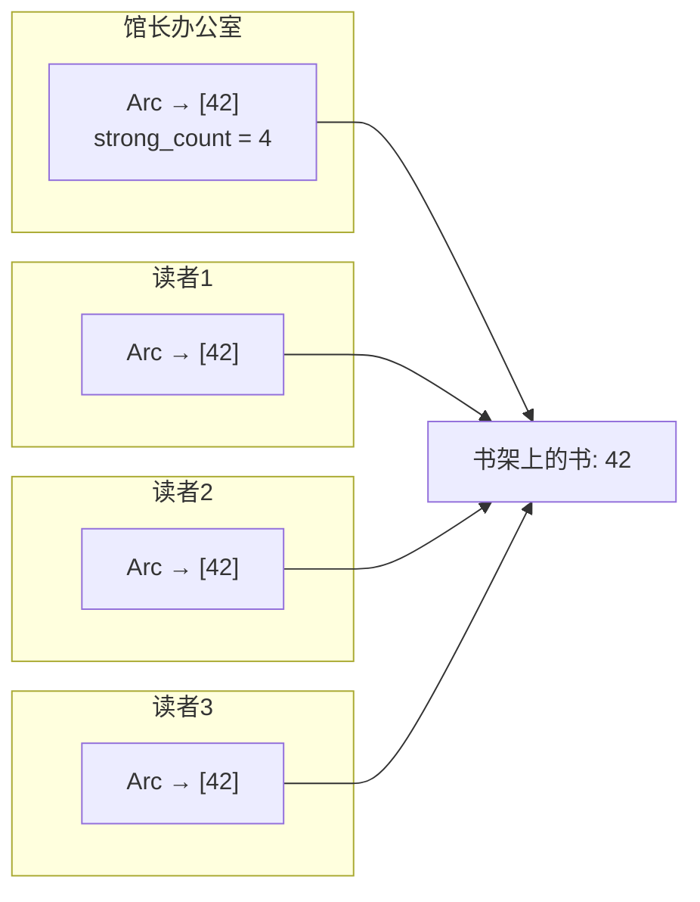
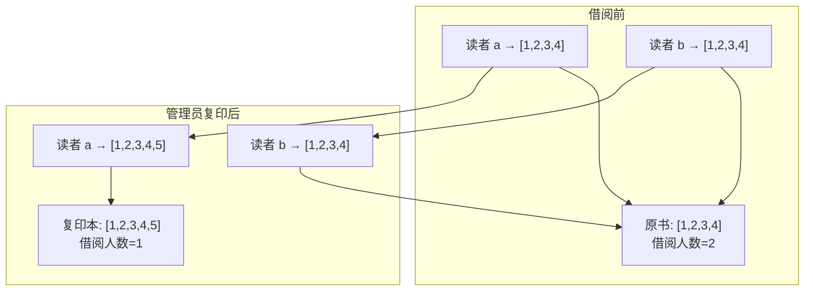

# Rust Arc：多线程共享所有权的正确姿势

> 本文基于 Rust 1.96。

## 单线程用 Rc，多线程用 Arc——私人书房 vs 公共图书馆

把 `Arc` 想象成**图书馆的书**。

一本《Rust 程序设计》放在图书馆里，好几个读者可以同时借来看——大家都拿到同一本书，各自读各自的章节。这就是共享引用。书的内页有一张借阅卡，记录着「当前有几个人在借」——这就是**引用计数**。最后一个人还书时，图书管理员把书下架处理掉——这就是 **drop**。

`Rc` 是私人书房里的书——你邀请朋友进来一起看。但你不能把书房里的书带到街上、传到另一个房间——因为 `Rc` 的借阅卡记录用的是普通贴纸计数，并不防并发的人同时摸。

`Arc`（Atomic Reference Counting）是真正公共图书馆的书——它用的是防撕的硬卡片加原子计数器，多个人同时碰也不会乱：

```rust
use std::sync::Arc;
use std::thread;

let data = Arc::new(42);

let handles: Vec<_> = (0..4).map(|i| {
    let data = Arc::clone(&data); // 办一张借书证，借阅人数 +1
    thread::spawn(move || {
        println!("读者 {}: {}", i, data);
    })
}).collect();

for h in handles {
    h.join().unwrap();
}
// 最后一个 Arc 离开作用域时，引用计数归零，图书馆下架
```



`Rc` 则是私人书房——同样可以共享，但只能在同一个房间里：

```rust
use std::rc::Rc;
use std::thread;

let data = Rc::new(42);
thread::spawn(move || {
    println!("{}", data); // ❌ Rc 没有实现 Send——私人书不能带出书房
});
```

## 内部机制：原子操作不是免费的——多人同时借书需要登记

`Rc` 和 `Arc` 的差别全在引用计数操作上：

```rust
// Rc::clone —— 书房里的贴纸
// strong_count += 1;  // 一笔一划，一条 CPU 指令

// Arc::clone —— 图书馆的电子登记系统
// strong_count.fetch_add(1, Ordering::Relaxed);  // 多人同时操作，需要排队
```

原子操作比普通整数操作慢几倍到十几倍——就像图书馆的电子借阅系统比书房里的贴纸要慢不少，因为要保证两个人同时借书时记录不会出错。对于高频 `clone`/`drop` 的场景（比如开学季新书发布，大量读者同时借书），这个差距是可见的：

```rust
// ❌ 循环里每次 clone——每次排队登记
for msg in messages {
    let arc = Arc::clone(&shared_data);
    pool.spawn(move || process(arc, msg));
}

// ✅ 还是需要 clone，但关键是不在不必要的时候 clone
// 如果数据在函数调用链中只是借用，传 &T 而不是 Arc<T>
// 就像——如果只是站在旁边看一眼，不需要办借书证
```

## 共享可变状态：Arc\<Mutex\<T\>\>——限定版藏书

`Arc` 只解决了「多个读者共享同一本书」的问题——但只能读。要批注修改，得限定借阅规则：

```rust
use std::sync::{Arc, Mutex};
use std::thread;

let counter = Arc::new(Mutex::new(0));
let mut handles = vec![];

for _ in 0..10 {
    let counter = Arc::clone(&counter);
    let handle = thread::spawn(move || {
        let mut num = counter.lock().unwrap();
        *num += 1;
    });
    handles.push(handle);
}

for handle in handles {
    handle.join().unwrap();
}

println!("结果: {}", *counter.lock().unwrap()); // 10
```

`Arc<Mutex<T>>` 读起来绕口，但拆开看很清楚：

- `Arc` 管**谁拥有**这本书——图书馆的书归全体读者共享
- `Mutex` 管**谁能批注**这本书——同一时刻只能有一位读者在书上写批注，还回来之后下一位才能写

这个组合极其常见——Rust 生态里几乎所有多线程共享可变状态的场景都用它。RwLock 是另一个选择：

```rust
use std::sync::RwLock;

let cache = Arc::new(RwLock::new(HashMap::new()));

// 读——多位读者可以同时翻阅
{
    let data = cache.read().unwrap();
    println!("{:?}", data.get("key"));
}

// 写——只有一位能批注
{
    let mut data = cache.write().unwrap();
    data.insert("key", "value");
}
```

| 锁 | 适合场景 |
|-----|---------|
| `Arc<Mutex<T>>` | 读写比例接近，或写为主——像课堂传阅的讲义 |
| `Arc<RwLock<T>>` | 读远多于写——像字典、目录，很多人查但很少人改 |

## `Arc::make_mut`：写时复制——有人写批注，图书管理员复印一本新的

`Arc::make_mut` 是一个巧妙的优化——就像图书管理员很聪明：

- 如果某本书只有你一个人在借，你说「我想在上面写批注」——管理员说「直接写吧，反正没别人看」
- 如果同时有好几个人在借——管理员会把书复印一本新的给你写，原书不动留给其他人

```rust
use std::sync::Arc;

let mut a = Arc::new(vec![1, 2, 3]);

// 只有一个人在借——直接写
{
    let data = Arc::make_mut(&mut a);
    data.push(4);
}
println!("{:?}", a); // [1, 2, 3, 4]

// 现在有两个人了——复印一本再写
let b = Arc::clone(&a);
{
    let data = Arc::make_mut(&mut a); // a 的引用计数 > 1，复印一本
    data.push(5);
}
println!("a: {:?}", a); // [1, 2, 3, 4, 5]——你的复印本
println!("b: {:?}", b); // [1, 2, 3, 4]——原书还在
```



这是 copy-on-write 的经典模式：引用计数为 1 时直接改，大于 1 时先复制再改。它让你在使用 `Arc` 的同时保留了「直接修改数据」的可能性——不需要每次都找管理员锁门（`.lock().unwrap()`）。

## Weak：书单上的记录——书没了记录还在

`Arc` 会造成循环引用，导致内存泄漏。用图书馆来解释：图书管理员有一个**待购书单**（Weak），书单上记着某本书的名字。但这本书如果已经被下架了，书单上的记录就失效了。

```rust
use std::sync::{Arc, Weak};
use std::cell::RefCell;

struct Node {
    value: i32,
    parent: RefCell<Weak<Node>>,    // Weak——家长名录，不是借书证
    children: RefCell<Vec<Arc<Node>>>,
}

impl Node {
    fn new(value: i32) -> Arc<Node> {
        Arc::new(Node {
            value,
            parent: RefCell::new(Weak::new()),
            children: RefCell::new(Vec::new()),
        })
    }
}

fn main() {
    let parent = Node::new(1);
    let child = Node::new(2);

    // 子节点知道父节点是谁——但只是记在家长名录上，不占借阅名额
    *child.parent.borrow_mut() = Arc::downgrade(&parent);
    parent.children.borrow_mut().push(Arc::clone(&child));

    // 父节点计数：strong=1（parent 变量），weak=1（来自 child）
    // 子节点计数：strong=2（child 变量 + parent.children）

    drop(parent);
    // 父节点被下架了（strong=0），但 weak 记录还在
    // child.parent 现在是个空记录——通过 upgrade 可以检查
    println!("父节点还活着吗？{}",
        child.parent.borrow().upgrade().is_some()); // false
}
```

关键区别：

| | strong_count | weak_count | 会阻止下架吗？ |
|---|---|---|---|
| `Arc<T>` | +1 | — | ✅——这算一个正式借阅者 |
| `Weak<T>` | — | +1 | ❌——借阅记录而已，书没了记录就作废 |

`Weak::upgrade()` 返回 `Option<Arc<T>>`——如果书还在，返回正版借书证；如果书已经下架了，返回 `None`。

## 实战：图书馆自习室座位管理系统——多线程连接池

```rust
use std::collections::VecDeque;
use std::sync::{Arc, Condvar, Mutex};
use std::thread;
use std::time::Duration;

// 连接池——图书馆的书架
struct Pool {
    connections: Mutex<VecDeque<Connection>>,
    available: Condvar,
    max_size: usize,
}

struct Connection {
    id: usize,
}

impl Pool {
    fn new(max_size: usize) -> Arc<Self> {
        let connections = (0..max_size)
            .map(|id| Connection { id })
            .collect();
        Arc::new(Pool {
            connections: Mutex::new(connections),
            available: Condvar::new(),
            max_size,
        })
    }

    fn acquire(self: &Arc<Self>) -> Connection {
        let mut conns = self.connections.lock().unwrap();

        // 书架上没有书了——排队等待
        while conns.is_empty() {
            conns = self.available.wait(conns).unwrap();
        }

        conns.pop_front().unwrap()
    }

    fn release(self: &Arc<Self>, conn: Connection) {
        let mut conns = self.connections.lock().unwrap();
        conns.push_back(conn);
        self.available.notify_one(); // 通知排队的人：书回来了
    }
}

fn main() {
    let pool = Pool::new(4);
    let mut handles = vec![];

    for i in 0..10 {
        let pool = Arc::clone(&pool);
        handles.push(thread::spawn(move || {
            let conn = pool.acquire();
            println!("读者 {i} 借到了书 {}", conn.id);
            thread::sleep(Duration::from_millis(100));
            pool.release(conn);
        }));
    }

    for h in handles {
        h.join().unwrap();
    }
}
```

这个例子展示了 `Arc` + `Mutex` + `Condvar` 的组合——`Arc` 让 Pool（图书管理）能在所有读者间共享，`Mutex` 保护内部的书架（连接队列），`Condvar` 负责「没书时等待、有人还书时唤醒」的信号同步。

## Arc 与 Send/Sync 的自动实现——图书馆书架的自动合规检查

`Arc<T>` 的 Send/Sync 实现取决于 T：

```rust
// Arc<T> 是 Send 的，当 T 是 Send + Sync
// 你可以把这本书带到任何阅览室

// Arc<T> 是 Sync 的，当 T 是 Send + Sync
// 多个读者可以同时排队借阅同一本
```

这意味着你可以把 `Arc<MyStruct>` 安全地发到另一个线程，只要 `MyStruct` 是 `Send + Sync`。大多数 Rust 类型都是自动 `Send + Sync` 的——编译器像图书管理员那样替你检查每本书的「可否外借」标记，不需要你手动声明。

## 性能要点——图书馆运营的注意事项

1. **原子操作的代价**：`Arc::clone` 比 `Rc::clone` 慢几倍——图书馆的电子登记比书房里的贴纸慢，但远不到「不可接受」的程度。多数场景下这不是瓶颈。
2. **避免在高频路径里 clone**：借还高峰期每来一位读者都登记一次，不如让读者在里面多待一会儿（用 `&T` 借用）。
3. **Mutex vs RwLock**：借阅者的阅读行为（读）占 90% 以上的场景，`Arc<RwLock<T>>` 比 `Arc<Mutex<T>>` 吞吐高很多——就像阅览室比单间自习室容纳更多人。
4. **不用为小数据用 Arc**：`Arc<u32>` 有两本书的开销（strong_count + weak_count + 堆分配），比直接用 `u32` 大得多——就像给一页纸的书配一个精装书套。

## 小结

- **`Arc` = 图书馆的书**——原子引用计数，多人跨房间借阅安全
- **`Arc<Mutex<T>>` = 限定借阅版图书**——经典并发模式，一人批注完下一位
- **`Arc::make_mut` = 复印批注**——一人独借时直接写，多人借阅时复印
- **`Weak` = 书单记录**——不增加借阅名额，书下架了记录自动失效
- **`Arc::clone` 不是免费的**——电子登记比贴纸慢，大部分场景没问题，但不要在高频路径上无意义地办借书证

**返回：** [Rust 笔记](index.md)
