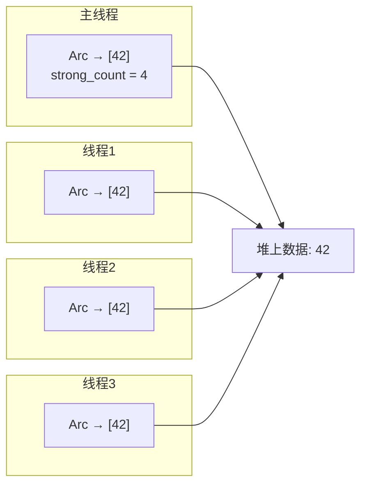
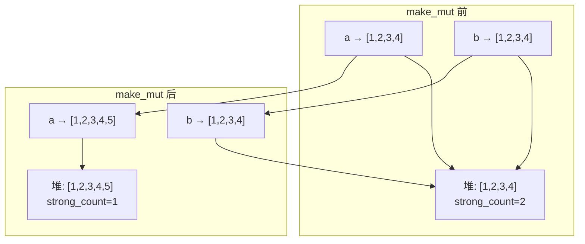

# Rust Arc：多线程共享所有权的正确姿势

> 本文基于 Rust 1.85。

## 单线程用 Rc，多线程用 Arc

Rust 的所有权模型不允许一个值有两个所有者——除非你用引用计数：

```rust
use std::rc::Rc;

let data = Rc::new(vec![1, 2, 3]);
let clone1 = Rc::clone(&data); // 引用计数 +1
let clone2 = Rc::clone(&data); // 引用计数 +1
// data、clone1、clone2 指向同一块内存
// 最后一个离开作用域时释放
```

但 `Rc` 的引用计数用的是普通整数加减——**不是线程安全的**。编译器会阻止你把它发到另一个线程：

```rust
use std::rc::Rc;
use std::thread;

let data = Rc::new(42);
thread::spawn(move || {
    println!("{}", data); // ❌ Rc 没有实现 Send
});
```

`Arc`（Atomic Reference Counting）用**原子操作**做引用计数，多线程安全：

```rust
use std::sync::Arc;
use std::thread;

let data = Arc::new(42);

let handles: Vec<_> = (0..4).map(|i| {
    let data = Arc::clone(&data); // 原子递增
    thread::spawn(move || {
        println!("线程 {}: {}", i, data);
    })
}).collect();

for h in handles {
    h.join().unwrap();
}
// 最后一个 Arc 离开作用域时，引用计数归零，释放内存
```



## 内部机制：原子操作不是免费的

`Rc` 和 `Arc` 的差别全在引用计数操作上：

```rust
// Rc::clone —— 普通整数操作
// strong_count += 1;  // 一条 CPU 指令

// Arc::clone —— 原子操作
// strong_count.fetch_add(1, Ordering::Relaxed);  // lock 前缀，内存屏障
```

原子操作比普通整数操作慢几倍到十几倍。对于高频 `clone`/`drop` 的场景（比如事件循环里），这个差距是可见的。实际代码里，如果一个 Arc 会被频繁 clone，常见的优化是**先 clone 再分发**：

```rust
// ❌ 循环里每次 clone——每次都做原子操作
for msg in messages {
    let arc = Arc::clone(&shared_data);
    pool.spawn(move || process(arc, msg));
}

// ✅ 在外面 clone 一次——把原子操作的次数从 N 降到 1
for msg in messages {
    let arc = Arc::clone(&shared_data); // 还是不行，clone 在循环里
    // ...
}
```

实际上上面的场景无法避免 clone——每个线程需要一个独立的 Arc。关键是不要**没必要的 clone**：如果数据在函数调用链中只是借用，传 `&T` 而不是 `Arc<T>`。

## 共享可变状态：Arc\<Mutex\<T\>\>

`Arc` 只解决了「多个线程共享同一块数据」的问题——数据是只读的。要修改，得加锁：

```rust
use std::sync::{Arc, Mutex};
use std::thread;

let counter = Arc::new(Mutex::new(0));
let mut handles = vec![];

for _ in 0..10 {
    let counter = Arc::clone(&counter);
    let handle = thread::spawn(move || {
        let mut num = counter.lock().unwrap();
        *num += 1;
    });
    handles.push(handle);
}

for handle in handles {
    handle.join().unwrap();
}

println!("结果: {}", *counter.lock().unwrap()); // 10
```

`Arc<Mutex<T>>` 读起来绕口，但拆开看很清楚：

- `Arc` 管**谁拥有**这块数据——多个线程共享所有权
- `Mutex` 管**谁能访问**这块数据——同一时刻只有一个线程能修改

这个组合极其常见——Rust 生态里几乎所有多线程共享可变状态的场景都用它。RwLock 是另一个选择：

```rust
use std::sync::RwLock;

let cache = Arc::new(RwLock::new(HashMap::new()));

// 读——多线程可以同时持有
{
    let data = cache.read().unwrap();
    println!("{:?}", data.get("key"));
}

// 写——独占
{
    let mut data = cache.write().unwrap();
    data.insert("key", "value");
}
```

| 锁 | 适合场景 |
|-----|---------|
| `Arc<Mutex<T>>` | 读写比例接近，或写为主 |
| `Arc<RwLock<T>>` | 读远多于写——如缓存、配置 |

## `Arc::make_mut`：写时复制

`Arc::make_mut` 是一个巧妙的优化：

```rust
use std::sync::Arc;

let mut a = Arc::new(vec![1, 2, 3]);

// 当前只有一个所有者——直接修改原数据，不复制
{
    let data = Arc::make_mut(&mut a);
    data.push(4);
}
println!("{:?}", a); // [1, 2, 3, 4]

// 现在有两个所有者——make_mut 会 clone 一份再修改
let b = Arc::clone(&a);
{
    let data = Arc::make_mut(&mut a); // a 的引用计数 > 1，所以这里复制了一份
    data.push(5);
}
println!("a: {:?}", a); // [1, 2, 3, 4, 5]
println!("b: {:?}", b); // [1, 2, 3, 4]
```



这是 copy-on-write 的经典模式：引用计数为 1 时直接改，大于 1 时先复制再改。它让你在使用 `Arc` 的同时保留了「直接修改数据」的可能性——不需要每次都 `.lock().unwrap()`。

## Weak：打断引用循环

`Arc` 会造成循环引用，导致内存泄漏：

```rust
use std::sync::{Arc, Weak};
use std::cell::RefCell;

struct Node {
    value: i32,
    parent: RefCell<Weak<Node>>,    // Weak——不增加引用计数
    children: RefCell<Vec<Arc<Node>>>,
}

impl Node {
    fn new(value: i32) -> Arc<Node> {
        Arc::new(Node {
            value,
            parent: RefCell::new(Weak::new()),
            children: RefCell::new(Vec::new()),
        })
    }
}

fn main() {
    let parent = Node::new(1);
    let child = Node::new(2);

    // 子节点持有父节点的 Weak——不会阻止父节点释放
    *child.parent.borrow_mut() = Arc::downgrade(&parent);
    parent.children.borrow_mut().push(Arc::clone(&child));

    // 父节点计数：strong=1（parent 变量），weak=1（来自 child）
    // 子节点计数：strong=2（child 变量 + parent.children）

    drop(parent);
    // 父节点引用计数：strong=0 → 释放，但 weak 还存在
    // child.parent 现在是悬空的 Weak——通过 upgrade 可以检测到
    println!("父节点还活着吗？{}",
        child.parent.borrow().upgrade().is_some()); // false
}
```

关键区别：

| | strong_count | weak_count | 会阻止释放？ |
|---|---|---|---|
| `Arc<T>` | +1 | — | ✅ |
| `Weak<T>` | — | +1 | ❌ |

`Weak::upgrade()` 返回 `Option<Arc<T>>`——如果原始数据已经释放了，返回 `None`。这就是「不持有所有权」的含义。

## 实战：多线程连接池

```rust
use std::collections::VecDeque;
use std::sync::{Arc, Condvar, Mutex};
use std::thread;
use std::time::Duration;

// 连接池——多线程共享
struct Pool {
    connections: Mutex<VecDeque<Connection>>,
    available: Condvar,
    max_size: usize,
}

struct Connection {
    id: usize,
}

impl Pool {
    fn new(max_size: usize) -> Arc<Self> {
        let connections = (0..max_size)
            .map(|id| Connection { id })
            .collect();
        Arc::new(Pool {
            connections: Mutex::new(connections),
            available: Condvar::new(),
            max_size,
        })
    }

    fn acquire(self: &Arc<Self>) -> Connection {
        let mut conns = self.connections.lock().unwrap();

        // 没有可用连接——等待
        while conns.is_empty() {
            conns = self.available.wait(conns).unwrap();
        }

        conns.pop_front().unwrap()
    }

    fn release(self: &Arc<Self>, conn: Connection) {
        let mut conns = self.connections.lock().unwrap();
        conns.push_back(conn);
        self.available.notify_one(); // 唤醒一个等待的线程
    }
}

fn main() {
    let pool = Pool::new(4);
    let mut handles = vec![];

    for i in 0..10 {
        let pool = Arc::clone(&pool);
        handles.push(thread::spawn(move || {
            let conn = pool.acquire();
            println!("线程 {i} 获取连接 {}", conn.id);
            thread::sleep(Duration::from_millis(100));
            pool.release(conn);
        }));
    }

    for h in handles {
        h.join().unwrap();
    }
}
```

这个例子展示了 `Arc` + `Mutex` + `Condvar` 的组合——`Arc` 让 Pool 能在所有线程间共享，`Mutex` 保护内部的连接队列，`Condvar` 负责「没连接时等待、有连接时唤醒」的信号同步。

## Arc 与 Send/Sync 的自动实现

`Arc<T>` 的 Send/Sync 实现取决于 T：

```rust
// Arc<T> 是 Send 的，当 T 是 Send + Sync
// 这意味着你可以把 Arc<T> 发到另一个线程

// Arc<T> 是 Sync 的，当 T 是 Send + Sync
// 这意味着你可以通过 &Arc<T> 在多个线程间共享引用（即 clone）
```

这意味着你可以把 `Arc<MyStruct>` 安全地发到另一个线程，只要 `MyStruct` 是 `Send + Sync`。大多数 Rust 都是自动 `Send + Sync` 的——编译器替你检查，不需要你声明。

## 性能要点

1. **原子操作的代价**：`Arc::clone` 比 `Rc::clone` 慢几倍，但远不到「不可接受」的程度。多数场景下这不是瓶颈。
2. **避免在高频路径里 clone**：事件循环里每处理一条消息都 `Arc::clone` 一次，不如用 `&T` 借用。
3. **Mutex vs RwLock**：读操作 > 90% 的场景，`Arc<RwLock<T>>` 比 `Arc<Mutex<T>>` 吞吐高很多。
4. **不用为小数据用 Arc**：`Arc<u32>` 有两个 `usize` 的开销（strong_count + weak_count + 堆分配），比直接用 `u32` 大得多。

## 小结

- `Arc` = 多线程版 `Rc`——原子引用计数，线程安全
- `Arc<Mutex<T>>` = 多线程共享可变状态，Rust 最经典的并发模式
- `Arc::make_mut` = 写时复制，引用计数为 1 时直接改，大于 1 时 clone 再改
- `Weak` = 不增加 strong_count 的引用，用于打断循环引用
- `Arc::clone` 不是免费的——原子操作比普通整数操作慢。大部分场景没问题，但不要在高频路径上无意义地 clone
