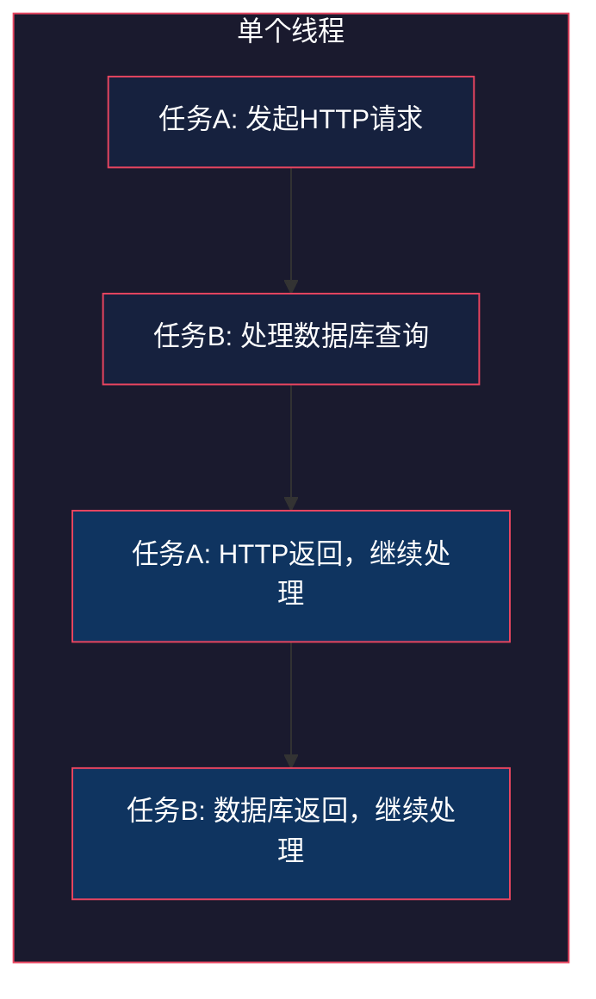
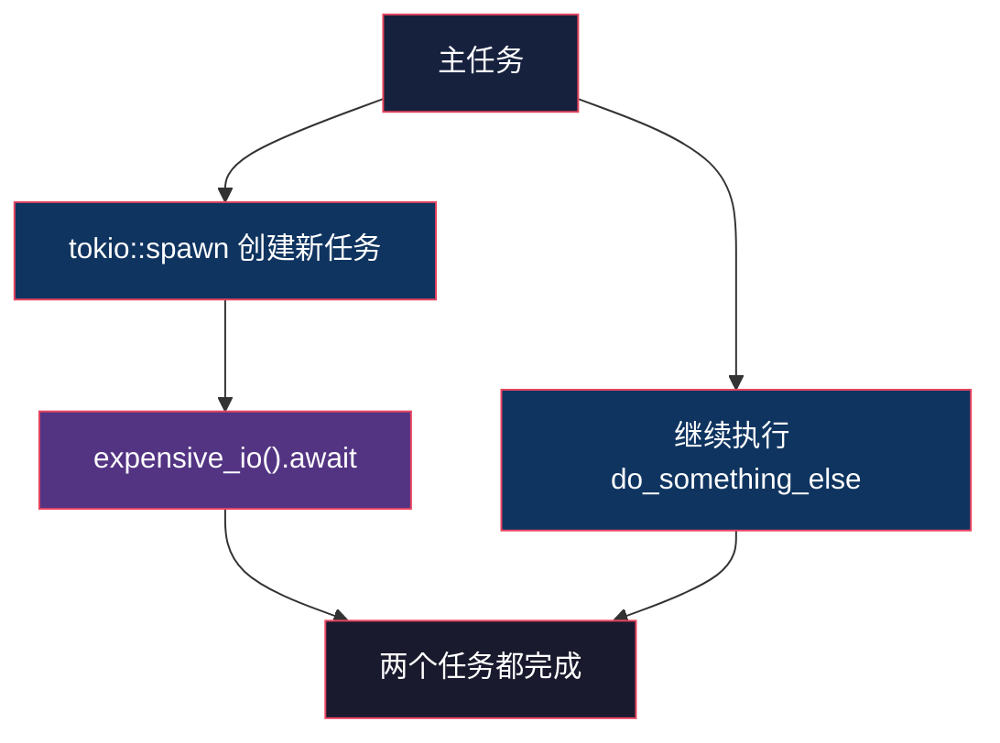
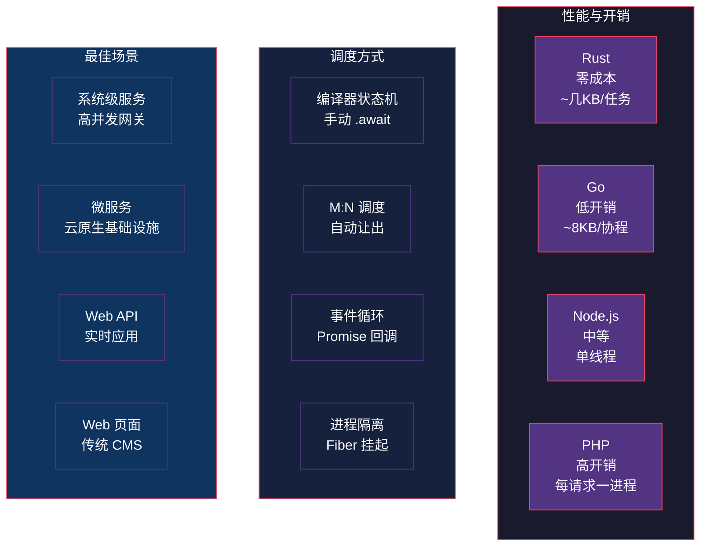

# Rust async/await：异步编程不是多线程

> 本文基于 Rust 1.95 稳定版。

## 生活比喻：餐厅服务员 vs 厨师团队

一家餐厅有两种运营模式：

- **多线程模式**：每来一桌客人，派一个专属服务员全程陪同——点菜、等菜、上菜、结账。10 桌客人就要 10 个服务员，成本高。
- **异步模式**：一个服务员同时服务多桌——A 桌点完菜，不站在那等，转身去给 B 桌点菜；A 桌的菜做好了，再去上菜。1 个服务员就能服务 10 桌。

Rust 的 async/await 就是第二种模式。一个线程可以同时处理多个异步任务，任务在等待 IO 时主动让出线程，而不是傻等。

## 先搞清楚：async 不是自动多线程

这是最常见的误解。看代码：

```rust
// 这不是多线程！这是单线程异步
#[tokio::main]
async fn main() {
    let a = fetch_data("api-a");
    let b = fetch_data("api-b");
    let (ra, rb) = tokio::join!(a, b); // 并发，但可能在同一个线程
}
```

`tokio::join!` 让两个请求**并发**执行，但它们可能跑在同一个线程上。区别在于：

| | 多线程 | 异步 |
|---|---|---|
| 并发方式 | 线程切换（OS 调度） | 任务切换（运行时调度） |
| 开销 | 每个线程 ~8MB 栈 | 每个任务 ~几 KB |
| 适用场景 | CPU 密集 | IO 密集 |
| 10000 个并发 | 炸了 | 轻松 |

## async fn 到底返回了什么

`async fn` 不是普通函数——它返回一个 `Future`，这个 Future 在被 `.await` 之前**什么都不会做**：

```rust
async fn hello() -> String {
    println!("hello");  // 这行不会立即执行！
    "world".into()
}

#[tokio::main]
async fn main() {
    let fut = hello();        // 没有打印任何东西
    println!("main");
    let result = fut.await;   // 现在才执行 hello()，打印 "hello"
    println!("{result}");
}
// 输出：
// main
// hello
// world
```

**好在哪：**

- **惰性求值**——创建 Future 不等于开始执行，你可以组合多个 Future 再一起跑
- **零成本抽象**——编译器把 async fn 转换成状态机，没有额外的堆分配

## .await 是让出点

`.await` 是任务让出线程的关键位置。当 Future 还没准备好时，线程不会阻塞，而是去执行别的任务：

```rust
async fn fetch_user(id: u64) -> User {
    // 到这里，如果数据还没返回
    let resp = http_get(&format!("/users/{id}")).await;
    // ↑ .await 让出线程，运行时去执行其他任务
    // 数据返回后，从这里继续
    parse_user(resp)
}
```

用图来理解线程和任务的关系：



任务在 `.await` 处让出线程，线程去干别的活；IO 完成后再回来继续。

## tokio::spawn：真正的并发

`tokio::join!` 是在同一个任务里并发等待多个 Future。`tokio::spawn` 是把 Future 提交给运行时，作为独立任务并发执行：

```rust
#[tokio::main]
async fn main() {
    // spawn 返回 JoinHandle，可以 await 获取结果
    let handle = tokio::spawn(async {
        expensive_io().await
    });

    // 主任务继续干别的
    do_something_else().await;

    // 需要结果时再 await
    let result = handle.await.unwrap();
}
```



## async 与所有权：为什么到处要 move

async 块会捕获外部变量，但 Future 可能在创建它的函数返回后才执行。所以编译器要求你用 `move` 明确转移所有权：

```rust
fn spawn_greeting(name: String) {
    // 必须 move，否则 name 被 drop 后 Future 还引用它
    tokio::spawn(async move {
        println!("Hello, {name}");
    });
    // name 的所有权已经转移进 async 块了
}
```

不用 `move` 的后果——编译器会告诉你：

```rust
// ❌ 编译失败
fn bad() {
    let name = String::from("Alice");
    tokio::spawn(async {
        println!("Hello, {name}"); // 借用了 name，但 name 可能先被 drop
    });
}
```

## async trait：终于不用 Box 了

Rust 1.75 稳定了原生 async trait 方法（`async fn in trait`），之前需要 `#[async_trait]` 宏：

```rust
// Rust 1.75+，原生支持
trait Repository {
    async fn find_by_id(&self, id: u64) -> Result<User>;
    async fn save(&self, user: &User) -> Result<()>;
}

struct PgRepository { pool: PgPool }

impl Repository for PgRepository {
    async fn find_by_id(&self, id: u64) -> Result<User> {
        sqlx::query_as("SELECT * FROM users WHERE id = $1")
            .bind(id)
            .fetch_one(&self.pool)
            .await
    }

    async fn save(&self, user: &User) -> Result<()> {
        sqlx::query("INSERT INTO users ...")
            .bind(&user.name)
            .execute(&self.pool)
            .await?;
        Ok(())
    }
}
```

## 常见陷阱：async 和锁

`std::sync::Mutex` 不能跨 `.await` 持有——它会把整个线程锁住，其他异步任务也跑不了：

```rust
// ❌ 错误：跨 await 持有 std::sync::Mutex
async fn bad() {
    let lock = std::sync::Mutex::new(vec![]);
    let mut guard = lock.lock().unwrap();
    // 下面这行会阻塞整个线程！
    some_io().await;
    guard.push(1);
}

// ✅ 正确：用 tokio::sync::Mutex
async fn good() {
    let lock = tokio::sync::Mutex::new(vec![]);
    let mut guard = lock.lock().await; // 异步锁，等待时不阻塞线程
    some_io().await;
    guard.push(1);
}
```

但 `tokio::sync::Mutex` 也有代价——每次 lock 都是异步的，开销比 `std::sync::Mutex` 大。最佳实践：

| 场景 | 用什么 |
|------|--------|
| 锁的临界区很短，不跨 .await | `std::sync::Mutex` |
| 需要跨 .await 持有锁 | `tokio::sync::Mutex` |
| 读多写少 | `tokio::sync::RwLock` |

## 横向对比：Rust vs Node.js vs PHP vs Go

同一个任务——并发请求 3 个 API，4 种语言的写法和底层机制完全不同。

### Node.js：单线程事件循环

```javascript
async function fetchAll() {
  const [a, b, c] = await Promise.all([
    fetch('/api/a'),
    fetch('/api/b'),
    fetch('/api/c'),
  ]);
}
```

Node.js 的异步是**单线程事件循环 + libuv 线程池**。`fetch` 本身不阻塞主线程，IO 由 libuv 的后台线程完成，完成后回调推入事件队列。

- 优点：写起来最简单，`async/await` 语法最成熟
- 缺点：单线程，CPU 密集任务会阻塞整个事件循环；回调嵌套虽被 `await` 解决了，但底层还是 Promise 链

### PHP：每次请求一个进程

```php
// PHP 8.1+ Fiber
$fiber = new Fiber(function () {
    $result = Fiber::suspend(fetchApi());  // 挂起
    process($result);
});
$fiber->start();  // 启动
$fiber->resume($data);  // 恢复
```

PHP 的传统模型是**请求-响应-销毁**——每个请求一个进程，处理完就结束。PHP 8.1 引入了 Fiber，但生态里真正的异步框架（Swoole、ReactPHP）是独立的事件循环，和 Node.js 类似。

- 优点：天然隔离，一个请求崩了不影响别的
- 缺点：进程开销大，Fiber 生态不成熟，大部分 PHP 代码还是同步阻塞的

### Go：goroutine 自动让出

```go
func fetchAll() {
    ch := make(chan string, 3)
    go func() { ch <- fetch("/api/a") }()
    go func() { ch <- fetch("/api/b") }()
    go func() { ch <- fetch("/api/c") }()
    a, b, c := <-ch, <-ch, <-ch
}
```

Go 的 goroutine 是**用户态线程**，由 Go runtime 的 M:N 调度器管理。代码写起来像同步的，runtime 在函数调用、IO 操作时自动插入检查点（抢占式调度），不需要你手动 `.await`。

- 优点：写起来最像同步代码，心智负担最低
- 缺点：每个 goroutine 初始 ~8KB 栈（可增长），百万级并发时内存比 Rust 高；runtime 开销不可控

### Rust：编译器生成状态机

```rust
async fn fetch_all() {
    let (a, b, c) = tokio::join!(
        fetch("/api/a"),
        fetch("/api/b"),
        fetch("/api/c"),
    );
}
```

Rust 的 async 是**编译期状态机转换**。`async fn` 被编译器变成一个实现了 `Future` trait 的状态机，每个 `.await` 是一个状态转换点。没有运行时自动插入检查点，你必须显式写 `.await`。

- 优点：零成本抽象，没有 GC、没有运行时开销、没有隐藏的堆分配
- 缺点：学习曲线最陡，需要理解 `Future`、`Pin`、`Poll`、生命周期

### 四语言对比



| 维度 | Rust | Node.js | PHP | Go |
|------|------|---------|-----|-----|
| 并发模型 | Future 状态机 | 事件循环 + Promise | 进程/Fiber | goroutine |
| 让出方式 | 显式 `.await` | 自动（Promise 链） | `Fiber::suspend` | 自动（抢占调度） |
| 每任务开销 | ~几 KB | ~几 KB（Promise） | ~MB（进程） | ~8KB（初始栈） |
| CPU 密集 | 需要 spawn_blocking | 会阻塞事件循环 | 天然隔离 | GOMAXPROCS 多核 |
| 内存安全 | 编译器保证 | GC | GC | GC |
| 学习曲线 | 陡峭 | 平缓 | 平缓 | 平缓 |
| 最佳场景 | 系统级高并发 | Web API | Web 页面 | 微服务/云原生 |

## 什么时候该用 async

**适合：**

- 高并发网络服务（HTTP、gRPC、WebSocket）
- 数据库连接池
- 文件 IO + 网络 IO 混合

**不适合：**

- CPU 密集计算——用 `tokio::task::spawn_blocking` 或 Rayon
- 简单脚本——同步代码更清晰
- 需要频繁共享可变状态——锁的开销会抵消异步的好处

## 骨架代码

```rust
use tokio::sync::{mpsc, Mutex};
use std::sync::Arc;

#[derive(Clone)]
struct AppState {
    db: PgPool,
    cache: Arc<Mutex<Vec<String>>>,
}

async fn handle_request(state: AppState, id: u64) -> Result<String> {
    // 先查缓存
    {
        let cache = state.cache.lock().await;
        if let Some(hit) = cache.get(id as usize) {
            return Ok(hit.clone());
        }
    }

    // 缓存没中，查数据库
    let row = sqlx::query_scalar("SELECT name FROM users WHERE id = $1")
        .bind(id)
        .fetch_one(&state.db)
        .await?;

    // 写缓存
    let mut cache = state.cache.lock().await;
    cache.push(row.clone());

    Ok(row)
}

#[tokio::main]
async fn main() {
    let state = AppState {
        db: connect_db().await,
        cache: Arc::new(Mutex::new(Vec::new())),
    };

    // 并发处理多个请求
    let mut handles = vec![];
    for id in 0..100 {
        let s = state.clone();
        handles.push(tokio::spawn(async move {
            handle_request(s, id).await
        }));
    }

    for handle in handles {
        let _ = handle.await;
    }
}
```

## 总结

Rust 的 async/await 是零成本的异步抽象——编译器把 async fn 编译成状态机，不堆分配、不 GC。核心要点：

- **async 不等于多线程**——异步是并发模型，多线程是并行模型，两者正交
- **`.await` 是让出点**——任务在这里暂停，线程去干别的
- **`move` 是必须的**——async 块捕获变量时，必须转移所有权
- **锁要选对**——短临界区用 `std::sync::Mutex`，跨 `.await` 用 `tokio::sync::Mutex`
