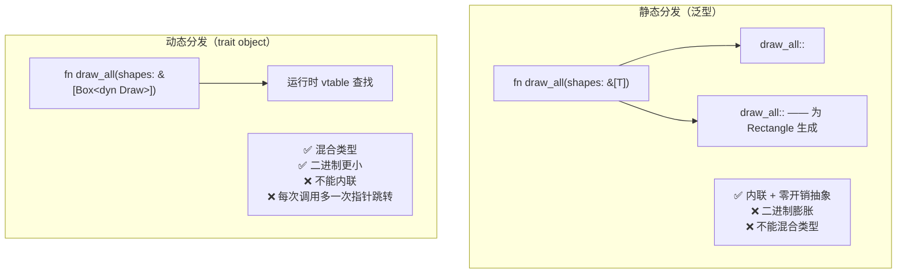
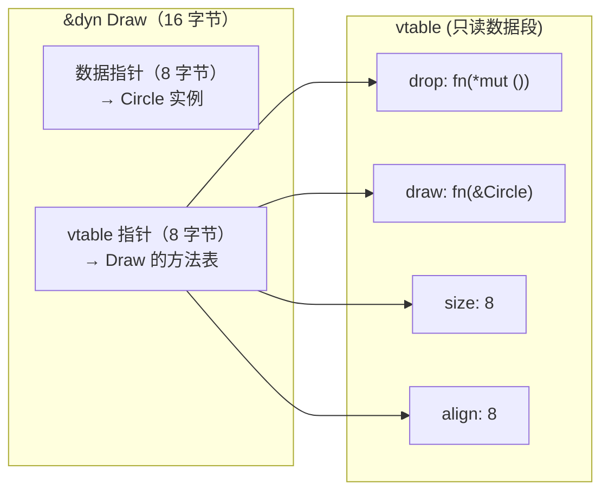

# Rust Box\<dyn\>：从泛型到 trait 对象，理解动态分发

> 本文基于 Rust 1.85。

## 一句话回答

`Box<dyn Trait>` 是 Rust 做动态分发的方式。泛型（`<T: Trait>`）在**编译期**为每个具体类型生成一份代码——快，但二进制膨胀，且无法把不同类型放进同一个集合。`Box<dyn Trait>` 在**运行期**通过虚表（vtable）找方法——稍慢，但可以把不同实现塞进同一个 `Vec`。

如果你写过 Java/C++，trait object ≈ Java 的 interface 引用 / C++ 的虚函数 + `unique_ptr<Base>`。但 Rust 还多了一层限制：不是所有 trait 都能当 trait object。这就是「对象安全」——本篇会讲清楚。

## 泛型的局限：为什么需要 trait object

泛型在编译期单态化（monomorphization）——编译器为每个具体类型生成一份副本：

```rust
// 泛型
fn draw_static<T: Draw>(shapes: &[T]) {
    for shape in shapes {
        shape.draw();
    }
}

// 编译器生成的伪代码（单态化）
fn draw_static_Circle(shapes: &[Circle]) { ... }
fn draw_static_Rectangle(shapes: &[Rectangle]) { ... }
fn draw_static_Triangle(shapes: &[Triangle]) { ... }
```

问题是：

```rust
// ❌ 编译错误：Vec 里所有元素必须是同一个类型
let shapes: Vec<???> = vec![
    Circle::new(10.0),
    Rectangle::new(5.0, 3.0),
    Triangle::new(3.0, 4.0, 5.0),
];
```

`Vec<T>` 要求所有元素类型一致——泛型没法把 `Circle`、`Rectangle`、`Triangle` 放进同一个 Vec。这就是 trait object 存在的意义。

```rust
// ✅ trait object——不同类型，同一个 Vec
let shapes: Vec<Box<dyn Draw>> = vec![
    Box::new(Circle::new(10.0)),
    Box::new(Rectangle::new(5.0, 3.0)),
    Box::new(Triangle::new(3.0, 4.0, 5.0)),
];

for shape in &shapes {
    shape.draw(); // 运行时查找 vtable
}
```

## `dyn` 是什么

`dyn Trait` 声明的意思是：**「这是一个运行时动态分发的 trait 对象」**。

Rust 2015 里可以不写 `dyn`——`Box<Trait>` 也能工作。Rust 2018 开始要求显式写 `Box<dyn Trait>`，去掉 `dyn` 会有警告。到了 Rust 2021，`dyn` 是强制的。加上 `dyn` 的好处是读代码时一眼就能分清静态和动态：

```rust
fn static_dispatch<T: Draw>(t: &T) { t.draw(); }     // 泛型，编译期确定
fn dynamic_dispatch(t: &dyn Draw) { t.draw(); }        // trait object，运行期确定
```

## 静态分发 vs 动态分发



用一个实际例子对比：

```rust
trait Animal {
    fn sound(&self) -> &'static str;
}

struct Dog;
impl Animal for Dog {
    fn sound(&self) -> &'static str { "汪汪" }
}

struct Cat;
impl Animal for Cat {
    fn sound(&self) -> &'static str { "喵喵" }
}

// 静态分发：编译期为 Dog 和 Cat 各生成一份
fn announce_static<T: Animal>(animal: &T) {
    println!("{}", animal.sound());
}

// 动态分发：运行时通过 vtable 找方法
fn announce_dynamic(animal: &dyn Animal) {
    println!("{}", animal.sound());
}

fn main() {
    let dog = Dog;
    let cat = Cat;

    // 静态——调用时类型已知
    announce_static(&dog);
    announce_static(&cat);

    // 动态——通过 trait object
    announce_dynamic(&dog as &dyn Animal);
    announce_dynamic(&cat as &dyn Animal);
}
```

## 内存布局：胖指针

`&dyn Trait` 不是一个普通指针——它是个**胖指针**（fat pointer），占两个 `usize`：



```rust
use std::mem;

fn main() {
    let s: &str = "hello";
    println!("&str: {} 字节", mem::size_of_val(&s)); // 16 字节

    let slice: &[i32] = &[1, 2, 3];
    println!("&[i32]: {} 字节", mem::size_of_val(&slice)); // 16 字节

    let trait_obj: &dyn std::fmt::Display = &42;
    println!("&dyn Display: {} 字节", mem::size_of_val(&trait_obj)); // 16 字节
}
```

胖指针 = 数据指针 + 类型元数据。`&str` 加长度，`&[T]` 加长度，`&dyn Trait` 加 vtable 指针。每次通过 trait object 调用方法，都会先查 vtable 再跳转——这就是动态分发的「多一次指针跳转」。

## 为什么是 `Box<dyn>` 而不是 `&dyn`

```rust
// ❌ 生命周期约束太短——借用的 trait object 活不过引用的作用域
fn make_shapes<'a>() -> Vec<&'a dyn Draw> { ... } // 谁拥有这些数据？

// ✅ Box 拥有数据——想存多久存多久
fn make_shapes() -> Vec<Box<dyn Draw>> { ... }
```

除了 `Box`，`Rc<dyn Trait>` 和 `Arc<dyn Trait>` 也常用：

```rust
use std::rc::Rc;
use std::sync::Arc;

// 单线程共享
let shapes: Vec<Rc<dyn Draw>> = vec![
    Rc::new(Circle::new(10.0)),
    Rc::new(Circle::new(5.0)),  // Rc 允许多个所有者
];

// 多线程共享
let shapes: Vec<Arc<dyn Draw + Send + Sync>> = vec![
    Arc::new(Circle::new(10.0)),
];
```

## 对象安全：不是所有 trait 都能当 trait object

这是 trait object 最大的限制。如果一个 trait 有这些方法，就不能用作 `dyn Trait`：

```rust
// ❌ 不是对象安全的——不能写成 &dyn Clone
trait Clone {
    fn clone(&self) -> Self; // 返回 Self——编译器不知道 Self 是什么类型
}

// ❌ 不是对象安全的——有泛型方法
trait Parser {
    fn parse<T: FromStr>(&self, s: &str) -> Result<T, T::Err>;
    //    ^ 泛型参数——编译器没法为每种 T 生成 vtable 条目
}
```

要使用 trait object，trait 的所有方法必须满足：

1. 返回值不是 `Self`（除非 `Self` 是 `Sized` 且在指针后面）
2. 没有泛型参数

```rust
// ✅ 对象安全的
trait Draw {
    fn draw(&self);                    // 不返回 Self
    fn area(&self) -> f64;            // 返回具体类型
}

// ✅ 改造成对象安全的——把泛型移到参数
trait Parser {
    fn parse(&self, s: &str) -> Result<Box<dyn Any>, Box<dyn Error>>;
    //             ^^^^^^^^^  ^^^^^^^^^^——不用泛型，用 trait object
}
```

编译器会帮你检查——如果 trait 不是对象安全的，写 `&dyn Trait` 时会直接报错：

```rust
// 编译错误：the trait `Clone` cannot be made into an object
let _: &dyn Clone = &42;
```

## 实战场景

### 场景一：可扩展的插件系统

```rust
trait Plugin {
    fn name(&self) -> &str;
    fn execute(&self, input: &str) -> anyhow::Result<String>;
}

// 插件注册表
struct PluginRegistry {
    plugins: Vec<Box<dyn Plugin>>,
}

impl PluginRegistry {
    fn new() -> Self {
        Self { plugins: Vec::new() }
    }

    fn register(&mut self, plugin: Box<dyn Plugin>) {
        println!("注册插件: {}", plugin.name());
        self.plugins.push(plugin);
    }

    fn run_all(&self, input: &str) -> Vec<anyhow::Result<String>> {
        self.plugins
            .iter()
            .map(|p| p.execute(input))
            .collect()
    }
}

// 用户自定义插件——不需要改注册表的代码
struct UpperCasePlugin;
impl Plugin for UpperCasePlugin {
    fn name(&self) -> &str { "uppercase" }
    fn execute(&self, input: &str) -> anyhow::Result<String> {
        Ok(input.to_uppercase())
    }
}

struct ReversePlugin;
impl Plugin for ReversePlugin {
    fn name(&self) -> &str { "reverse" }
    fn execute(&self, input: &str) -> anyhow::Result<String> {
        Ok(input.chars().rev().collect())
    }
}

fn main() {
    let mut registry = PluginRegistry::new();
    registry.register(Box::new(UpperCasePlugin));
    registry.register(Box::new(ReversePlugin));

    for result in registry.run_all("hello") {
        println!("{:?}", result);
    }
}
```

加一个新插件只需要实现 `Plugin` trait，不需要修改 `PluginRegistry`。这就是「开闭原则」——对扩展开放，对修改关闭。

### 场景二：类型擦除

```rust
use std::fmt::Debug;

// 可以存任何实现了 Debug + Send + 'static 的类型
struct LogEntry {
    timestamp: chrono::DateTime<chrono::Utc>,
    payload: Box<dyn Any + Send + 'static>, // 完全类型擦除
}

impl LogEntry {
    fn new(payload: impl Any + Send + 'static) -> Self {
        Self {
            timestamp: chrono::Utc::now(),
            payload: Box::new(payload),
        }
    }

    // 尝试取出具体类型
    fn downcast_ref<T: Any>(&self) -> Option<&T> {
        self.payload.downcast_ref::<T>()
    }
}

#[derive(Debug)]
struct PaymentEvent {
    amount: f64,
    currency: String,
}

fn main() {
    let entry = LogEntry::new(PaymentEvent {
        amount: 100.0,
        currency: "CNY".into(),
    });

    // 取回具体类型
    if let Some(event) = entry.downcast_ref::<PaymentEvent>() {
        println!("支付事件: {:?}", event);
    }
}
```

### 场景三：全局错误类型

anyhow 的核心就是 `Box<dyn Error>` 的变体：

```rust
// anyhow 内部的简化版
type Error = Box<dyn std::error::Error + Send + Sync + 'static>;

fn fallible_ops() -> Result<(), Box<dyn std::error::Error + Send + Sync>> {
    let _file = std::fs::read_to_string("config.toml")?; // io::Error
    let _num: i32 = "42".parse()?;                        // ParseIntError
    // 两种不同的错误类型，都能通过 Box<dyn Error> 传播
    Ok(())
}
```

## 选择指南

| 场景 | 用 | 原因 |
|------|-----|------|
| 编译期就知道所有类型 | 泛型 `<T: Trait>` | 零开销，内联友好 |
| 需要异构集合 | `Vec<Box<dyn Trait>>` | 唯一选择 |
| 写库，类型留给调用者 | 泛型 `<T: Trait>` | 调用者能拿到具体类型 |
| 插件系统 | `Box<dyn Trait>` | 运行时注册 |
| 减小二进制体积 | `dyn Trait` | 不会为每个类型生成代码 |
| 内部闭包存储 | `Box<dyn FnOnce()>` | 闭包类型不可命名 |

一条实用准则：**能静态就静态**。泛型是 Rust 的默认选择——更安全、更快、编译器能帮你验证更多。只有当泛型做不到的时候——异构集合、运行时多态、类型不可知——才用 `dyn`。

## 小结

`Box<dyn Trait>` 的三个要点：

1. **胖指针**——数据指针 + vtable 指针，16 字节。每次调用多一次间接跳转
2. **对象安全**——返回 Self 或有泛型方法的不行，这是编译器可以验证的硬限制
3. **选择**——编译期能确定类型用泛型，运行期才确定或用异构集合用 trait object
