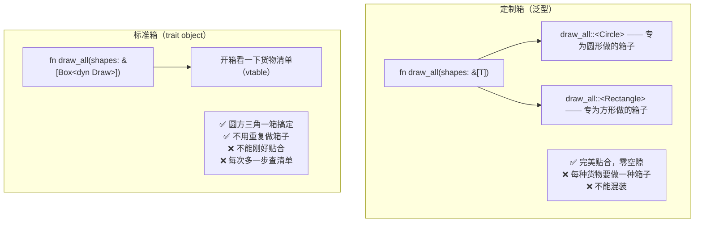
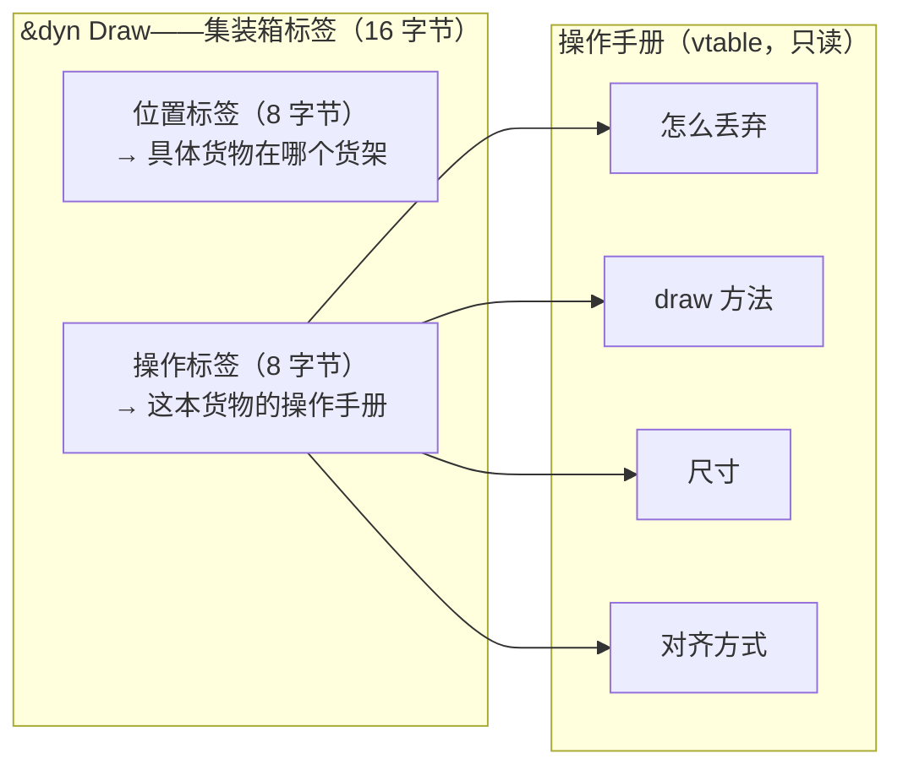

# Rust Box\<dyn\>：从泛型到 trait 对象，理解动态分发

> 本文基于 Rust 1.96。

## 一句话回答

`Box<dyn Trait>` 是 Rust 做动态分发的方式。把它想成**国际物流中的标准集装箱**。

泛型（`<T: Trait>`）就像给每种货物定做专用箱子——圆形的做圆箱、方形的做方箱。很快、很贴合，但每来一种新货物就要造一种新箱子，而且不同形状的箱子不能摞在一起。

`Box<dyn Trait>` 就是标准集装箱——里面装圆的好还是方的好无所谓，集装箱尺寸是统一的。搬运工不需要知道里面是什么，只需要知道「把这个箱子吊上船就行」。代价是多了一步「查一下这个集装箱的货物清单」，也就是虚表（vtable）查找。

如果你写过 Java/C++，trait object ≈ Java 的 interface 引用 / C++ 的虚函数 + `unique_ptr<Base>`。但 Rust 还多了一层限制：不是所有 trait 都能当 trait object——有些货物形状太奇怪，放不进标准箱。这就是「对象安全」——本篇会讲清楚。

## 泛型的局限：为什么需要 trait object

泛型在编译期单态化（monomorphization）——编译器为每个具体类型生成一份副本：

```rust
// 泛型——给每种货物定做箱子
fn draw_static<T: Draw>(shapes: &[T]) {
    for shape in shapes {
        shape.draw();
    }
}

// 编译器生成的伪代码（单态化）——圆箱、方箱、三角箱各做一种
fn draw_static_Circle(shapes: &[Circle]) { ... }
fn draw_static_Rectangle(shapes: &[Rectangle]) { ... }
fn draw_static_Triangle(shapes: &[Triangle]) { ... }
```

问题是：

```rust
// ❌ 编译错误：所有货物必须装进同一种箱子
let shapes: Vec<???> = vec![
    Circle::new(10.0),
    Rectangle::new(5.0, 3.0),
    Triangle::new(3.0, 4.0, 5.0),
];
```

`Vec<T>` 要求所有元素类型一致——泛型没法把不同形状的货物放进同一排货架。这就是 trait object 存在的意义——标准集装箱。

```rust
// ✅ trait object——不管什么形状，统一装箱
let shapes: Vec<Box<dyn Draw>> = vec![
    Box::new(Circle::new(10.0)),
    Box::new(Rectangle::new(5.0, 3.0)),
    Box::new(Triangle::new(3.0, 4.0, 5.0)),
];

for shape in &shapes {
    shape.draw(); // 运行时查一下货物清单，再搬运
}
```

## `dyn` 是什么

`dyn Trait` 声明的意思是：**「这是一个用标准集装箱运输的 trait 对象」**。

Rust 2015 里可以不写 `dyn`——`Box<Trait>` 也能工作。Rust 2018 开始要求显式写 `Box<dyn Trait>`，去掉 `dyn` 会有警告。到了 Rust 2021，`dyn` 是强制的。加上 `dyn` 的好处是读代码时一眼就能分清用的是定制箱还是标准箱：

```rust
fn static_dispatch<T: Draw>(t: &T) { t.draw(); }     // 定制箱，出厂前就装好了
fn dynamic_dispatch(t: &dyn Draw) { t.draw(); }        // 标准箱，运到码头再开箱
```

## 静态分发 vs 动态分发——定制箱 vs 标准箱



用一个实际例子对比：

```rust
trait Animal {
    fn sound(&self) -> &'static str;
}

struct Dog;
impl Animal for Dog {
    fn sound(&self) -> &'static str { "汪汪" }
}

struct Cat;
impl Animal for Cat {
    fn sound(&self) -> &'static str { "喵喵" }
}

// 定制箱：编译期为 Dog 和 Cat 各做一种箱子
fn announce_static<T: Animal>(animal: &T) {
    println!("{}", animal.sound());
}

// 标准箱：运行时查看货物清单
fn announce_dynamic(animal: &dyn Animal) {
    println!("{}", animal.sound());
}

fn main() {
    let dog = Dog;
    let cat = Cat;

    // 定制箱——装狗的就是狗箱，装猫的就是猫箱
    announce_static(&dog);
    announce_static(&cat);

    // 标准箱——都装进统一尺寸的箱子
    announce_dynamic(&dog as &dyn Animal);
    announce_dynamic(&cat as &dyn Animal);
}
```

## 内存布局：集装箱标签

`&dyn Trait` 不是一个普通指针——它是个**胖指针**（fat pointer），就像集装箱上贴的标签：不只告诉你箱子在哪，还告诉你里面是什么、怎么处理。



```rust
use std::mem;

fn main() {
    let s: &str = "hello";
    println!("&str: {} 字节", mem::size_of_val(&s)); // 16 字节——位置+长度

    let slice: &[i32] = &[1, 2, 3];
    println!("&[i32]: {} 字节", mem::size_of_val(&slice)); // 16 字节——位置+长度

    let trait_obj: &dyn std::fmt::Display = &42;
    println!("&dyn Display: {} 字节", mem::size_of_val(&trait_obj)); // 16 字节——位置+操作手册
}
```

胖指针 = 数据指针 + 类型元数据。`&str` 加长度，`&[T]` 加长度，`&dyn Trait` 加 vtable 指针（操作手册地址）。每次通过 trait object 调用方法，都会先查操作手册再按步骤操作——这就是动态分发的「多一步标签查看」。

## 为什么是 `Box<dyn>` 而不是 `&dyn`

```rust
// ❌ 借用——像从别人那里借集装箱临时用一下，随时要还
fn make_shapes<'a>() -> Vec<&'a dyn Draw> { ... } // 谁拥有这些箱子？

// ✅ Box 拥有数据——像自己买了个集装箱，想存多久存多久
fn make_shapes() -> Vec<Box<dyn Draw>> { ... }
```

除了 `Box`，`Rc<dyn Trait>` 和 `Arc<dyn Trait>` 也常用——就像几个仓库共享同一个集装箱：

```rust
use std::rc::Rc;
use std::sync::Arc;

// 单线程共享——同一个仓库内部流转
let shapes: Vec<Rc<dyn Draw>> = vec![
    Rc::new(Circle::new(10.0)),
    Rc::new(Circle::new(5.0)),  // Rc 允许多个仓库管理员都有钥匙
];

// 多线程共享——跨仓库、跨城市流转
let shapes: Vec<Arc<dyn Draw + Send + Sync>> = vec![
    Arc::new(Circle::new(10.0)),
];
```

## 对象安全：不是所有货物都能装进标准箱

这是 trait object 最大的限制。如果一个 trait 有这些方法，就不能用作 `dyn Trait`：

```rust
// ❌ 不能装进标准箱——克隆方法返回 Self，装进去后不知道克隆出来的是啥
trait Clone {
    fn clone(&self) -> Self; // 返回 Self——标签上写的「按原样复制一份」
    // 但标准箱尺寸固定，克隆出来的尺寸不一致就没法保证
}

// ❌ 不能装进标准箱——有泛型方法
trait Parser {
    fn parse<T: FromStr>(&self, s: &str) -> Result<T, T::Err>;
    //    ^ 泛型参数——操作手册上每一页都写着不同的搬运方式
    // 没法预先把所有搬运方式印上去
}
```

要使用 trait object，trait 的所有方法必须满足——就像能装进标准箱的货物必须满足两个条件：

1. 结果不依赖具体类型（返回值不是 `Self`）
2. 方法参数不随类型变化（没有泛型参数）

```rust
// ✅ 可以装进标准箱
trait Draw {
    fn draw(&self);                    // 不返回 Self——不管什么形状，画出来就行
    fn area(&self) -> f64;            // 返回具体类型——面积就是个数字
}

// ✅ 改造后可以装进标准箱——把泛型换成统一接口
trait Parser {
    fn parse(&self, s: &str) -> Result<Box<dyn Any>, Box<dyn Error>>;
    //             ^^^^^^^^^  ^^^^^^^^^^——不用泛型，用 trait object
    // 就像把「每种货物配一种标签」改成「统一用标准标签」
}
```

编译器会帮你检查——如果 trait 不是对象安全的，写 `&dyn Trait` 时会直接报错：

```rust
// 编译错误：the trait `Clone` cannot be made into an object
let _: &dyn Clone = &42;
```

## 实战场景——集装箱物流的三大应用

### 场景一：可扩展的插件系统——多式联运

```rust
trait Plugin {
    fn name(&self) -> &str;
    fn execute(&self, input: &str) -> anyhow::Result<String>;
}

// 插件注册表——物流调度中心
struct PluginRegistry {
    plugins: Vec<Box<dyn Plugin>>,
}

impl PluginRegistry {
    fn new() -> Self {
        Self { plugins: Vec::new() }
    }

    fn register(&mut self, plugin: Box<dyn Plugin>) {
        println!("注册插件: {}", plugin.name());
        self.plugins.push(plugin);
    }

    fn run_all(&self, input: &str) -> Vec<anyhow::Result<String>> {
        self.plugins
            .iter()
            .map(|p| p.execute(input))
            .collect()
    }
}

// 不同的物流公司可以用同一套标准箱——不需要改调度中心代码
struct UpperCasePlugin;
impl Plugin for UpperCasePlugin {
    fn name(&self) -> &str { "uppercase" }
    fn execute(&self, input: &str) -> anyhow::Result<String> {
        Ok(input.to_uppercase())
    }
}

struct ReversePlugin;
impl Plugin for ReversePlugin {
    fn name(&self) -> &str { "reverse" }
    fn execute(&self, input: &str) -> anyhow::Result<String> {
        Ok(input.chars().rev().collect())
    }
}

fn main() {
    let mut registry = PluginRegistry::new();
    registry.register(Box::new(UpperCasePlugin));
    registry.register(Box::new(ReversePlugin));

    for result in registry.run_all("hello") {
        println!("{:?}", result);
    }
}
```

加一个新插件只需要实现 `Plugin` trait，不需要修改 `PluginRegistry`。这就是「开闭原则」——对扩展开放，对修改关闭，就像物流行业不需要为每一种新货物重新设计港口。

### 场景二：类型擦除——快递的通用包装

```rust
use std::fmt::Debug;

// 可以存任何实现了 Debug + Send + 'static 的类型
// 就像快递站可以收任何包裹，只要贴了标签就能送
struct LogEntry {
    timestamp: chrono::DateTime<chrono::Utc>,
    payload: Box<dyn Any + Send + 'static>, // 不管里面是什么，统一包装
}

impl LogEntry {
    fn new(payload: impl Any + Send + 'static) -> Self {
        Self {
            timestamp: chrono::Utc::now(),
            payload: Box::new(payload),
        }
    }

    // 收件人打开包裹确认具体类型
    fn downcast_ref<T: Any>(&self) -> Option<&T> {
        self.payload.downcast_ref::<T>()
    }
}

#[derive(Debug)]
struct PaymentEvent {
    amount: f64,
    currency: String,
}

fn main() {
    let entry = LogEntry::new(PaymentEvent {
        amount: 100.0,
        currency: "CNY".into(),
    });

    // 确认收货
    if let Some(event) = entry.downcast_ref::<PaymentEvent>() {
        println!("支付事件: {:?}", event);
    }
}
```

### 场景三：全局错误类型——统一运输 Any cargo

anyhow 的核心就是 `Box<dyn Error>` 的变体——就像物流公司说的「什么都能运」：

```rust
// anyhow 内部的简化版——万能集装箱
type Error = Box<dyn std::error::Error + Send + Sync + 'static>;

fn fallible_ops() -> Result<(), Box<dyn std::error::Error + Send + Sync>> {
    let _file = std::fs::read_to_string("config.toml")?; // io::Error——易碎品
    let _num: i32 = "42".parse()?;                        // ParseIntError——液体
    // 两种不同的错误类型，都能通过 Box<dyn Error> 传播——统一装箱运输
    Ok(())
}
```

## 选择指南——发快递还是定做箱子？

| 场景 | 选 | 原因 |
|------|-----|------|
| 编译期就知道所有类型 | 定制箱 `<T: Trait>` | 零空隙，贴合最优 |
| 需要异构集合 | `Vec<Box<dyn Trait>>` | 唯一选择——标准箱是唯一能混装的方案 |
| 写库，类型留给调用者 | 定制箱 `<T: Trait>` | 调用者知道自己的货物尺寸 |
| 插件系统 | 标准箱 `Box<dyn Trait>` | 运行时注册，来什么装什么 |
| 减小二进制体积 | 标准箱 `dyn Trait` | 不会为每种货物做一种箱子 |
| 内部闭包存储 | 标准箱 `Box<dyn FnOnce()>` | 闭包类型不可命名——形状千奇百怪 |

一条实用准则：**能用定制箱就用定制箱**。泛型是 Rust 的默认选择——更安全、更快、编译器能帮你验证更多。只有定制箱做不到的时候——异质集合、运行时多态、类型不可知——才用标准箱。

## 小结

`Box<dyn Trait>` 的三个要点，用集装箱来记：

1. **胖指针**——集装箱标签：位置 + 操作手册，16 字节。每次调用多一步标签查询
2. **对象安全**——不是所有货物都能装进标准箱：形状太奇怪（返回 `Self`）或搬运方式太多变（泛型方法）的不行，编译器会拦住
3. **选择**——编译期能确定类型用定制箱（泛型），运行期才确定或用异质集合用标准箱（trait object）

**返回：** [Rust 笔记](index.md)
