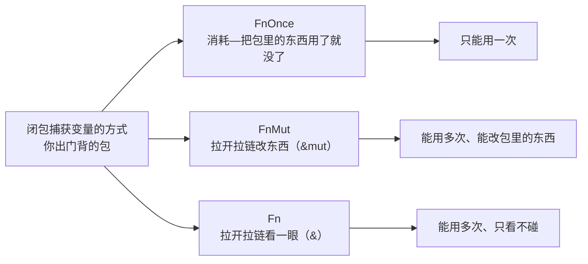

# Rust 闭包：FnOnce、FnMut、Fn 的区别——一个背包就讲清楚了

> 本文基于 Rust 1.96+（2024 edition）。

## 一个问题引出三种背包模式

把一个函数带出门，就像背一个背包出门。包里装着它从外面捕获的变量——也就是它需要用到的东西。

```rust
let mut v = vec![1, 2, 3];

// 闭包 1：只看一眼包里的东西
let print = || println!("{:?}", v);
print();  // OK

// 闭包 2：想往包里塞东西
let mut push = || v.push(4);  // ❌ 编译不过
//              error: cannot borrow `v` as mutable because
//              it is also borrowed as immutable
```

为什么第一个闭包能用，第二个报错？因为 Rust 为每个闭包**自动选择**了一种背包模式。这段代码中 `print` 只是拉开拉链看了一眼包里的 `v`（不可变引用），而 `push` 想往包里塞东西（可变引用）——两者冲突。但这个错误提示也暴露了三种不同的背包模式：



这三种 trait 的关系，就像背包的不同型号：

```rust
// 标准库中的定义（简化）
pub trait FnOnce<Args> {
    type Output;
    fn call_once(self, args: Args) -> Self::Output;
    //           ^^^^ 背包被整个消耗——只能用一次
}

pub trait FnMut<Args>: FnOnce<Args> {
    fn call_mut(&mut self, args: Args) -> Self::Output;
    //           ^^^^^^^^ 背包拉开拉链——可以用多次、能改里面东西
}

pub trait Fn<Args>: FnMut<Args> {
    fn call(&self, args: Args) -> Self::Output;
    //       ^^^^ 背包隔着看——可以用多次、只看不碰
}
```

关键理解：**`Fn` 是 `FnMut` 的升级版，`FnMut` 是 `FnOnce` 的升级版。** 如果你的背包是 `Fn` 型号，那它也能当 `FnMut` 和 `FnOnce` 用。反过来说：凡是收 `FnOnce` 的地方，三种背包都能背进去；收 `FnMut` 的地方，`Fn` 和 `FnMut` 能进，`FnOnce` 不行（因为 `FnOnce` 只能用一次，但收件人可能想用多次）。

## Rust 怎么决定闭包用哪个背包

不是你在代码里写 `impl Fn()`——是编译器根据闭包**怎么用包里的东西**自动决定：

```rust
let s = String::from("hello");

// 拉开拉链看一眼 → 给你 Fn（也能当 FnMut、FnOnce 用）
let only_read = || println!("{}", s);
//              编译器: s 只被 & 引用 → 给 Fn

let mut v = vec![1, 2, 3];

// 拉开拉链往里面塞东西 → 给你 FnMut（也能当 FnOnce 用）
let mut mutate = || v.push(4);
//              编译器: v 被 &mut 引用 → 给 FnMut

// 把包里的东西拿出来用了，塞不回去了 → 只给 FnOnce
let consume = || drop(s);
//            编译器: s 被 move 了 → 只给 FnOnce
```

### 验证：看看 move 关键字的影响

```rust
let s = String::from("hello");

// 没有 move：拉开拉链看一眼（&s 不可变借用）
let just_read = || println!("{}", s);    // impl Fn + FnMut + FnOnce

// 有 move：把 s 放到自己背包里
let moved = move || println!("{}", s);   // 仍是 impl Fn——因为 println! 不消耗 s
```

`move` 关键字**不改变闭包实现了哪个背包型号**。它只改变所有权的归属——即使加了 `move`，如果闭包体不消耗捕获的变量，它仍然实现 `Fn`。`move` 只是把东西从外部口袋放到了闭包的内部口袋里，但拉开拉链看还是看。

## 三种背包在 API 中的实际用途

### FnOnce：背一个只能用一次的工具

```rust
// thread::spawn 要求 FnOnce + Send + 'static
let msg = String::from("hello from thread");
std::thread::spawn(move || {
    println!("{}", msg);   // msg 被放进了新线程的包里
});
// msg 在这里拿不出来了——已经被装进背包带走了
```

`thread::spawn` 签名：

```rust
pub fn spawn<F, T>(f: F) -> JoinHandle<T>
where
    F: FnOnce() -> T + Send + 'static,
    T: Send + 'static,
```

为什么是 `FnOnce`？因为新线程只背一次这个包——`FnOnce` 是最大号的背包（所有闭包都能塞进去），给了调用方最大的自由度。

### FnMut：拉开拉链，每次往里塞点不一样的

```rust
// Iterator::map 需要 FnMut
let mut counter = 0;
let incremented: Vec<_> = (1..5).map(|x| {
    counter += 1;              // &mut counter——拉开拉链改计数器
    x + counter
}).collect();
println!("{:?}", incremented);  // [2, 4, 6, 8]
```

`Iterator::map` 签名：

```rust
fn map<B, F>(self, f: F) -> Map<Self, F>
where
    F: FnMut(Self::Item) -> B,
```

为什么是 `FnMut` 而不是 `FnOnce`？因为 `map` 对迭代器中的**每个元素**都要拉开一次背包——不能只拉开一次就拉不上。

### Fn：只看不碰，随便看多少次

```rust
// Vec::sort_by_key 只需要 FnMut，但如果你的闭包是 Fn，也可以
let mut items = vec![3, 1, 4, 1, 5];
items.sort_by_key(|&x| x);     // |&x| x 纯看——不碰包里别的东西 → Fn
```

实际上大多数标准库 API 接受 `FnOnce` 或 `FnMut`——`Fn` 反而少见，因为它要求包里不能装任何需要动手脚的东西。

## 实战：写一个检查背包的函数

```rust
// 接受 FnOnce——最大号背包，三种都能装
fn execute_once<F>(f: F)
where
    F: FnOnce() -> String,
{
    let result = f();
    println!("执行结果: {}", result);
}

// 接受 FnMut——拉开拉链三次，每次可能改包里东西
fn execute_thrice<F>(mut f: F)
where
    F: FnMut() -> String,
{
    println!("第 1 次: {}", f());
    println!("第 2 次: {}", f());
    println!("第 3 次: {}", f());
}

// 使用
let s = String::from("hello");
execute_once(|| s.clone());     // Fn 背包 → OK（Fn 也能当 FnOnce 用）
execute_once(move || s);        // FnOnce 背包 → OK（刚好用一次）

let mut count = 0;
execute_thrice(|| {
    count += 1;                 // FnMut 背包——每次拉开拉链改计数器
    format!("第 {} 次", count)
});
// 输出:
// 第 1 次: 第 1 次
// 第 2 次: 第 2 次
// 第 3 次: 第 3 次
```

### 选哪个背包


一个经验法则：**除非你确定背包要拉开多次而且只看不碰，否则用 FnOnce**。

## 闭包和帆布包（函数指针）的区别

```rust
fn add_one(x: i32) -> i32 { x + 1 }       // 一个空手出门的函数

// 函数指针不背包——可以当作 fn 类型传递
let f: fn(i32) -> i32 = add_one;

// 闭包背了包——里面有从外面捕获的东西
let n = 1;
let closure = |x: i32| x + n;   // 类型: [closure@...]，不是 fn（包里装着 n）

// 但如果你出门什么都不带，闭包可以自动当成函数指针用
let non_capturing = |x: i32| x + 1;   // 可以强制为 fn(i32) -> i32
```

```rust
// 只收空手的——只能传什么都不带的闭包和普通函数
fn apply_fn(f: fn(i32) -> i32, x: i32) -> i32 { f(x) }

// 收背包的——三种都能传
fn apply_closure<F: Fn(i32) -> i32>(f: F, x: i32) -> i32 { f(x) }

apply_fn(|x| x + 1, 5);      // OK——空手
// apply_fn(|x| x + n, 5);   // ❌——包里装了 n

apply_closure(|x| x + n, 5); // OK
```

## 一个真实场景：用背包包装重试逻辑

```rust
fn with_retry<F, T, E>(mut f: F, max_attempts: usize) -> Result<T, E>
where
    F: FnMut() -> Result<T, E>,
{
    let mut last_err = None;
    for attempt in 1..=max_attempts {
        match f() {
            Ok(v) => return Ok(v),
            Err(e) => {
                eprintln!("第 {attempt} 次失败，重试中...");
                last_err = Some(e);
                std::thread::sleep(std::time::Duration::from_secs(1));
            }
        }
    }
    Err(last_err.unwrap())
}

// 使用——背着一个网络请求，失败了就重试
let result = with_retry(
    || reqwest::blocking::get("https://api.example.com/data")
        .and_then(|r| r.error_for_status()),
    3
);
```

`FnMut` 在这里是必需的——每次重试都要重新拉开背包拿出请求来接。不能是 `Fn`（因为每次调的东西不同），也不只是 `FnOnce`（因为要调多次）。

## 小结

Rust 闭包不是语法糖——是编译器自动生成了一个实现了 `FnOnce` / `FnMut` / `Fn` 的匿名背包。三个关键点：

1. **编译器根据你怎么用包里的东西自动选背包型号**——只看不碰 → `Fn`，拉开改东西 → `FnMut`，用完就扔 → `FnOnce`
2. **`Fn` ⊂ `FnMut` ⊂ `FnOnce`**——收 `FnOnce` 的地方兼容性最好
3. **如果你的函数只用一次背来的东西，用 `FnOnce` 约束**——给调用方最大自由度

这三条规则不讲明白，Rust 的闭包编译器报错会让人摸不着头脑。讲明白了，你会发现这是 Rust 所有权系统在闭包上的自然延伸——**一个装了可变引用的背包，不可能同时背在两个人身上**。

**返回：** [Rust 笔记](index.md)
