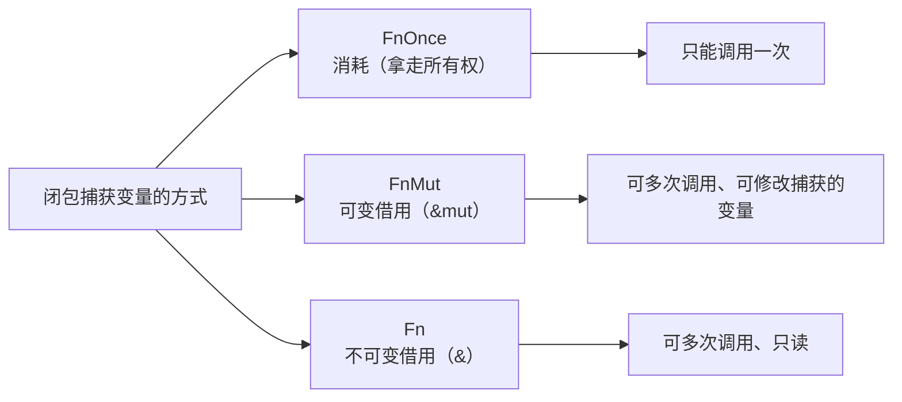
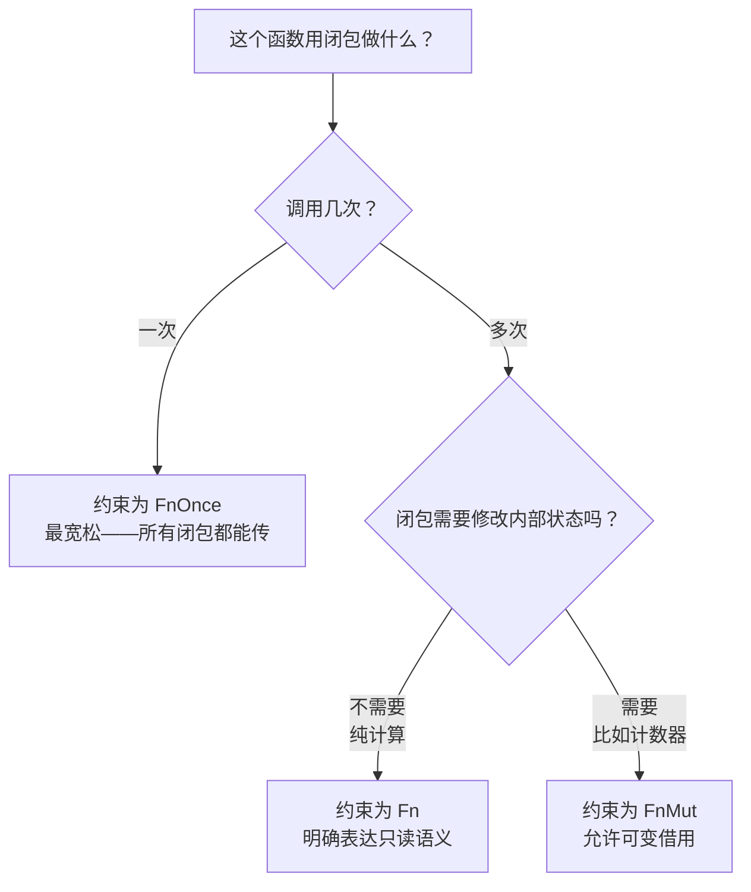

# Rust 闭包：FnOnce、FnMut、Fn 的区别，以及为什么你需要知道

> 本文基于 Rust 1.85+（2024 edition）。

## 一个问题引出三种 trait

```rust
let mut v = vec![1, 2, 3];

// 闭包 1：只读
let print = || println!("{:?}", v);
print();  // OK

// 闭包 2：修改
let mut push = || v.push(4);  // ❌ 编译不过
//              error: cannot borrow `v` as mutable because
//              it is also borrowed as immutable
```

为什么第一个闭包能用，第二个报错？因为 Rust 为每个闭包**自动选择**了一个 trait 来实现。这段代码中 `print` 借用了 `v` 的不可变引用，而 `push` 需要可变引用——两者冲突。但这个错误提示也暴露了三个不同的 trait：



这三个 trait 的关系：

```rust
// 标准库中的定义（简化）
pub trait FnOnce<Args> {
    type Output;
    fn call_once(self, args: Args) -> Self::Output;
    //           ^^^^ 消耗 self——只能调一次
}

pub trait FnMut<Args>: FnOnce<Args> {
    fn call_mut(&mut self, args: Args) -> Self::Output;
    //           ^^^^^^^^ &mut self——可多次调、可修改
}

pub trait Fn<Args>: FnMut<Args> {
    fn call(&self, args: Args) -> Self::Output;
    //       ^^^^ &self——可多次调、只读
}
```

关键理解：**`Fn` 是 `FnMut` 的子 trait，`FnMut` 是 `FnOnce` 的子 trait**。如果你有一个 `Fn` 闭包，它也是 `FnMut` 和 `FnOnce`。反过来说：能接受 `FnOnce` 的地方，三种闭包都能传；能接受 `FnMut` 的地方，`Fn` 和 `FnMut` 能传，`FnOnce` 不行。

## Rust 怎么决定闭包实现哪个 trait

不是你在代码里写 `impl Fn()`——是编译器根据闭包**捕获变量的方式**自动决定：

```rust
let s = String::from("hello");

// 只读引用 → 实现 Fn + FnMut + FnOnce
let only_read = || println!("{}", s);
//              编译器: s 只被 & 引用 → 给 Fn

let mut v = vec![1, 2, 3];

// 可变引用 → 实现 FnMut + FnOnce（但不会有 Fn）
let mut mutate = || v.push(4);
//              编译器: v 被 &mut 引用 → 给 FnMut

// 拿走所有权 → 只实现 FnOnce
let consume = || drop(s);
//            编译器: s 被 move 了 → 只给 FnOnce
```

### 验证：看看 move 关键字的影响

```rust
let s = String::from("hello");

// 没有 move：只是 &s（不可变借用）
let just_read = || println!("{}", s);    // impl Fn + FnMut + FnOnce

// 有 move：s 被移动到闭包内部
let moved = move || println!("{}", s);   // 仍是 impl Fn——因为 println! 不消耗 s
```

`move` 关键字**不改变闭包实现了哪个 trait**。它只改变所有权——即使加了 `move`，如果闭包体不消耗捕获的变量，它仍然实现 `Fn`。

## 三种 trait 在 API 中的实际用途

### FnOnce：传一个可以消耗环境的任务

```rust
// thread::spawn 要求 FnOnce + Send + 'static
let msg = String::from("hello from thread");
std::thread::spawn(move || {
    println!("{}", msg);   // msg 被 move 进闭包
});
// msg 在这里不可用——已经被 move 了
```

`thread::spawn` 签名：

```rust
pub fn spawn<F, T>(f: F) -> JoinHandle<T>
where
    F: FnOnce() -> T + Send + 'static,
    T: Send + 'static,
```

为什么是 `FnOnce`？因为新线程只执行一次这个闭包——`FnOnce` 是最高级别的约束（所有闭包都满足），给了调用方最大的自由度。

### FnMut：传一个可以被多次调用、每次可能不同的逻辑

```rust
// Iterator::map 需要 FnMut
let mut counter = 0;
let incremented: Vec<_> = (1..5).map(|x| {
    counter += 1;              // &mut counter——所以是 FnMut
    x + counter
}).collect();
println!("{:?}", incremented);  // [2, 4, 6, 8]
```

`Iterator::map` 签名：

```rust
fn map<B, F>(self, f: F) -> Map<Self, F>
where
    F: FnMut(Self::Item) -> B,
```

为什么是 `FnMut` 而不是 `FnOnce`？因为 `map` 对迭代器中的**每个元素**调用闭包——不能只调一次就消耗掉。

### Fn：传一个纯计算、可以反复调用的逻辑

```rust
// Vec::sort_by_key 只需要 FnMut，但如果你的闭包是 Fn，也可以
let mut items = vec![3, 1, 4, 1, 5];
items.sort_by_key(|&x| x);     // |&x| x 是纯计算 → Fn
```

实际上大多数标准库 API 接受 `FnOnce` 或 `FnMut`——`Fn` 约束反而少见，因为它太严格。

## 实战：写一个接受闭包的函数

```rust
// 接受 FnOnce——最宽松，三种都能传
fn execute_once<F>(f: F)
where
    F: FnOnce() -> String,
{
    let result = f();
    println!("执行结果: {}", result);
}

// 接受 FnMut——可以多次调，允许闭包有内部状态
fn execute_thrice<F>(mut f: F)
where
    F: FnMut() -> String,
{
    println!("第 1 次: {}", f());
    println!("第 2 次: {}", f());
    println!("第 3 次: {}", f());
}

// 使用
let s = String::from("hello");
execute_once(|| s.clone());     // Fn 闭包 → OK（Fn 也是 FnOnce）
execute_once(move || s);        // FnOnce 闭包 → OK

let mut count = 0;
execute_thrice(|| {
    count += 1;                 // FnMut 闭包
    format!("第 {} 次", count)
});
// 输出:
// 第 1 次: 第 1 次
// 第 2 次: 第 2 次
// 第 3 次: 第 3 次
```

### 选择哪个约束



一个经验法则：**除非你确定闭包需要被调多次且必须是纯计算，否则用 FnOnce**。

## 闭包和函数指针的区别

```rust
fn add_one(x: i32) -> i32 { x + 1 }       // 函数指针

// 函数指针不捕获环境——可以作为 fn 类型传递
let f: fn(i32) -> i32 = add_one;

// 闭包捕获了环境——不是 fn 类型
let n = 1;
let closure = |x: i32| x + n;   // 类型: [closure@...]，不是 fn

// 但非捕获闭包可以自动转成 fn
let non_capturing = |x: i32| x + 1;   // 可以强制为 fn(i32) -> i32
```

```rust
// 接受函数指针——只能传非捕获闭包和函数
fn apply_fn(f: fn(i32) -> i32, x: i32) -> i32 { f(x) }

// 接受闭包——三种都能传
fn apply_closure<F: Fn(i32) -> i32>(f: F, x: i32) -> i32 { f(x) }

apply_fn(|x| x + 1, 5);      // OK——非捕获
// apply_fn(|x| x + n, 5);   // ❌——捕获了 n

apply_closure(|x| x + n, 5); // OK
```

## 一个真实场景：用闭包包装重试逻辑

```rust
fn with_retry<F, T, E>(mut f: F, max_attempts: usize) -> Result<T, E>
where
    F: FnMut() -> Result<T, E>,
{
    let mut last_err = None;
    for attempt in 1..=max_attempts {
        match f() {
            Ok(v) => return Ok(v),
            Err(e) => {
                eprintln!("第 {attempt} 次失败，重试中...");
                last_err = Some(e);
                std::thread::sleep(std::time::Duration::from_secs(1));
            }
        }
    }
    Err(last_err.unwrap())
}

// 使用——一个可能不稳定的网络请求
let result = with_retry(
    || reqwest::blocking::get("https://api.example.com/data")
        .and_then(|r| r.error_for_status()),
    3
);
```

`FnMut` 在这里是必需的——`reqwest::blocking::get` 可能拿不到相同的 response 对象（每次调闭包都发新请求），所以不能是 `Fn`。但它也不需要消耗环境，`FnOnce` 太宽松（只调一次会掩盖"可能重试多次"的语义）。

## 小结

Rust 闭包不是语法糖——是编译器自动生成了一个实现了 `FnOnce` / `FnMut` / `Fn` 的匿名结构体。三个关键点：

1. **编译器根据捕获方式自动选 trait**——只读 → `Fn`，可变借用 → `FnMut`，消耗 → `FnOnce`
2. **`Fn` ⊂ `FnMut` ⊂ `FnOnce`**——能接受 `FnOnce` 的地方兼容性最好
3. **如果你的函数只调一次闭包，用 `FnOnce` 约束**——给调用方最大自由度

这三条规则不讲明白，Rust 的闭包编译器报错会让人摸不着头脑。讲明白了，你会发现这是 Rust 所有权系统在闭包上的自然延伸——**一个捕获了可变引用的闭包，不可能同时被多个地方持有**。
