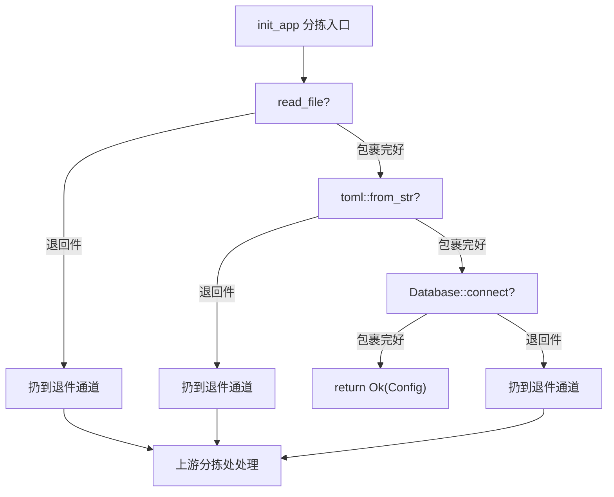
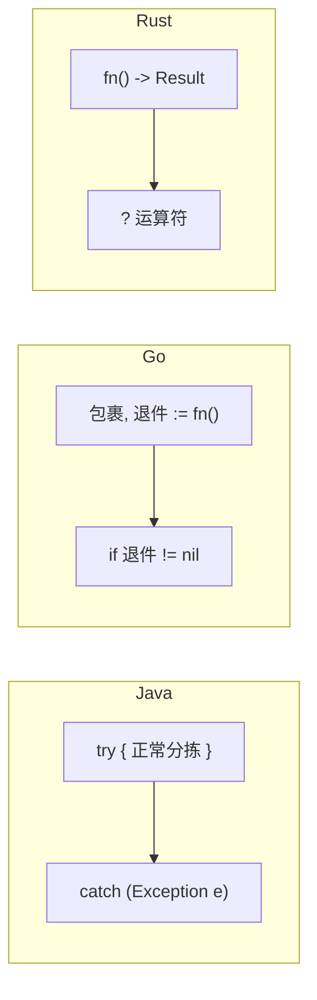

# Rust 错误处理：用「快递分拣」一次讲清 Result、Option 和 ? 运算符

> 本文基于 Rust 1.96。

Java 有 try-catch 和 null。Go 有 `if err != nil`。Rust 没有异常，没有 null——错误处理全在快递分拣系统里，分拣员（编译器）替你检查。

## Option：有没有你的包裹

想象你是一个快递分拣员。有人在系统里查一个快递单号——结果有两种：要么包裹确实在仓库里（`Some`），要么压根没有这个单号（`None`）。

```rust
fn find_user(id: u32) -> Option<String> {
    if id == 0 {
        None          // 没这个包裹
    } else {
        Some(format!("user_{id}"))  // 包裹在这，你拿好
    }
}

let user = find_user(1);
match user {
    Some(name) => println!("找到包裹：{name}"),
    None => println!("这个单号不存在"),
}
```

分拣员**必须**处理这两种可能——你不可能不拆开快递箱就把里面的东西拿走。不存在王安全」（null pointer exception）。

简化写法：

```rust
let name = find_user(1).unwrap_or("anonymous".to_string());

// 或者直接拆箱（开发阶段用）
let name = find_user(1).unwrap();
```

## Result：快递要么到了要么被退回

`Option` 只管有没有这个单号，`Result` 管快递是成功到达（`Ok`）还是被退回（`Err`）：

```rust
use std::fs;

fn read_config(path: &str) -> Result<String, std::io::Error> {
    fs::read_to_string(path)  // Ok(包裹内容) 或 Err(退回原因)
}

match read_config("config.toml") {
    Ok(content) => println!("包裹内容：{content}"),
    Err(e) => eprintln!("包裹被退回：{e}"),
}
```

`Result<T, E>` 有两个标签——`T` 是正常包裹的标签，`E` 是退回单的标签。不像异常那样看不清一个函数会抛出什么，`Result` 把退回单的写法写在了快递面单上。

## ?：分拣流水线——退回件直接往下传

Go 的分拣线需要三步检查一个退回件：

```go
content, err := readConfig("config.toml")
if err != nil {
    return "", err
}
```

Rust 的流水线用 `?` 一步到位：

```rust
fn load() -> Result<String, std::io::Error> {
    let content = read_config("config.toml")?;  // 收到退回件直接往下传
    Ok(content)
}
```

`?` 等价于分拣员的手动操作：

```rust
let content = match read_config("config.toml") {
    Ok(v) => v,              // 包裹完好，拆开拿出内容
    Err(e) => return Err(e.into()),  // 退回件？直接扔回退件传送带
};
```

多个 `?` 连在一起，流水线看起来像没有分拣环节：

```rust
fn init_app() -> Result<Config, Box<dyn Error>> {
    let content = read_file("config.toml")?;
    let config: Config = toml::from_str(&content)?;
    let db = Database::connect(&config.db_url)?;
    Ok(Config { db, ... })
}
```

四段传送带，任意一段收到退回件都自动扔到退件通道。没有嵌套的 if，没有隐藏的控制流。

## 分拣流程图



每一步的 `?` 都是一个分拣分叉口——包裹完好往下走，退回件直接扔传送带。流程一目了然。

## 常见分拣工具

`match` 写多了也会啰嗦。标准库提供了一组分拣工具：

```rust
// map：把包裹内容从 A 换成 B（不拆箱）
let len = read_config("c.toml").map(|s| s.len());

// and_then：包裹完好，继续下一个分拣流程
let db = read_config("c.toml")
    .and_then(|s| parse_config(&s));

// unwrap_or：拆箱，退回件用备用品代替
let content = read_config("c.toml").unwrap_or_default();

// unwrap_or_else：退回件时现场做一个备用品（懒加载）
let content = read_config("c.toml")
    .unwrap_or_else(|_| default_config());

// ok()：Result<T,E> → Option<T>，丢弃退回单上的原因
let maybe = read_config("c.toml").ok();
```

## 对比三种快递系统



| | Java | Go | Rust |
|------|------|------|------|
| 空箱子 | `null` → NPE | `nil` → panic | `Option<T>` → 分拣员检查 |
| 退件处理 | try-catch | `if err != nil` | `Result<T, E>` + `?` |
| 分拣员保证 | checked 异常 | 无 | 强制处理所有退件通道 |
| 性能 | 异常有回溯开销 | 分支跳转 | 零成本——和手写 if-else 一样 |

Java 的 checked exception 能提供分拣员保证，但大部分团队用 unchecked exception 绕过了。Go 的 `if err != nil` 写太多成了噪音。Rust 让退件处理和正常包裹分拣一样简洁——`?` 是不可见的快乐传送带。

## 什么时候用什么包裹

- **箱子可能空的** — `Option<T>`，如 `HashMap::get()`、`Vec::first()`
- **分拣可能出问题** — `Result<T, E>`，如文件读写、网络请求、解析
- **拆不了的死包裹** — `panic!`，如数组越界、除零——应该是 bug
- **快速原型** — `unwrap()` / `expect()`，遇到退件直接炸仓库，正式代码再替换

`unwrap()` 和 `expect()` 写了就别留在生产包裹里——它们是"我知道这个包裹绝对不会是退回件"的声明，分拣员信你，但如果真的是退回件，仓库就炸了（运行时 panic）。

> 适合有 Java/Go 背景，第一次接触 Rust 错误处理的读者。

**返回：** [Rust 笔记](index.md)
