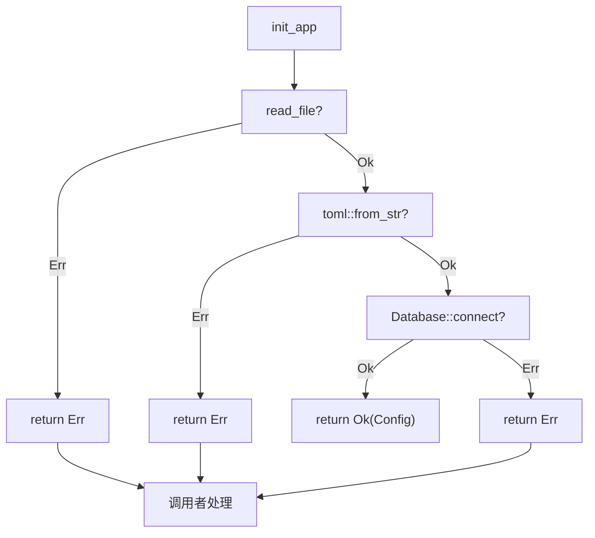
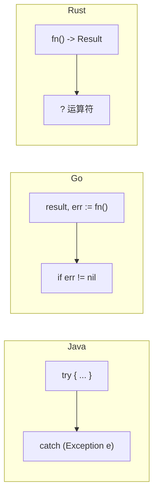

# Rust 错误处理：Result、Option 和 ? 运算符

> 本文基于 Rust 1.85。

Java 有 try-catch 和 null。Go 有 `if err != nil`。Rust 没有异常，没有 null——错误处理全在类型系统里，编译器替你检查。

## Option：没有 null 的世界

```rust
fn find_user(id: u32) -> Option<String> {
    if id == 0 {
        None          // 用户不存在
    } else {
        Some(format!("user_{id}"))  // 找到了
    }
}

let user = find_user(1);
match user {
    Some(name) => println!("找到：{name}"),
    None => println!("用户不存在"),
}
```

调用者**必须**处理两种可能——编译期不会让你直接拿到 `Some` 里的值。不存在运行时 NPE。

简化写法：

```rust
let name = find_user(1).unwrap_or("anonymous".to_string());

// 或者直接 panic（开发阶段用）
let name = find_user(1).unwrap();
```

## Result：错误也是返回值

`Option` 只管有没有，`Result` 管成功还是失败：

```rust
use std::fs;

fn read_config(path: &str) -> Result<String, std::io::Error> {
    fs::read_to_string(path)  // Ok(content) 或 Err(e)
}

match read_config("config.toml") {
    Ok(content) => println!("{content}"),
    Err(e) => eprintln!("读取失败：{e}"),
}
```

`Result<T, E>` 有两个泛型参数——`T` 是成功类型，`E` 是错误类型。不像异常那样看不清函数可能抛出什么，`Result` 把错误类型写在了函数签名上。

## ?：错误传播不用手写 if-else

Go 写三行检查一个错误：

```go
content, err := readConfig("config.toml")
if err != nil {
    return "", err
}
```

Rust 用 `?` 一行搞定：

```rust
fn load() -> Result<String, std::io::Error> {
    let content = read_config("config.toml")?;  // 出错直接向上传播
    Ok(content)
}
```

`?` 等价于：

```rust
let content = match read_config("config.toml") {
    Ok(v) => v,
    Err(e) => return Err(e.into()),  // into() 自动做类型转换
};
```

多个 `?` 连在一起，读起来像没有错误处理：

```rust
fn init_app() -> Result<Config, Box<dyn Error>> {
    let content = read_file("config.toml")?;
    let config: Config = toml::from_str(&content)?;
    let db = Database::connect(&config.db_url)?;
    Ok(Config { db, ... })
}
```

四行代码，任意一步失败都自动 return Err。没有嵌套 if，没有隐藏的控制流。

## 错误传播流程图



每一步的 `?` 都是一个分叉点——Ok 往下继续，Err 直接返回。控制流一目了然。

## 常见组合子

`match` 写多了也会啰嗦。标准库提供了一组组合子：

```rust
// map：把 Ok 里的值换个类型
let len = read_config("c.toml").map(|s| s.len());

// and_then：Ok 时链式调用下一个可能失败的函数
let db = read_config("c.toml")
    .and_then(|s| parse_config(&s));

// unwrap_or：提取值，Err 时给默认值
let content = read_config("c.toml").unwrap_or_default();

// unwrap_or_else：Err 时懒计算默认值
let content = read_config("c.toml")
    .unwrap_or_else(|_| default_config());

// ok()：Result<T,E> → Option<T>，丢弃错误信息
let maybe = read_config("c.toml").ok();
```

## 对比三种语言



| | Java | Go | Rust |
|------|------|------|------|
| 可空值 | `null` → NPE | `nil` → panic | `Option<T>` → 编译检查 |
| 错误处理 | try-catch | `if err != nil` | `Result<T, E>` + `?` |
| 编译器保证 | 检查异常（checked） | 无 | 强制处理所有错误路径 |
| 性能 | 异常有栈回溯开销 | 分支跳转 | 零成本——和手写 if-else 一样 |

Java 的 checked exception 能提供编译期保证，但大部分团队用 unchecked exception 绕过了。Go 的 `if err != nil` 写太多成了噪音。Rust 让错误处理和正常逻辑写起来一样简洁——`?` 是不可见的快乐路径。

## 什么时候用什么

- **值可能没有** — `Option<T>`，如 `HashMap::get()`、`Vec::first()`
- **操作可能失败** — `Result<T, E>`，如文件读写、网络请求、解析
- **不可恢复的错误** — `panic!`，如数组越界、除零——应该是 bug
- **快速原型** — `unwrap()` / `expect()`，失败直接 crash，正式代码再替换

`unwrap()` 和 `expect()` 写了就别留在生产代码里——它们是"我知道这里不会错"的声明，编译器信你，但如果错了就是运行时 panic。

> 适合有 Java/Go 背景，第一次接触 Rust 错误处理的读者。
