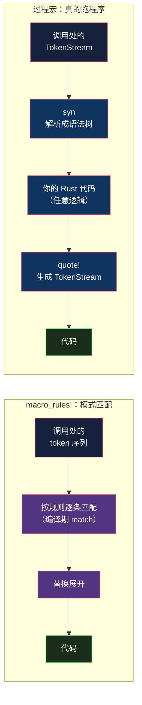
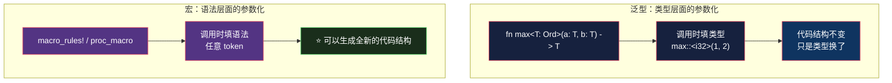
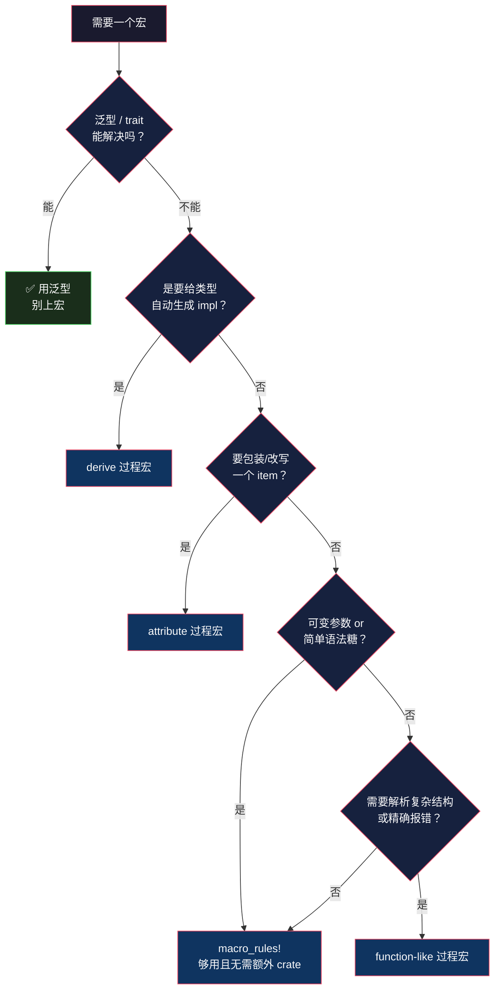

# Rust 宏：macro_rules! 写模式，过程宏写逻辑

> 本文基于 Rust 1.95 稳定版。

## 生活比喻：印章 vs 数控机床

Rust 的两套宏系统，差别不在「谁更强」，而在**你写的到底是什么**：

- **`macro_rules!` 是印章**——你刻好一个图案（**模式**），盖下去就是这个图案。刻的时候是声明式的：「长这个样子的输入，产出那个样子的输出」。中间怎么冲压的，你管不着。
- **过程宏是数控机床**——你写的是**一段真的程序**。它读进原料（TokenStream），跑你的逻辑，吐出成品（TokenStream）。中间想怎么加工都行，因为那就是普通的 Rust 代码。

一句话：**`macro_rules!` 写的是模式，过程宏写的是逻辑。**



上图那条分岔是整个宏系统的分水岭：**左边没有「程序」这一步，右边有。** 后面所有的差异——卫生性、错误信息、编译开销、要不要独立 crate——都是这一步有无带来的连锁反应。

## 为什么需要宏：泛型做不到的三件事

| 需求 | 为什么泛型做不到 |
|------|-----------------|
| **可变参数** | `println!("{} {}", a, b)` 参数个数不定。泛型的参数个数是编译期固定的 |
| **生成新的代码结构** | `#[derive(Debug)]` 要凭空**造出一个 impl 块**。泛型只能参数化已有的类型，造不出新 item |
| **接收任意语法** | `sqlx::query!("SELECT ...")` 直接吃一段 SQL 字面量。泛型只能接收**表达式**，接收不了**语法** |

把这三点收成一句：

> **泛型抽象的是「类型」，宏抽象的是「语法」。**



## 第一套：`macro_rules!` —— 本质是编译期的 match

### 最基本的样子

```rust
macro_rules! say_hello {
    () => {
        println!("你好，宏");
    };
}

say_hello!();   // 你好，宏
```

结构非常固定：`(模式) => { 展开 }`，调用时用 `宏名!(...)`——**那个 `!` 是宏的标志**。忘了写会得到一句挺友好的报错：

```console
error[E0423]: expected function, found macro `say_hello`
  --> app/src/main.rs:42:5
   |
42 |     say_hello();
   |     ^^^^^^^^^ not a function
   |
help: use `!` to invoke the macro
   |
42 |     say_hello!();
   |              +
```

### 关键洞察：这就是个 match

```rust
macro_rules! greet {
    ($name:expr) => {
        println!("你好，{}", $name);
    };
}
```

把这段和 `match` 摆在一起看：

```mermaid
flowchart LR
    subgraph MAC["macro_rules! greet"]
        M1["($name&#58;expr)"] -->|"=&gt;"| M2["println! 展开"]
    end

    subgraph MATCH["match 表达式"]
        C1["Some(x)"] -->|"=&gt;"| C2["处理 x"]
        C3["None"] -->|"=&gt;"| C4["处理空"]
    end

    style M1 fill:#533483,stroke:#e94560,color:#fff
    style M2 fill:#1a2e1b,stroke:#53d769,color:#fff
    style C1 fill:#16213e,stroke:#e94560,color:#fff
    style C2 fill:#1a2e1b,stroke:#53d769,color:#fff
    style C3 fill:#16213e,stroke:#e94560,color:#fff
    style C4 fill:#1a2e1b,stroke:#53d769,color:#fff
```



- `$name:expr` 是**模式**，`=>` 后面是**分支体**
- 多条规则 = 多个 match 分支，**按书写顺序匹配，第一个匹配上的赢**
- 匹配不上 = 编译错误（相当于 match 不穷尽）

**理解了「宏就是 match」，一大半行为就自然了**——包括后面那个难懂的错误信息。

### 片段类型（fragment specifier）

`$name` 后面必须跟一个片段类型，它告诉解析器「这一段按什么语法类别解析」：

| 片段 | 匹配什么 |
|------|---------|
| `expr` | 任意表达式 |
| `ty` | 类型 |
| `ident` | 标识符（变量名、函数名） |
| `tt` | **单个** token tree（最灵活） |
| `pat` | 模式 |
| `stmt` | 语句 |
| `path` | 路径（`std::collections::HashMap`） |
| `item` | 项（`fn` / `struct` / `impl`） |
| `literal` | 字面量 |
| `block` | 块 |
| `vis` | 可见性（`pub`、`pub(crate)`） |
| `lifetime` | 生命周期（`'a`） |

**为什么需要这个？** 因为 Rust 的宏在**解析阶段**就得知道每一段是什么——它没有 Lisp 那种「宏操作已解析 AST」的能力。`$name:expr` 是在给解析器下指令：「从这里开始，按表达式规则解析」。

`expr` 的宽容度值得体会一下：

```rust
greet!("Rust");                  // 你好，Rust
greet!(format!("{}号", 42));      // 你好，42号  ← 表达式可以有嵌套调用
```

### 重复：`$(...),*`

要处理「数量不定」的参数，用重复语法：

```rust
macro_rules! hashmap {
    ($($k:expr => $v:expr),* $(,)?) => {{
        let mut m = HashMap::new();
        $( m.insert($k, $v); )*
        m
    }};
}
```

```console
$ cargo run
hashmap = {"one": 1, "two": 2, "three": 3}
```

三个符号的含义：

| 写法 | 含义 |
|------|------|
| `$( ... )` | 重复组 |
| `$( ... ),*` | 用 `,` 分隔，重复 **0 次或多次** |
| `$( ... ),+` | 同上但至少 1 次 |
| `$(,)?` | 可选的尾逗号（让 `hashmap!{a=>1, b=>2,}` 也能过） |

注意**模式里的 `$(...)` 和展开里的 `$(...)` 是配对的**——展开里的 `$( ... )*` 会把 `$k`/`$v` 按模式里捕获的次数逐一展开。这个「一对一配对」是 `macro_rules!` 的核心机制。

### 递归：TT muncher

宏可以调用自己：

```rust
macro_rules! count {
    () => { 0 };
    ($head:tt $($tail:tt)*) => { 1 + count!($($tail)*) };
}
```

```console
count 数出 = 5           // count!(a b c d e)
```

思路是：第一条规则处理「空了」的终止条件，第二条**一次吃掉一个 token**（`$head:tt`），剩下的 `$($tail)*` 递归调用自己。这叫 **TT muncher（token tree 咀嚼器）**，`vec!` 内部就是这么实现的。

递归宏是 `macro_rules!` 里唯一能表达复杂逻辑的手段——因为宏里没有循环、没有条件判断，**递归 + 模式匹配就是全部的控制流**。

### 卫生性（hygiene）—— Rust 宏最重要的设计

这是 Rust 宏相对 C 宏的**质变**。先看演示：

```rust
macro_rules! swap {
    ($a:expr, $b:expr) => {{
        let tmp = $a;
        $a = $b;
        $b = tmp;
    }};
}

fn main() {
    let tmp = 100;          // ← 调用方也有一个 tmp
    let mut x = 1;
    let mut y = 2;
    swap!(x, y);
    println!("交换后 x={} y={}，外层的 tmp 仍是 {}", x, y, tmp);
}
```

```console
交换后 x=2 y=1，外层的 tmp 仍是 100
```

**宏里的 `tmp` 和外面的 `tmp` 是两个不同的标识符，互不干扰。** 宏内引入的名字会自动带上一层「上下文」，不会和调用方的名字撞车。

对比 C 的 `#define`——C 宏是**纯文本替换**，同一个逻辑写出来是这样：

```c
#define SWAP(a, b) { int tmp = a; a = b; b = tmp; }

int tmp = 100;
SWAP(x, y);      // 💥 tmp 被覆盖成 x 的值
```

C 里这是经典陷阱，标准解法是把变量名起成 `__tmp_do_not_use`，靠约定而非机制。Rust 用**卫生性**从语言层面解决了它。

卫生性还有另一面：**宏内部 `let` 引入的变量，调用方看不见**。这保证了宏不会意外污染调用方的命名空间——这条性质让宏可以安全地引入临时变量，是写宏时最省心的一点。

### 对比：过程宏没有这层保护

上面说的是「宏里的名字不会撞调用方」。反过来呢——**调用方的代码会不会被宏里的名字劫持？**

用一对完全等价的实现来测。宏内部引入 `tmp = 100`，然后把调用方传入的表达式放进去：

```rust
// macro_rules! 版本
macro_rules! check_rules {
    ($e:expr) => {{
        let tmp = 100;
        $e
    }};
}

// 过程宏版本（默认 quote! 用的就是 call_site 上下文）
#[proc_macro]
pub fn check_proc(input: TokenStream) -> TokenStream {
    let expr: proc_macro2::TokenStream = input.into();
    quote! {{
        let tmp = 100;
        #expr
    }}
    .into()
}
```

调用方也定义一个 `tmp`，然后把这个名字**传进去**：

```rust
let tmp = 5;
println!("macro_rules! 看到 = {}", check_rules!(tmp));
println!("过程宏       看到 = {}", check_proc!(tmp));
```

```console
macro_rules! 看到 = 5
过程宏       看到 = 100
```

**同样的代码结构，结果不一样。**

- `macro_rules!` 看到 **5** —— 调用方传进来的 `tmp` 仍然指向调用方那个。宏里的 `tmp = 100` 对它**完全不可见**（编译器还额外报了个 `unused_variables` 警告，正好证明了这点）。
- 过程宏看到 **100** —— 调用方的 `tmp` **被宏内部的 `tmp` 劫持了**。

这就是卫生性的实质：**它不是「名字不冲突」，而是「名字带着出处」**。`macro_rules!` 里宏生成的标识符带着宏自己的上下文，调用方的标识符带调用方的上下文，两者即使拼写相同也是不同的东西。过程宏默认用 `Span::call_site()`，生成的标识符带上的是**调用处的上下文**——和调用方的代码同源，于是被捕获。

### 补救：`Span::mixed_site()`

过程宏想要局部变量的卫生性，得手动指定 span：

```rust
use proc_macro2::Span;

#[proc_macro]
pub fn check_proc_hygienic(input: TokenStream) -> TokenStream {
    let expr: proc_macro2::TokenStream = input.into();
    // 给宏自己引入的标识符打上 mixed_site 上下文
    let tmp = syn::Ident::new("tmp", Span::mixed_site());
    quote! {{
        let #tmp = 100;
        #expr
    }}
    .into()
}
```

```console
macro_rules!       看到 = 5
过程宏（默认）      看到 = 100
过程宏（mixed_site）看到 = 5     ← 修好了
```

`mixed_site` 的语义是「**局部变量按宏的定义处解析，其它标识符按调用处解析**」——这恰好就是 `macro_rules!` 的卫生性行为。所以写过程宏时，凡是自己 `let` 出来的中间变量，都该用 `mixed_site`。

**代价是这件事得你自己记得做**——`macro_rules!` 是白送的，过程宏是要手动维护的。这也是过程宏写起来更累的原因之一。

### 错误信息：`macro_rules!` 的短板

反过来传个表达式，看会报什么：

```rust
macro_rules! take_ident {
    ($name:ident) => { stringify!($name) };
}

take_ident!(abc);      // ✅
take_ident!(1 + 2);    // ❌ 期望 ident，给了表达式
```

```console
error: no rules expected `1`
 --> app/src/main.rs:9:32
  |
1 | macro_rules! take_ident {
  | ----------------------- when calling this macro
...
9 |     println!("{}", take_ident!(1 + 2));
  |                                ^ no rules expected this token in macro call
  |
note: while trying to match meta-variable `$name:ident`
```

**它说的是「这条规则不接受这个 token」，而不是「我期望一个标识符，你给了表达式」。** 注意 `^` 只指向 `1`，不指向 `1 + 2`——因为解析器在第一个 token 上就卡住了。

根因还是前面那个：`macro_rules!` 在匹配时看到的是 **token 序列**，不是语法树。它只知道「对不上」，说不出「为什么对不上」。

**这是 `macro_rules!` 最大的痛点，也正是过程宏存在的头号理由。**

## 第二套：过程宏 —— 真的在写程序

过程宏的接口简单到离谱：

```
TokenStream  进  →  TokenStream  出
```

你拿到调用处的原始 token，返回的 token 会被插进代码里。中间干什么都行——**因为那是普通的 Rust 代码**，可以用 `if`、循环、递归、调用别的 crate。

### 三种过程宏

| 种类 | 声明方式 | 典型例子 | 作用位置 |
|------|---------|---------|---------|
| **derive** | `#[proc_macro_derive(X)]` | `#[derive(Debug)]` | 附加到 struct/enum 上 |
| **attribute** | `#[proc_macro_attribute]` | `#[tokio::main]` | **替换**被标注的 item |
| **function-like** | `#[proc_macro]` | `sqlx::query!` | 像普通宏一样调用 |

### 两个硬性约束

**① 必须单独的 crate，且 `Cargo.toml` 里声明：**

```toml
[lib]
proc-macro = true
```

**② 这个 crate 只能导出宏**，不能导出普通函数、类型、常量。

为什么必须单独？因为过程宏要在**编译宿主代码之前先被编译出来并运行**——编译器得把它当作动态库加载，然后调用它来生成代码。如果它和普通代码混在一个 crate 里，就会出现「要编译 A 得先编译 A」的循环依赖。

这是个不太直观但逻辑上绕不过去的约束。

### 实战：写一个 `#[derive(Describe)]`

目标：给结构体自动生成一个 `describe()` 方法，输出所有字段名和值。

```rust
use proc_macro::TokenStream;
use quote::quote;
use syn::{Data, DeriveInput, Fields, parse_macro_input};

#[proc_macro_derive(Describe)]
pub fn derive_describe(input: TokenStream) -> TokenStream {
    // ① 解析：把原始 token 变成语法树
    let input = parse_macro_input!(input as DeriveInput);

    let name = &input.ident;
    let name_str = name.to_string();

    // ② 校验：只处理具名字段的结构体，其它情况给编译错误
    let fields = match &input.data {
        Data::Struct(s) => match &s.fields {
            Fields::Named(named) => &named.named,
            _ => return syn::Error::new_spanned(&input.ident, "Describe 只支持具名字段的结构体")
                    .to_compile_error().into(),
        },
        _ => return syn::Error::new_spanned(&input.ident, "Describe 只能用在 struct 上")
                .to_compile_error().into(),
    };

    // ③ 生成：为每个字段产出一段 format!
    let parts = fields.iter().map(|f| {
        let ident = f.ident.as_ref().unwrap();
        let field_str = ident.to_string();
        quote! { format!("{}={:?}", #field_str, &self.#ident) }
    });

    // ④ 拼装：套进 impl 块
    let expanded = quote! {
        impl #name {
            pub fn describe(&self) -> String {
                let parts: Vec<String> = vec![ #( #parts ),* ];
                format!("{}({})", #name_str, parts.join(", "))
            }
        }
    };

    expanded.into()
}
```

**四步曲：解析 → 校验 → 生成 → 拼装。** 这是所有 derive 宏的固定骨架。

三个关键工具：

| 工具 | 作用 |
|------|------|
| `syn` | 把 TokenStream **解析成语法树**（`DeriveInput` / `Data` / `Fields`...） |
| `quote!` | 反向操作：用 Rust 语法**写出** TokenStream |
| `proc-macro2` | 让 `proc_macro` 类型在非编译器环境也能用（便于单测） |

`quote!` 里两个要记住的语法：

- **`#var` 是插值**——把变量代表的 token 插进生成结果里
- **`#( ... ),*` 是重复插值**——和 `macro_rules!` 的 `$(...),*` 一个意思

使用起来：

```rust
#[derive(Describe)]
struct User {
    id: u32,
    name: String,
    active: bool,
}

let u = User { id: 7, name: "Ada".into(), active: true };
println!("{}", u.describe());
```

```console
User(id=7, name="Ada", active=true)
```

### 过程宏的错误信息可以很精确

回到上面那个校验分支——如果拿 enum 去 derive：

```rust
#[derive(Describe)]
enum Color { Red, Green }
```

```console
error: Describe 只能用在 struct 上
 --> app/src/main.rs:4:6
  |
4 | enum Color {
  |      ^^^^^
```

**精准指到 `Color`，信息是你自己写的那句话。**

这就是过程宏对 `macro_rules!` 的决定性优势：**你手上有完整的语法树**，所以你知道「这是个 `enum`，而我要的是 `struct`」——能说出具体哪里不对。

关键在 `syn::Error::new_spanned(&input.ident, "消息")`：`new_spanned` 会把错误**绑定到具体的语法节点上**，编译器就能把下划线画在那个位置。

回头看 `macro_rules!` 那句 `no rules expected '1'`——**同一个问题，两种体验。** 这也解释了为什么生态里的宏基本都是过程宏：错误信息质量在真实项目里的权重，远高于写起来的简便程度。

## 该用哪个：决策路径



**第一个岔路口最重要：泛型能解决就别上宏。** 大部分「我想用宏」的冲动，其实是没想清楚泛型/trait 能表达什么。

## 宏的代价

宏不是免费的抽象，它的代价和泛型完全不同：

| 代价 | 说明 |
|------|------|
| **编译时间** | 过程宏要先编译成动态库再加载运行，明显拖慢编译（`syn` + `quote` 本身就重） |
| **错误信息** | `macro_rules!` 的报错难懂；过程宏写不好也一样（`to_compile_error` 用不对就指向宏内部） |
| **调试困难** | 展开后的代码难以单步跟踪，`cargo expand` 几乎是必备工具 |
| **可读性** | 宏引入了「新语法」，读代码的人得先把宏读一遍 |
| **IDE 支持** | 补全、跳转、重构在宏里经常失效 |

**结论：宏是最后手段，不是首选。**

判断标准很朴素——**用宏省下的重复代码，值不值得让后来读代码的人多学一套语法？** 宏的可读性成本是**持久的**（每个新人都要付一次），收益往往是**一次性的**（写的时候省了点事）。很多项目里宏就是在这个权衡上亏掉的。

## 骨架代码

```rust
// ========== 1. macro_rules! 基本形 ==========
macro_rules! 名字 {
    () => { /* 无参 */ };
    ($x:expr) => { /* 单参 */ };
    ($($x:expr),* $(,)?) => { /* 重复 + 可选尾逗号 */ };
}

// ========== 2. 重复展开 ==========
macro_rules! make_vec {
    ($($x:expr),*) => {{
        let mut v = Vec::new();
        $( v.push($x); )*
        v
    }};
}

// ========== 3. 递归（TT muncher）：嚼 token 直到空 ==========
macro_rules! count {
    () => { 0 };
    ($head:tt $($tail:tt)*) => { 1 + count!($($tail)*) };
}

// ========== 4. 过程宏骨架（独立 crate + proc-macro = true） ==========
use proc_macro::TokenStream;
use quote::quote;
use syn::{parse_macro_input, DeriveInput};

#[proc_macro_derive(MyDerive)]
pub fn my_derive(input: TokenStream) -> TokenStream {
    // ① 解析
    let ast = parse_macro_input!(input as DeriveInput);
    let name = &ast.ident;
    // ② 校验（给精确报错的关键）
    //    出错时：return syn::Error::new_spanned(节点, "消息").to_compile_error().into();
    // ③ 生成
    let out = quote! {
        impl #name {
            pub fn generated() -> &'static str { "由宏生成" }
        }
    };
    // ④ 拼装
    out.into()
}
```

## 总结

| 维度 | `macro_rules!` | 过程宏 |
|------|---------------|--------|
| 你写的是 | 模式（pattern → expansion） | 普通 Rust 程序 |
| 输入 | token 序列 | 语法树（经 `syn` 解析） |
| 运行时机 | 解析阶段，编译器内置 | 编译前，作为动态库加载执行 |
| 卫生性 | ✅ 局部变量自动卫生 | ❌ 默认无，需 `Span::mixed_site()` |
| 错误信息 | 引擎给的，模糊 | 你写的，可精确到节点 |
| 额外 crate | 不需要 | 必须独立 crate + `syn`/`quote` |
| 编译开销 | 小 | 大 |
| 表达力 | 递归 + 模式匹配 | 完整的 Rust |

**三条最该记住的：**

1. **`macro_rules!` 本质是编译期的 `match`** —— 理解了这点，片段类型、匹配顺序、错误信息全都顺了。
2. **卫生性是 Rust 宏相对 C 宏的质变，但它只属于 `macro_rules!`** —— 宏内引入的名字不会污染调用方，这是机制保证而非命名约定。过程宏默认**没有**这层保护，得自己用 `Span::mixed_site()` 补上。
3. **过程宏的优势全在「你看得见语法树」** —— 正因为看得见，才能给出精准报错。代价是独立 crate、编译开销，以及**卫生性要自己负责**。

最后回到那个比喻：印章（`macro_rules!`）刻一次盖很多次，简单可靠，但只能按图案盖；机床（过程宏）什么都能加工，但你得先有台机床（独立 crate），还得会编程（`syn` + `quote`），而且**加工废了没人替你兜底**（没有卫生性）。

---

**相关文章：** [Rust Trait 与泛型：多态不只是继承](traits-generics.md) · [Rust Box&lt;dyn&gt;：trait 对象与动态分发](box-dyn.md) · [Rust 闭包：FnOnce、FnMut、Fn 的区别](closures.md)
