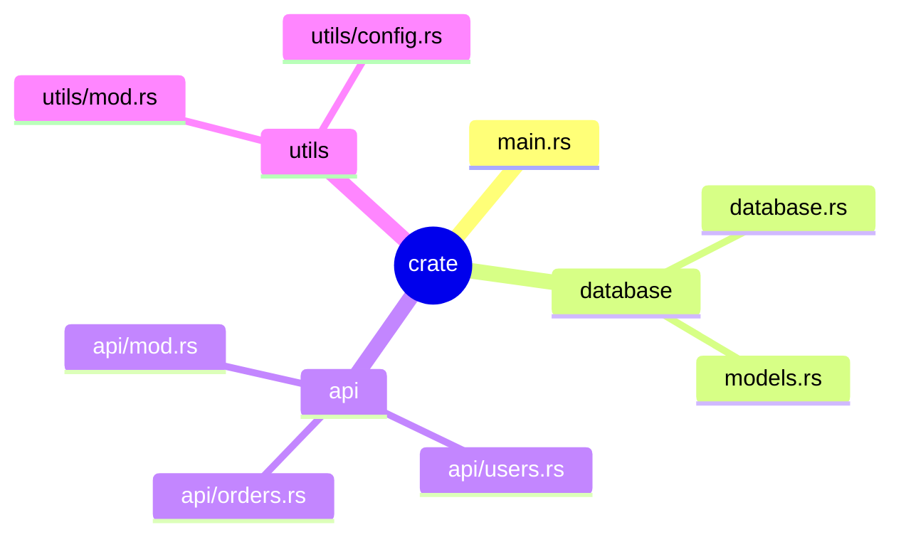

# Rust 模块系统：一个文件不是天然模块

> 本文基于 Rust 1.85。

Python 里一个 `.py` 文件自动等于一个模块。Java 里一个 `.java` 文件包含一个 public class。Rust 不一样——文件只是容器，模块需要显式声明。这个设计与 Cargo 的编译单元概念直接相关，不理解它就理解不了为什么项目结构是这样。

## mod：模块不是自动的

```rust
// main.rs
mod database;        // 声明一个名为 database 的模块
                     // Rust 会找 database.rs 或 database/mod.rs

fn main() {
    database::connect();  // 用模块名::函数访问
}
```

```rust
// database.rs
pub fn connect() {
    println!("连接数据库");
}
```

关键点：**`mod database` 不是 import，是声明**。它告诉编译器「存在一个模块叫 database，请去 disk 上找对应的文件」。如果你在文件里直接写 `database::connect()` 但没有 `mod database`，编译器回答——「我不认识 database」。

这解释了 Rust 项目中每个 `.rs` 文件都需要在某处被 `mod` 声明。没有声明的文件不被编译到 crate 中——它不是没被引用，而是编译器根本不知道它存在。

## 模块树：每个 crate 是一个树



根是 `main.rs`（或 `lib.rs`），每个 `mod` 声明是一个子节点。整个项目的模块组织成一个树——这棵树在编译时被展开成扁平的结构。

## 可见性：pub 比你想象的更细粒度

```rust
mod database {
    pub struct Connection {  // struct 是 pub 的
        url: String,         // ❌ field 默认私有
    }

    pub fn connect() { }     // ✅ 函数 pub

    pub(crate) fn internal() { }  // ✅ 仅 crate 内部可见
    pub(super) fn parent_visible() { } // ✅ 仅父模块可见
}

fn main() {
    let conn = database::Connection {
        url: String::from("..."),  // ❌ 编译错误：url 是私有的
    };
}
```

`pub` 让 struct 对外可见，但 struct 的字段默认私有。Python/Java 默认全部公开，Rust 默认全部私有。这种保守设计的原因：字段暴露破坏封装——等接口稳定后再手动 `pub` 比从一开始全部暴露再收束更容易。

| 修饰符 | 可见范围 |
|------|------|
| （无） | 当前模块及子模块 |
| `pub` | 所有地方 |
| `pub(crate)` | 当前 crate 内 |
| `pub(super)` | 父模块 |
| `pub(in crate::path)` | 指定路径 |

## use：别名的艺术

`mod` 是「声明」模块，`use` 是「引用」模块中的东西：

```rust
mod database;

// 不加 use——全路径引用
fn connect_db() {
    database::Connection::new("postgres://localhost");
}

// 加 use——缩短路径
use database::Connection;

fn connect_db2() {
    Connection::new("postgres://localhost");
}

// 重命名
use std::io::Result as IoResult;

// 批量引用——Rust 的多合一
use std::collections::{HashMap, HashSet, BTreeMap};
```

`use` 和 Java 的 `import` 本质相同但风格差异很大。Java 习惯 `import java.util.*`，Rust 社区强烈建议显式列出每个引用的类型——`use std::collections::{HashMap, HashSet}` 而非 `use std::collections::*`。类型来源一目了然。

## 模块文件组织：2018 edition 之后

2018 edition 之前只有两种方式：

```
src/
├── main.rs
├── database.rs            // mod database
└── database/              // mod database 的子模块
    └── models.rs          // mod database::models
```

2018 edition 允许同级文件路径方式：

```
src/
├── main.rs
├── database.rs            // mod database
└── database/
    └── models.rs          // database::models
```

或者删掉 `database.rs`，用 `database/mod.rs`：

```
src/
├── main.rs
└── database/
    ├── mod.rs             // mod database（注意文件名是 mod.rs 不是 database.rs）
    ├── models.rs
    └── connection.rs
```

`mod.rs` 仍然是子模块目录的入口。`main.rs` 中的 `mod database` 会先找 `database.rs`，找不到再找 `database/mod.rs`。这个搜索顺序解决了当初 `database.rs` 看着和 `database/` 目录脱节的问题。

## 重新导出：对外 API 的设计利器

```rust
// lib.rs
mod database;
mod api;
mod utils;

// 重新导出——对外暴露精选出的接口
pub use database::{Connection, Pool};
pub use api::handlers::handle_request;
```

crate 内部结构任意重组，对外接口不变。这是 Rust 里最重要但被最多人忽略的设计模式。Java 的 `public class` 必须和文件位置锁死，Rust 的 `pub use` 让内部组织完全独立于对外接口。

## workspace：多 crate 项目

当单个 crate 太大时，拆分成 workspace：

```
myapp/
├── Cargo.toml          # workspace root
├── core/
│   ├── Cargo.toml      # [package] name = "myapp-core"
│   └── src/lib.rs
├── api/
│   ├── Cargo.toml      # [package] name = "myapp-api"
│   └── src/main.rs
└── cli/
    ├── Cargo.toml
    └── src/main.rs
```

根 `Cargo.toml`：

```toml
[workspace]
members = ["core", "api", "cli"]
resolver = "2"
```

workspace 的好处：所有 crate 共享一个 `Cargo.lock`、一个 `target/` 编译目录——版本一致、增量编译共享、互相引用直接用路径依赖。

## 和 Python/Java 对比

| | Rust | Python | Java |
|------|------|------|------|
| 文件即模块 | ❌（需 mod 声明） | ✅ | 一个文件一个 public class |
| 可见性默认 | 私有 | 公开 | 包级 |
| 导入语法 | `use path::Type` | `import module` | `import com.xyz.Class` |
| 外部可见 | `pub` 逐个声明 | `__all__` 可选 | `public` 逐个 |
| 内部重组不影响 API | `pub use` | `__init__.py` 提升 | 不可重组 |

Rust 的设计最保守也最灵活——什么都不默认公开，但给了精确的可见性控制。Python 最简单但最模糊——默认公开，靠约定而非编译器保护封装。Java 居中——`public`/`private` 明确，但包结构锁死物理路径。

> 适合有 Python/Java 背景，首次接触 Rust 模块系统的读者。
