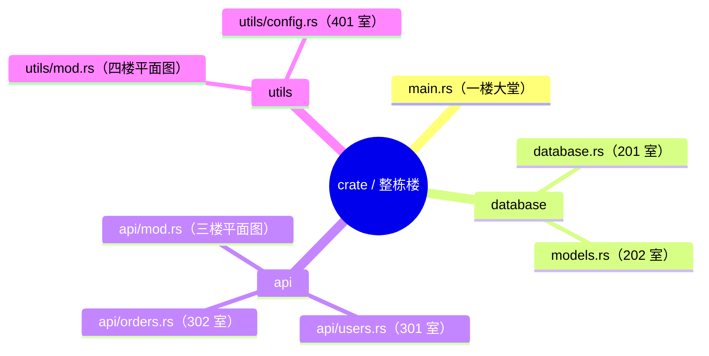

# Rust 模块系统：公寓楼里的房间管理

> 本文基于 Rust 1.96。

把 Rust 的项目想象成一栋**公寓楼**（crate）。每个 `.rs` 文件是一个**房间**，`mod.rs` 是**楼层平面图**，`pub` 就是**房门开着**（外面的人能进来），private 就是**锁着门**。`use` 是**捷径通道**，`super` 是**上一层**。

## mod：每个房间都需要在平面图上登记

公寓楼不会自动知道有哪些房间——你得在一楼大堂的平面图上标明。Rust 也一样，文件不会自动成为模块。

```rust
// main.rs（一楼大堂的公告板）
mod database;        // 登记：这栋楼有一个房间叫 database
                     // 物业会去查：database.rs 或 database/mod.rs

fn main() {
    database::connect();  // 通过房间号访问
}
```

```rust
// database.rs（实际的房间）
pub fn connect() {
    println!("连接数据库");
}
```

关键点：**`mod database` 不是「搬进去」，是「登记」**。它告诉编译器：「存在一个房间叫 database，请去图纸上找对应的位置」。如果你在代码里直接写 `database::connect()` 但没有 `mod database`，编译器的回答很干脆——「这栋楼里没有这个房间」。

这也解释了为什么 Rust 项目里每个 `.rs` 文件都需要在某处被 `mod` 声明——没有声明的文件不会被编译进 crate。它不是「没被引用到」，而是整栋楼的图纸上根本没这个房间。

## 模块树：每栋 crate 就是一栋楼



根是 `main.rs`（或 `lib.rs`），相当于一楼大堂的公告板。每个 `mod` 声明就是公告板上标记的一个房间。整栋楼的房间组织成一棵树——编译时展开成扁平结构，就像物业把所有房间的门牌号列成一张总表。

## 可见性：门锁系统比想象的更精细

```rust
mod database {
    pub struct Connection {  // 这间房的门开着（struct 对外可见）
        url: String,         // ❌ 但房间里的抽屉是锁着的（字段默认私有）
    }

    pub fn connect() { }     // ✅ 大门敞开
    pub(crate) fn internal() { }  // ✅ 整栋楼通用（电梯、楼道）
    pub(super) fn parent_visible() { } // ✅ 本楼层可见（走廊）
}

fn main() {
    let conn = database::Connection {
        url: String::from("..."),  // ❌ 编译错误：抽屉是私有的
    };
}
```

`pub` 让 struct 对外可见，但 struct 的字段默认私有。Python/Java 默认全部公开，Rust 默认全部私有。原因很实际：房间里的抽屉一开始先锁着，等你想清楚哪些东西可以给别人看之后再打开——比先全部敞开再匆忙收拾要容易得多。

| 修饰符 | 可见范围 | 公寓类比 |
|------|------|------|
| （无） | 当前模块及子模块 | 房间内及套间 |
| `pub` | 所有地方 | 整栋楼 + 街上的行人都能进 |
| `pub(crate)` | 当前 crate 内 | 本栋楼的公共区域 |
| `pub(super)` | 父模块 | 本层走廊 |
| `pub(in crate::path)` | 指定路径 | 特定区域的通行证 |

## use：捷径通道

`mod` 是「登记」房间，`use` 是「修一条捷径」：

```rust
mod database;

// 不加 use——每次都得走完整路线
fn connect_db() {
    database::Connection::new("postgres://localhost");
}

// 加 use——修一条捷径
use database::Connection;

fn connect_db2() {
    Connection::new("postgres://localhost");  // 走近路，少打字
}

// 重命名——给房间起个小名
use std::io::Result as IoResult;

// 批量引用——一条走廊串联多个房间
use std::collections::{HashMap, HashSet, BTreeMap};
```

`use` 和 Java 的 `import` 本质相同但风格差异很大。Java 习惯 `import java.util.*`——相当于把整个楼层打通；Rust 社区强烈建议显式列出每个引用的类型——`use std::collections::{HashMap, HashSet}` 而不是 `use std::collections::*`。每一条捷径从哪到哪都清清楚楚。

## 模块文件组织：2018 edition 之后

2018 edition 之前，只有一种方式来布局房间对应的文件——有目录就得有 `mod.rs`：

```
src/
├── main.rs（一楼大堂）
├── database.rs（database 房间本身）
└── database/（database 的套间）
    └── models.rs（套间里的 models）
```

2018 edition 开始，允许同级文件路径方式——可以同时有 `database.rs` 作为房间本身，和 `database/` 作为套间入口：

```
src/
├── main.rs
├── database.rs（database 房间）
└── database/
    └── models.rs（database 的套间 models）
```

或者删掉 `database.rs`，改用 `database/mod.rs` 做入口：

```
src/
├── main.rs
└── database/
    ├── mod.rs（database 房间，同时是套间入口）
    ├── models.rs
    └── connection.rs
```

`mod.rs` 既是房间本身，也是通往套间的入口。`main.rs` 中的 `mod database` 会先找 `database.rs`，找不到再找 `database/mod.rs`——物业先看独立房间号，再看套间入口。

## 重新导出：大堂的访客指引牌

```rust
// lib.rs（一楼大堂总台）
mod database;
mod api;
mod utils;

// 在大堂设置指引牌——外部访客不需要知道内部房间怎么走
pub use database::{Connection, Pool};
pub use api::handlers::handle_request;
```

整栋楼的内部结构可以随时改造，但大堂的指引牌不变——这就是 **`pub use`** 的力量。Java 的 `public class` 必须和文件位置锁死，Rust 的 `pub use` 让内部组织完全独立于对外接口。

## workspace：小区模式

当一栋楼不够住时，搞一个小区（workspace）：

```
myapp/
├── Cargo.toml（小区管理处）
├── core/（1 号楼）
│   ├── Cargo.toml
│   └── src/lib.rs
├── api/（2 号楼）
│   ├── Cargo.toml
│   └── src/main.rs
└── cli/（3 号楼）
    ├── Cargo.toml
    └── src/main.rs
```

小区的好处：所有楼共享一个物业管理处（`Cargo.lock`）、一个停车场（`target/` 编译目录）——版本一致、增量编译共享、互相引用直接用路径依赖。

## 和 Python/Java 对比

| | Rust（门禁公寓） | Python（开放式社区） | Java（写字楼） |
|------|------|------|------|
| 文件即模块 | ❌（需 mod 登记） | ✅ | 一个文件一个 public class |
| 可见性默认 | 私有（门锁着） | 公开（门开着） | 包级（本单元可见） |
| 导入语法 | `use path::Type` | `import module` | `import com.xyz.Class` |
| 外部可见 | `pub` 逐个声明 | `__all__` 可选 | `public` 逐个 |
| 内部重组不影响 API | `pub use` 大堂指引牌 | `__init__.py` 提升 | 不可重组 |

Rust 的设计最保守也最灵活——什么都不默认公开，但给了精确的可见性控制。Python 最简单但最模糊——默认公开，靠约定而非编译器保护封装。Java 居中——`public`/`private` 明确，但包结构锁死物理路径。

> 适合有 Python/Java 背景，首次接触 Rust 模块系统的读者。

**返回：** [Rust 笔记](index.md)
