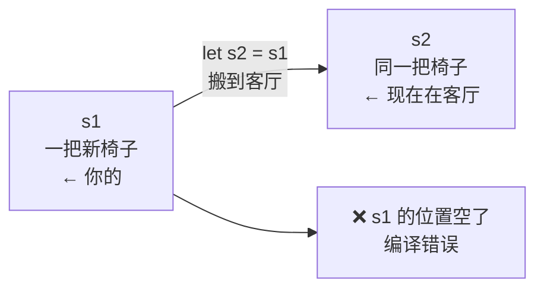
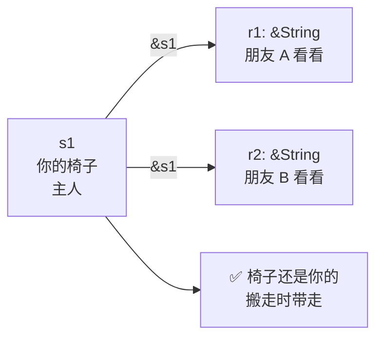
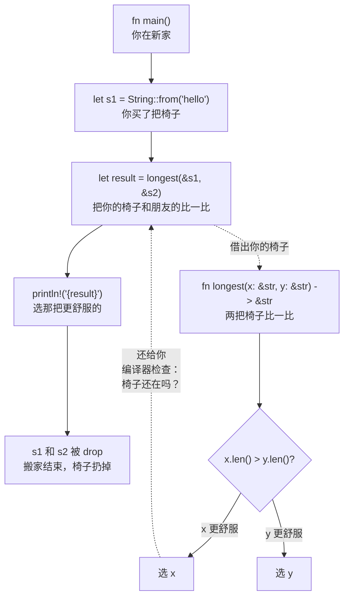
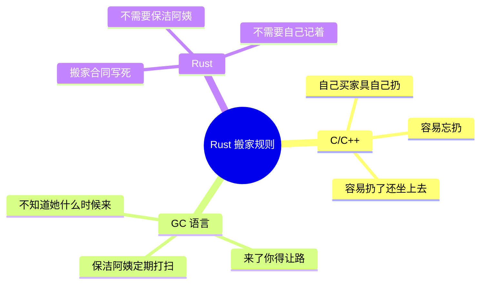

# Rust 所有权：用「搬家」比喻一次搞懂

> 本文基于 Rust 1.96。

想象你在搬家。每件家具都有且只有一个主人——要么是你买的，要带到新家去；要么是别人的，只是暂时放在你这。

C 语言的做法是：自己买家具、自己搬、搬走时自己扔。忘扔一件，那件家具就永远占着地方不走（内存泄漏）。

Java/Go 的做法是：请了一个保洁阿姨（GC），她定期来看看你有没有不要的东西。但你不知道她什么时候来，有时候她正好在你忙的时候过来打扫，你就得停下来等她（stop-the-world）。

Rust 走第三条路：**搬家当天，所有家具的归属就在合同里写死了。** 不需要保洁阿姨，不需要自己记着扔。如果出了问题，搬家师傅当场告诉你——而不是等你住进去才发现沙发挡着门了。

## 三条铁律

搬家师傅只在三件事上把关：

1. **每件家具有且只有一个主人**——同一把椅子不可能同时属于你和你朋友
2. **主人离开房间，家具必须带走或扔掉**——不会把别人的椅子落在空房间里
3. **同一时间，要么一个人改家具，要么多个人看家具，不能同时**

记不住没关系，接下来三张图让你直观理解。

## 第一张图：Move——家具搬走了



C++ 搬家喜欢复制——给你也买一把一模一样的。Rust 搬家默认是**真的搬走**：

```rust
let s1 = String::from("hello");
let s2 = s1;          // 椅子从 s1 的位置搬到了 s2
// println!("{s1}");  // ❌ 编译错误：原来的位置空了
println!("{s2}");     // ✅ 椅子在 s2，坐上去没问题
```

`s1` 不是被复制了一份——是**整个搬走了**。之后 `s1` 那里什么都没有了。这样防止了搬家结束时的 double free：离开房间时只有 `s2` 需要处理这把椅子。

不过小板凳（栈上数据）就不一样——`i32` 实现了 `Copy` trait，就像一张纸上的笔记，抄一份不费事：

```rust
let x = 5;
let y = x;            // 这是抄了一份，不是搬走
println!("{x}");      // ✅ 原版还在
```

搬家逻辑很统一：大件家具（String 等堆数据）搬走不复制，小物件（i32 等栈数据）顺手抄一份。一切都是默认行为，不需要你手动选择。

## 第二张图：Borrow——借家具看看



不想把椅子送人，只是让朋友坐坐——用 `&`：

```rust
let s1 = String::from("hello");
let r1 = &s1;         // 朋友 A 看看你的椅子
let r2 = &s1;         // 朋友 B 也能看——多人同时看没问题
println!("{r1} {r2} {s1}");  // ✅ 三个人各看各的
```

如果你想让朋友帮你把椅子改一下（比如刷个漆），用 `&mut`——但有规矩，同一时间只能有一个人动手：

```rust
let mut s1 = String::from("hello");
let r1 = &mut s1;     // 让朋友 A 动手帮你改椅子
// let r2 = &mut s1;  // ❌ 不能同时让 B 也来改——会打架
r1.push_str(" world");
println!("{r1}");     // ✅
```

两种借用的规矩：

| | 只是看看 `&T` | 动手改 `&mut T` |
|------|:---:|:---:|
| 同时可以有好几个人 | ✅ | ❌（只能一个人动手） |
| 还能同时有人看看 | ✅ | ❌（动手时别人不能看） |
| 能不能改 | ❌ | ✅ |

这个规矩防止了最恶心的事故——你正坐在一把椅子上休息，另一个人过来把椅子拆了重组。Rust 直接在搬家合同阶段就拦住了。

## 第三张图：Lifetime——借用期限



借东西是有期限的。你不能椅子已经还给朋友了，还一屁股坐上去。绝大多数时候借用的期限编译器自动算好了，不需要你写。但遇到函数返回引用时，需要告诉编译器哪个借用关系：

```rust
fn longest<'a>(x: &'a str, y: &'a str) -> &'a str {
    if x.len() > y.len() { x } else { y }
}
```

`'a` 标的是：还回来的那把椅子，至少和借出去的 x、y 中离搬家最早的那把**同时存在**。如果还回来的椅子比它主人的房间活得久——编译错误。

```rust
let result;
{
    let s1 = String::from("hello");     // s1 在这个小房间
    result = longest(&s1, "world");     // 你借 s1 去比
}  // ← s1 的房间拆了，椅子扔了
// println!("{result}");  // ❌ 你还拿着已经被扔掉的椅子
```

编译器在搬家合同阶段发现 `result` 还拿着已经被扔掉的椅子，直接拒绝搬家。这不是入住后的检查，是签合同之前就查出来了。零额外成本。

## 为什么这套规矩值得学



所有权的规矩难学——几乎是每个 Rust 新手的第一道坎。但学会了之后，你会发现很多以前在 C++ 里靠注释约定（"调用者负责释放此指针"）的东西，在 Rust 里搬家师傅（编译器）替你检查了。

> 适合有 C/C++ 背景但第一次接触 Rust 的读者阅读。

**返回：** [Rust 笔记](index.md)
