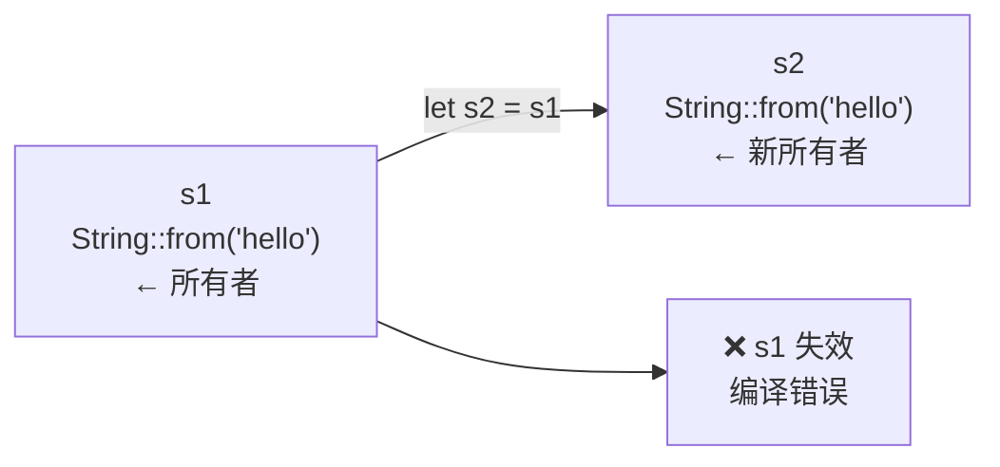
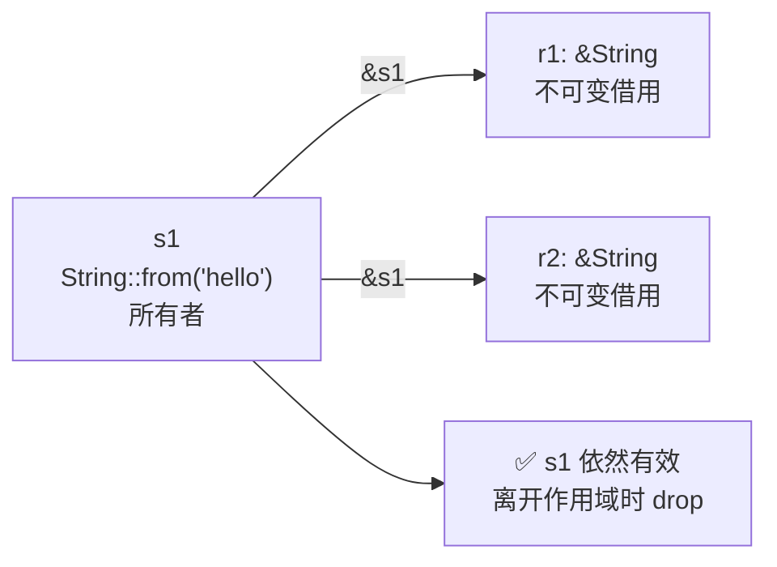
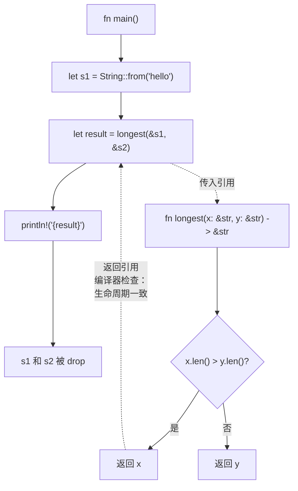
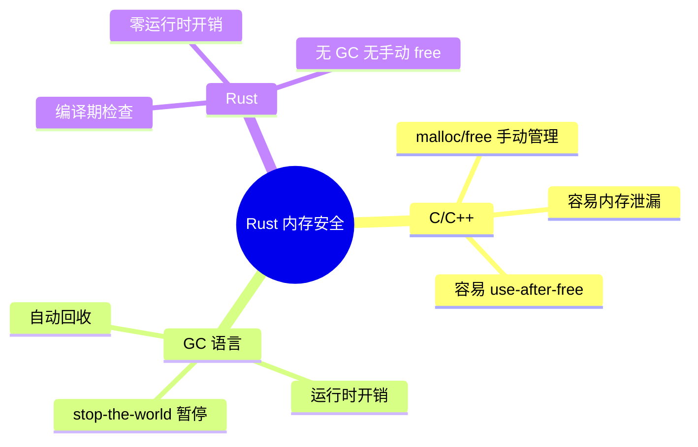

# Rust 所有权：三张图看懂最核心的概念

> 本文基于 Rust 1.85。

C 语言里你 `malloc` 之后必须 `free`，忘一次就是内存泄漏。Java/Go 有 GC，但 GC 什么时候跑你不确定，stop-the-world 卡一下就是几百毫秒。

Rust 走第三条路：**编译期通过一套所有权规则检查内存安全**。没有 GC，没有手动 free，出问题的是编译错误而不是运行时 bug。

## 三条铁律

编译器在背后只检查三件事：

1. **每个值有且只有一个所有者**
2. **所有者离开作用域，值被自动 drop**
3. **同一时刻，要么一个可变引用，要么多个不可变引用，不能同时**

记不住没关系，接下来三张图会让你直观理解。

## 第一张图：Move——所有权转移



C++ 默认拷贝，Rust 默认移动：

```rust
let s1 = String::from("hello");
let s2 = s1;          // s1 的所有权移动到了 s2
// println!("{s1}");  // ❌ 编译错误：value borrowed after move
println!("{s2}");     // ✅ 正常
```

`s1` 不是被拷贝了一份——它被**移动到** `s2`，之后 `s1` 不存在了。这防止了 double free：离开作用域时只有 `s2` 会释放内存。

栈上数据例外——整数实现了 `Copy` trait，自动按位复制：

```rust
let x = 5;
let y = x;            // 这是拷贝，不是移动
println!("{x}");      // ✅ 依然有效
```

移走堆数据（String），拷贝栈数据（i32）。规则一致——只是 `i32` 在栈上，拷贝成本零，编译器自动做了。

## 第二张图：Borrow——共享不转移



不想转移所有权，只是临时看一下——用 `&`：

```rust
let s1 = String::from("hello");
let r1 = &s1;         // 借用，不转移所有权
let r2 = &s1;         // 可以同时有多个不可变借用
println!("{r1} {r2} {s1}");  // ✅ 三个都能用
```

如果需要修改，用 `&mut`，但有约束——同一时刻只能有一个可变借用：

```rust
let mut s1 = String::from("hello");
let r1 = &mut s1;     // 可变借用
// let r2 = &mut s1;  // ❌ 同一时刻只能一个可变借用
r1.push_str(" world");
println!("{r1}");     // ✅
```

两种借用的规则张这样：

| | 不可变借用 `&T` | 可变借用 `&mut T` |
|------|:---:|:---:|
| 同一时刻可以有多个 | ✅ | ❌（只有一个） |
| 同时还有不可变借用 | ✅ | ❌（不能混用） |
| 修改数据 | ❌ | ✅ |

这个规则防止了最恶心的内存 bug——一个迭代器正在遍历 Vec，另一段代码同时修改它导致指针失效。Rust 编译期就拦住了。

## 第三张图：Lifetime——借用能活多久



绝大多数时候生命周期是编译器自动推导的，不需要写。但遇到函数返回引用时，需要显式标注：

```rust
fn longest<'a>(x: &'a str, y: &'a str) -> &'a str {
    if x.len() > y.len() { x } else { y }
}
```

`'a` 的意思是：返回的引用活得和 x、y 里较短的那个一样长。如果返回的引用比数据活得更久——编译错误。

```rust
let result;
{
    let s1 = String::from("hello");
    result = longest(&s1, "world");  // s1 在内部作用域
                                      // result 的生命周期和 s1 关联
}  // ← s1 在这里被 drop
// println!("{result}");  // ❌ 编译错误：result 指向已释放的 s1
```

编译器在编译时发现 `result` 在 `s1` 被 drop 之后还有使用，直接拒绝编译。这不是运行时检查，是编译期静态分析。零运行时成本。

## 为什么这套机制值得学



所有权机制难学——几乎是每个 Rust 新手的第一道坎。但学会了之后，你会发现很多以前在 C++ 里靠注释约定（"调用者负责释放此指针"）的东西，在 Rust 里编译器替你检查了。

> 适合有 C/C++ 背景但第一次接触 Rust 的读者阅读。
