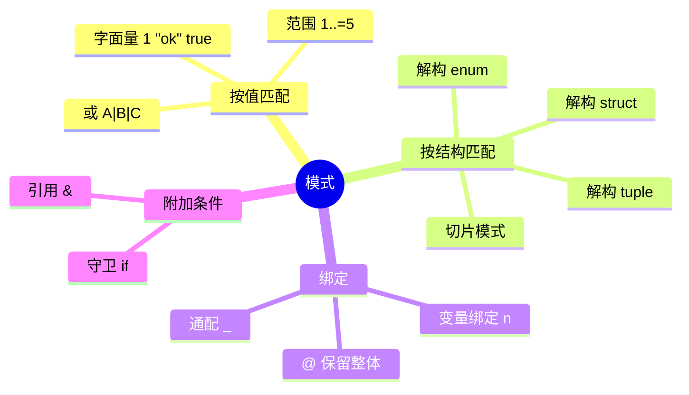
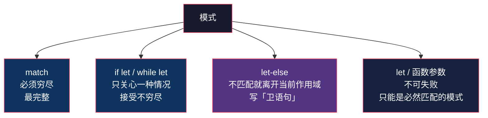

# Rust 模式匹配：匹配的是形状，不是值

> 本文基于 Rust 1.95 稳定版。

## 生活比喻：分拣中心的传送带

传送带上的包裹源源不断。两种处理思路：

- **`if/else` 的思路**：「这个包裹**是不是**寄给张三的？」——盯着**值**发问，判完还得自己翻找里面是什么
- **`match` 的思路**：「这是个什么**形状**的包裹？盒子？信封？泡沫袋？拆开，把里面的东西**按位置取出来**」——盯着**结构**发问，顺带把零件摆好

这个差别不是修辞。`match` 一次干了两件事：**判断形状** + **绑定变量**。而 `if/else` 只做第一件，第二件永远得你手写。

```rust
// if/else：判断和取值是分开的两步
if let Some(user) = map.get(&id) {
    if user.active {
        let name = &user.name;          // 还得再取一次
        // ...
    }
}

// match：判断和取值在同一步完成
match map.get(&id) {
    Some(User { name, active: true, .. }) => {
        // name 已经在这里了，直接用
    }
    _ => {}
}
```

## `if/else` 做不到的三件事

| 能力 | `if/else` | `match` |
|------|-----------|---------|
| **匹配结构** | 嵌套判断 → `if let` 千层饼 | 一次写完整棵树 |
| **同时绑定** | 判完手动解包 | 判断即绑定 |
| **穷尽性检查** | 没有这个概念 | 编译器保证不漏分支 |

第三件事最容易被低估。`if/else` 链漏掉一个分支，编译器不管；`match` 漏掉一个，编译不过——**而且将来给 enum 加变体时，所有漏改的地方会一起报错**。

## 模式能匹配什么

这是 Rust 里少数几个「背下来就完事」的表，过一遍就够用：

| 模式 | 写法 | 匹配什么 |
|------|------|---------|
| 字面量 | `1` / `"ok"` / `true` | 具体值 |
| 变量绑定 | `n` | 任何值，并绑定 |
| 通配 | `_` | 任何值，**不绑定** |
| 范围 | `1..=5` / `'a'..='z'` | 区间内 |
| 或 | `A \| B \| C` | 任一满足 |
| 解构 struct | `Point { x, y }` | 按字段名 |
| 解构 tuple | `(a, b)` | 按位置 |
| 解构 enum | `Some(x)` / `Shape::Rect { .. }` | 按变体 |
| 切片 | `[first, .., last]` | 长度 + 首尾 |
| 引用 | `&v` | 解一层引用 |
| 守卫 | `n if n > 0` | 附加条件 |
| `@` 绑定 | `n @ 1..=5` | 既匹配又保留整个值 |
| 忽略剩余 | `..` | 不关心的部分 |



## 四种「模式位置」

同一个模式，出现在不同位置，行为不一样。这是初学时最容易混乱的地方：



| 位置 | 可否失败 | 典型用途 |
|------|---------|---------|
| `match` | 不可失败（必须穷尽） | 分支逻辑 |
| `if let` / `while let` | 可失败（只管一种） | 有则处理，无则跳过 |
| `let ... else` | 不可失败 | 提前返回（卫语句） |
| `let` / 函数参数 | 不可失败 | 解构已知结构 |

### `let-else`：把「卫语句」写进解构

`let-else`（Rust 1.65+）解决了一个长期痛点——**解构失败时想提前 return，以前只能写成嵌套**：

```rust
fn parse_port(cfg: &str) -> Option<u16> {
    let Some(rest) = cfg.strip_prefix("port=") else {
        return None;                        // ← 不匹配就走人
    };
    let Ok(p) = rest.parse::<u16>() else {
        return None;
    };
    Some(p)                              // ← 主干逻辑保持零缩进
}
```

```console
port=8080 → Some(8080)
host=x    → None
port=abc  → None
```

对比一下没有 `let-else` 时的写法——主干逻辑被迫下沉两层：

```rust
fn parse_port_old(cfg: &str) -> Option<u16> {
    if let Some(rest) = cfg.strip_prefix("port=") {
        if let Ok(p) = rest.parse::<u16>() {
            return Some(p);
        }
    }
    None
}
```

**`let-else` 的价值在于「早退早安心」**：错误情况在函数开头就被打发走，主干逻辑不会被 `if let` 一层层推往右边。

## 绑定模式：最容易讲错的地方

这是本文最值得慢慢看的一节。

同样是解构 `Option<String>`，加不加 `&`，绑出来的类型**完全不同**：

```rust
let opt = Some(String::from("hello"));

match &opt {
    Some(s) => {
        let _: &String = s;      // ✅ s 是 &String —— 只是借用
    }
    None => {}
}

match opt {
    Some(s) => {
        let _: String = s;       // ✅ s 是 String —— 所有权的移动
    }
    None => {}
}
// 到这里 opt 已经被移动，不能再用了
```

**关键在于：绑定出来的类型不是模式写死的，而是由「被匹配的东西是什么类型」推导出来的。**

规则叫**默认绑定模式**（default binding modes，也叫 match ergonomics）：

> 当你匹配一个**引用**时，模式里的变量绑定**自动变成引用**——不用手写 `&`。

而且这条规则**会沿着嵌套一路传导**：

```rust
#[derive(Debug)]
struct Point { x: i32, y: i32 }

enum Shape {
    Circle(Point, f64),
    Rect { tl: Point, br: Point },
}

let shape = Shape::Rect { tl: Point { x: 0, y: 0 }, br: Point { x: 10, y: 20 } };

match &shape {
    Shape::Rect { tl, br } => {
        let _: &Point = tl;      // ✅ 自动是 &Point，不用写 &Point { .. }
        let _: &Point = br;
    }
    Shape::Circle(_, r) => {}
}
```

**只借用了最外层(`&shape`)，内层跟着全部变成引用。** 这就是为什么你写 `match &some_struct` 时，不用在每个字段前面加 `&`。

### 为什么这个设计很重要

如果没有默认绑定模式，上面那段得写成：

```rust
// 假设没有 match ergonomics —— 每一步都要显式加 &
match &shape {
    &Shape::Rect { tl: &Point { x, y }, br: &Point { .. } } => { /* ... */ }
    &Shape::Circle(_, r) => {}
}
```

**每个层级一个 `&`，深一层就多一个**——嵌套三层以后基本没法读。这个特性是 Rust 1.26 引入的（RFC 2005「match ergonomics」），把「匹配引用」从负担变成了默认行为。

> **一个常见的困惑**：既然自动取引用，那 `ref` 关键字还有什么用？
>
> `ref` 是这个特性**之前**的手动版本——在 `ref` 的年代，你想在匹配里借用而不是移动，必须显式写 `Some(ref s)`。现在推导规则接管了大部分场景。
>
> 但真实情况比「少用」更有意思：**`ref` 在默认绑定模式生效的地方，是被明确禁止的。** 试试这个几乎所有人都会踩的组合：
>
> ```rust
> match &opt {
>     Some(ref s) => {}    // ❌ 显式 ref + 隐式借用 = 冲突
>     None => {}
> }
> ```
>
> ```console
> error: cannot explicitly borrow within an implicitly-borrowing pattern
>   |
>   = note: matching on a reference type with a non-reference pattern
>           implicitly borrows the contents
>   |
> 7 |         Some(ref s) => {
>   |              ^^^ help: remove the explicit `ref`
> ```
>
> 编译器说得非常直白：**你已经在隐式借用了，再加 `ref` 就是借两次。**
>
> 那 `ref` 什么时候还有效？两种：
>
> ```rust
> // ① 匹配「拥有的值」—— 这时 ref 是唯一能避免移动的手段
> match opt {                       // opt: Option<String>，未加 &
>     Some(ref s) => { /* s: &String，opt 没被移动 */ }
>     None => {}
> }
> println!("{opt:?}");              // ✅ opt 仍可用
>
> // ② 在模式里显式写 &，把隐式借用关掉
> match &opt {
>     &Some(ref s) => { /* ... */ }
>     &None => {}
> }
> ```
>
> **记忆点：`ref` 是「显式借用」的手动版，而默认绑定模式是「隐式借用」的自动版——两者不能同时出现在一个模式里。** 现代代码里前者基本被后者取代了，所以看到 `ref`，多半是在读有年头的代码，或者作者需要精确控制借用语义。

## `@` 绑定：既要整个值，又要拆开看

有时候你想**同时**保留整个值、又匹配它的内部结构：

```rust
for v in [1, 5, 6, 15, 30, 99] {
    let tag = match v {
        0 => "零".to_string(),
        n @ 1..=5 => format!("小({n})"),        // ← 匹配范围，同时把值绑到 n
        6 | 7 | 8 => "中段".to_string(),
        n if n % 10 == 0 => format!("整十({n})"),  // ← 守卫：附加条件
        n => format!("大({n})"),
    };
    println!("{v:>3} → {tag}");
}
```

```console
  1 → 小(1)
  5 → 小(5)
  6 → 中段
 15 → 大(15)
 30 → 整十(30)
 99 → 大(99)
```

两个点值得注意：

- **`n @ 1..=5`** —— `@` 让你既能用范围做条件，又能拿到具体的值。少了它就是「知道它小，但不知道多小」
- **`n if n % 10 == 0`** —— 守卫是**模式的补充**，不是替代。注意它排在 `6 | 7 | 8` **后面**：match 是**自上而下、先到先得**的，顺序写反了行为就变了

**顺序敏感是 `match` 和 `if/else` 的又一处不同。** 后者你通常可以随意调整分支顺序，前者不行。

## 切片模式

切片匹配同时看**长度**和**首尾元素**，这在处理「第一个/最后一个特殊」的场景里非常顺手：

```rust
for s in [&[][..], &[1][..], &[1, 2][..], &[1, 2, 3][..], &[1, 2, 3, 4][..]] {
    let d = match s {
        [] => "空".to_string(),
        [only] => format!("唯一: {only}"),
        [first, .., last] => format!("首 {first} 尾 {last}"),
    };
    println!("{s:?} → {d}");
}
```

```console
[] → 空
[1] → 唯一: 1
[1, 2] → 首 1 尾 2
[1, 2, 3] → 首 1 尾 3
[1, 2, 3, 4] → 首 1 尾 4
```

`..` 是「中间随便多少个」的通配——两端的元素有名字，中间的直接跳过。

这个例子顺带展示了**穷尽性检查的价值**。把中间那条 `[only]` 删掉试试：

```console
error[E0004]: non-exhaustive patterns: `&[_]` not covered
 --> src/main.rs:4:24
  |
4 |         let _d = match s {
  |                        ^ pattern `&[_]` not covered
  |
  = note: the matched value is of type `&[i32]`
help: ensure that all possible cases are being handled by adding a match arm
      with a wildcard pattern or an explicit pattern as shown
  |
6 ~             [first, .., last] => format!("首 {first} 尾 {last}"),
7 ~             &[_] => todo!(),
```

`&[_]` 就是「长度为 1 的切片」——编译器精确地知道你漏了哪种情况，还顺带给了修补建议。

换成 `if s.len() == 0 / == 1 / else` 的写法，漏掉一个分支是不会有人提醒你的。

## 实战：从嵌套 JSON 配置里抽服务器列表

场景——从一段配置里提取所有合法的服务器地址，要求：

- 顶层必须是对象
- 必须有 `servers` 数组
- 每项必须是 `{host: string, port: number}`，且端口在合法范围

这一段同时用上 `let-else`、嵌套解构、守卫：

```rust
use std::collections::BTreeMap;

#[derive(Debug, Clone, PartialEq)]
enum Json {
    Null,
    Bool(bool),
    Num(f64),
    Str(String),
    Arr(Vec<Json>),
    Obj(BTreeMap<String, Json>),
}

/// 从配置里抽出服务器列表。要求结构完全正确，任一处不符就整条丢弃。
fn servers(cfg: &Json) -> Vec<(String, u16)> {
    // ① let-else：不是对象就整体放弃
    let Json::Obj(fields) = cfg else {
        return Vec::new();
    };

    // ② 取出 servers 字段，并直接解构成数组
    let Some(Json::Arr(items)) = fields.get("servers") else {
        return Vec::new();
    };

    items
        .iter()
        .filter_map(|item| {
            // ③ 嵌套解构：一次把 host/port 抽出来
            match item {
                Json::Obj(m) => {
                    let (Some(Json::Str(host)), Some(Json::Num(port))) =
                        (m.get("host"), m.get("port"))
                    else {
                        return None;
                    };
                    // ④ 先校验 f64 范围再转换 —— 注意 as 是饱和转换，
                    //    99999.0 as u16 == 65535，转换后再校验就漏了
                    (1.0..=65535.0)
                        .contains(port)
                        .then(|| (host.clone(), *port as u16))
                }
                _ => None,
            }
        })
        .collect()
}
```

跑起来：

```console
api.example.com:8443
cache.example.com:6379
```

输入里塞了 5 条，3 条被丢掉：端口越界的、缺 `port` 的、根本不是对象的。**注意没有任何一条是「被 if 拦下来」的——它们都是在解构失败时自然出局的。**

### 这里有个真踩到的坑

第 ④ 步我第一版写成了这样：

```rust
// ❌ 漏了越界端口
let port = *port as u16;
(1..=65535).contains(&port).then(|| (host.clone(), port))
```

结果 `99999.0` 那条**没有被丢掉**，输出的端口是 `65535`。

原因是 **Rust 的浮点转整数 `as` 是饱和转换（saturating），不是截断**（Rust 1.45 起）：

```rust
let x = 99999.0_f64;
println!("{}", x as u16);     // 65535，不是回绕也不是 panic
```

它被 clamp 到了 `u16::MAX`，于是顺利通过了范围检查。

**教训是：范围校验必须发生在转换之前。** 这类「转换本身会改变值」的陷阱，在 `as` 上尤其容易踩——因为它不报错、不 panic，只是安静地给你一个错的值。

## `_` 的代价：它会吞掉未来

`match` 的穷尽性检查是它最大的卖点，但用 `_` 兜底会**悄悄关掉这个保护**：

```rust
enum Shape { Circle(Point, f64), Rect { tl: Point, br: Point } }

// ❌ 用 _ 兜底
let name = match s {
    Shape::Circle(..) => "圆",
    _ => "其它",                    // 将来加了 Triangle，这里静默变成 "其它"
};

// ✅ 穷尽列出
let name = match s {
    Shape::Circle(..) => "圆",
    Shape::Rect { .. } => "矩形",   // 加变体时这里会编译报错 —— 你会知道
};
```

**判断标准**：这个 enum 是**封闭的**（你自己定义的、不打算扩展）还是**开放的**？

- 封闭 → 穷尽列出，让编译器帮你守住
- 开放（比如处理外部 crate 的 `#[non_exhaustive]` enum）→ 用 `_`，因为你别无选择

第二种情况其实说明你没得选；**真正的问题都出在第一种——你明明可以穷尽，却图省事写了 `_`，把编译器变成了哑巴。**

还有一个偷懒但**安全**的替代品：`matches!` 宏。

```rust
let codes = [200u16, 301, 404, 500];
for c in codes {
    println!("{c} 是成功码? {}", matches!(c, 200..=299));
}
```

它只回答「是否匹配」，不做绑定，也不要求穷尽——**用来做单一条件判断时，比 `match ... { _ => false }` 干净得多**。

## 骨架代码

```rust
// ========== 1. 四种模式位置 ==========
match value {
    Pattern1 => { /* 必须穷尽 */ }
    _ => {}
}

if let Some(x) = opt { /* 只管一种 */ }

while let Some(x) = iter.next() { /* 循环解构 */ }

let Some(x) = opt else { return; };   // 1.65+，卫语句

let Point { x, y } = point;            // 不可失败的解构
fn f(Point { x, y }: Point) {}         // 函数参数里也能解构

// ========== 2. 常用模式速记 ==========
match v {
    0 => {},                          // 字面量
    n @ 1..=5 => {},                  // 范围 + @ 绑定
    6 | 7 | 8 => {},                  // 或
    n if n % 10 == 0 => {},           // 守卫（注意顺序！）
    Point { x: 0, .. } => {},         // 解构 + 忽略剩余
    [first, .., last] => {},          // 切片
    &r => {},                         // 解引用
    _ => {},                          // 兜底（会关闭穷尽检查，慎用）
}

// ========== 3. 绑定模式规则 ==========
match &opt { Some(s) => {} , None => {} }   // s: &String  （自动借用）
match opt  { Some(s) => {} , None => {} }   // s: String   （移动所有权）
// 嵌套时规则一路传导，不用逐层写 &

// ========== 4. 安全的条件判断 ==========
if matches!(code, 200..=299) { }    // 比 match + _ => false 干净
```

## 总结

| 维度 | `if/else` | 模式匹配 |
|------|-----------|---------|
| 问的问题 | 值**是不是**这个 | 结构**长什么样** |
| 匹配与绑定 | 两步分开 | 一步完成 |
| 分支顺序 | 通常无关 | **自上而下，先到先得** |
| 穷尽性 | 无此概念 | 编译器保证（除非你写 `_`） |
| 嵌套结构 | 逐层 `if let` | 一次写完整棵树 |

**三条最该记住的：**

1. **模式匹配匹配的是「形状」，不是「值」。** 它同时回答两个问题——「这是哪种情况」和「把里面的东西给我」。

2. **绑定类型由被匹配者推导，不由模式写死。** 匹配引用时变量自动变引用，且沿嵌套传导（match ergonomics）。这解释了为什么 `match &x` 里不用写 `&`。

3. **`_` 兜底会关掉穷尽性检查——那是 `match` 最值钱的地方。** 能用穷尽就用穷尽；只在面对真正开放的 enum 时才用 `_`。

最后回到那个比喻：`if/else` 是站在传送带边上，逐个问「你是给谁的」；`match` 是**把它拿起来看形状、拆开、把零件摆好**。后者一次做完了前者要做三遍的事——而且如果有人往传送带上放了个你没见过的形状，`match` 会当场拦下来告诉你，`if/else` 会安静地把它漏过去。

---

**相关文章：** [Rust 所有权：三张图看懂最核心的概念](ownership.md) · [Rust Rc 与 RefCell：编译期管不了的共享可变，运行时来管](rc-refcell.md) · [Rust 宏：macro_rules! 写模式，过程宏写逻辑](macros.md) · [Rust Trait 与泛型：多态不只是继承](traits-generics.md)
