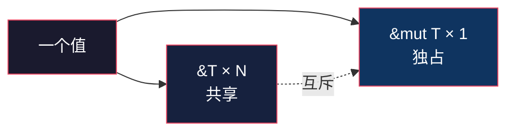
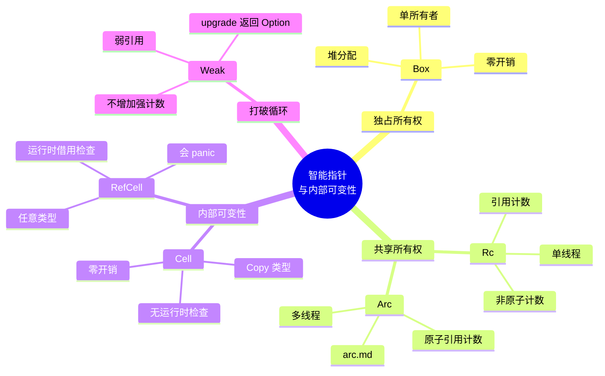
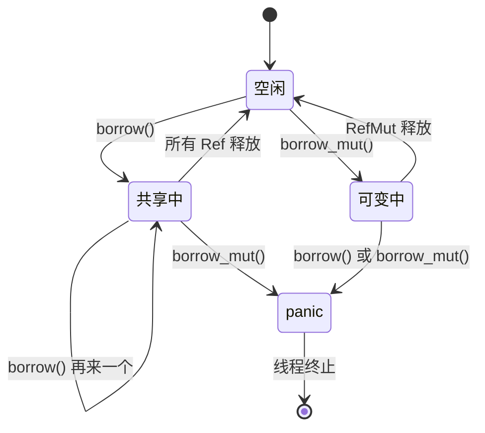
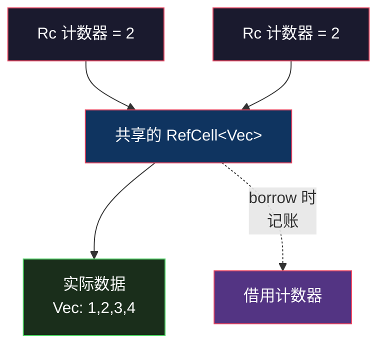
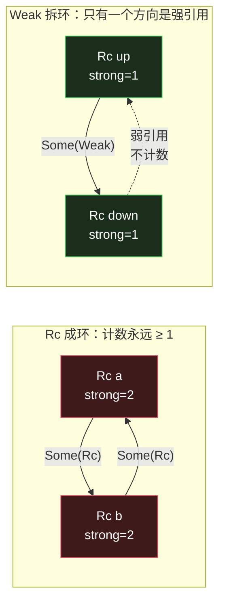
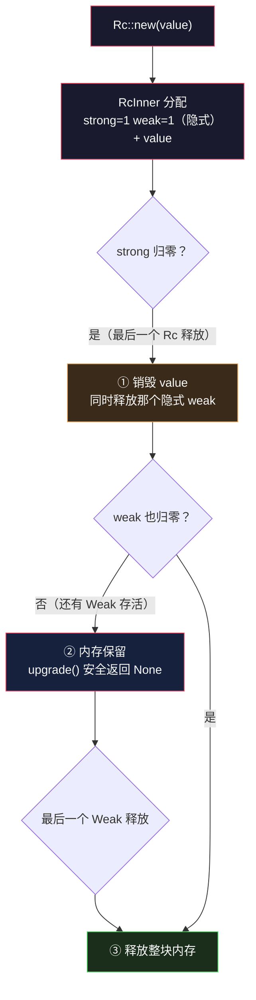
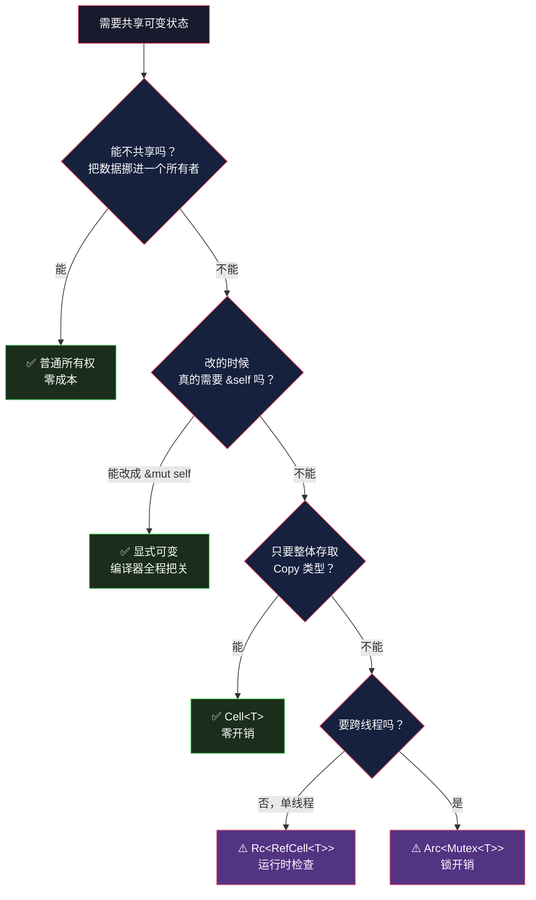

# Rust Rc 与 RefCell：编译期管不了的共享可变，运行时来管

> 本文基于 Rust 1.95 稳定版。

## 生活比喻：一本能写字的共享笔记本

Rust 的三条借用规则把「共享」和「可变」焊死成了互斥关系。但现实里有些东西**天生既要共享又要可变**：

- **图书馆的书**——同一本书可以同时有多个读者（共享），但谁都不能在上面写字。人走光了书才下架。这就是 `Rc<T>`。
- **会议室的白板**——谁拿到笔谁写（可变），但同一时刻只能有一个人拿着笔。这就是 `RefCell<T>`。
- **传阅的共享笔记本**——多人共同持有，谁拿到谁写。这就是 `Rc<RefCell<T>>`。
- **通讯录里的一个电话号码**——它**不阻止对方搬走**，你打过去可能已经是空号。这就是 `Weak<T>`。

这篇讲的就是这四样东西：它们解决什么问题、代价是什么、什么时候会咬你一口。

## 回顾：编译期的那条黄金规则

Rust 的所有权系统只有一条核心规则：

> **要么任意多个 `&T`（共享不可变），要么恰好一个 `&mut T`（独占可变），二者不可同时存在。**



编译器在**编译期**替你证明这条规则。绝大多数时候这很好——零运行时开销，白送的安全性。

但有四类场景，编译器**证明不了**：

| 场景 | 为什么编译器证明不了 |
|------|---------------------|
| 图 / 双向链表 | 一个节点被多个节点指向，「谁是所有者」编译期说不清 |
| 树 + 父指针 | 父拥有子，子又需要回指父——所有权关系成环 |
| 观察者 / 回调 | 注册时不知道将来谁会改谁 |
| `&self` 方法里写缓存 | 签名是共享借用，但内部确实要改 |

这些场景的共同点是：**安全性依然成立，但成立的理由是运行时的，不是类型系统能静态推导的。**

Rust 的解法很干脆——**既然编译期证明不了，那就把检查推迟到运行时**。这就是「内部可变性」（interior mutability）。

## 智能指针家族全景

先看一眼这堆类型各自的位置：



这张图里，`Box` 和 `Arc` 已经各有专文（[Box&lt;dyn&gt;](box-dyn.md)、[Arc](arc.md)），本文补齐中间两块。

## 第一半：`Rc<T>` —— 共享所有权

`Rc` = **R**eference **C**ounted。它把「谁拥有这个值」从**编译期的一个名字**变成**运行期的一个计数器**。

```rust
use std::rc::Rc;

let a = Rc::new(String::from("共享数据"));
println!("创建后 strong_count = {}", Rc::strong_count(&a));   // 1

let b = Rc::clone(&a);
let c = Rc::clone(&a);
println!("clone 两次后 strong_count = {}", Rc::strong_count(&a));  // 3
println!("a={a} b={b} c={c}");

drop(c);
println!("drop 一个后 strong_count = {}", Rc::strong_count(&a));  // 2
```

```console
创建后 strong_count = 1
clone 两次后 strong_count = 3
a=共享数据 b=共享数据 c=共享数据
drop 一个后 strong_count = 2
```

**三个必须记住的点：**

1. **`Rc::clone` 不是深拷贝。** 它只是把计数器 `+1`，数据本体一个字节都没动。所以 `Rc::clone` 是 O(1) 的——这也是为什么 clippy 建议写 `Rc::clone(&a)` 而不是 `a.clone()`：前者一眼能看出「这是浅拷贝，不贵」，后者长得跟深拷贝一模一样。

2. **计数器归零才真正释放。** `drop(c)` 之后 `strong_count` 从 3 变 2，内存还在。最后一个 `Rc` 离开作用域时才调用析构。

3. **`Rc` 是只读的。** 你拿不到 `&mut T`——`Rc::get_mut()` 只在**计数器为 1** 时才返回 `Some`，因为只有独占时才能证明改它是安全的。

```rust
let mut a = Rc::new(String::from("hi"));
*Rc::get_mut(&mut a).unwrap() += "!";   // ✅ 只有 1 个引用，能拿到 &mut

let b = Rc::clone(&a);
assert!(Rc::get_mut(&mut a).is_none()); // ❌ 有 2 个引用了，拿不到
```

这就是 `Rc` 的一半答案：**解决了「共享」，但没解决「可变」。**

## 第二半：`Cell` 与 `RefCell` —— 内部可变性

`Cell<T>` 和 `RefCell<T>` 干的是同一件事——**让 `&self` 能改内部数据**——区别在于检查强度：

| | `Cell<T>` | `RefCell<T>` |
|---|---|---|
| 适用类型 | 仅 `Copy`（或 `Default` 用于 `take`） | 任意类型 |
| 检查方式 | 无（值整体存取，天然无别名） | 运行时借用计数器 |
| 开销 | 零 | 每次 borrow 改一个计数 |
| 失败行为 | 不会失败 | `borrow_mut` 冲突时 **panic** |
| 拿引用 | 不能，只能 `get`/`set` 整个值 | 能，`borrow()` 返回 `Ref<T>` |

```rust
use std::cell::{Cell, RefCell};

// Cell：值整体搬进搬出，没有「引用」这回事，所以不需要检查
let counter = Cell::new(0);
counter.set(counter.get() + 1);
counter.set(counter.get() + 1);
println!("Cell counter = {}", counter.get());   // 2

// RefCell：能拿出 &T / &mut T，所以必须记录「当前是哪种借用」
let log = RefCell::new(Vec::new());
log.borrow_mut().push("第一条");
log.borrow_mut().push("第二条");
println!("RefCell log = {:?}", log.borrow());   // ["第一条", "第二条"]
```

**为什么 `Cell` 不需要运行时检查？** 因为它根本没有「借用」的概念——`get()` 是**拷贝一份出来**，`set()` 是**覆盖回去**。没有引用逃逸，就不可能产生别名，编译器静态就能确认安全。

只有 `RefCell` 需要那本账：内部维护一个借用计数器，`borrow()` 加共享、`borrow_mut()` 要独占。

### `RefCell` 的状态机



**这张图是本文最重要的一张。** 它说明：`RefCell` 把编译期的借用检查原封不动搬到了运行期——同样的规则（共享 XOR 可变），同样的穷尽性，只是违例的后果从「编译失败」变成了「运行时 panic」。

### 代价：panic

同一个 `RefCell` 上，可变借出期间再借：

```rust
let v = RefCell::new(10);
let _g = v.borrow_mut();
let _also = v.borrow();   // 💥
```

```console
thread 'main' panicked at src/main.rs:16:19:
RefCell already mutably borrowed
```

这个 panic **不能 catch 后继续用**——虽然技术上可以 `catch_unwind`，但 `RefCell` 的内部计数可能停在异常状态，之后的行为不可预期。**`RefCell` 的 panic 是设计的失败路径，不是可恢复错误。**

生产代码里用 `try_borrow` / `try_borrow_mut` 拿到 `Result`：

```rust
let v = RefCell::new(1);
let _held = v.borrow_mut();
println!("try_borrow 在可变借用期间 = {:?}", v.try_borrow().is_err());
// true —— 不 panic，返回 Err
```

### 最常见的坑：借用跨越了函数调用

`RefCell` panic 的绝大多数原因不是「故意嵌套借用」，而是**借用守卫活得太久**：

```rust
// ❌ 容易踩：borrow_mut() 的守卫活到整个语句结束
if let Some(x) = cache.borrow_mut().get(&key) {
    cache.borrow_mut().insert(key, compute(x));   // 💥 上一个守卫还没释放
}

// ✅ 显式收窄作用域：先取值，再释放，再写
let cached = cache.borrow().get(&key).cloned();
if let Some(x) = cached {
    cache.borrow_mut().insert(key, compute(x));
}
```

记住一条：**`Ref<T>` / `RefMut<T>` 是 RAII 守卫，它们活到作用域结束，不是到语句结束**（Rust 2024 起 `if let` / `match` 的临时值会提前释放，但嵌套在表达式里的依然会拖长）。拿不准就显式 `drop(guard)` 或者用 `{}` 圈起来。

## 合体：`Rc<RefCell<T>>`

单独任何一个都不够用：

- `Rc<T>` 能共享，不能改
- `RefCell<T>` 能改，不能共享（它只有一个所有者）

叠起来就是 Rust 里**共享可变状态**的标准写法：

```rust
use std::cell::RefCell;
use std::rc::Rc;

let shared = Rc::new(RefCell::new(vec![1, 2, 3]));

let a = Rc::clone(&shared);
let b = Rc::clone(&shared);

a.borrow_mut().push(4);                    // 通过 a 改
println!("b 看到的 = {:?}", b.borrow());   // b 也能看到 [1, 2, 3, 4]
```



**注意这里是两层独立的机制，别混为一谈：**

- `Rc` 的计数器管**所有权**——归零才释放内存
- `RefCell` 的借用计数器管**访问**——同一时刻共享还是独占

两者互不干涉：`Rc::strong_count` 是 2，不代表 `borrow_mut()` 会失败；反过来 `borrow_mut()` 持有期间，`Rc::clone` 照样随便调。

## 循环引用：`Rc` 唯一会泄漏的场景

`Rc` 有个致命弱点——**它数的是「引用」而不是「可达性」**。两个 `Rc` 互相指向，计数器永远归不了零：

```rust
struct Leaky {
    name: String,
    peer: RefCell<Option<Rc<Leaky>>>,
}

impl Drop for Leaky {
    fn drop(&mut self) {
        println!("  drop Leaky({})", self.name);
    }
}

{
    let a = Rc::new(Leaky { name: "a".into(), peer: RefCell::new(None) });
    let b = Rc::new(Leaky { name: "b".into(), peer: RefCell::new(None) });
    *a.peer.borrow_mut() = Some(Rc::clone(&b));   // a 持有 b
    *b.peer.borrow_mut() = Some(Rc::clone(&a));   // b 持有 a —— 成环
    println!("  离开作用域前 a.strong={} b.strong={}",
             Rc::strong_count(&a), Rc::strong_count(&b));
}
println!("  ^ 作用域结束了，但上面没有任何 drop 输出");
```

```console
[循环引用] a.peer = b, b.peer = a
  离开作用域前 a.strong=2 b.strong=2
  ^ 作用域结束了，但上面没有任何 drop 输出
```

**两个 `drop` 一个都没打印——内存泄漏了。** 而且 Rust 的借用检查器完全不会提示你，这是**内存安全但泄漏**的合法程序。



右边那个解法用的就是 `Weak`——**它不是「更弱的 `Rc`」，而是「不参与所有权计数的引用」**，这个定义上的差别带来了不少反直觉的行为，值得单独一节讲清楚。

## `Weak<T>`：不参与所有权计数的引用

`Weak` 是 `Rc` 的**非拥有型**版本——它指向同一块分配，但**不增加强计数**。

回到开头那个比喻：**`Rc` 是房产证，`Weak` 是通讯录里的电话号码。** 存个号码不会让对方不搬家，所以你打过去可能已经是空号——必须先确认人在不在。

### 两条铁律

**① `Weak` 不能直接解引用。**

`Weak<T>` 没有实现 `Deref<Target = T>`。`*w` 或 `w.field` 都编译不过。原因很直接：**对象随时可能已经死了，允许解引用就等于允许 UB。**

**② 必须 `upgrade()` 才能访问，而它返回的是「临时所有权」。**

```rust
weak.upgrade()   // -> Option<Rc<T>>
```

拿到 `Some` 说明对方还活着，同时你手里多了一份**真正的强引用**：

```console
升级成功，现在 strong=2
drop 原始 rc2 后 strong=1
   ↑ 升级出的 Rc 让它活着，直到它自己也被释放
   >>> [值被销毁] Data(9)
```

注意第二行——**原始的 `Rc` 已经释放了，对象却还活着**，因为升级出来的那个 `Rc` 撑着它。所以别把 `upgrade()` 的结果长期存着，那等于偷偷把弱引用转成了强引用，用 `Weak` 的意义就没了。正确的用法永远是「**升级 → 立刻用 → 用完就放**」。

### 值的销毁和内存的回收是两件事

这是 `Weak` 最容易搞错的地方。很多人以为「`Rc` 死了，`Weak` 就指向空气」，实际是**两次独立的销毁**：



- **值（`T`）**：`strong == 0` 时**立刻**销毁
- **内存（装计数器和值的那个 box）**：`strong == 0` **且** `weak == 0` 才释放

中间那段「值没了、内存还在」的窗口，正是 `upgrade()` 能安全返回 `None` 而不是崩溃的原因——它得读得到那个计数器，才能告诉你「人没了」。

std 源码里这段写在 `drop_slow`（`library/alloc/src/rc.rs`）：

```rust
unsafe fn drop_slow(&mut self) {
    // Reconstruct the "strong weak" pointer and drop it when this
    // variable goes out of scope. This ensures that the memory is
    // deallocated even if the destructor of `T` panics.
    let _weak = Weak { ptr: self.ptr, alloc: &self.alloc };
    ptr::drop_in_place(&mut (*self.ptr.as_ptr()).value);   // 只销毁值
}
```

而 `Rc::new` 里那个 `weak: Cell::new(1)` 就是注释说的 **implicit weak pointer**：

```rust
Box::leak(Box::new(RcInner { strong: Cell::new(1), weak: Cell::new(1), value }))
```

它是**所有强引用共同拥有的一个隐式弱引用**，专门保证「strong 的析构函数还在跑的时候，内存不会被提前释放」。

### 一个 API 陷阱：`weak_count()` 会突然变 0

这是实测才发现的坑，跟直觉完全不符：

```console
[强计数 > 0 时]
  Rc::strong_count       = 1
  Rc::weak_count         = 2
  Weak::weak_count(w1)   = 2

[强计数 = 0，w1/w2 都还在]
  Weak::weak_count(w1)   = 0    ← 明明两个 Weak 都活着
  Weak::weak_count(w2)   = 0
```

源码里这是**故意**的：

```rust
pub fn weak_count(&self) -> usize {
    if let Some(inner) = self.inner() {
        if inner.strong() > 0 {
            inner.weak() - 1 // subtract the implicit weak ptr
        } else {
            0
        }
    } else { 0 }
}
```

一旦 `strong == 0` 就直接返回 0。**它的语义是「还有几个 `Weak` 指向这个活着的分配」，不是「还有几个 `Weak` 对象存在」。** 所以别拿它当排查内存泄漏的指标——想知道漏没漏，看 `strong_count` 更靠谱。

### 用途一：打破循环

修复上面那个环：

```rust
struct Fixed {
    name: String,
    peer: RefCell<Option<Weak<Fixed>>>,   // 换成 Weak
}

{
    let up = Rc::new(Fixed { name: "up".into(), peer: RefCell::new(None) });
    let down = Rc::new(Fixed { name: "down".into(), peer: RefCell::new(None) });
    *down.peer.borrow_mut() = Some(Rc::downgrade(&up));   // 弱引用，不计数
    println!("  up.strong={} down.strong={}",
             Rc::strong_count(&up), Rc::strong_count(&down));
}
```

```console
[Weak 打断] up = down, down.peer = weak(up)
  up.strong=1 down.strong=1
  drop Fixed(down)
  drop Fixed(up)
  ^ 两个都正常释放
```

强计数都是 1，作用域结束就干净释放。

本质是**给环指定一个方向**：一个方向用 `Rc`（拥有），另一个方向用 `Weak`（不拥有）。哪个方向用 `Weak`，取决于「谁是主体」——目录树里子目录不该拥有父目录，所以 `parent` 用 `Weak`（见下一节的实战）。

### 用途二：缓存 / 注册表

`upgrade()` 返回 `None` 这件事本身很有价值。比如做个「对象注册表」，用 `HashMap<Id, Weak<T>>` 存——**对象没人用了，表项自动失效**，不需要任何清理逻辑：

```rust
use std::collections::HashMap;

struct Registry {
    items: RefCell<HashMap<u32, Weak<Item>>>,
}

impl Registry {
    /// 查到了就复用，查不到才新建 —— 且不会拖住已死的对象
    fn get_or_create(self: &Rc<Self>, id: u32) -> Rc<Item> {
        if let Some(existing) = self.items.borrow().get(&id).and_then(Weak::upgrade) {
            return existing;                     // 还活着，复用
        }
        let item = Rc::new(Item { id });         // 已死或不存在，重建
        self.items.borrow_mut().insert(id, Rc::downgrade(&item));
        item
    }
}
```

实测行为：

```console
复用同一对象 = true       ← 第二次调用拿到同一个
重建后 id = 1             ← 前一个被 drop 后，重新建
```

### 用途三：观察者列表

订阅者列表用 `Vec<Weak<dyn Observer>>` 存，**发布者不会因为「我还在」就让已经没人用的订阅者活着**：

```rust
struct Publisher {
    subscribers: RefCell<Vec<Weak<dyn Observer>>>,
}

impl Publisher {
    fn publish(&self, event: &Event) {
        // retain 顺手清理已死的订阅者 —— 一步完成「通知 + 回收」
        self.subscribers.borrow_mut().retain(|w| match w.upgrade() {
            Some(obs) => { obs.on_event(event); true }   // 还活着：通知，保留
            None => false,                                // 已死：丢弃
        });
    }
}
```

```console
订阅后槽位 = 2
    [A] 收到 第一次
    [B] 收到 第一次
    >>> LogObserver(B) 被释放

drop 掉 B 之后：
    [A] 收到 第二次
  发布后槽位 = 1  ← B 的空槽被 retain 顺手清掉
```

这是 `Weak` 一个很讨喜的性质：**「顺便清理」是天然的**。`retain` 里那句 `None => false` 就是回收，不需要任何额外的生命周期管理代码。

（channel 方案解决的是同一个问题，只是换了条路——见 [Observer 模式](../../architecture/design-patterns/observer.md)。）

### 什么时候不该用 `Weak`

| 情况 | 问题 |
|------|------|
| 只是不想付 `Rc` 的计数开销 | `Weak` 反而多一层 `Option` 检查 |
| 指望它自动清理 | `Weak` **不会**主动清任何东西，`upgrade()` 返回 `None` 就完了，回收得你自己做 |
| 想要「可选的所有者」 | 那应该是 `Option<Rc<T>>`，不是 `Weak` |

**判断标准**：问自己「**这个引用应该让对方活得久一点吗？**」

- 应该 → `Rc` / `Arc`
- 不应该，但我想知道它还在不在 → `Weak`

## 实战：带父指针的目录树

这是 `Rc<RefCell<>>` + `Weak` 最经典的用法——**`std::fs` 的目录结构本身就是「父拥有子、子回指父」**。

- `children` 用 `Rc` 强引用：父目录**拥有**子目录
- `parent` 用 `Weak` 弱引用:子目录**不拥有**父目录（否则就是上面那个环）

```rust
use std::cell::RefCell;
use std::rc::{Rc, Weak};

#[derive(Debug)]
struct Dir {
    name: String,
    parent: RefCell<Weak<Dir>>,          // 回指父节点：弱引用，不成环
    children: RefCell<Vec<Rc<Dir>>>,     // 拥有子节点：强引用
}

impl Dir {
    fn new(name: &str) -> Rc<Self> {
        Rc::new(Dir {
            name: name.to_string(),
            parent: RefCell::new(Weak::new()),   // 一开始没有父节点
            children: RefCell::new(Vec::new()),
        })
    }

    /// 建子目录并挂上去
    /// self: &Rc<Self> —— 需要拿到自身的 Rc 才能造 Weak
    fn mkdir(self: &Rc<Self>, name: &str) -> Rc<Dir> {
        let child = Dir::new(name);
        *child.parent.borrow_mut() = Rc::downgrade(self);   // 弱引用回指
        self.children.borrow_mut().push(Rc::clone(&child)); // 强引用持有
        child
    }

    /// 靠 Weak::upgrade 一路向上爬，拼出完整路径
    fn path(&self) -> String {
        match self.parent.borrow().upgrade() {
            Some(p) => format!("{}/{}", p.path(), self.name),
            None => self.name.clone(),      // upgrade 失败 = 根节点
        }
    }
}

fn main() {
    let root = Dir::new("root");
    let docs = root.mkdir("docs");
    let _img = docs.mkdir("img");

    println!("docs 路径 = {}", docs.path());
    println!("root strong_count = {}", Rc::strong_count(&root));
    println!("docs strong_count = {}", Rc::strong_count(&docs));
}
```

```console
docs 路径 = root/docs
root strong_count = 1
docs strong_count = 2
```

**两处输出都值得琢磨：**

- `docs 路径 = root/docs` —— 从 `docs` 出发，`upgrade()` 拿到父节点，递归拼到根。**`Weak` 让「向上爬」成为可能，同时不制造环。**
- `root strong_count = 1` —— 根节点**只有 1 个强引用**（`main` 里的 `root` 变量）。如果 `parent` 用的是 `Rc` 而不是 `Weak`，这里会是 2（`docs.parent` 也持有一份），进而成环泄漏。
- `docs strong_count = 2` —— `main` 的 `docs` 变量 + `root.children[0]`，两个强引用。符合预期。

### 为什么 `mkdir` 的签名是 `self: &Rc<Self>`

这是个容易被忽视的细节。普通方法写 `&self` 拿不到 `Rc` 本身，就**没法 `Rc::downgrade`**——`downgrade` 要的是 `&Rc<T>`，不是 `&T`。

`self: &Rc<Self>` 这种「任意 self 类型」语法（Rust 1.33+）让你在方法里拿到整个 `Rc`。代价是调用方必须持有 `Rc<Dir>` 而不是 `Dir`——这也正好说明了**这套结构只适用于「节点一律由 `Rc` 持有」的设计**。

## 多线程版本对照

单线程的 `Rc<RefCell<T>>` 换成多线程，不是简单加个 `Send`，而是**两个部件都要换**：

| 单线程 | 多线程 | 换的理由 |
|--------|--------|---------|
| `Rc<T>` | `Arc<T>` | `Rc` 的计数器是普通 `usize`，并发 `clone` 会撕裂。`Arc` 用原子操作 |
| `RefCell<T>` | `Mutex<T>` / `RwLock<T>` | `RefCell` 的借用标记不是原子的，跨线程共享会数据竞争 |

```rust
// 单线程：Rc<RefCell<T>>
let shared = Rc::new(RefCell::new(vec![1, 2, 3]));

// 多线程：Arc<Mutex<T>>
let shared = Arc::new(Mutex::new(vec![1, 2, 3]));
```

类型系统会**强制**你换对——这一点设计得很漂亮：

```rust
fn assert_send<T: Send>() {}
fn assert_sync<T: Sync>() {}

assert_send::<RefCell<i32>>();     // ✅ RefCell<i32> 是 Send
// assert_sync::<RefCell<i32>>();  // ❌ 但不是 Sync

// assert_send::<Rc<i32>>();       // ❌ Rc 连 Send 都不是
```

```console
RefCell<i32>: Send ✓  Sync ✗
Rc<i32>:       Send ✗  Sync ✗
```

这两行结论值得记牢，它们经常被弄混：

- **`Rc<T>` 既不是 `Send` 也不是 `Sync`**——它的引用计数用 `Cell<usize>` 存，非原子。若能跨线程，两个线程同时 `clone` 就会把计数改坏。
- **`RefCell<T>` 是 `Send`（当 `T: Send`），但不是 `Sync`**——整个 `RefCell` **移动**到另一个线程是安全的（那一刻只有一个人持有它）；但**两个线程同时 `&` 它**就不行（`borrow()` 会并发改那个非原子的借用标记）。

所以 `Rc<RefCell<T>>` 跨线程会在**编译期**被拦下——你没法把它丢进 `thread::spawn`。这是好事：**它把「换错了同步原语」从线上数据竞争降级成了编译错误。**

`Arc<Mutex<T>>` 的细节见 [Arc](arc.md)。

## 什么时候不该用

`Rc<RefCell<T>>` 是**最后手段**，不是默认选择。它有实打实的代价：

| 代价 | 说明 |
|------|------|
| 运行时开销 | 每次 borrow 改计数；`None` 检查无法省略 |
| 无编译期保证 | 借用错误变成 panic，可能只在特定输入下触发 |
| 放弃 `Sync` | 之后想多线程就得全盘重构 |
| 泄漏风险 | 忘了用 `Weak` 就静默泄漏 |

**先把这四步走完，再考虑 `Rc<RefCell<T>>`：**



**特别值得试的是第一步。** 很多「我需要 `Rc<RefCell<T>>`」的判断，只要换个角度组织数据就消失了——比如把状态收进一个所有者，用消息传递（channel）代替共享内存。这也是 [Observer 模式](../../architecture/design-patterns/observer.md) 里说的同一件事。

## 骨架代码

```rust
// ========== 1. Rc：共享所有权 ==========
use std::rc::Rc;
let shared = Rc::new(data);
let clone = Rc::clone(&shared);              // O(1)，只加计数
// Rc::get_mut 只在 strong_count == 1 时可用

// ========== 2. Cell：Copy 类型的内部可变 ==========
use std::cell::Cell;
let c = Cell::new(0);
c.set(c.get() + 1);                          // 值搬进搬出，零开销
let taken = c.replace(100);                  // 换出旧值

// ========== 3. RefCell：任意类型，运行时检查 ==========
use std::cell::RefCell;
let r = RefCell::new(vec![1]);
r.borrow_mut().push(2);                      // 冲突则 panic
if let Ok(mut g) = r.try_borrow_mut() {      // 不 panic，返回 Result
    g.push(3);
}
// ⚠️ 守卫是 RAII，活到作用域结束 —— 别让它跨过下一次 borrow

// ========== 4. Rc<RefCell<T>>：共享 + 可变 ==========
let shared = Rc::new(RefCell::new(state));
shared.borrow_mut().update();                // 两个计数器各管各的

// ========== 5. Weak：不参与所有权计数的引用 ==========
use std::rc::Weak;
let weak: Weak<T> = Rc::downgrade(&shared);  // 不增加强计数
match weak.upgrade() {                       // 必须升级才能访问，返回临时所有权
    Some(strong) => { /* 还活着，且被这份临时 Rc 撑着 */ }
    None => { /* 已释放 —— 不 panic、不 UB */ }
}
// ⚠️ upgrade() 的结果别长期持有，否则等于偷偷转成了强引用
// ⚠️ weak_count() 在 strong==0 后返回 0，别拿它排查泄漏

// ========== 6. 两段式销毁：值 vs 内存 ==========
// strong == 0            → 值（T）立刻销毁
// strong == 0 && weak == 0 → 整块内存才释放
// 「值没了、内存还在」的窗口期，正是 upgrade() 能安全返回 None 的原因
```

## 总结

| 类型 | 解决什么 | 机制 | 失败模式 |
|------|---------|------|---------|
| `Box<T>` | 独占堆内存 | 编译期所有权 | 编译错误 |
| `Rc<T>` | 单线程共享所有权 | 非原子引用计数 | 循环引用 → 泄漏 |
| `Arc<T>` | 多线程共享所有权 | 原子引用计数 | 循环引用 → 泄漏 |
| `Cell<T>` | `Copy` 类型的内部可变 | 整体值存取 | 无（不会失败） |
| `RefCell<T>` | 任意类型的内部可变 | 运行时借用计数 | 借用冲突 → **panic** |
| `Weak<T>` | 不参与所有权计数的引用 | 只加弱计数 | `upgrade()` 返回 `None`（不是错误，是正常路径） |

**一句话概括整篇文章：**

> Rust 把「共享 XOR 可变」这条规则**从编译期搬到了运行期**，代价从「编译失败」换成了「运行时 panic + 引用计数开销」。`Rc` 和 `RefCell` 就是这次搬家留下的接口。

它不是为了绕开借用检查器，而是**承认有些正确性论证只能等到运行时才能完成**——然后老老实实把检查做在那里。所以用它们的时候要清楚：**你交出去的是编译期的保证，拿回来的是更大的表达力。这笔交易有时候值，但不该是默认选项。**

---

**相关文章：** [Rust Arc：多线程共享所有权的正确姿势](arc.md) · [Rust Box&lt;dyn&gt;：trait 对象与动态分发](box-dyn.md) · [Rust 所有权：三张图看懂最核心的概念](ownership.md) · [Rust 生命周期](lifetimes.md)
