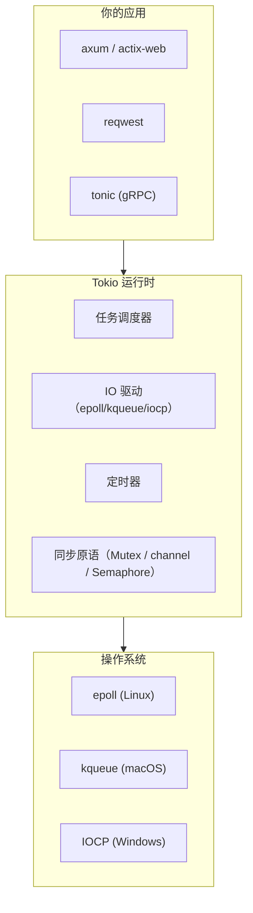
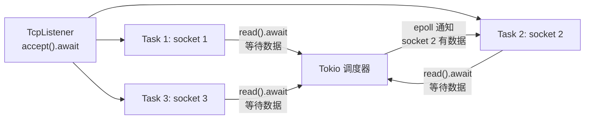

# Rust Tokio：异步运行时的内核、任务与通道

> 本文基于 Rust 1.85，tokio 1.44。

## 没有 Tokio 的 Rust 异步，只有一半

Rust 的 `async`/`await` 是语言内置的——但语言只定义了语法和 `Future` trait，没有提供运行时。异步代码要真正跑起来，需要一个运行时来调度任务、驱动 IO。

Tokio 就是 Rust 生态里最广泛使用的异步运行时。它的定位不是「一个异步框架」——它是 Rust 异步生态的基础设施。`hyper`、`axum`、`tonic`、`reqwest` 这些库全部跑在 Tokio 之上。



## #[tokio::main]：入口

```rust
#[tokio::main]
async fn main() {
    println!("Hello from async main");
}
```

这个宏展开后大约是这样：

```rust
fn main() {
    let rt = tokio::runtime::Runtime::new().unwrap();
    rt.block_on(async {
        println!("Hello from async main");
    });
}
```

`#[tokio::main]` 做了三件事：创建运行时、用 `block_on` 执行你的 async 函数、在所有任务结束后退出。默认用多线程运行时——工作线程数等于 CPU 核数。也可以手动控制：

```rust
#[tokio::main(worker_threads = 2)]
async fn main() { ... }

// 或者完全手动创建
fn main() {
    let rt = tokio::runtime::Builder::new_multi_thread()
        .worker_threads(4)
        .thread_name("my-worker")
        .enable_all()
        .build()
        .unwrap();
    rt.block_on(async { ... });
}
```

## spawn：把任务丢到后台

`tokio::spawn` 是 Tokio 最重要的 API 之一——它把一个 future 提交到运行时，立即返回，任务在后台执行：

```rust
use tokio::time::{sleep, Duration};

#[tokio::main]
async fn main() {
    // 启动一个后台任务
    let handle = tokio::spawn(async {
        sleep(Duration::from_secs(2)).await;
        println!("后台任务完成");
        42 // 返回值
    });

    // 主任务继续执行，不等待
    println!("主任务继续...");

    // .await 等待后台任务完成，拿到返回值
    let result = handle.await.unwrap();
    println!("拿到结果: {result}");
}
```

`tokio::spawn` 返回 `JoinHandle<T>`——类似 `thread::spawn` 的 `JoinHandle`，但 `.await` 而不是 `.join()`。

几个要点：

```rust
// ❌ spawn 里的 future 必须是 'static——不能借用局部变量
let data = vec![1, 2, 3];
tokio::spawn(async {
    println!("{:?}", data); // data 可能活得不够久
});

// ✅ 用 Arc 转移所有权
let data = Arc::new(vec![1, 2, 3]);
let data = Arc::clone(&data);
tokio::spawn(async move {
    println!("{:?}", data);
});
```

## 异步 IO：TCP Echo 服务器

理解 Tokio 的 IO 模型，从一个 TCP echo 服务器开始：

```rust
use tokio::io::{AsyncReadExt, AsyncWriteExt};
use tokio::net::TcpListener;

#[tokio::main]
async fn main() -> tokio::io::Result<()> {
    let listener = TcpListener::bind("127.0.0.1:8080").await?;
    println!("监听 127.0.0.1:8080");

    loop {
        // accept 是异步的——不会阻塞线程
        let (mut socket, addr) = listener.accept().await?;
        println!("新连接: {addr}");

        // 每个连接 spawn 一个任务
        tokio::spawn(async move {
            let mut buf = vec![0; 1024];
            loop {
                match socket.read(&mut buf).await {
                    Ok(0) => { // 连接关闭
                        println!("{addr} 断开");
                        return;
                    }
                    Ok(n) => {
                        // 原样写回
                        if socket.write_all(&buf[..n]).await.is_err() {
                            return;
                        }
                    }
                    Err(_) => return,
                }
            }
        });
    }
}
```

可以同时用 telnet 测试：

```bash
$ telnet 127.0.0.1 8080
hello
hello
world
world
```

对比一下传统的多线程写法——这段代码只用一个线程就可以同时处理成千上万个连接。没有线程切换、没有栈开销、没有锁竞争。这就是异步 IO 的核心价值。



## Channel：任务间通信

Tokio 内置了四种通道，覆盖不同场景：

### mpsc——多生产者单消费者

```rust
use tokio::sync::mpsc;

#[tokio::main]
async fn main() {
    let (tx, mut rx) = mpsc::channel(32); // 缓冲区 32

    // 多个生产者
    for i in 0..5 {
        let tx = tx.clone();
        tokio::spawn(async move {
            for j in 0..3 {
                tx.send(format!("生产者 {i} 消息 {j}")).await.unwrap();
            }
        });
    }
    drop(tx); // 必须 drop 原始 tx——否则 rx 永远不知道什么时候结束

    // 单个消费者
    while let Some(msg) = rx.recv().await {
        println!("收到: {msg}");
    }
}
```

`drop(tx)` 是关键——Tokio 的 channel 靠「所有 sender 都被 drop」来判断「不会再有人发消息了」。忘了 drop 原始 tx，`rx.recv()` 永远不会返回 `None`。

### oneshot——一发一收

```rust
use tokio::sync::oneshot;

#[tokio::main]
async fn main() {
    let (tx, rx) = oneshot::channel();

    tokio::spawn(async move {
        // 做点计算...
        let result = 42;
        tx.send(result).unwrap(); // 发送一次
    });

    // 等待结果
    let result = rx.await.unwrap();
    println!("结果: {result}");
}
```

`oneshot` 的模式是「启动一个任务做计算，把结果发回来」——相当于异步版的 `thread::spawn` + `join`。

### broadcast——一发多收

```rust
use tokio::sync::broadcast;

#[tokio::main]
async fn main() {
    let (tx, _) = broadcast::channel(16);

    let mut rx1 = tx.subscribe();
    let mut rx2 = tx.subscribe();

    tokio::spawn(async move {
        for i in 0..5 {
            tx.send(format!("消息 {i}")).unwrap();
        }
    });

    // 两个接收者都能收到所有消息
    tokio::spawn(async move {
        while let Ok(msg) = rx1.recv().await {
            println!("rx1: {msg}");
        }
    });

    while let Ok(msg) = rx2.recv().await {
        println!("rx2: {msg}");
    }
}
```

### watch——最新值通知

```rust
use tokio::sync::watch;

#[tokio::main]
async fn main() {
    let (tx, mut rx) = watch::channel(0);

    // 定期更新值
    tokio::spawn(async move {
        for i in 1..=5 {
            tx.send(i).unwrap();
            tokio::time::sleep(tokio::time::Duration::from_millis(100)).await;
        }
    });

    // 值变化时收到通知——只拿到最新值
    while rx.changed().await.is_ok() {
        println!("当前值: {}", *rx.borrow());
    }
}
```

`watch` 和 `broadcast` 的区别：broadcast 每条消息都会收到，watch 只取最新值——适合配置变更、状态同步等场景。

### 四种通道对比

| 通道 | 生产者 | 消费者 | 特点 |
|------|--------|--------|------|
| `mpsc` | 多个 | 一个 | 有界/无界缓冲，最通用 |
| `oneshot` | 一个 | 一个 | 一发一收，一次性 |
| `broadcast` | 一个 | 多个 | 每条消息所有接收者都能收到 |
| `watch` | 一个 | 多个 | 只取最新值，适合状态同步 |

## select!：等最先完成的那个

Tokio 的 `select!` 在多个异步操作上等待，哪个先完成就处理哪个：

```rust
use tokio::select;
use tokio::time::{sleep, Duration};

#[tokio::main]
async fn main() {
    let task1 = tokio::spawn(async {
        sleep(Duration::from_secs(2)).await;
        "任务 1"
    });

    let task2 = tokio::spawn(async {
        sleep(Duration::from_secs(1)).await;
        "任务 2"
    });

    select! {
        result = task1 => {
            println!("任务 1 先完成: {:?}", result);
        }
        result = task2 => {
            println!("任务 2 先完成: {:?}", result);
        }
    }
    // 输出: 任务 2 先完成: Ok("任务 2")
}
```

### select! 的实用模式

```rust
use tokio::select;
use tokio::sync::mpsc;
use tokio::time::{sleep, Duration};

#[tokio::main]
async fn main() {
    let (tx, mut rx) = mpsc::channel(32);
    let shutdown_tx = tx.clone();

    // 模式一：超时
    let result = select! {
        msg = rx.recv() => msg,
        _ = sleep(Duration::from_secs(5)) => {
            eprintln!("超时：5 秒内没收到消息");
            return;
        }
    };

    // 模式二：多路接收，合并到一个循环
    let (tx2, mut rx2) = mpsc::channel(32);
    loop {
        select! {
            Some(msg) = rx.recv() => {
                println!("来自通道 1: {msg}");
            }
            Some(msg) = rx2.recv() => {
                println!("来自通道 2: {msg}");
            }
            else => break, // 两个通道都关闭了
        }
    }

    // 模式三：取消令牌（Ctrl+C）
    tokio::spawn(async move {
        loop {
            select! {
                _ = tokio::signal::ctrl_c() => {
                    println!("收到 Ctrl+C，通知关闭...");
                    let _ = shutdown_tx.send(()).await;
                    return;
                }
            }
        }
    });
}
```

`select!` 是异步 Rust 最强大的控制流工具——它可以同时等待多个不同操作，也可以给任何操作加上超时，还可以实现取消模式。Go 程序员会觉得这很像 `select` + `case`，但 Tokio 的版本可以对任意 future 操作，不仅仅是 channel。

## 实战：HTTP 健康检查服务

```rust
use std::collections::HashMap;
use std::sync::Arc;
use tokio::io::{AsyncReadExt, AsyncWriteExt};
use tokio::net::TcpStream;
use tokio::sync::RwLock;
use tokio::time::{sleep, Duration};

struct HealthChecker {
    targets: RwLock<HashMap<String, String>>, // name → addr
}

impl HealthChecker {
    fn new() -> Arc<Self> {
        Arc::new(HealthChecker {
            targets: RwLock::new(HashMap::new()),
        })
    }

    async fn add_target(self: &Arc<Self>, name: &str, addr: &str) {
        self.targets
            .write()
            .await
            .insert(name.to_string(), addr.to_string());
    }

    async fn check_one(addr: &str) -> bool {
        match tokio::time::timeout(
            Duration::from_secs(2),
            TcpStream::connect(addr),
        )
        .await
        {
            Ok(Ok(mut stream)) => {
                // 连接成功——发一个 HTTP HEAD 请求
                let req = format!("HEAD / HTTP/1.0\r\nHost: {}\r\n\r\n", addr);
                if stream.write_all(req.as_bytes()).await.is_err() {
                    return false;
                }
                let mut buf = [0; 1024];
                stream.read(&mut buf).await.is_ok()
            }
            _ => false,
        }
    }

    async fn run(self: Arc<Self>) {
        loop {
            let targets = self.targets.read().await;
            let mut handles = vec![];

            for (name, addr) in targets.iter() {
                let name = name.clone();
                let addr = addr.clone();
                handles.push(tokio::spawn(async move {
                    let ok = HealthChecker::check_one(&addr).await;
                    (name, ok)
                }));
            }
            drop(targets);

            for handle in handles {
                let (name, ok) = handle.await.unwrap();
                println!(
                    "[{}] {} - {}",
                    chrono::Local::now().format("%H:%M:%S"),
                    name,
                    if ok { "✅" } else { "❌" }
                );
            }

            sleep(Duration::from_secs(10)).await;
        }
    }
}

#[tokio::main]
async fn main() {
    let checker = HealthChecker::new();
    checker.add_target("GitHub", "github.com:80").await;
    checker.add_target("Google", "google.com:80").await;
    checker.add_target("本地服务", "127.0.0.1:8080").await;

    checker.run().await;
}
```

这个例子展示了 Tokio 的异步 IO（`TcpStream::connect`）、超时控制（`timeout`）、并发健康检查（`spawn` + 多 task）、读写锁（`RwLock`）——几乎所有核心机制。

## Tokio 同步原语 vs 标准库

Tokio 提供了标准库同步原语的异步版本：

| 用途 | 标准库（阻塞） | Tokio（异步） |
|------|---------------|--------------|
| 互斥锁 | `std::sync::Mutex` | `tokio::sync::Mutex` |
| 读写锁 | `std::sync::RwLock` | `tokio::sync::RwLock` |
| 信号量 | — | `tokio::sync::Semaphore` |
| 通知 | — | `tokio::sync::Notify` |
| 屏障 | `std::sync::Barrier` | `tokio::sync::Barrier` |
| 通道 | `std::sync::mpsc` | `tokio::sync::mpsc` 等 |

关键原则：**锁的持有时间越短越好**。如果临界区里只是改一个整数——用标准库的 `Mutex`（没有 `.await`，不跨 yield 点）。如果临界区里有异步操作——必须用 Tokio 的 `Mutex`。

```rust
// ✅ 临界区很短，标准库 Mutex 足够了
use std::sync::Mutex;
let counter = Mutex::new(0);
{
    let mut n = counter.lock().unwrap();
    *n += 1;
}

// ✅ 临界区有 .await，必须用 Tokio Mutex
use tokio::sync::Mutex;
let cache = Mutex::new(HashMap::new());
{
    let mut map = cache.lock().await;
    // 如果缓存里没有，从数据库加载……
    let data = fetch_from_db().await; // .await 跨 yield 点
    map.insert("key", data);
}
```

实际上，`tokio::sync::Mutex` 用得比你想的少——多数场景可以用 `Arc<std::sync::Mutex<T>>` 或直接用 channel 解决同步问题。Tokio 官方文档的建议是：**优先用标准库 Mutex，除非锁的持有时间跨越了 `.await`**。

## 关键要点

1. **`#[tokio::main]`** 不只是语法糖——它创建运行时、执行 async main、在所有任务结束时退出
2. **`spawn` 要求 `'static`**——任务不能借用局部变量，用 `Arc` 转移所有权
3. **忘了 `drop(tx)` 是常见的 bug**——mpsc channel 的 sender 没全 drop，receiver 会永远等下去
4. **`select!` 是异步控制流的核心**——超时、取消、多路复用都用它
5. **`tokio::sync::Mutex` 不总比 `std::sync::Mutex` 好**——临界区短就用标准库版，简单且更快
6. **不要阻塞异步线程**——在 async 函数里调 `std::thread::sleep` 会堵住工作线程，用 `tokio::time::sleep` 代替
