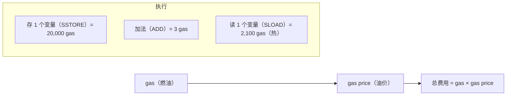

# Solidity（一）：EVM 世界观——Solidity 不是一个普通的编程语言

> 你用 Java/Python 在服务器上跑代码——如果服务器挂了，重启就好。你在 Solidity 写的代码部署到以太坊上——永远在那里，删不掉。这不是比喻。这是 EVM 的铁律。

## 核心比喻：自动售货机

智能合约就像一台自动售货机：

```text
自动售货机                    智能合约
──────────────────────────────────────
投币 → 选商品 → 出货         调用 → 执行代码 → 状态变化
机器坏了可以修                部署了就永远在那里
老板可以开机器改价格           连部署者也不能篡改
只接受一种硬币                只接受区块链上的交易
每投一次币有成本              每执行一步消耗 gas
```

Solidity 代码不是跑在你的服务器上——是跑在以太坊网络每一台全节点上。你部署一个合约，几千台机器同时执行它。所以每一行代码都有真实的金钱成本。

## 第一段 Solidity 代码

```solidity
// SPDX-License-Identifier: MIT
pragma solidity ^0.8.35;

contract Counter {
    uint256 public count;

    function increment() public {
        count += 1;
    }

    function getCount() public view returns (uint256) {
        return count;
    }
}
```

和普通语言的差异在哪儿？

- **`contract`**——不是 class、不是 struct。它是一个部署在链上的独立实体，有自己的地址。
- **`uint256`**——不是 int。Solidity 的世界以 256 位为最小单元，因为 EVM 的栈槽 = 256 位。
- **`public`**——和别的语言不一样。这里的 `public` 不仅允许外部调用，还**自动生成一个 getter 函数**。
- **`view`**——承诺这个函数不修改状态（不耗 gas 的读操作）。写了 view 但实际改了状态？编译器不让你编译。
- **`increment()` 没有 view**——它要改 `count`，改状态需要发交易、消耗 gas。

## gas：每一行代码都在烧钱

```text
部署 Counter 合约：约 100,000 gas
调用 increment()：约 43,000 gas
调用 getCount()： 约 2,400 gas（因为是 view，本地执行）
```

gas 是什么？把它理解成**燃油**：



gas 的存在有两个原因：
1. **防止无限循环**——每次操作都耗 gas，gas 耗完交易停止，不会死循环阻塞网络
2. **为计算资源定价**——存储比计算贵得多（SSTORE 20000 gas vs ADD 3 gas），因为存储要给所有节点分摊

## SPDX-License-Identifier 为什么必须写

第一行 `// SPDX-License-Identifier: MIT`，不写编译器**报错**。这是 Solidity 编译器的强制要求——每个源文件必须声明许可证。因为智能合约代码是公开的，需要明确法律上的使用权。

## 编译和部署：一个真实流程

```bash
# 安装 Solidity 编译器
npm install -g solc

# 编译合约
solc --bin --abi Counter.sol

# 输出：
# Binary: 608060405234801561001057600080fd5b50...（字节码——部署到链上的二进制）
# ABI:    [{"inputs":[],"name":"increment"...}]  （接口——告诉别人怎么调）
```

部署不是把 Solidity 源码传到链上——是**编译成 EVM 字节码**传上去。一旦部署，字节码**不可更改**。如果你发现了 bug，不能「更新合约」——只能部署一个新合约，然后告诉所有人用新的。

## 账户：外部账户 vs 合约账户

```text
外部账户（EOA）       — 由人控制，持有私钥。可以发起交易。
合约账户（Contract）  — 由代码控制，不持有私钥。不能自己发起交易——必须被外部账户或其他合约调用。
```

你（EOA）→ 调用 → 合约 → 合约内部可以再调用另一个合约

## 小结

- **EVM = 世界计算机**——代码跑在几千个节点上，不是你的服务器
- **gas = 燃油**——每一步操作都有成本，存储远比计算贵
- **部署即永恒**——合约一旦部署不可修改，bug 修不了
- **语言是为 EVM 设计的**——256 位、gas 意识、不可变——所有语法特性都扎根于 EVM 的底层约束

下一篇讲类型系统——为什么 Solidity 的默认整数是 256 位，bytes 和 string 有什么区别。

---

**下一篇：** [（二）类型与变量——256 位是默认，不是奢侈](02-types-and-variables.md)
