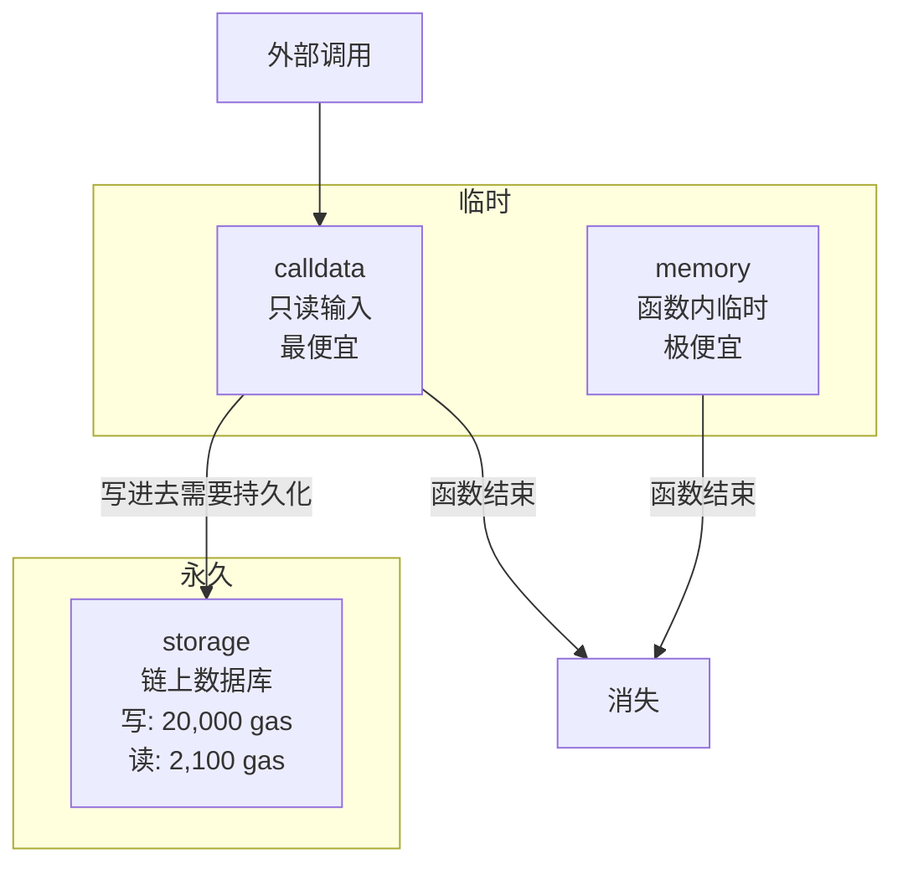

# Solidity（三）：Storage vs Memory——数据的两种活法

> 同样是 `uint256 x = 5`，写在 storage 上花 20,000 gas，放在 memory 里只花 3 gas。Storage 是你买的房子，memory 是你写的便签——房子一平米几万块，便签随手就写。

## 四种数据位置

```text
storage    — 链上持久存储。贵、慢、永久的。
memory     — 临时内存。便宜、只在函数执行期间存在。
calldata   — 只读的输入数据。比 memory 更便宜但不能改。
stack      — EVM 栈。编译器自动管理，你不能直接控制。
```



## storage：链上的房子

```solidity
contract StorageDemo {
    // 状态变量——默认存储在 storage
    uint256 public storedData;  // 这是一个 storage 变量

    function set(uint256 x) public {
        storedData = x;          // SSTORE——20,000 gas（首次从零写入）
        storedData = x + 1;      // SSTORE——5,000 gas（修改已有值）
    }
}
```

storage 的花费取决于操作类型：

| 操作 | gas | 说明 |
|------|-----|------|
| 零值 → 非零值 | 20,000 | 最贵——在状态树里创建新节点 |
| 非零值 → 非零值 | 5,000 | 修改已有值 |
| 非零值 → 零值 | 5,000 + 退款 15,000 | 清理存储有 gas 退款 |

清理存储有 gas 退款——这是以太坊鼓励你「不用的空间还给网络」的经济激励机制。

## memory：函数的草稿纸

```solidity
function doSomething() public pure returns (uint256) {
    uint256 x = 5;        // 在 memory 中创建，函数结束即销毁
    uint256 y = x + 3;
    return y;             // 返回的值被复制到调用者的 memory
}
```

memory 中的变量只在函数执行期间存在。函数 return 之后，这些 memory 空间就被回收了。memory 的扩容有成本（按字收费，每 32 字节 ~3 gas），但在大多数场景下远小于 storage。

## calldata：只读的输入

```solidity
contract CalldataDemo {
    // 外部函数的参数默认在 calldata 中
    function process(string calldata input) external pure returns (bytes32) {
        // input 在 calldata——只读，不能修改
        // ❌ input = "new value";  // 编译错误
        return keccak256(bytes(input));  // 只能读
    }

    function processMemory(string memory input) public pure returns (bytes32) {
        // input 在 memory——可以改，但成本更高
        // 调用者已经把数据从 calldata 复制到了 memory
        return keccak256(bytes(input));
    }
}
```

如果数据不需要修改，用 `calldata` 而不是 `memory`——省掉从 calldata 到 memory 的复制成本。

## 数组和 struct 的存储位置陷阱

这是 Solidity 新手最容易踩到的坑：

```solidity
contract ArrayTrap {
    uint256[] public numbers;

    // ❌ 陷阱：在 storage 数组上循环
    function sumStorage() public view returns (uint256) {
        uint256 total = 0;
        for (uint256 i = 0; i < numbers.length; i++) {
            total += numbers[i];
            //            ↑ 每次循环一次 SLOAD（2,100 gas）
            // 100 个元素的数组 = 210,000 gas
        }
        return total;
    }

    // ✅ 正确：先把 storage 数组复制到 memory
    function sumMemory() public view returns (uint256) {
        uint256[] memory memNumbers = numbers;  // 一次复制全部到 memory
        uint256 total = 0;
        for (uint256 i = 0; i < memNumbers.length; i++) {
            total += memNumbers[i];
            //            ↑ memory 读取（3 gas）
            // 100 个元素 ≈ 300 gas + 一次复制成本
        }
        return total;
    }
}
```

小数组（< 10 个元素）循环 storage 无所谓。大数组（50+）一定要先复制到 memory。

## 引用类型赋值的行为差异

```solidity
contract RefBehavior {
    uint256[] public arr;

    // storage 引用——指向同一块数据
    function storageRef() public {
        uint256[] storage localRef = arr;  // localRef 和 arr 是同一个数组
        localRef.push(42);                  // arr 也被改了
    }

    // memory 引用——独立副本
    function memoryCopy() public view {
        uint256[] memory localCopy = arr;  // localCopy 是 arr 的副本
        // localCopy.push(42);               // ❌ memory 数组不能 push
        // 改了 localCopy 不影响 arr
    }
}
```

- **`storage` 的赋值 = 赋引用**（两个变量指向同一块存储）
- **`memory` 的赋值 = 赋副本**（独立的拷贝）

这是 Solidity 和 JavaScript 行为最相似的地方——但它比 JavaScript 更多了一个可见的数据位置标签。

## 存储槽：编译器怎么排布数据

```solidity
contract StorageLayout {
    uint256 public a;  // 槽 0（32 字节——一个完整的 256 位槽）
    uint128 public b;  // 槽 1，偏移 0（16 字节）
    uint128 public c;  // 槽 1，偏移 16 字节——和 b 共享同一个 256 位槽
    uint256 public d;  // 槽 2——槽 1 装不下 256 位了，开新槽
}
```

mapping 和动态数组的存储布局更复杂——它们用的是 `keccak256(key + slot)` 来定位。

## 小结

| 数据位置 | 生命周期 | 修改 | 成本 | 类比 |
|----------|---------|------|------|------|
| `storage` | 永久 | ✅ | 极高（20000/5000） | 买房子 |
| `memory` | 函数内 | ✅ | 低（3-30） | 便签纸 |
| `calldata` | 函数内 | ❌（只读） | 极低 | 信封上的字 |

- 函数参数能用 `calldata` 就别用 `memory`
- 大数组循环前先复制到 memory
- storage 赋值是引用，memory 赋值是副本
- 清理存储有 gas 退款——不用的数据应该删掉

下一篇讲函数、修饰器与事件——view/pure/payable 的区别和 modifier 的 AOP 机制。

---

**上一篇：** [（二）类型与变量](02-types-and-variables.md)
**下一篇：** [（四）函数、修饰器与事件](04-functions-and-modifiers.md)
