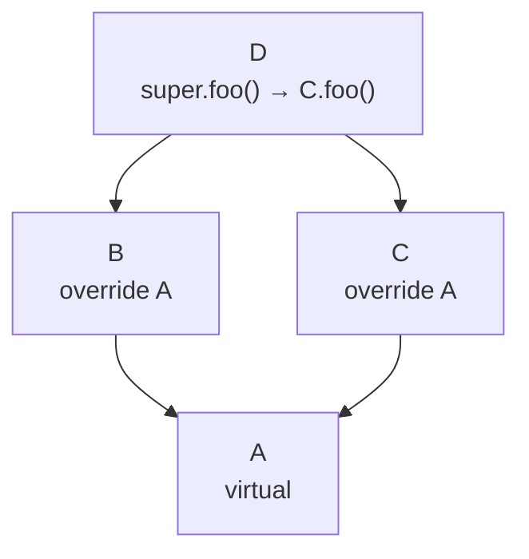

# Solidity（六）：继承、接口与抽象合约

> Solidity 支持多重继承——用的和 Python 一模一样的 C3 线性化算法。但多了一个 Python 没有的东西：父合约的构造函数参数需要显式传给继承链。

## 单继承

```solidity
contract Ownable {
    address public owner;

    constructor() {
        owner = msg.sender;
    }

    modifier onlyOwner() {
        require(msg.sender == owner, "Not owner");
        _;
    }
}

contract MyContract is Ownable {
    // MyContract 继承了 owner 状态变量 + onlyOwner modifier
    function withdraw() public onlyOwner {
        payable(owner).transfer(address(this).balance);
    }
}
```

和 Java 的 `extends` 一样的基础用法，传构造函数参数的方式不同：

```solidity
contract Base {
    uint256 public x;
    constructor(uint256 _x) { x = _x; }
}

// 方式 1：直接在继承声明里传参
contract Derived1 is Base(42) { }

// 方式 2：在派生合约构造函数里传
contract Derived2 is Base {
    constructor(uint256 _x) Base(_x) { }
}
```

## 多重继承与 C3 线性化

```solidity
contract A {
    function foo() public pure virtual returns (string memory) {
        return "A";
    }
}

contract B is A {
    function foo() public pure virtual override returns (string memory) {
        return "B";
    }
}

contract C is A {
    function foo() public pure virtual override returns (string memory) {
        return "C";
    }
}

// 多重继承——D 同时继承了 B 和 C
contract D is B, C {
    function foo() public pure override(B, C) returns (string memory) {
        // 必须显式 override——编译器帮你检查是否和所有父合约冲突
        return super.foo();  // 按 C3 线性化顺序调用
    }
}
```

C3 线性化顺序：`D → B → C → A`



`super.foo()` 在 Solidity 里是按继承顺序链式调用——D 的 super 是 B，B 的 super 是 C，C 的 super 是 A。每个 override 的父合约都会被遍历到，不会跳过。

### virtual 和 override 是必须的

```solidity
contract Parent {
    // virtual = 「子合约可以重写这个方法」
    function greet() public pure virtual returns (string memory) {
        return "Hello from Parent";
    }
}

contract Child is Parent {
    // override = 「我正在重写父合约的方法」
    function greet() public pure override returns (string memory) {
        return "Hello from Child";
    }
}
```

Solidity 强制显式标注 virtual 和 override——不标注就编译不过。这比 Java 的 `@Override` 注解更强硬——不是「建议」，是「必须」。

多重继承时需要指定 override 了哪些父合约：

```solidity
contract Child is Parent1, Parent2 {
    function greet() public pure override(Parent1, Parent2) returns (string memory) {
        //                           ^^^^^^^^^^^^^^^^
        //                           明确列出所有被 override 的父合约
        return "Hello from Child";
    }
}
```

## 抽象合约 vs 接口

```solidity
// 抽象合约——可以包含已实现的方法和未实现的虚函数
abstract contract Animal {
    function speak() public virtual returns (string memory);
    //      ↑ 没有函数体 = 纯虚函数——子合约必须实现

    function breathe() public pure returns (string memory) {
        return "Breathing...";  // 已实现的方法——子合约可以选 override
    }
}

// 接口——只定义契约，不允许任何实现
interface IERC20 {
    function transfer(address to, uint256 amount) external returns (bool);
    function balanceOf(address account) external view returns (uint256);
    // 不能有构造函数，不能有状态变量，不能有已实现的方法
}
```

| | 抽象合约 | 接口 |
|---|---|---|
| 关键字 | `abstract contract` | `interface` |
| 状态变量 | ✅ | ❌ |
| 构造函数 | ✅ | ❌ |
| 已实现方法 | ✅ | ❌ |
| 继承其他合约 | ✅ | ✅ |
| 每次调用 gas | 和普通合约一样 | 和普通合约一样 |

接口在 ABI 意义上存在——编译后不部署代码，只用于 ABI 级兼容。

## library：无状态的可复用代码

```solidity
library Math {
    function max(uint256 a, uint256 b) internal pure returns (uint256) {
        return a > b ? a : b;
    }

    function min(uint256 a, uint256 b) internal pure returns (uint256) {
        return a < b ? a : b;
    }
}

contract UsingLibrary {
    using Math for uint256;

    function compare(uint256 a, uint256 b) public pure returns (uint256, uint256) {
        return (a.max(b), a.min(b));  // 用 using ... for 语法把方法挂到类型上
    }

    // 等价于
    function compareExplicit(uint256 a, uint256 b) public pure returns (uint256, uint256) {
        return (Math.max(a, b), Math.min(a, b));
    }
}
```

library 和普通合约的区别：
- **不能有状态变量**——纯函数的集合
- **不能接收 ETH**
- **不能被继承**
- 如果是 `internal` 函数——编译期内联，调用不花额外 gas
- 如果是 `public` 函数——部署为独立合约，通过 DELEGATECALL 调用

## 实战：用继承组织一个 DeFi 合约

```solidity
// 接口定义——ERC20 标准
interface IERC20 {
    function transfer(address to, uint256 amount) external returns (bool);
    function balanceOf(address account) external view returns (uint256);
}

// 抽象合约——权限控制
abstract contract Ownable {
    address public owner;
    constructor() { owner = msg.sender; }
    modifier onlyOwner() { require(msg.sender == owner); _; }
}

// 库——安全数学（虽然 0.8+ 已经内置溢出检查）
library SafeMath {
    function add(uint256 a, uint256 b) internal pure returns (uint256) {
        return a + b;
    }
}

// 最终合约——组合以上所有
contract Vault is Ownable, IERC20 {
    using SafeMath for uint256;

    mapping(address => uint256) private _balances;

    function transfer(address to, uint256 amount) external override returns (bool) {
        require(_balances[msg.sender] >= amount, "Insufficient");
        _balances[msg.sender] = _balances[msg.sender].add(amount); // SafeMath.add
        _balances[to] = _balances[to].add(amount);
        return true;
    }

    function balanceOf(address account) external view override returns (uint256) {
        return _balances[account];
    }

    // 只有 owner 能提款
    function emergencyWithdraw() external onlyOwner {
        payable(owner).transfer(address(this).balance);
    }
}
```

这个例子展示了 Solidity 代码组织的最佳实践：**接口定义契约 → 抽象合约提供部分实现 → library 提供工具函数 → 最终合约组合一切**。

## 小结

- **多重继承用 C3 线性化**——和 Python 一样的算法，`super` 按继承链顺序调
- **virtual/override 是强制的**——不写编译不过，编译器帮你检查冲突
- **抽象合约**有状态和方法，**接口**只有契约——选用取决于是否需要共享实现
- **library** 是不能有状态变量的纯函数集合——internal 函数编译期内联，免费

下一篇讲安全——重入攻击、访问控制、闪电贷原理，每个都带真实攻击案例。

---

**上一篇：** [（五）映射与结构体](05-mappings-and-structs.md)
**下一篇：** [（七）安全——重入攻击与链上陷阱](07-security.md)
