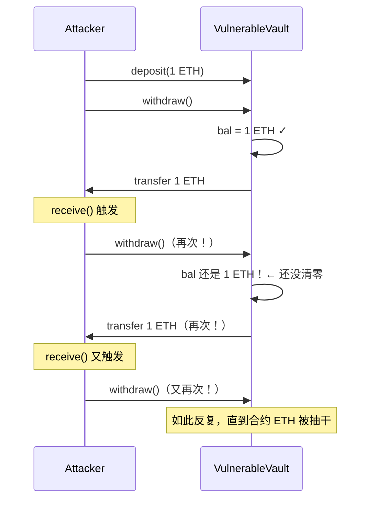

# Solidity（七）：安全——重入攻击与链上陷阱

> 2016 年，The DAO 被重入攻击盗走 360 万 ETH（当时价值 6000 万美元），直接导致以太坊硬分叉。这个攻击只需要 5 行 Solidity 代码就能实现——而防御它只需要记住一条原则：先改状态，再转账。

## 重入攻击（Reentrancy）

这是 Solidity 历史上最著名的漏洞。

### 攻击原理

```solidity
// 有漏洞的合约
contract VulnerableVault {
    mapping(address => uint256) public balances;

    function deposit() public payable {
        balances[msg.sender] += msg.value;
    }

    function withdraw() public {
        uint256 bal = balances[msg.sender];
        require(bal > 0, "No balance");

        // ❌ 先转账……再清零。攻击窗口在这！
        (bool success, ) = msg.sender.call{value: bal}("");
        require(success);

        balances[msg.sender] = 0;
    }
}

// 攻击合约
contract Attacker {
    VulnerableVault public vault;

    constructor(VulnerableVault _vault) {
        vault = _vault;
    }

    function attack() public payable {
        vault.deposit{value: 1 ether}();
        vault.withdraw();
    }

    // 当 Vault 转 ETH 回来时，这个函数被自动触发
    receive() external payable {
        if (address(vault).balance >= 1 ether) {
            vault.withdraw();  // ← 在余额清零前再次提款！
        }
    }
}
```



攻击的核心：**在余额清零之前，控制权已经交还给了攻击者**。`.call{value}()` 会触发接收者的 `receive()` 函数，攻击者在 `receive()` 里递归调用 `withdraw()`。

### 防御：检查-效果-交互 模式

```solidity
contract SafeVault {
    mapping(address => uint256) public balances;

    function deposit() public payable {
        balances[msg.sender] += msg.value;
    }

    function withdraw() public {
        uint256 bal = balances[msg.sender];
        require(bal > 0, "No balance");

        // ✅ 先改状态，再转账
        balances[msg.sender] = 0;

        (bool success, ) = msg.sender.call{value: bal}("");
        require(success);
        // 即使被递归调用 withdraw()，balances 已经是 0 了
    }
}
```

**检查-效果-交互（Checks-Effects-Interactions）**：

```text
1. Checks：  验证输入和前条件（require）
2. Effects： 修改自己的状态变量（先更新！）
3. Interactions：调用外部合约或发 ETH（放最后！）
```

另外两种防御方式：

```solidity
// 方式 2：OpenZeppelin 的 ReentrancyGuard
import "@openzeppelin/contracts/utils/ReentrancyGuard.sol";

contract SafeVault is ReentrancyGuard {
    function withdraw() public nonReentrant {
        // nonReentrant modifier 阻止递归调用
    }
}

// 方式 3：直接用 transfer()（2300 gas 限制——没 gas 做重入）
// 但 transfer() 的 2300 gas 限制在 EIP-1884 后可能不够用
// 建议用 Checks-Effects-Interactions 而不是依赖 gas 限制
```

## 访问控制：tx.origin vs msg.sender

```solidity
contract Phishing {
    // ❌ 用 tx.origin 做权限检查——可以被钓鱼
    function badCheck() public view {
        require(tx.origin == owner, "Not owner");
    }

    // ✅ 用 msg.sender
    function goodCheck() public view {
        require(msg.sender == owner, "Not owner");
    }
}
```

攻击场景：

```text
1. 用户（tx.origin）被诱骗调用了攻击合约的某个函数
2. 攻击合约内部调用你的合约
3. 在你的合约里，msg.sender = 攻击合约，tx.origin = 用户
4. 如果用 tx.origin 做权限检查——绕过！

tx.origin = 交易的原始发起者（永远是 EOA）
msg.sender = 当前调用的直接调用者
```

**永远用 `msg.sender`，永远不要用 `tx.origin` 做权限检查。**

## 整数溢出（Solidity 0.8+ 已解决）

```solidity
// Solidity < 0.8：需要 SafeMath
uint8 x = 255;
x = x + 1;  // 变成 0——溢出但不报错，静默错误

// Solidity >= 0.8：自动检测
uint8 x = 255;
x = x + 1;  // 直接 revert！溢出保护内置
```

0.8+ 的编译器已经在所有算术运算后插入了溢出检查的字节码。不需要 SafeMath 库了。

## 闪电贷攻击

闪电贷不是漏洞——是 DeFi 的合法工具，但攻击者用它来做杠杆攻击。

```text
闪电贷机制：
  1. 借一大笔钱（无需抵押——只要在同一笔交易里还就行）
  2. 用这笔钱做一系列操作（操纵价格、套利、清算）
  3. 在同一笔交易结束前还钱
  4. 如果还不出来，整个交易 revert——贷款从未发生
```

攻击案例（2020 bZx 攻击，简化版）：

```text
1. 闪电贷借 10,000 ETH
2. 用 5,000 ETH 在 DEX A 上买 WBTC → WBTC 价格暴涨
3. 用另 5,000 ETH 在 DEX B 上做空 WBTC → 触发清算
4. 清算系统用的是 DEX A 的价格（已被操纵）→ 超额清算
5. 套利利润：~35 万美元
6. 还 10,000 ETH 给闪电贷
7. 整个攻击在一笔交易内完成，外面看不到
```

防御：**不要用单 DEX 的实时价格做清算。用 TWAP（时间加权平均价格）或链下预言机（如 Chainlink）。**

## 前端跑路：代理模式的风险

许多 DeFi 项目用代理模式做可升级合约：

```solidity
// 用户交互的是 Proxy——Proxy 不存逻辑，把调用委托给 Implementation
// 如果 Implementation 地址指向恶意代码——所有逻辑被替换
// 这就是「rug pull」的技术实现
```

判断一个项目是否安全：**查看 Proxy 的 admin 是不是多签钱包或时间锁。如果 admin 是一个 EOA 地址——项目方随时能改代码**。

## 安全检查清单

- [ ] `msg.sender` 不是 `tx.origin`——权限检查用正确的变量
- [ ] 外部调用前状态已更新（Checks-Effects-Interactions）
- [ ] 重入锁或 ReentrancyGuard——在涉及 ETH transfer 的函数中
- [ ] transfer/send 的返回值被检查——不要假设一定成功
- [ ] 使用 Solidity 0.8+ 的溢出保护——不需要 SafeMath
- [ ] 价格预言机不用单个 DEX 的实时价格——用 TWAP 或 Chainlink
- [ ] 没有使用 `block.timestamp` 或 `block.number` 做随机源——矿工可以微调
- [ ] 代理合约的 admin 是多签或时间锁——不是单个 EOA

## 小结

| 攻击 | 原理 | 防御 |
|------|------|------|
| 重入攻击 | 外部调用时控制权被攻击者接管 | Checks-Effects-Interactions |
| 访问控制绕过 | tx.origin 被钓鱼 | 只用 msg.sender |
| 整数溢出 | 旧版不检查溢出 | Solidity 0.8+ 内置保护 |
| 闪电贷操纵 | 同一交易内操纵 DEX 价格 | TWAP + Chainlink 预言机 |
| 代理 rug pull | admin 私钥泄露或恶意升级 | 多签 admin + 时间锁 |

智能合约安全不是「加了检查就完美」——是**默认不信任任何外部输入和调用，每行代码都在想「如果对方是恶意合约会怎样」**。

---

**上一篇：** [（六）继承、接口与抽象合约](06-inheritance-and-interfaces.md)
