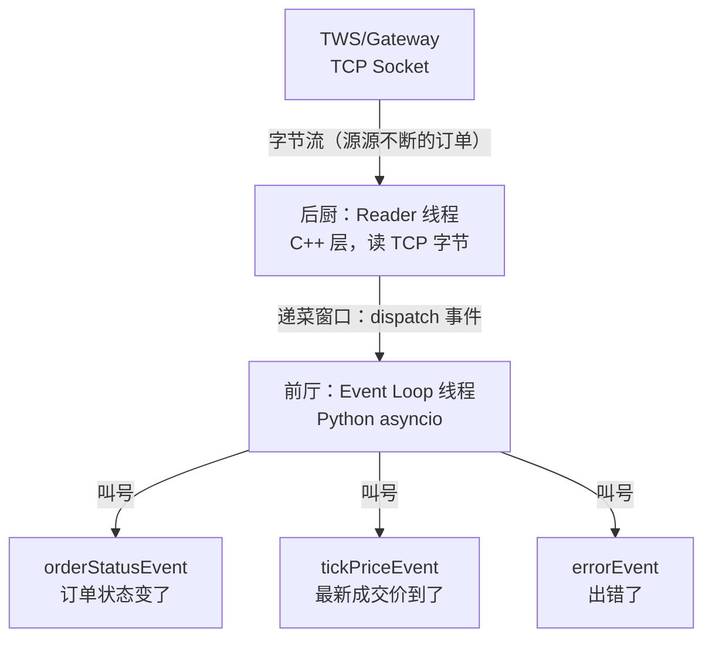
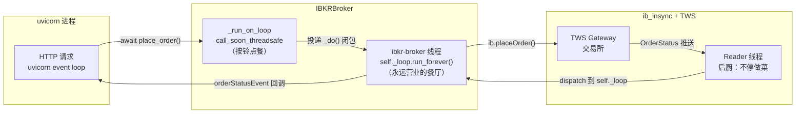
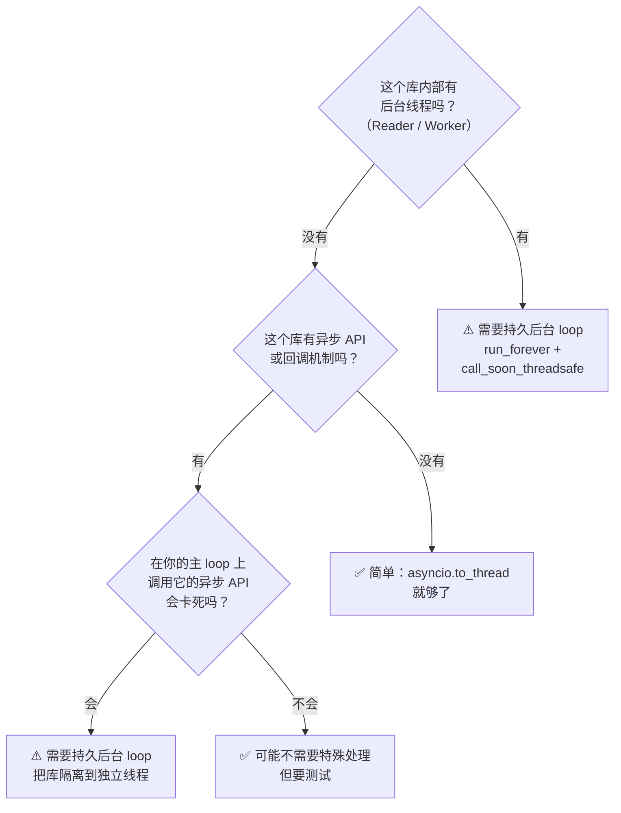

# 当你的 event loop 死了，回调也就死了：ib_insync 持久后台线程调试记

> 本文基于 Python 3.12、ib_insync 0.9.86、FastAPI + uvicorn。

## 问题：下单成功，回调呢？

某天我发现一个诡异的 bug：通过 Order API 下单到 IBKR TWS，`placeOrder` 返回成功，`orderStatus` 也写了 `PendingSubmit`。看起来一切正常——但实际上，订单已经变成了幽灵。

```python
# 下单看起来正常
trade = await broker.place_order(request)
print(trade.order_id)  # 12345 — 有订单号，有状态
print(trade.status)    # PendingSubmit — 看起来在等待成交

# ...但 5 分钟后，订单一动不动
for t in ib.trades():
    print(t.order.orderId)   # 0 ！所有订单 orderId=0
    print(t.orderStatus.status)  # PendingSubmit — 永远停在这里
```

就像你寄了一封信，邮局给了你一个回执编号，你也看到信被投进了邮筒——但收件人永远收不到。你拿着回执编号去查，系统里却查不到这封信的存在。

更坏的是：回调也静默了。`orderStatusEvent` 是 IBKR 推送订单状态变化的主要通道——`PendingSubmit` → `Submitted` → `Filled`，每一步都应该触发一次回调。但现在它**一次也不触发**，像从来没注册过一样。

`orderId=0` 是钥匙。它告诉你：订单确实被发送到了 TWS，TWS 也收到了，但 TWS 返回的确认消息**没有被处理**。就像你给客服打了电话，客服接了，但你的话筒坏了——对方在说话，你什么也听不到。

## ib_insync 的"前台+后台"双人模式

要理解这个 bug，得先理解 ib_insync 的架构。这里有一个关键的"前台+后台"设计。

### 比喻：餐厅的前厅和后厨

把 ib_insync 想象成一家餐厅：

```
┌─────────────────────────────────────────────────────────┐
│                     IBKR 餐厅                            │
│                                                         │
│   ┌──────────────┐          ┌──────────────────┐        │
│   │  后厨         │          │   前厅            │        │
│   │  (Reader 线程)│  递菜窗口 │  (Event Loop)    │        │
│   │              │─────────▶│                  │        │
│   │  C++ 层      │          │  Python 层       │        │
│   │  持续接收     │          │  叫号、上菜       │        │
│   │  TWS 推送     │          │  通知服务员       │        │
│   └──────────────┘          └────────┬─────────┘        │
│                                      │                  │
│                                      ▼                  │
│                              ┌──────────────┐          │
│                              │  服务员        │          │
│                              │  (回调函数)    │          │
│                              │              │          │
│                              │ 你的代码      │          │
│                              └──────────────┘          │
└─────────────────────────────────────────────────────────┘
```



后厨（Reader 线程）是 C++ 层跑的，它只管一件事：从 TCP Socket 读字节，解析成事件，然后**往递菜窗口一放**。它不关心前厅有没有人接，也不关心服务员是不是已经下班了——它就是不停地做菜、递菜。

前厅（Event Loop）是 Python 层的，它的工作是从递菜窗口取菜，然后**叫号**——找到注册了对应回调的服务员（你的回调函数），把菜给他。

### 递菜窗口是单向的、不可更换的

这个架构最关键的细节——也是整个 bug 的根源——在于：**递菜窗口是在餐厅开业（`IB()` 构造函数）时就固定好的**。后厨只认这一个窗口。如果这个窗口没人接了（event loop 停止运行 / 线程死亡），后厨还是会往里递菜——但菜就堆在地上，烂掉，没人会知道。

更具体地说：ib_insync 的 `IB()` 实例在哪个 event loop 上创建，Reader 就永远往那个 loop 投递事件。这是一个**硬绑定**，不是配置项，你改不了。就像餐厅的后厨通道是开业时浇筑的混凝土结构——你不能中途把递菜窗口改到另一个位置去。

所以问题的本质不是"回调没注册"，而是"**回调注册的那个 event loop 已经没人听了**"。

## 四次尝试：从客栈到买房

理解了餐厅模型，现在来看我们走过的弯路。每一次尝试都可以用吃饭的场景来理解。

### 尝试 1：`connectAsync` — 跟别人拼桌

最开始的实现很直接——既然 ib_insync 提供了异步 API，那就在 FastAPI 的 event loop 上直接用呗：

```python
async def connect(self, host, port, client_id):
    self._ib = IB()
    await self._ib.connectAsync(host, port, clientId=client_id)
    self._ib.reqMarketDataType(1)
    contract = Stock("SOXL", "SMART", "USD")
    await self._ib.qualifyContractsAsync(contract)
```

**比喻**：你开了一家快餐店（Order API），做的是汉堡生意（HTTP 请求）。有一天你想加个川菜窗口（IBKR 连接），就把川菜师傅请到你的快餐后厨里干活。结果呢？川菜师傅需要一口大铁锅持续颠勺（长连接），但你的后厨是流线作业的——一个订单一个订单来，一个订单结束就收拾台面。铁锅根本放不下，两个节奏完全冲突。

**技术原因**：uvicorn 的 event loop 是给 HTTP 请求-响应周期设计的——来一个请求，处理，返回，结束。但 IBKR 的连接是**无限长会话**——连接建立后要持续数小时接收价格推送、订单状态更新。uvicorn 的 loop 上 mix 两种完全不同生命周期的工作负载，结果就是：`accountSummaryAsync` 这种需要长时间轮询的方法直接卡死——uvicorn 的 loop 忙着处理 HTTP 请求，没空管你的 account summary。

而且 `connectAsync` 的行为取决于 ib_insync 内部的实现细节——它可能在某些版本里自动创建独立线程，在某些版本里复用当前 loop。行为不可控。

### 尝试 2：`asyncio.to_thread` — 开个钟点房

既然不能拼桌，那给 IBKR 单独开个房间总行了吧——用 `asyncio.to_thread` 在独立线程里做 connect：

```python
async def connect(self, host, port, client_id):
    ib_holder: list[IB] = []

    def _do():
        loop = asyncio.new_event_loop()
        asyncio.set_event_loop(loop)
        ib = IB()              # ← 后厨通道绑定到这个新 loop
        ib.connect(host, port, clientId=client_id)
        ib_holder.append(ib)
        # ⚠️ _do() 返回，loop 被 GC，线程死亡

    await asyncio.to_thread(_do)
    self._ib = ib_holder[0]
```

同样，每次 `place_order` 也开一个新的 `to_thread`：

```python
async def place_order(self, request):
    def _do():
        loop = asyncio.new_event_loop()   # ← 又一个全新 loop
        asyncio.set_event_loop(loop)
        order.orderId = ib.client.getReqId()
        return ib.placeOrder(contract, order)

    trade = await asyncio.wait_for(asyncio.to_thread(_do), timeout=30)
```

**比喻**：你去一个城市出差，不住酒店——每次需要开会就去开个钟点房，开完会退房。第一次去的时候你在房间里留了你的名片（`IB()` 绑定到了那个房间的地址）。之后 TWS 想给你发快递（回调事件），按名片的地址送过去——但你已经退房了。快递员敲门没人应，包裹扔门口就走了。

你第二次又去开会，开了个新房间。但快递员不知道你的新房间号——他只认第一次那张名片上的地址。你在新房间里等快递，永远等不到。

**技术原因**：这是最致命的误解。`IB()` 在 `_do()` 里创建时，Reader 线程**绑定了 `_do()` 里面的那个 event loop**。但 `_do()` 返回后，那个 loop 随着线程一起死了。Reader 没有死——它还在 C++ 层跑着——但它手里握着一个死 loop 的引用。之后 TWS 推送的任何消息，Reader 尝试 `call_soon_threadsafe` 到那个死 loop → 操作系统层面静默失败。

connect 本身是同步的——`ib.connect()` 在 `_do()` 里返回时连接已经建立了——所以 `self._ib` 确实拿到了一个已连接的 IB 实例。但这就像你拿到了手机但把 SIM 卡扔了：手机还在，信号断了。

### 尝试 3：每次操作都开新房间 — 越跑越远

在上一步的基础上，我们想："connect 时的 loop 死了，那每次 place_order 自己建一个 loop 不就好了？"

```python
async def place_order(self, request):
    def _do():
        loop = asyncio.new_event_loop()   # 第三个 loop
        asyncio.set_event_loop(loop)
        order.orderId = ib.client.getReqId()
        return ib.placeOrder(contract, order)
        # 这个 loop 又死了

    trade = await asyncio.wait_for(asyncio.to_thread(_do), timeout=30)
```

**比喻**：你每次去开会都开一个新钟点房，每次都留一张新名片。问题是：快递员手上的名片地址永远是**第一次那个**。你在第 N 个房间等着收快递，而快递一直往第一个房间送——第一个房间早就退房了。

**技术原因**：`placeOrder` 是同步方法，在线程内调用就能成功发出请求——所以返回值（trade 对象）里确实有正确的状态。但这个 trade 对象的**后续更新**依赖 Reader → Event Loop → orderStatusEvent 回调这条链路。

现在把整条链路画出来：

```
placeOrder 发出 ──────────────────────────────────────────┐
                                                          │
TWS 收到，处理，推送 OrderStatus ──────────────────────────┤
                                                          │
ib_insync Reader 收到推送 ────────────────────────────────┤
                                                          │
Reader 找 IB 实例绑定的 event loop ──▶ 是 connect 时创建   │
                                      的那个 loop ──▶ 死了  │
                                                          │
事件丢弃！orderStatusEvent 永远不触发！                      │
                                                          │
ib.trades() 里 orderId=0，status 永远是 PendingSubmit ─────┘
```

`orderId=0` 不是一个"错误值"，它是**初始化默认值**。当 `OrderStatus` 消息从未被处理时，trade 对象里的 orderId 字段就停留在初始的 0。它说明的不是"订单没发出去"，而是"**TWS 的回复没有被投递到任何地方**"。

### 到这里，停下来想 5 分钟

在进入正确答案之前，先停下来想一想：我们到底需要什么？

ib_insync 的设计要求是：
1. **一个 event loop**，在 `IB()` 创建时绑定
2. **这个 loop 必须永远活着**，因为 Reader 随时可能往里面投递事件
3. **所有 IB 操作（connect、placeOrder、cancelOrder）必须在这个 loop 上执行**，否则 Reader 不认

`asyncio.to_thread` 满足第 3 点（操作在线程内执行），但破坏了第 2 点（操作完 loop 就死了）。`asyncio.to_thread` 的语义是"借一个线程，用完还回去"——但 IBKR 需要的是"**买一个线程，永远不还**"。

错误模式总结：我们一直在试图**临时借房间**，而 IBKR 需要的是**买房子**。

### 尝试 4：买房——`run_forever` + `call_soon_threadsafe`

想清楚后，方案就自然浮现了：

1. 创建一个专用的 event loop
2. 在独立 daemon 线程中**永久运行**这个 loop（`run_forever`）
3. 所有操作通过 `call_soon_threadsafe` 从外层（uvicorn）线程**投递**到 IB 的 loop 线程

这就是最终方案。让我们逐段拆解代码。

---

#### 桥梁：`_run_on_loop`

这是整个架构的核心——一个跨线程的同步委托器：

```python
def _run_on_loop(self, func, *args, timeout=30.0):
    """在 IB 事件循环线程中执行 func，阻塞等待结果。"""
    result: list = []
    exc: list = []
    done = threading.Event()

    def _wrapped():
        try:
            result.append(func(*args))
        except Exception as e:
            exc.append(e)
        finally:
            done.set()

    self._loop.call_soon_threadsafe(_wrapped)
    if not done.wait(timeout=timeout):
        raise TimeoutError(f"IB operation timed out ({timeout}s)")
    if exc:
        raise exc[0]
    return result[0] if result else None
```

**比喻**：这就像餐厅的**点餐系统**。

你在前台（uvicorn 线程）写下你想吃的菜（`func`），按一下铃（`call_soon_threadsafe`），然后坐在座位上等（`done.wait`）。后厨（IB 的 loop 线程）听到铃声，从窗口拿走你的订单，开始做菜。做好了把菜放在出餐口，按铃通知你（`done.set()`），你起身去取。

注意几个细节：

- **`result` 和 `exc` 用 list 包装**，因为闭包里不能赋值外部变量，但可以 `append` 到 list。这是一个经典的 Python 跨线程闭包技巧。
- **`threading.Event` 做同步屏障**：调用线程在 `done.wait()` 上阻塞，IB 线程执行完后 `done.set()` 唤醒它。这就是把异步的跨线程委托变成了调用者眼中的同步调用。
- **`call_soon_threadsafe` 不直接执行**：它只是把 `_wrapped` 放入 IB loop 的待办队列。loop 会在下一次迭代时取出来执行。所以 timeout 是必要的——如果 IB loop 卡住了（比如 TWS 断连），调用者不会永远等下去。

#### 连接：买房子，不租酒店

```python
async def connect(self, host, port, client_id):
    self._loop = asyncio.new_event_loop()

    connected = threading.Event()
    conn_err: list[Exception] = []
    ib_holder: list[IB] = []

    def _run():
        asyncio.set_event_loop(self._loop)
        try:
            ib = IB()               # ← 后厨通道绑定到 self._loop
            ib.connect(host, port, clientId=client_id)
            ib.reqMarketDataType(1)
            contract = Stock("SOXL", "SMART", "USD")
            ib.qualifyContracts(contract)
            ib_holder.append(ib)
        except Exception as e:
            conn_err.append(e)
        finally:
            connected.set()         # ← 通知外层：连接完成了
        self._loop.run_forever()    # ← 永不返回！

    self._thread = threading.Thread(
        target=_run, daemon=True, name="ibkr-broker"
    )
    self._thread.start()

    if not connected.wait(timeout=15):
        raise TimeoutError("IB connection timed out")
    if conn_err:
        raise conn_err[0]
    self._ib = ib_holder[0]
```

关键变化是最后一行：`self._loop.run_forever()`。这行代码**永远不会返回**。它让事件循环进入无限循环——不断从队列里取事件、处理、取下一个事件、处理……直到有人显式调用 `loop.stop()`。

之前的版本的问题是 `_do()` 返回后 loop 就死了。现在 `_run()` 进入了 `run_forever()`，**函数的栈帧永远不弹出**，loop 就一直活着。Reader 随时往这个 loop 投递事件，loop 随时能处理——就像你终于买了个房子，地址永不变了。

#### 下单：按铃，等出餐

```python
async def place_order(self, request):
    assert self._ib is not None
    # ... 构建 contract、选择 MKT/LMT ...
    ib = self._ib
    cache = self._con_id_cache

    def _do():
        order.orderId = ib.client.getReqId()
        if need_qualify:
            ib.qualifyContracts(contract)
            cache[request.symbol] = contract.conId
        return ib.placeOrder(contract, order)

    trade = self._run_on_loop(_do)

    # 下单成功！Reader 会收到 OrderStatus 推送，
    # dispatch 到活着 self._loop → orderStatusEvent 正常触发
```

注意 `_do()` 里面**没有** `new_event_loop()` 了——不需要。`getReqId()`、`qualifyContracts`、`placeOrder` 全部在 IB 的后台线程上执行，而这个线程的 loop 就是 Reader 认识的那个 loop。`placeOrder` 返回后，Reader 后续收到的 `OrderStatus` 事件会被投递到**同一个 loop**，`orderStatusEvent` 回调正常触发。

#### 关闭：从里面锁门，不要从外面踹

```python
async def disconnect(self):
    if self._loop is not None and self._loop.is_running():
        self._loop.call_soon_threadsafe(self._loop.stop)
    if self._thread is not None:
        self._thread.join(timeout=5)
```

你不能直接从 uvicorn 线程调用 `self._loop.stop()`——那会导致竞态条件。你必须用 `call_soon_threadsafe` 把"停止"指令投递到 IB 的 loop 里，让它**自己关掉自己**。就像你不能从窗外把手伸进去关灯——你要进屋，按开关，再出来。

#### 完整的架构图



三条关键路径全部经过同一个 `self._loop`：

| 路径 | 方向 | 线程 |
|------|------|------|
| 下单 | uvicorn → `_run_on_loop` → `_do()` → TWS | 跨线程委托 |
| 回调 | TWS → Reader → `self._loop` → `orderStatusEvent` | IB 线程内 |
| 关闭 | uvicorn → `call_soon_threadsafe(loop.stop)` | 跨线程委托 |

## sync.py 的同类修复：同一个病，同一剂药

写完 broker 的修复后，我发现 `scripts/sync.py` 也有同样的问题——调用 `ib.accountSummaryAsync()` 直接卡死，整个 sync 服务启动不了。

原因一模一样：sync 服务在一个 asyncio loop 上跑，`accountSummaryAsync` 试图在同一个 loop 上长轮询 IBKR，结果互相阻塞。

修复方案完全一致：

```python
# scripts/sync.py — main()
ib = IB()
ib_loop = asyncio.new_event_loop()

connected = threading.Event()
conn_err: list[Exception] = []

def _ib_run():
    asyncio.set_event_loop(ib_loop)
    try:
        ib.connect(host, port, clientId=client_id)
    except Exception as e:
        conn_err.append(e)
    finally:
        connected.set()
    ib_loop.run_forever()    # ← 同一个配方

ib_thread = threading.Thread(target=_ib_run, daemon=True, name="sync-ib")
ib_thread.start()

if not connected.wait(timeout=15):
    raise TimeoutError("IB connection timed out")
if conn_err:
    raise conn_err[0]
```

sync 服务有三个独立的 asyncio task（账户同步、bar 检查、订单对账），它们都在主 loop 上跑。但现在 IB 的操作都在 `ib_loop` 上跑——两个 loop 互不干扰。sync 的 task 通过 `ib_loop.call_soon_threadsafe` 委托 IB 操作，跟 broker 的 `_run_on_loop` 是同一个模式。

## 经验总结

### 核心直觉

**当 wrapping 一个有自己 event loop 的库时，把它想象成一个需要稳定地址的人。你不能每次找他都问"你现在住哪？"，你得给他一个固定的家。**

### 判断流程图



### 具体 checklist

1. **创建专用 event loop**：`asyncio.new_event_loop()`，不和 uvicorn/FastAPI 共享
2. **独立线程中 `run_forever()`**：daemon 线程，程序退出时自动回收
3. **`call_soon_threadsafe` 做跨线程桥**：所有 IB 操作通过它投递，不在外层线程直接操作
4. **`threading.Event` 做结果同步**：让调用者同步等待跨线程操作的结果
5. **关闭时 `call_soon_threadsafe(loop.stop)`**：让 loop 自己停下来，不要从外部杀
6. **带 timeout**：`done.wait(timeout=N)`，防止 IB loop 卡死时调用者永远阻塞

### 不要做的事

- ❌ 在临时线程里 connect，让线程死掉——Reader 失去事件投递目标，变成"活死人"
- ❌ 每次操作 `new_event_loop()`——每个新 loop 都是 Reader 不认识的地址
- ❌ 在 uvicorn loop 上调用库的异步 API——两种生命周期的工作负载不能混在一个 loop 里
- ❌ 用 `asyncio.to_thread` 执行有长期回调依赖的操作——to_thread 是"借"，IBKR 要的是"买"

### 这个故事为什么花了 5 个 commit

回头看，从 `ba8ccc8`（第一个持久后台 loop 尝试）到 `24e5a11`（改成 connectAsync）到 `5314393`（改回 to_thread）再到 `a99e8f6`（最终回到持久 loop），走了一个完整的圈。

为什么绕了一圈？

因为每次改方案，我们都在**看到问题后跳到相反的极端**，而没有理解中间层的原因：

- `connectAsync` 卡死 → "异步不行，必须独立线程" ✅ 方向对
- `to_thread` 能连上 → "独立线程就够了" ❌ 但没意识到 loop 会死
- `place_order` 也能执行 → "每次新建 loop 也行" ❌ 越走越远
- 直到发现 `orderId=0` → "Reader 需要一个**持续活着**的 loop" → 回到 `run_forever`

如果把 `asyncio.to_thread` 比作钟点房，`run_forever` 就是买房。两者都能"在独立线程里做事"，但只有后者提供了一个**永久的地址**。第一次我们做了买房（`ba8ccc8`），但它有其他问题（自动重连等），于是我们退回了钟点房——却忘记了买房的核心价值不在于房间本身，而在于**地址不变**这一点。

调试这类问题的难点在于：**错误不在你看到的代码里，而在你没看到的 C++ 层**。Python 侧一切正常——`placeOrder` 返回了 trade 对象，异常也没抛——但 C++ 层的 Reader 线程默默地把事件丢进了黑洞。这种"跨语言异步静默失败"是最难排查的 bug：不是崩溃，不是报错，而是**静默**。

最终代码不过 60 行（`_run_on_loop` 20 行，`connect` 30 行，`disconnect` 10 行）。有时候最简单的代码，需要经历最复杂的版本才能写出来——因为简单的背后是你真正理解了"为什么不能是另一种样子"。
