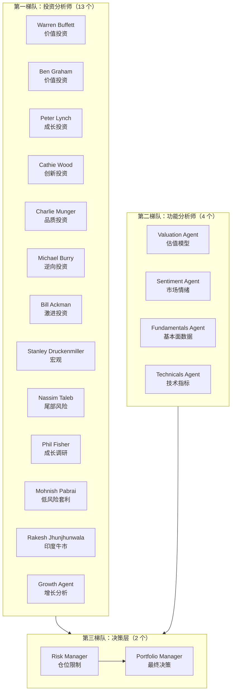
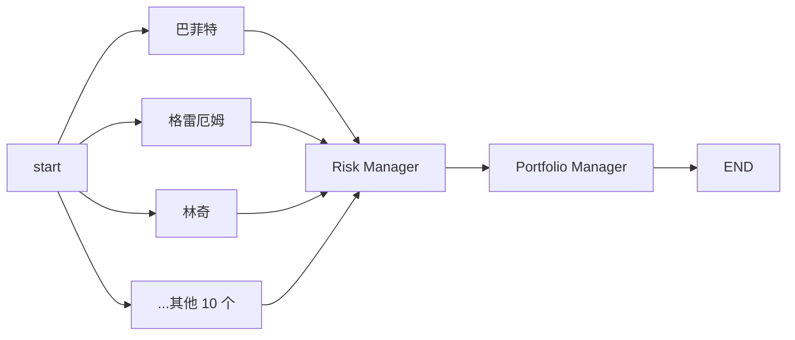

# AI Hedge Fund 源码阅读（一）：19 个 AI 分析师组成对冲基金，怎么协同决策

> 基于 [virattt/ai-hedge-fund](https://github.com/virattt/ai-hedge-fund)，MIT 协议，LangGraph + Pydantic。

## 一句话说清楚

这个项目让 19 个 AI Agent 模拟一支对冲基金的投资决策流程。每个 Agent 扮演一位知名投资人（巴菲特、格雷厄姆、彼得·林奇等）或承担一个功能角色（估值、风控、组合管理）。输入股票代码，输出"买/卖/持有"的决策和理由。

这不是真正的交易系统，但它是**最接近"AI 投研团队"的教育项目**——用 LangGraph 编排多个 LLM Agent 的协作流程。

## 19 个 Agent，三个梯队



**第一梯队（13 个）**：每个 Agent 用自己的投资哲学分析股票。巴菲特看 ROE、护城河、安全边际；Bury 看逆向机会；Taleb 看尾部风险——每个 Agent 的 prompt 和打分逻辑都不同。

**第二梯队（4 个）**：功能型 Agent，做估值、情绪分析、基本面分析、技术分析。它们不模仿特定人物，而是执行专业计算。

**第三梯队（2 个）**：Risk Manager 根据所有分析师的信号计算仓位上限；Portfolio Manager 综合所有信号做出最终的买卖决策。

## LangGraph StateGraph：一次性 fan-out，顺序汇聚

```python
# src/main.py
def create_workflow(selected_analysts=None):
    workflow = StateGraph(AgentState)
    workflow.add_node("start_node", start)

    # 第一层：所有分析师并行执行（fan-out）
    for analyst_key in selected_analysts:
        node_name, node_func = analyst_nodes[analyst_key]
        workflow.add_node(node_name, node_func)
        workflow.add_edge("start_node", node_name)  # 所有分析师从 start 出发

    # 第二层：汇聚到风控
    workflow.add_node("risk_management_agent", risk_management_agent)
    for analyst_key in selected_analysts:
        workflow.add_edge(analyst_nodes[analyst_key][0], "risk_management_agent")

    # 第三层：最终决策
    workflow.add_node("portfolio_manager", portfolio_management_agent)
    workflow.add_edge("risk_management_agent", "portfolio_manager")
    workflow.add_edge("portfolio_manager", END)
```



所有分析师从 `start_node` 同时出发（fan-out），各自独立运行完成后汇聚到 Risk Manager。这不是串行流水线——巴菲特的回答不依赖格雷厄姆。所有分析师并行执行，然后 Risk Manager 一次性接收所有信号。

## AgentState：TypedDict 做全局状态

```python
# src/graph/state.py
class AgentState(TypedDict):
    messages: Annotated[Sequence[BaseMessage], operator.add]  # 对话历史（追加模式）
    data: Annotated[dict[str, any], merge_dicts]               # 数据层（合并模式）
    metadata: Annotated[dict[str, any], merge_dicts]           # 配置（合并模式）
```

LangGraph 的 `Annotated` + reducer 函数是关键机制：

- `operator.add`：每条新消息**追加**到消息列表末尾
- `merge_dicts`（自定义）：`{**a, **b}`，新数据**合并**到旧数据上

`data` 中最重要的字段：

```python
data = {
    "tickers": ["AAPL", "MSFT", "NVDA"],     # 股票池
    "portfolio": {"cash": 100000, ...},       # 组合头寸
    "start_date": "2024-01-01",
    "end_date": "2024-03-01",
    "analyst_signals": {                      # 分析师的信号汇总
        "warren_buffett_agent": {
            "AAPL": {"signal": "bullish", "confidence": 85, "reasoning": "..."},
            "MSFT": {"signal": "bullish", "confidence": 90, "reasoning": "..."},
        },
        "ben_graham_agent": {...},
    }
}
```

每个分析师完成分析后，把结果写入 `data["analyst_signals"][agent_id]`。Risk Manager 和 Portfolio Manager 从这里读取所有信号。

## 每个 Agent 的标准结构

以巴菲特 Agent 为例：

```python
# src/agents/warren_buffett.py

# 1. 定义结构化输出
class WarrenBuffettSignal(BaseModel):
    signal: Literal["bullish", "bearish", "neutral"]
    confidence: int = Field(description="Confidence 0-100")
    reasoning: str = Field(description="Reasoning for the decision")

# 2. Agent 函数签名
def warren_buffett_agent(state: AgentState, agent_id: str = "warren_buffett_agent"):
    data = state["data"]
    tickers = data["tickers"]

    for ticker in tickers:
        # 3. 拉取财务数据
        metrics = get_financial_metrics(ticker, end_date, ...)
        # 4. 确定性分析（ROE、护城河、管理质量...）
        fundamental_score = analyze_fundamentals(metrics)
        moat_score = analyze_moat(metrics)
        intrinsic_value = calculate_intrinsic_value(financials)
        # 5. LLM 做最终判断
        buffett_output = generate_buffett_output(ticker, analysis_data, state)
        # 6. 写入全局状态
        state["data"]["analyst_signals"][agent_id] = {ticker: buffett_output}

    return {"messages": [message], "data": state["data"]}
```

**关键设计：预处理 + LLM 判断分离**。RoE 计算、护城河评分、DCF 估值这些都是确定的 Python 计算——不需要 LLM。LLM 只做最后一层的综合判断——基于已经算好的数据决定 bullish/bearish/neutral。这个分离让 token 消耗降到最低，也让结果更确定。

## 和 MetaGPT、nanobot 的架构对比

| | AI Hedge Fund | MetaGPT | nanobot |
|---|---|---|---|
| 编排引擎 | **LangGraph StateGraph** | 自研 Role 状态机 | 自研 AgentLoop |
| Agent 通信 | **共享 dict（analyst_signals）** | Environment MessageBus | MessageBus |
| 并发模型 | **一次性 fan-out** | 串行（消息驱动） | 多 session 并发 |
| 输出格式 | Pydantic BaseModel | JSON 命令数组 | 自由文本 |
| 核心模式 | 数据预处理 + LLM 判断 | SOP 驱动的 Role 链 | Tool-using Agent 循环 |

AI Hedge Fund 的架构最简单的——没有什么复杂的消息路由、没有 Environment、没有工具调用循环。它只是一个**确定性的 DAG**：fan-out 到所有分析师 → 汇聚到风控 → 最终决策。

## 小结

这个项目的架构核心就三个决策：

1. **fan-out 并行** ——所有分析师同时跑，不互相依赖
2. **共享 dict 通信**——不搞消息队列，一个 `analyst_signals` 字典搞定
3. **计算和 LLM 分离**——确定性指标（ROE、DCF）用 Python 算，LLM 只做综合判断

下一篇看巴菲特 Agent 的内部细节——600 行的分析逻辑、三阶段 DCF 估值模型、以及 prompt 怎么用 6 句话指挥 LLM 做出巴菲特的决策。
