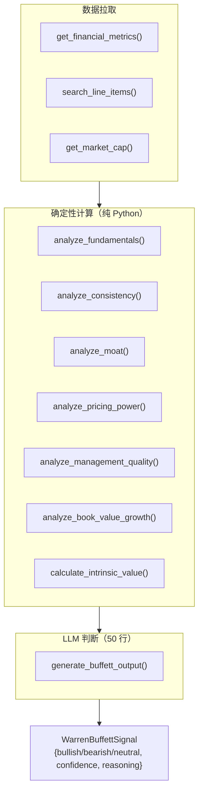

# AI Hedge Fund 源码阅读（二）：巴菲特 Agent 的 600 行分析逻辑

> 基于 [virattt/ai-hedge-fund](https://github.com/virattt/ai-hedge-fund)，MIT 协议。

## 一个 Agent 里有 600 行代码，LLM 只占最后 50 行

上一篇讲了 19 个 Agent 的协作架构。这一篇拆开最复杂的 Agent——Warren Buffett——看它内部的 600 行代码到底干了什么。

结论先给：**只有 50 行是 LLM 调用，其余 550 行是纯 Python 计算。** 这是 AI Hedge Fund 最重要的架构选择——把 LLM 的角色从"全知分析师"降级为"基于计算结果的判断者"。

## 整体结构



## 七个确定性分析模块

每个模块都是一个独立的函数，输入财务数据，输出打分 + 理由。

### 1. 基本面分析（ROE、负债、利润率、流动性）

```python
def analyze_fundamentals(metrics):
    score = 0
    # ROE > 15% → +2
    if metrics.return_on_equity and metrics.return_on_equity > 0.15:
        score += 2
    # 负债率 < 0.5 → +2
    if metrics.debt_to_equity and metrics.debt_to_equity < 0.5:
        score += 2
    # 营业利润率 > 15% → +2
    if metrics.operating_margin and metrics.operating_margin > 0.15:
        score += 2
    # 流动比率 > 1.5 → +1
    if metrics.current_ratio and metrics.current_ratio > 1.5:
        score += 1
    return {"score": score, "details": ...}
```

四条规则，全是数字比较。不需要 LLM 来判断"AAPL 的基本面好不好"——阈值、权重、打分逻辑全部硬编码。

### 2. 收入一致性分析（连续增长检测）

```python
def analyze_consistency(financial_line_items):
    # 连续 4 个季度，每个季度收入 > 上一季度
    earnings_growth = all(
        earnings_values[i] > earnings_values[i + 1]
        for i in range(len(earnings_values) - 1)
    )
    if earnings_growth:
        score += 3
```

不需要 LLM 判断"收入增长是否持续"——一个 `all()` 就够了。

### 3. 护城河分析（多维评分）

这是最复杂的模块——5 个维度、30+ 个指标：

| 维度 | 分析内容 | 最大分 |
|---|---|---|
| ROE 一致性 | 过去 5 期中 ROE > 15% 的比例 | 2 |
| 利润率稳定性 | 营业利润率趋势 + 变化率 | 1 |
| 资产效率 | 资产周转率 > 1.0 | 1 |
| 绩效稳定性 | ROE 和利润率的变异系数 | 1 |
| 总计 | | 5 |

```python
def analyze_moat(metrics):
    # ROE 一致性：80% 的季度 ROE > 15% → +2
    high_roe_periods = sum(1 for roe in historical_roes if roe > 0.15)
    roe_consistency = high_roe_periods / len(historical_roes)
    if roe_consistency >= 0.8:
        moat_score += 2

    # 利润率稳定性：用变异系数
    roe_avg = sum(historical_roes) / len(historical_roes)
    roe_variance = sum((r - roe_avg)**2 for r in historical_roes) / len(historical_roes)
    roe_stability = 1 - (roe_variance**0.5) / roe_avg
    if overall_stability > 0.7:
        moat_score += 1
```

### 4. 内在价值计算（三阶段 DCF 模型）

这是巴菲特 Agent 最核心的计算——600 行中将近 200 行用在估值上。不是简单的 PE 倍数，而是**三阶段 DCF**：

```python
def calculate_intrinsic_value(financial_line_items):
    # 第 1 步：计算 Owner Earnings
    owner_earnings = calculate_owner_earnings(financial_line_items)

    # 第 2 步：估计历史增长率（保守折价 30%）
    historical_growth = ((latest / oldest) ** (1/years)) - 1
    conservative_growth = historical_growth * 0.7

    # 第 3 步：三阶段 DCF
    stage1_growth = min(conservative_growth, 0.08)    # 高增长 5 年
    stage2_growth = min(conservative_growth * 0.5, 0.04)  # 过渡 5 年
    terminal_growth = 0.025  # 永续增长 = GDP 增速

    # 第 4 步：折现
    for year in range(1, 6):
        future_earnings = owner_earnings * (1 + stage1_growth) ** year
        pv = future_earnings / (1 + 0.10) ** year
        stage1_pv += pv
    # ... stage2 + terminal

    # 第 5 步：保守折价 15%
    conservative_iv = intrinsic_value * 0.85
```

每个参数的选择都体现了巴菲特的保守原则——增长率打 7 折、折现率用 10%、最终估值再打 85 折。

### Owner Earnings 的计算

巴菲特的 Owner Earnings 公式：

```
Owner Earnings = Net Income + Depreciation - Maintenance Capex - Working Capital Change
```

维护性资本支出用三种方法估计，取中位数：

```python
method_1 = latest_capex * 0.85          # 假设 15% 是成长性 capex
method_2 = latest_depreciation           # 折旧 = 维护性 capex
method_3 = avg_capex_ratio * revenue    # 历史 capex/revenue 比率
maintenance_capex = sorted([m1, m2, m3])[1]  # 取中位数
```

### 5-7. 管理质量、定价权、账面价值增长

三个相对小的分析模块——股票回购检测、毛利率趋势、净资产 CAGR。

## LLM 到底判断了什么

所有确定性计算完成之后，才调 LLM。prompt 只有 6 句话：

```python
template = ChatPromptTemplate.from_messages([
    ("system",
     "You are Warren Buffett. Decide bullish, bearish, or neutral "
     "using only the provided facts.\n"
     "Checklist: Circle of competence / Competitive moat / "
     "Management quality / Financial strength / Valuation vs intrinsic value / "
     "Long-term prospects\n"
     "Signal rules:\n"
     "- Bullish: strong business AND margin_of_safety > 0.\n"
     "- Bearish: poor business OR clearly overvalued.\n"
     "- Neutral: good business but margin_of_safety <= 0, or mixed evidence.\n"
     "Confidence scale: 90-100% Exceptional business...\n"
     "Keep reasoning under 120 characters. Do not invent data. Return JSON only."),
    ("human",
     "Ticker: {ticker}\nFacts:\n{facts}\n\n"
     "Return exactly: "
     '{{"signal": "bullish|bearish|neutral", "confidence": int, '
     '"reasoning": "short justification"}}'),
])
```

**关键设计：**

1. **"using only the provided facts"**——不给 LLM 太多自由发挥空间，必须基于已经算好的指标做判断
2. **"Keep reasoning under 120 characters"**——强制简短，防止幻觉
3. **"Return JSON only"** + Pydantic 模型约束——`WarrenBuffettSignal` 确保输出是 `bullish/bearish/neutral`，不会出现"maybe bullish depending on..."
4. **Confidence scale 有明确的数字定义**——不是"你觉得有多确定"，是"90-100 = exceptional business, 70-89 = good business"
5. **"Do not invent data"**——防止 LLM 编造不存在的财务数字

## Pydantic 做结构化输出

```python
class WarrenBuffettSignal(BaseModel):
    signal: Literal["bullish", "bearish", "neutral"]
    confidence: int = Field(description="Confidence 0-100")
    reasoning: str = Field(description="Reasoning for the decision")
```

然后 `call_llm()` 接收 `pydantic_model` 参数：

```python
return call_llm(
    prompt=prompt,
    pydantic_model=WarrenBuffettSignal,  # LLM 输出被强制解析为这个类型
    agent_name=agent_id,
    state=state,
    default_factory=create_default_warren_buffett_signal,
)
```

如果 LLM 返回的 JSON 格式不对，`default_factory` 提供降级信号——不会让整个 pipeline 因为这个 Agent 出错而崩溃。

## 小结

巴菲特 Agent 的 600 行代码暴露了 AI 应用的一个核心模式：

```
确定性计算（550 行） →  LLM 判断（50 行）
```

不是"让 AI 做所有事"，而是"**用代码做 AI 做不好的事（数学计算），让 AI 做代码做不好的事（综合判断）**"。

这个模式比"全交给 LLM"更可靠、更省钱、更确定——LLM 不会被要求计算 ROE（可能算错），也不会被要求估计 DCF（肯定算错）。它只需要在已经算好的数据上，做出"买/卖/持有"的判断。

下一篇讲 Portfolio Manager——怎么把 13 个分析师的信号综合成一个交易决策。
