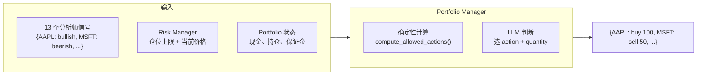

# AI Hedge Fund 源码阅读（三）：如何综合 13 个人的意见做决策 + 值得学的 6 个设计

> 基于 [virattt/ai-hedge-fund](https://github.com/virattt/ai-hedge-fund)，MIT 协议。

## Portfolio Manager：最后一道决策

13 个分析师各自给了 bullish/bearish/neutral，Risk Manager 算了仓位上限。现在 Portfolio Manager 要把所有信号综合成一个交易决策——买多少、卖多少、还是不动。



## 第一步：确定性约束——compute_allowed_actions()

在问 LLM 之前，先算出来**客观上哪些操作是可行的**。不能买 100 万 AAPL 但账户只有 1 万现金，这是数学问题，不需要 LLM 判断。

```python
def compute_allowed_actions(tickers, current_prices, max_shares, portfolio):
    cash = float(portfolio.get("cash", 0.0))
    for ticker in tickers:
        price = float(current_prices.get(ticker, 0.0))
        actions = {"buy": 0, "sell": 0, "short": 0, "cover": 0, "hold": 0}

        # 买：最多 = min(仓位上限, 现金/价格)
        if cash > 0 and price > 0:
            max_buy = min(max_shares[ticker], int(cash // price))
            if max_buy > 0: actions["buy"] = max_buy

        # 卖：最多 = 当前持仓
        if long_shares > 0: actions["sell"] = long_shares

        # 融券卖空：受保证金约束
        if price > 0:
            available_margin = max(0.0, (equity / margin_requirement) - margin_used)
            max_short = min(max_shares[ticker], int(available_margin // price))
            if max_short > 0: actions["short"] = max_short
```

算完之后，如果某个 ticker **只有 hold 是合法操作**，就直接跳过 LLM：

```python
# 如果只有 'hold'，不需要问 LLM——直接填入预决定
if set(aa.keys()) == {"hold"}:
    prefilled_decisions[t] = PortfolioDecision(
        action="hold", quantity=0, confidence=100,
        reasoning="No valid trade available"
    )
else:
    tickers_for_llm.append(t)  # 其他情况才发给 LLM
```

这节省了不必要的 LLM 调用——如果 AAPL 的仓位已经满了，不需要让 LLM 判断"要不要再买一点"。

## 第二步：LLM 判断——选哪个操作

只有真正需要决策的 ticker 才发给 LLM：

```python
template = ChatPromptTemplate.from_messages([
    ("system",
     "You are a portfolio manager.\n"
     "Inputs per ticker: analyst signals and allowed actions with max qty "
     "(already validated).\n"
     "Pick one allowed action per ticker and a quantity ≤ the max. "
     "Keep reasoning very concise (max 100 chars). "
     "No cash or margin math. Return JSON only."),
    ("human",
     "Signals:\n{signals}\n\n"
     "Allowed:\n{allowed}\n\n"
     "Format:\n"
     '{{"decisions": {{'
     '  "TICKER": {{"action":"...","quantity":int,"confidence":int,"reasoning":"..."}}'
     '}}}}'),
])
```

**关键约束：**

1. **"already validated"**——告诉 LLM 这些数量已经经过风控验证，不要再质疑
2. **"No cash or margin math"**——不要在 prompt 里让 LLM 算数学，所有数字约束已经通过 `max_qty` 给出
3. **"Pick one allowed action"**——不是"推荐一个操作"，是"从合法操作中选一个"
4. **"Keep reasoning under 100 chars"**——防止冗长的解释

### 信号压缩：只传关键信息

13 个分析师每人分析 3 个 ticker，原始数据有几百行。Portfolio Manager 的 prompt 只需要每个 ticker 的**汇总**：

```python
def _compact_signals(signals_by_ticker):
    for t, agents in signals_by_ticker.items():
        compact[t] = {}
        for agent, payload in agents.items():
            sig = payload.get("sig") or payload.get("signal")
            conf = payload.get("conf") or payload.get("confidence")
            if sig is not None and conf is not None:
                compact[t][agent] = {"sig": sig, "conf": conf}
    return compact
# 结果: {"AAPL": {"warren_buffett": {"sig": "bullish", "conf": 85}, ...}}
```

## 值得学的 6 个设计

### 1. LangGraph StateGraph 做 DAG 编排

```python
# 不要用 callback hell 或自定义调度器——
# 用 LangGraph 声明式定义 DAG
workflow = StateGraph(AgentState)
workflow.add_node("buffett", warren_buffett_agent)
workflow.add_node("risk", risk_management_agent)
workflow.add_edge("buffett", "risk")  # 数据流方向
```

LangGraph 的 `StateGraph` 处理了**节点间的数据传递、状态合并、执行顺序**——这些如果手写要几百行。

### 2. Pydantic 做结构化输出 + 降级

```python
class WarrenBuffettSignal(BaseModel):
    signal: Literal["bullish", "bearish", "neutral"]
    confidence: int = Field(description="Confidence 0-100")
    reasoning: str
```

每个 Agent 的输出都是 Pydantic model。不是"返回一段文本然后正则解析"，是"返回一个类型化的对象"。LLM 输出格式出错时 `default_factory` 提供降级值——**不会因为一个 Agent 的 JSON 格式错误搞崩整个 pipeline**。

### 3. 确定性 pre-processing + LLM 后处理

```
财务数据 → Python 计算（ROE、DCF、打分）→ LLM 判断（bullish/bearish）
```

不是"把财报扔给 LLM，让它自己算 ROE"。LLM 的计算能力不可靠——让它做综合判断，让 Python 做数学。这个分离贯穿整个项目。

### 4. LLM 调用前先过滤"不需要决策的 case"

```python
# Portfolio Manager：只有 hold 的 ticker 不发给 LLM
if set(aa.keys()) == {"hold"}:
    prefilled_decisions[t] = PortfolioDecision(action="hold", ...)
else:
    tickers_for_llm.append(t)
```

每一分 token 都是钱。能通过逻辑判断的决定，不要浪费 LLM 调用。

### 5. TypedDict + Annotated 做增量状态

```python
class AgentState(TypedDict):
    messages: Annotated[Sequence[BaseMessage], operator.add]  # 追加
    data: Annotated[dict[str, any], merge_dicts]               # 合并
```

不需要 `state["messages"] = state["messages"] + [new_msg]`——`operator.add` 自动处理。合并逻辑（`merge_dicts`）也是声明式的。LangGraph 的 reducer 机制让状态更新变成**声明而非命令**。

### 6. 单一数据源（analyst_signals）避免重复拉取

所有分析师的结果写入同一个 `state["data"]["analyst_signals"]`。Risk Manager 和 Portfolio Manager 从这里读——不需要每个 Agent 都调一次 API。同一个 ticker 的财务数据在 Agent 内部只拉一次（`get_financial_metrics()`），多个分析模块复用。

## 和 MetaGPT 的对比

| | AI Hedge Fund | MetaGPT |
|---|---|---|
| 编排 | LangGraph DAG | 自研状态机 |
| Agent 输出 | **Pydantic BaseModel** | JSON 命令 + ActionNode |
| LLM 角色 | **判断（基于计算结果）** | 全流程（思考 + 执行） |
| 降级策略 | default_factory | JSON_REPAIR_PROMPT |
| 数据流 | 共享 dict (analyst_signals) | Message 对象 + cause_by 路由 |
| 代码量 | ~3000 行 Python | ~22 万行 Python |

AI Hedge Fund 比 MetaGPT 小两个数量级，但它的设计更"务实"——不追求通用框架，只解决一个具体问题（投资决策），所以每个决策都可以做得更精确。

## 系列回顾

| 篇 | 内容 |
|---|---|
| 一 | 架构总览：LangGraph DAG + 19 个 Agent 三层编排 |
| 二 | 巴菲特 Agent 内部：600 行分析逻辑，LLM 只占 50 行 |
| 三 | Portfolio Manager + 6 个值得学的设计 |
