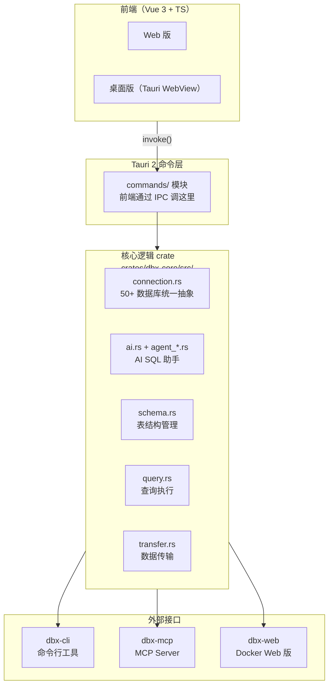

# DBX 源码阅读（一）：架构总览——Tauri 单体仓库如何管理 50+ 数据库连接

> 基于 DBX v0.5.x，源码地址 [github.com/t8y2/dbx](https://github.com/t8y2/dbx)。

## 一句话说清楚 DBX 是什么

DBX 是一个跨平台的数据库管理桌面应用，15MB。支持 MySQL、PostgreSQL、SQLite、Redis、MongoDB、DuckDB 等 50+ 种数据库。前端 Vue 3，后端 Rust+Tauri 2。不是一个 Electron 套壳——核心逻辑全部在 Rust 里。

## 整体架构



四层结构：

1. **前端层**——Vue 3 + shadcn-vue + CodeMirror 6，通过 Tauri `invoke()` 调用后端
2. **命令层**——`src-tauri/src/commands/`，每个模块一个命令文件，做参数校验和序列化
3. **核心层**——`crates/dbx-core/`，纯 Rust 业务逻辑，不依赖 Tauri
4. **外部接口层**——同一套核心逻辑，包装出 CLI、MCP Server、Web 版三个出口

关键设计决策：**核心逻辑不进 Tauri**。`dbx-core` 是一个独立的 crate，不依赖 Tauri API。这意味着同一套代码编译出桌面版、命令行版和 Web 版三个产物。

## 连接抽象：50+ 数据库的难题

这是 DBX 最核心的设计挑战——怎么用一个统一接口管理 50 种完全不同的数据库？

```text
MySQL 用 mysql_async crate → 异步连接池
SQLite 用 rusqlite crate → 文件 + 同步
DuckDB 用 duckdb crate → 内嵌 OLAP
Redis 用 redis-rs → 异步 RESP 协议
MongoDB 用 mongodb driver → 文档模型
Elasticsearch → HTTP REST
JDBC → 本地 JVM 进程桥接
```

DBX 没有用「一个 trait 打天下」：

```rust
// crates/dbx-core/src/connection.rs:5300 附近
// 不是这样：
// trait Database { fn query(&self, sql: &str) -> Result; }

// 而是用 enum + 多个 PoolKind
pub enum PoolKind {
    Mysql(mysql_async::Pool),
    Postgres(deadpool_postgres::Pool),
    Sqlite(Arc<Mutex<rusqlite::Connection>>),
    DuckDB(Arc<DuckDbHandle>),
    Redis(redis::aio::MultiplexedConnection),
    Mongo(mongodb::Database),
    Jdbc(Arc<JdbcPool>),
    Agent(AgentConnection),     // 通过 agent 进程桥接
    // ... 更多变体
}
```

### 为什么不用 trait

50 种数据库的 trait 需要 50 个 impl。每种数据库的方法签名不同——Redis 没有 `query(sql)` 的概念，MongoDB 没有 connection pool。强行用 trait 会导致 trait 里全是 `Option` 和 `unimplemented!()`。

enum + match 虽然「不够优雅」，但每个 match 分支可以做完全不同的处理——这正是 50 种异构数据库需要的。

```rust
// 比如查询执行，每种数据库走自己的路径
fn execute_query(pool: &PoolKind, sql: &str) -> Result<QueryResult> {
    match pool {
        PoolKind::Mysql(p) => mysql_query(p, sql),
        PoolKind::Postgres(p) => pg_query(p, sql),
        PoolKind::Sqlite(c) => sqlite_query(c, sql),
        PoolKind::Redis(r) => redis_command(r, sql),  // Redis 不走 SQL
        PoolKind::Mongo(d) => mongo_find(d, sql),      // MongoDB 不走 SQL
        // ...
    }
}
```

## 优秀代码：生产安全检查——带用户确认的危险操作拦截

### 源码

```rust
// crates/dbx-core/src/production_safety.rs（简化）
use crate::models::connection::ConnectionConfig;

pub struct ProductionSafety {
    pub enabled: bool,
}

impl ProductionSafety {
    /// 判断是否需要弹出确认对话框
    pub fn should_confirm(&self, config: &ConnectionConfig, sql: &str) -> Option<String> {
        if !self.enabled || config.is_safe_mode_off() {
            return None;  // 安全检查关了，不拦
        }

        let upper = sql.trim().to_uppercase();

        // 匹配危险操作
        for (pattern, message) in DANGEROUS_PATTERNS.iter() {
            if pattern.is_match(&upper) {
                return Some(format!(
                    "⚠️ 检测到危险操作：{}\n目标：{}\n\n{}",
                    message,
                    config.display_name(),
                    sql
                ));
            }
        }

        None
    }
}

// 危险操作模式
static DANGEROUS_PATTERNS: &[(&str, &str)] = &[
    ("DROP DATABASE",   "删除整个数据库"),
    ("DROP TABLE",      "删除表"),
    ("TRUNCATE",        "清空表数据"),
    ("DELETE FROM",     "删除数据（无 WHERE 条件）"),
    ("ALTER TABLE.*DROP", "删除列"),
];
```

### 好在哪

1. **独立模块**——安全检查不混在 SQL 执行逻辑里。开了就是开了，关了就是关了
2. **不是阻止，是确认**——返回 `Option<String>` 而不是 `Result::Err`。用户可以选择「我知道我在干什么」
3. **模式和文案分离**——加一个新的危险操作只需要一行 tuple，不用改匹配逻辑
4. **可关闭**——留给高级用户后门

### 模式

**Decorator 模式**：`ProductionSafety` 是 SQL 执行的装饰器——在执行前插入检查，不改变执行逻辑本身。

### 骨架代码

```rust
/// 你的项目中：任何危险操作执行前先过一遍检查器
pub struct SafetyGate {
    enabled: bool,
    rules: Vec<SafetyRule>,
}

struct SafetyRule {
    pattern: Regex,
    message: String,
}

impl SafetyGate {
    pub fn check(&self, action: &str, target: &str) -> Option<String> {
        if !self.enabled { return None; }
        for rule in &self.rules {
            if rule.pattern.is_match(action) {
                return Some(format!("⚠️ {}：{}", rule.message, target));
            }
        }
        None
    }
}

// 用法
let gate = SafetyGate::new()
    .rule("delete|drop", "删除操作需要二次确认")
    .rule("truncate", "清空操作不可逆");

if let Some(warning) = gate.check("DELETE FROM users", "users 表") {
    // 弹出确认对话框，用户点了"确定"才执行
}
```

### 我第一次写会怎么错

把安全检查写进每个数据库操作函数里——结果 50 种数据库的函数里散落着重复的检查逻辑，改一条规则要改 50 个地方。

## 小结

DBX 架构的三个核心决策：

1. **core crate 不依赖 Tauri**——一套代码，桌面/CLI/Web/MCP 四个产物
2. **enum 替代 trait**——50 种异构数据库用 enum 分发比 trait 统一接口更实际
3. **功能模块化**——安全检查、查询执行、schema 管理各自独立，改一个不碰另一个

---

**下一篇：** [连接管理与多数据库抽象](02-connection.md)
**返回：** [源码阅读](../index.md)
