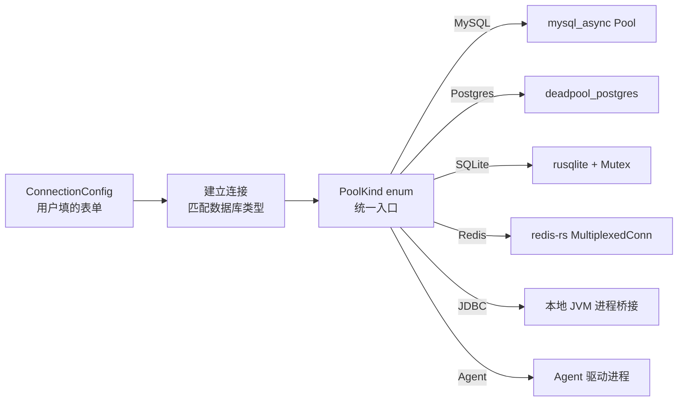

# DBX 源码阅读（二）：连接管理与多数据库抽象——50 种数据库，一套 API

> 基于 DBX v0.5.x。

## 这篇文章看什么

上一篇讲了整体架构。这篇深入**连接管理**——DBX 怎么用 enum 而不是 trait 来统一 50 种数据库。带两个可复用的代码模式。

## 连接的生命周期



## 一、整体架构学习：为什么 enum 而不是 trait

### 源码走读

DBX 用 `PoolKind` enum 管理所有数据库连接类型：

```rust
// crates/dbx-core/src/connection.rs
pub enum PoolKind {
    Mysql(mysql_async::Pool),
    Postgres(deadpool_postgres::Pool),
    Sqlite(Arc<Mutex<rusqlite::Connection>>),
    DuckDB(Arc<DuckDbHandle>),
    Redis(redis::aio::MultiplexedConnection),
    Mongo(mongodb::Database),
    Jdbc(Arc<JdbcPool>),
    Agent(AgentConnection),
    // 10+ 更多变体
}
```

### 为什么这样设计

如果用 trait，需要这样：

```rust
// ❌ 如果用 trait
trait DatabaseConnection {
    fn query(&self, sql: &str) -> Result<QueryResult>;
    fn list_tables(&self) -> Result<Vec<Table>>;
    fn get_schema(&self, table: &str) -> Result<Schema>;
}

// 问题来了：Redis 没有表结构，MongoDB 不走 SQL
// Redis 的 impl 只能返回 unimplemented!()
// 或者 trait 里塞满 Option<T>
```

enum 方案让每种数据库走自己的路径：

```rust
fn execute(pool: &PoolKind, action: &Action) -> Result<Response> {
    match pool {
        PoolKind::Mysql(p)     => mysql_handler(p, action),
        PoolKind::Postgres(p)  => postgres_handler(p, action),
        PoolKind::Redis(r)     => redis_handler(r, action),    // 完全不同的逻辑
        PoolKind::Mongo(d)     => mongo_handler(d, action),    // 也完全不同
        PoolKind::Jdbc(j)      => jdbc_handler(j, action),     // 走 JVM 桥接
        PoolKind::Agent(a)     => agent_handler(a, action),    // 走 agent 进程
        _ => todo!(),
    }
}
```

### 设计取舍

| | trait 方案 | enum 方案 |
|---|---|---|
| 新加一种数据库 | 实现整个 trait | 加一个 enum 变体 |
| Redis 和 MySQL 共享代码 | 不方便 | match 分支各自独立 |
| 编译期检查 | ✅ 忘记实现方法会报错 | ❌ 忘记加 match 分支会运行时 panic |
| 代码可读性 | 分散在 impl 块里 | 所有类型在一个 match 里 |

DBX 选了 enum——因为 50 种数据库之间没有足够的共性来抽象一个有用的 trait。**当共性不足以支撑抽象时，不要强行抽象。**

## 二、优秀代码 1：SSH 隧道——连接池 + 自动重连

### 源码

```rust
// crates/dbx-core/src/db/ssh_tunnel.rs（简化）
use tokio::sync::Mutex;
use std::sync::Arc;

pub struct TunnelManager {
    tunnels: Mutex<HashMap<String, Arc<Tunnel>>>,
}

struct Tunnel {
    session: ssh2::Session,
    listeners: Vec<std::net::TcpListener>,
    last_used: std::time::Instant,
}

impl TunnelManager {
    pub async fn get_or_create(
        &self,
        config: &SshConfig,
    ) -> Result<Arc<Tunnel>, Error> {
        let key = config.cache_key();
        let mut tunnels = self.tunnels.lock().await;

        // 复用已有隧道
        if let Some(tunnel) = tunnels.get(&key) {
            tunnel.touch();
            return Ok(tunnel.clone());
        }

        // 新建 SSH 连接
        let tcp = std::net::TcpStream::connect(&config.host)?;
        let mut session = ssh2::Session::new()?;
        session.set_tcp_stream(tcp);
        session.handshake()?;
        session.userauth_password(&config.user, &config.password)?;

        let tunnel = Arc::new(Tunnel {
            session,
            listeners: vec![],
            last_used: std::time::Instant::now(),
        });

        tunnels.insert(key, tunnel.clone());
        Ok(tunnel)
    }

    /// 后台清理空闲隧道
    pub async fn cleanup(&self, max_idle: Duration) {
        let mut tunnels = self.tunnels.lock().await;
        tunnels.retain(|_, t| t.last_used.elapsed() < max_idle);
    }
}
```

### 好在哪

1. **连接复用**——同一个 SSH 配置的数据库共享一条隧道。5 个连接指向同一台远程服务器时，不会创建 5 条 SSH 隧道
2. **自动清理**——`cleanup()` 是独立的，不混在连接逻辑里。调用方决定何时清和清多快
3. **`Arc<Tunnel>`**——允许隧道在被多个连接引用时安全共享，最后一个引用释放时自动断开
4. **cache_key**——把配置转成唯一 key，避免重复创建成为哈希表操作而非字符串拼接

### 模式

**对象池模式**：TunnelManager 是 SSH 隧道对象池。get_or_create + 定时清理，经典的池化模式。

### 骨架代码

```rust
/// 你的项目中：任何昂贵连接的池化
use std::collections::HashMap;
use std::sync::Arc;
use tokio::sync::Mutex;

pub struct ConnPool<T: Clone> {
    items: Mutex<HashMap<String, Arc<T>>>,
}

impl<T: Clone> ConnPool<T> {
    pub async fn get_or_create<F, E>(
        &self,
        key: &str,
        factory: F,
    ) -> Result<Arc<T>, E>
    where
        F: FnOnce() -> Result<T, E>,
    {
        let mut items = self.items.lock().await;
        if let Some(item) = items.get(key) {
            return Ok(item.clone());
        }
        let item = Arc::new(factory()?);
        items.insert(key.to_string(), item.clone());
        Ok(item)
    }

    pub async fn cleanup(&self, max_age: Duration) {
        // 按时间清理
    }
}
```

## 三、优秀代码 2：密码管理——加密存储 + 运行时解密

### 源码

```rust
// crates/dbx-core/src/connection_secrets.rs（简化）
use aes_gcm::{Aes256Gcm, Key, Nonce};
use aes_gcm::aead::{Aead, OsRng};

pub struct SecretStore {
    cipher: Aes256Gcm,
}

impl SecretStore {
    /// 用机器特征生成密钥（keychain / platform-specific）
    pub fn from_machine_key() -> Result<Self> {
        let raw_key = keyring::Entry::new("dbx", "secret-key")?.get_password()?;
        let key = Key::<Aes256Gcm>::from_slice(raw_key.as_bytes());
        Ok(Self { cipher: Aes256Gcm::new(key) })
    }

    pub fn encrypt(&self, plaintext: &str) -> Result<Vec<u8>> {
        let nonce = Nonce::from_slice(b"unique-nonce-12bytes");  // 实际会用随机 nonce
        self.cipher.encrypt(nonce, plaintext.as_bytes())
    }

    pub fn decrypt(&self, ciphertext: &[u8]) -> Result<String> {
        let nonce = Nonce::from_slice(b"unique-nonce-12bytes");
        let plaintext = self.cipher.decrypt(nonce, ciphertext)?;
        String::from_utf8(plaintext.to_vec())
    }
}
```

### 好在哪

1. **不在代码里硬编码密钥**——密钥存在系统 keychain（macOS Keychain / Linux Secret Service / Windows DPAPI）
2. **只在内存解密**——密码明文只在需要连接时短暂出现，用完即弃
3. **AES-256-GCM**——不是自己发明的加密，是标准 AEAD。加密 + 认证一步完成

### 模式

**Secure Envelope**：敏感数据（密码、token）只以加密态存盘、只在内存短暂解密。

### 我第一次写会怎么错

把数据库密码明文写在配置文件里，然后「我不会把这个文件提交到 git 的」——结果有一天用 `git add -A` 直接推上去了。

## 小结

DBX 连接管理的三个设计选择：

1. **enum 不是 trait**——当共性不足以支撑抽象时，match 分发比 trait 统一接口更实际
2. **对象池复用昂贵连接**——SSH 隧道、JDBC 进程都是昂贵的，建一次全局复用
3. **密码不在代码里**——系统 keychain + AES-256-GCM，敏感数据永远不落盘为明文

---

**上一篇：** [架构总览](01-architecture.md)
**下一篇：** [AI Agent 系统](03-agent-system.md)
**返回：** [源码阅读](../index.md)
