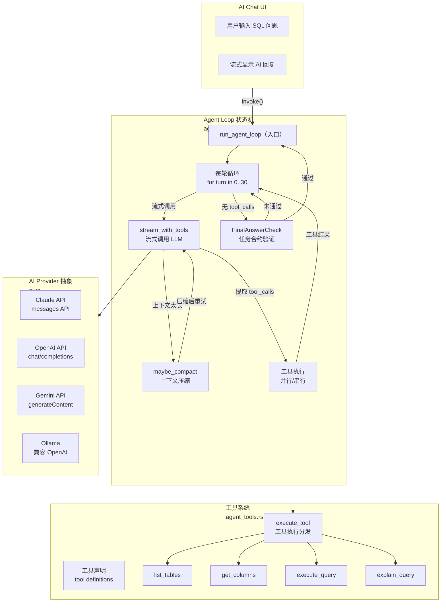

# DBX 源码阅读（三）：AI Agent 系统——LLM 对话循环与工具调用

> 基于 DBX v0.5.x。

## 这篇文章看什么

DBX 不仅仅是数据库管理工具——它内置了一个 AI SQL 助手，可以帮你写 SQL、分析表结构、解释查询计划。这个助手不是简单的「把 SQL 发给 AI」——它运行一个完整的 Agent 循环：LLM 输出文本 → 决定是否调用工具 → 执行工具 → 结果反馈 → 继续对话。

这篇文章拆解三个核心模块：

1. **Agent Loop（agent_loop.rs）**——LLM 多轮对话状态机，管理上下文压缩
2. **工具系统（agent_tools.rs）**——工具的声明和执行
3. **AI Provider 抽象（ai.rs）**——统一 Claude/OpenAI/Gemini/Ollama 接口

## 一、整体架构



### 数据流

```
用户输入 → run_agent_loop() → 循环 30 轮：
  1. 检查取消信号 + 可能压缩上下文
  2. 调用 LLM（流式，含工具定义）
  3. 收集 tool_calls + 累计文本
  4. 无 tool_calls → 验证任务合约 → 完成或修复
  5. 有 tool_calls → 并行/串行执行 → 结果注入下一轮
```

### 为什么这样设计

**Agent 模式 vs Ask 模式**：DBX 区分两种使用方式。Agent 模式允许执行 SQL，提供全部工具。Ask 模式只读，只提供 `list_tables` 和 `get_columns`。这种区分在用户侧对应「帮我做」和「告诉我怎么做」——行为完全不同，但共享同一个 loop。

**Context 压缩不是 option 是必须**：30 轮对话，每轮可能执行多个工具，工具返回成千上万的查询结果。如果不压缩，两三轮就超过 context window。`maybe_compact()` 在每个 turn 开始时检查 token 估算，超过预算才触发——而不是每次都压缩。

## 二、优秀代码 1：Agent Loop 状态机——多轮对话的骨架

### 源码

```rust
// crates/dbx-core/src/agent_loop.rs:17-22
const MAX_AGENT_TURNS: u32 = 30;
const MAX_TOOL_RESULT_CONTEXT_CHARS: usize = 12_000;
const TOOL_RESULT_HEAD_CHARS: usize = 4_000;
const TOOL_RESULT_TAIL_CHARS: usize = 4_000;
const TOOL_RESULT_SAMPLE_ITEMS: usize = 5;
const MAX_CONTRACT_REPAIR_ATTEMPTS: u32 = 2;
```

```rust
// crates/dbx-core/src/agent_loop.rs:42-47
// 四种退出状态
enum LoopExit {
    Completed,          // 正常完成
    Cancelled,          // 用户取消
    Interrupted(String), // LLM 流错误
    Exhausted,          // 达到最大 turn 数
}

impl LoopExit {
    fn should_break_turns(&self) -> bool {
        matches!(self, LoopExit::Cancelled | LoopExit::Interrupted(_))
    }
}
```

```rust
// crates/dbx-core/src/agent_loop.rs:161-413（核心循环骨架）
for turn in 0..MAX_AGENT_TURNS {
    // 1. 检查取消
    if cancelled.notified().now_or_never().is_some() { break; }

    // 2. 检查上下文预算，可能压缩
    maybe_compact(config, system_prompt, &tools, &mut conversation_messages, ...).await;

    on_event(AgentEvent::TurnStart { turn });

    // 3. 调用 LLM（流式），带重试
    for attempt in 0..2 {
        let request = build_tool_request(config, system_prompt, &messages, &tools, ...);
        let stream_result = stream_with_tools(config, &request, &session_id, &tools, cancelled, on_chunk).await;

        match stream_result {
            Ok((tool_calls, usage)) => { break; }
            Err(err) if attempt == 0 && is_context_length_error(&err) => {
                // 压缩后重试
                maybe_compact(config, ... force=true).await;
                continue;
            }
            Err(err) => { break; }
        }
    }

    // 4. 无 tool_calls → 检查合约是否满足
    if collected_tool_calls.is_empty() {
        match validate_final_answer(task_contract, &text) {
            FinalAnswerCheck::Satisfied => { break; }
            FinalAnswerCheck::NeedsRepair(reason) => {
                // 注入修复 prompt，继续下一轮
                conversation_messages.push(AiMessage { role: "user", content: repair_prompt });
                continue;
            }
        }
    }

    // 5. 执行工具（并行 + 串行）
    let parallel_futures = parallel_indices.iter().map(|i| execute_tool(..));
    let parallel_results = join_all(parallel_futures).await;

    for &i in &sequential_indices {
        sequential_results.push(execute_tool(..).await);
    }

    // 6. 注入工具结果到对话
    for (tc, result) in collected_tool_calls.iter().zip(results) {
        conversation_messages.push(AiMessage {
            role: "tool".to_string(),
            content: tool_result_for_followup_context(&tc.name, &result.content),
            tool_call_id: Some(tc.id.clone()),
            tool_calls: Vec::new(),
        });
    }
}

// 7. 处理退出状态：给用户友好的消息
match loop_exit {
    LoopExit::Exhausted => {
        // "Agent reached the 30-turn safety limit. Send Continue..."
    }
    LoopExit::Cancelled => {
        // "保留已生成的部分输出"
    }
    // ...
}
```

### 好在哪

1. **LoopExit 枚举锁定退出路径**——不是用 bool 或错误码，而是用一个 enum 明确 4 种结束原因。每个状态对应不同的用户消息，不遗漏不混淆

2. **取消信号在每个间隙检查**——不是在 LLM 调用前检查一次就算了。`cancelled.notified().now_or_never()` 在每轮开始、压缩前、重试前都检查。取消不是立即 kill，而是「处理完这个 chunk 就停」

3. **工具执行拆并行和串行**——读数据（list_tables、get_columns）可以同时执行，因为不修改状态。写操作（execute_query）必须串行，避免并发写出数据不一致。工具定义里声明了 `parallel_ok`，loop 根据这个标记分组

4. **任务合约修复**——AI 可能没有按约定输出（比如用户要求生成 SQL 但 AI 只给了文字解释）。loop 检测到合约未满足后，注入修复 prompt 最多 2 次，不无限循环

### 模式

**状态机模式**：Agent Loop 是一个隐式状态机——每个 turn 是一个状态，exit 决定下一个状态。状态转换由 `LoopExit` 和 `continue`/`break` 控制。

**Mediator 模式**：`agent_loop.rs` 充当 LLM 和数据库执行的仲裁者——它不关心具体的 SQL 是什么，只负责编排：调 LLM → 取 tool_calls → 执行 → 反馈。

### 骨架代码（你敢直接用）

```rust
/// 你的项目中：多轮 AI Agent 循环
use std::sync::Arc;
use tokio::sync::Notify;
use serde_json::Value;

const MAX_TURNS: u32 = 20;

enum AgentExit {
    Completed(String),   // 最终答案
    Cancelled,           // 用户取消
    Interrupted(String), // 错误
    Exhausted,           // 达到最大轮次
}

struct AgentContext {
    // 自定义工具和环境
}

/// Agent 循环骨架——去掉业务逻辑后核心只有 ~50 行
async fn run_agent(
    llm_call: impl Fn(&[Message]) -> Future<Output = Result<(Vec<ToolCall>, String), String>>,
    tool_exec: impl Fn(&ToolCall) -> Future<Output = String>,
    on_event: impl Fn(AgentEvent),
    cancelled: &Notify,
) -> Result<String, String> {
    let mut messages = Vec::new();
    let mut exit = AgentExit::Exhausted;

    for turn in 0..MAX_TURNS {
        // 检查取消
        if cancelled.notified().now_or_never().is_some() {
            exit = AgentExit::Cancelled; break;
        }

        on_event(AgentEvent::TurnStart(turn));

        let (tool_calls, text) = llm_call(&messages).await.map_err(|e| {
            exit = AgentExit::Interrupted(e.clone()); e
        })?;

        if tool_calls.is_empty() {
            exit = AgentExit::Completed(text); break;
        }

        // 执行工具
        let mut results = Vec::new();
        for tc in &tool_calls {
            let r = tool_exec(tc).await;
            results.push(r);
            on_event(AgentEvent::ToolResult(tc.name.clone(), r.clone()));
        }

        // 注入结果
        for (tc, r) in tool_calls.iter().zip(results) {
            messages.push(Message::tool_result(tc.id.clone(), r));
        }
    }

    match exit {
        AgentExit::Completed(text) => Ok(text),
        AgentExit::Exhausted => Err("Reached turn limit".into()),
        AgentExit::Cancelled => Err("Cancelled".into()),
        AgentExit::Interrupted(e) => Err(e),
    }
}
```

### 我第一次写会怎么错

1. **不缓存上下文压缩结果**——每轮都压缩一遍，浪费 token。应该先估算，超过预算才压缩
2. **串行执行所有工具**——看起来安全，但 `list_tables` 和 `get_columns` 完全可以并行，30 轮下来差很多时间
3. **工具结果原样塞回 LLM**——`execute_query` 可能返回上千行数据。DBX 做了 smart truncation：头 4000 字符 + 尾 4000 字符 + 前 5 条样本，LLM 看到的不超过 12000 字符
4. **取消信号只检查一次**——用户点了取消，但 LLM 还在输出。应该在每个 yield 点检查，这样才能响应式停止

## 三、优秀代码 2：AI Provider 抽象——一个 trait 都没有的统一接口

### 源码

```rust
// crates/dbx-core/src/ai.rs:50-67
#[derive(Debug, Clone, Serialize, Deserialize)]
#[serde(rename_all = "lowercase")]
pub enum AiProvider {
    #[serde(alias = "anthropic")]
    Claude,
    Openai,
    Gemini,
    Deepseek,
    Qwen,
    Ollama,
    #[serde(rename = "openai-compatible")]
    OpenaiCompatible,
    #[serde(rename = "codex-cli")]
    CodexCli,
    #[serde(rename = "claude-code-cli")]
    ClaudeCodeCli,
    Custom,
}
```

```rust
// crates/dbx-core/src/ai.rs:2515-2573
pub async fn stream_with_tools(
    config: &AiConfig,
    request: &AiCompletionRequest,
    session_id: &str,
    tools: &[crate::agent_events::ToolDefinition],
    cancelled: &Notify,
    on_chunk: impl Fn(AiStreamChunk),
) -> Result<(Vec<ToolCall>, Option<TokenUsage>), String> {
    validate_config(config)?;

    let stream_timeout = if config.enable_thinking { 600 } else { 120 };
    let client = build_ai_http_client(config, stream_timeout)?;

    let accumulator = Arc::new(Mutex::new(StreamingToolCallAccumulator::new()));

    let token_usage = match config.provider {
        AiProvider::Claude
            => stream_claude_with_tools(&client, session_id, request, tools, cancelled, &|event| {
                accumulator.lock().unwrap().process(event, &on_chunk);
            }).await?,
        AiProvider::Gemini
            => stream_gemini_with_tools(&client, session_id, request, tools, cancelled, &|event| {
                accumulator.lock().unwrap().process(event, &on_chunk);
            }).await?,
        AiProvider::Custom if uses_anthropic_messages_api(config)
            => stream_claude_with_tools(&client, session_id, request, tools, cancelled, &|event| {
                accumulator.lock().unwrap().process(event, &on_chunk);
            }).await?,
        _ if config.api_style == AiApiStyle::Responses
            => stream_responses_with_tools(&client, session_id, request, tools, cancelled, &|event| {
                accumulator.lock().unwrap().process(event, &on_chunk);
            }).await?,
        _ => stream_openai_with_tools(&client, session_id, request, tools, cancelled, &|event| {
                accumulator.lock().unwrap().process(event, &on_chunk);
            }).await?,
    };

    let tool_calls = Arc::try_unwrap(accumulator)
        .expect("single owner")
        .into_inner()
        .expect("not poisoned")
        .finalize();

    Ok((tool_calls, token_usage))
}
```

```rust
// crates/dbx-core/src/ai.rs:86-93
#[derive(Debug, Clone, Serialize, Deserialize, PartialEq, Default)]
#[serde(rename_all = "lowercase")]
pub enum AiApiStyle {
    #[default]
    Completions,           // OpenAI /v1/chat/completions
    Responses,             // OpenAI /v1/responses（新 API）
    #[serde(rename = "anthropic-messages")]
    AnthropicMessages,     // Claude /v1/messages
}
```

```rust
// crates/dbx-core/src/ai.rs:387-418
pub fn resolve_endpoint(config: &AiConfig) -> String {
    let ep = config.endpoint.trim().trim_end_matches('/');

    if matches!(config.provider, AiProvider::Gemini) {
        return format!("{base}/v1beta/models/{}:generateContent", config.model);
    }

    match config.provider {
        AiProvider::Openai | AiProvider::Deepseek | AiProvider::Qwen
        | AiProvider::Ollama | AiProvider::OpenaiCompatible | AiProvider::Custom => {
            if config.api_style == AiApiStyle::Responses {
                format!("{base}/v1/responses")
            } else {
                format!("{base}/v1/chat/completions")
            }
        }
        AiProvider::Claude | AiProvider::CodexCli | AiProvider::ClaudeCodeCli
        | AiProvider::Gemini => unreachable!(),
    }
}
```

```rust
// crates/dbx-core/src/ai.rs:1385-1419
pub async fn complete(request: &AiCompletionRequest) -> Result<String, String> {
    validate_config(&request.config)?;
    let client = build_ai_http_client(&request.config, 60)?;

    match request.config.provider {
        AiProvider::Claude       => call_claude(&client, request.clone()).await,
        AiProvider::Gemini       => call_gemini(&client, request.clone()).await,
        AiProvider::Openai       |
        AiProvider::Deepseek     |
        AiProvider::Qwen         |
        AiProvider::Ollama       |
        AiProvider::OpenaiCompatible => {
            if request.config.api_style == AiApiStyle::Responses {
                call_responses_api(&client, request.clone()).await
            } else {
                call_openai_compatible(&client, request.clone()).await
            }
        }
        AiProvider::Custom => {
            // 根据 api_style 路由到合适的实现
            if uses_anthropic_messages_api(&request.config) {
                call_claude(..)
            } else if uses_responses_api(..) {
                call_responses_api(..)
            } else {
                call_openai_compatible(..)
            }
        }
        AiProvider::CodexCli | AiProvider::ClaudeCodeCli => unreachable!(),
    }
}
```

### 好在哪

1. **没有 trait 的 Provider 抽象**——没有定义 `trait AiProvider { fn complete() -> ...; fn stream() -> ...; }`。而是用 enum + match 分发。和连接管理一样的思路：不同 Provider 的请求格式、鉴权方式、错误处理差异太大，强行 trait 会全是 `Result` 和 `Option`

2. **用 AiApiStyle 抽象协议层**——不是按「Provider 是谁」来路由，而是按「API 风格」来路由。OpenAI 兼容的服务商和新 OpenAI Responses API 属于不同风格，但用同一个 `OpenaiCompatible` Provider + `Responses` style 就能支持

3. **Cancellation 贯穿所有 stream 函数**——关闭 HTTP 流不够，还需要在每行 SSE 解析后检查 `cancelled`。DBX 的 `stream_claude` 在 `tokio::select!` 里同时等下一个 chunk 和 `cancelled.notified()`

4. **工具调用格式适配在 ToolDefinition 上**——每种 Provider 的工具 JSON schema 格式不同：
   ```rust
   // agent_events.rs:67-93
   impl ToolDefinition {
       pub fn to_openai_tool(&self) -> Value { /* type: "function" */ }
       pub fn to_anthropic_tool(&self) -> Value { /* input_schema */ }
       pub fn to_gemini_tool(&self) -> Value { /* function_declarations */ }
   }
   ```
   不同 Provider 发不同的 JSON body，所有细节在一个 impl 块里

5. **端点 URL 自动补全**——用户输入 `https://api.openai.com` 会补成 `https://api.openai.com/v1/chat/completions`。GitHub Models 用户输入 `https://models.inference.ai.azure.com` 也能正常工作。`ensure_openai_version_prefix()` 和 `resolve_endpoint()` 处理了这些细碎的边界

### 模式

**Strategy 模式**——每个 Provider 的实现是独立的策略。调用方不需要知道用的是 Claude 还是 Ollama，但具体实现不走 trait 的虚函数调用，而是走 enum match 静态分发。

**Factory 模式**——`build_ai_http_client()` 根据配置构造 HTTP 客户端（代理、超时），`resolve_endpoint()` 根据 Provider 和 style 构造 URL。调用方不需要关心构造细节。

### 骨架代码（你敢直接用）

```rust
/// 你的项目中：多 Provider AI 调用抽象
use serde::{Deserialize, Serialize};
use serde_json::json;

#[derive(Debug, Clone, Serialize, Deserialize)]
pub enum MyAiProvider {
    Claude,
    Openai,
    Ollama,
    Custom,
}

#[derive(Debug, Clone, Serialize, Deserialize, Default, PartialEq)]
pub enum MyApiStyle {
    #[default]
    ChatCompletions,   // /v1/chat/completions
    Messages,          // /v1/messages (Anthropic)
}

#[derive(Debug, Clone, Serialize, Deserialize)]
pub struct MyAiConfig {
    pub provider: MyAiProvider,
    pub api_key: String,
    pub endpoint: String,
    pub model: String,
    #[serde(default)]
    pub api_style: MyApiStyle,
}

fn resolve_api_url(config: &MyAiConfig) -> String {
    let ep = config.endpoint.trim().trim_end_matches('/');
    if ep.ends_with("/chat/completions") || ep.ends_with("/messages") {
        return ep.to_string();
    }
    match config.api_style {
        MyApiStyle::Messages => format!("{ep}/v1/messages"),
        MyApiStyle::ChatCompletions => format!("{ep}/v1/chat/completions"),
    }
}

pub async fn call_ai(config: &MyAiConfig, prompt: &str) -> Result<String, String> {
    let client = reqwest::Client::new();
    let url = resolve_api_url(config);

    match config.provider {
        MyAiProvider::Claude => {
            let body = json!({
                "model": config.model,
                "max_tokens": 2048,
                "messages": [{"role": "user", "content": prompt}],
            });
            let resp = client.post(&url)
                .header("x-api-key", &config.api_key)
                .header("anthropic-version", "2023-06-01")
                .json(&body)
                .send().await.map_err(|e| e.to_string())?;
            let data: serde_json::Value = resp.json().await.map_err(|e| e.to_string())?;
            Ok(data["content"][0]["text"].as_str().unwrap_or("").to_string())
        }
        MyAiProvider::Openai | MyAiProvider::Ollama | MyAiProvider::Custom => {
            let body = json!({
                "model": config.model,
                "messages": [{"role": "user", "content": prompt}],
            });
            let resp = client.post(&url)
                .header("Authorization", format!("Bearer {}", config.api_key))
                .json(&body)
                .send().await.map_err(|e| e.to_string())?;
            let data: serde_json::Value = resp.json().await.map_err(|e| e.to_string())?;
            Ok(data["choices"][0]["message"]["content"].as_str().unwrap_or("").to_string())
        }
    }
}

// 用法：切换 Provider 只需改配置
// let config = MyAiConfig {
//     provider: MyAiProvider::Claude,
//     endpoint: "https://api.anthropic.com".into(),
//     ..
// };
// let answer = call_ai(&config, "What is the capital of France?").await?;
```

### 我第一次写会怎么错

1. **用 trait 定义 Provider 抽象**——"所有 Provider 都有 `complete()` 和 `stream()` 方法"。看起来很干净。然后你发现 Codex CLI 不走 HTTP，走子进程。Claude 用 `x-api-key` 头，OpenAI 用 `Authorization: Bearer`。Gemini 的 endpoint URL 和别的完全不一样。最后 trait 里的方法签名全是 `Result<Option<String>, String>`——因为不是每个 Provider 都支持 tool calling

2. **不处理 endpoint URL 边界情况**——用户输入 `api.openai.com`（没协议头）、`api.openai.com/v1`（没 `/chat/completions`）、`https://api.openai.com/v1/chat/completions`（完整的）。DBX 的 `resolve_endpoint()` 处理了这些。我一开始会假设用户一定填完整的 URL

3. **工具调用 JSON 格式写死了**——"反正都是 JSON，都一样"。然后 Claude 用 `input_schema`，OpenAI 用 `parameters`，Gemini 用 `function_declarations`。DBX 在 `ToolDefinition` 上加了三个 `to_*_tool()` 方法，每个 Provider 走自己的渲染逻辑

## 四、上下文压缩

工具返回的结果可能非常大（`execute_query` 返回上千行）。DBX 在每个 turn 开始前估算 token 数，超过预算才压缩。

### 压缩策略

```rust
// crates/dbx-core/src/agent_loop.rs:881-987
// 1. 估算当前 prompt 的 token 数
let estimated_before = estimate_current_prompt_tokens(system_prompt, tools, messages);

// 2. 计算预算：context_window - max_tokens - 安全余量（10%）
let budget = prompt_budget(window, max_tokens);

// 3. 没超标就不压缩
if !force && estimated_before <= budget {
    return CompactResult::Skipped;
}

// 4. 从后往前数，保留最近的 keep_recent_budget token
//    剩下的前 N 条消息用 LLM 总结成一段摘要
let keep_recent_tokens = keep_recent_budget(budget);
let mut cut = messages.len();
for i in (0..messages.len()).rev() {
    // ... 累计 token 直到 keep_recent_tokens
}

// 5. 对 messages[1..cut] 调用 LLM 做总结
let summary = ai::complete(&summary_request).await?;

// 6. 替换为一条 summary 消息
messages.drain(summary_start..cut);
messages.insert(summary_start, AiMessage {
    role: "user",
    content: format!("[SYSTEM-GENERATED CONTEXT SUMMARY]\n\n{summary}"),
    ..
});
```

关键设计：

- **保留消息 0**（原始用户问题）不压缩——AI 需要知道最初的要求
- **保留最近 N 条消息**的原始内容——对话底层的上下文最重要
- **LLM 压缩 + 兜底**——AI 失效时用 `fallback_summary()`，纯统计归纳
- **压缩后通知前端**——发出 `ContextCompacted` 事件，UI 显示"上下文已压缩 xxx 条消息"

## 五、优秀代码 3：工具结果压缩——AI 不需要看 1000 行数据

### 源码

```rust
// crates/dbx-core/src/agent_loop.rs:999-1064
fn compact_tool_result_for_context(tool_name: &str, content: &str) -> String {
    if content.chars().count() <= MAX_TOOL_RESULT_CONTEXT_CHARS {
        return content.to_string();  // 小结果，不压缩
    }

    // JSON 结果：取头部和尾部各 5 条
    if let Ok(value) = serde_json::from_str::<Value>(content) {
        return compact_json_tool_result(tool_name, content, &value);
    }

    // 文本结果：截取头 4000 + 尾 4000 字符
    compact_text_tool_result(tool_name, content)
}
```

### 好在哪

1. **分路径处理 JSON 和纯文本**——JSON 可以结构化压缩（总条数 + 头 5 条 + 尾 5 条），纯文本只能截断
2. **上限硬限制**——`MAX_TOOL_RESULT_CONTEXT_CHARS = 12000`，不管什么结果都不能超过这个数。防止某个巨大查询结果冲爆 context window
3. **压缩标记注入结果**——每段压缩结果加了 `[TOOL RESULT COMPACTED FOR CONTEXT]` 标记。AI 看到标记就知道这不是完整数据

### 我第一次写会怎么错

把整个查询结果直接塞给 LLM——"反正 Claude 上下文窗口大"。第一条查询返回 10000 行，第二条返回 8000 行，第三轮就超过 200K 上下文了。结果不但慢，而且 LLM 在大量数据中会丢失重点。

## 小结

DBX AI Agent 系统的三个设计选择：

1. **Agent Loop 是显式状态机**——不是回调嵌套回调。LoopExit 枚举了 4 种结束路径，每种有对应的用户消息
2. **Provider 抽象用 enum 而不是 trait**——6 种 Provider 的差异太大，match 分发能处理每个 Provider 的独特细节
3. **上下文管理主动且智能**——不等到超了再 panic，而是每轮检查、提前压缩、结果截断

这个系统没有用 langchain/llamaindex 等框架——全部自己写，但写得很克制：没有过度抽象，没有魔法 trait，只在需要解耦的地方解耦。

---

**上一篇：** [连接管理](02-connection.md)
**下一篇：** [MCP Server 与 CLI](04-mcp-cli.md)
**返回：** [源码阅读](../index.md)
