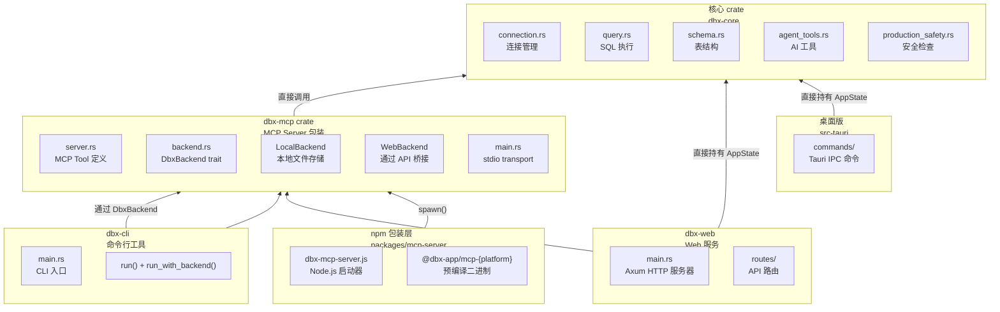

# DBX 源码阅读（四）：MCP Server 与 CLI——同一套代码，四个产物

> 基于 DBX v0.5.x。

## 这篇文章看什么

DBX 的架构目标是：**一套核心代码，输出四个不同的使用场景**。前两篇讲了核心 crate `dbx-core` 的设计，这篇看它怎么被包装成四个完全不同的产品：

1. **桌面版**——Tauri + Vue 3 桌面应用
2. **CLI 工具**——`dbx` 命令行，用于脚本化和自动化
3. **MCP Server**——供 AI Agent（Claude Code、Cursor 等）调用
4. **Web 版**——Docker 部署的 Web 应用

核心问题是：**Rust 的 crate 结构怎么做到「核心逻辑复用、入口各自独立」？**

## 一、整体架构



### 四个产物的共享代码

| 产品 | 入口 crate | 如何连接 dbx-core | 用户交互方式 |
|------|-----------|-------------------|-------------|
| 桌面版 | `src-tauri/` | 直接持有 `Arc<AppState>` | GUI + IPC |
| CLI | `dbx-cli` | 通过 `DbxBackend` trait | 命令行参数 |
| MCP | `dbx-mcp` | 通过 `DbxBackend` trait | stdio (JSON-RPC) |
| Web | `dbx-web` | 直接持有 `Arc<AppState>` | HTTP + SSE |

注意：**CLI 和 MCP 共享同一个 `DbxBackend` trait**，但桌面版和 Web 版直接持有 `AppState`。

### 为什么 CLI/MCP 走 trait，桌面/Web 不走

桌面版和 Web 版是「长寿命」应用——启动后持续运行，持有所有连接、状态、会话。CLI 和 MCP 是「短寿命」或「委托型」——CLI 每次执行一个命令退出，MCP Server 通过 stdio 协议通信，不直接管理连接池。

`DbxBackend` trait 提供了两种实现：
- `LocalBackend`——直接操作本地 SQLite 存储 + 直接查询数据库
- `WebBackend`——通过 HTTP API 桥接到一个远程 DBX Web 实例

这意味着：**CLI 和 MCP 可以工作在「远程模式」**——`DBX_WEB_URL` 设为目标服务器地址，所有操作通过 Web API 代理。这对生产环境的数据库管理非常有用。

## 二、DbxBackend——MCP 和 CLI 的共享接口

### 源码

```rust
// crates/dbx-mcp/src/backend.rs:46-110
#[async_trait]
pub trait DbxBackend: Send + Sync {
    async fn load_connections(&self) -> Result<Vec<ConnectionConfig>, String>;

    async fn execute_agent_tool(
        &self,
        connection: &ConnectionConfig,
        database: &str,
        tool_name: &str,
        arguments: Value,
        permissions: AgentSqlPermissions,
    ) -> ToolResult;

    async fn execute_query(
        &self,
        connection: &ConnectionConfig,
        database: &str,
        sql: &str,
        max_rows: Option<usize>,
        timeout_secs: Option<u64>,
    ) -> Result<dbx_core::db::QueryResult, String> {
        Err("SQL queries are not supported by this backend.".to_string())
    }

    async fn list_tables(
        &self, connection: &ConnectionConfig, database: &str, schema: &str,
    ) -> Result<Vec<TableInfo>, String> {
        Err("Table metadata is not supported by this backend.".to_string())
    }

    // ... 更多方法：get_columns, save_connections,
    //     execute_redis_command, execute_mongo_command, bridge_request
}
```

### 好在哪

1. **默认实现返回 `Err`**——每个方法都有默认实现。`LocalBackend` 需要覆盖所有，`WebBackend` 只需要覆盖 HTTP 相关的。不强制所有实现都做所有事情

2. **`execute_agent_tool` 是核心方法**——MCP 和 CLI 都通过这个统一入口调用 `agent_tools::execute_tool`。参数是 `(tool_name, arguments)`——MCP 传 "execute_query"，CLI 也传 "execute_query"。同一个工具函数，两个入口

3. **`bridge_request` 兜底**——有些操作（在桌面版 UI 中打开表）在其他版本中不可用。`bridge_request` 返回 `Err("DBX is not running")`——清晰、直接

### 两种实现对比

**LocalBackend**（localhost 模式）：
```rust
// crates/dbx-mcp/src/backend.rs:112-115
pub struct LocalBackend {
    state: Arc<AppState>,    // 持有完整的 AppState
    data_dir: PathBuf,       // SQLite 数据库文件路径
}
```
内部直接调用 `dbx-core` 的函数——`schema::list_tables_core()`、`query::execute_sql_statement_with_options()` 等。

**WebBackend**（远程模式）：
```rust
// crates/dbx-mcp/src/backend.rs:123-128
pub struct WebBackend {
    base_url: String,    // 远程 DBX Web 地址
    password: String,    // 认证密码
    client: reqwest::Client,
    auth: Mutex<WebAuthState>,  // 自动管理 session cookie
}
```
所有操作先登录（发送密码），获取 session cookie，然后通过 HTTP API 调用远程服务。

## 三、优秀代码 1：MCP 工具路由——`#[tool_router]` 宏

### 源码

```rust
// crates/dbx-mcp/src/server.rs:178-535
#[tool_router]
impl DbxMcpServer {
    #[tool(description = "List database connections configured in DBX")]
    async fn list_connections(&self, ...) -> CallToolResult { ... }

    #[tool(description = "List tables and views for a database connection")]
    async fn list_tables(&self, ...) -> CallToolResult { ... }

    #[tool(description = "Get column definitions for a table")]
    async fn describe_table(&self, ...) -> CallToolResult { ... }

    #[tool(description = "Execute a SQL query")]
    async fn execute_query(&self, ...) -> CallToolResult { ... }

    #[tool(description = "Execute a Redis command")]
    async fn execute_redis_command(&self, ...) -> CallToolResult { ... }

    #[tool(description = "Get compact table and column context")]
    async fn get_schema_context(&self, ...) -> CallToolResult { ... }
}
```

```rust
// crates/dbx-mcp/src/server.rs:158-176
impl DbxMcpServer {
    pub fn with_runtime_options(backend: Arc<dyn DbxBackend>, scope: McpScope, web_mode: bool) -> Self {
        let mut tool_router = Self::tool_router();

        // scoped 模式下禁用 add/remove 连接操作
        if scope.enabled() {
            tool_router.disable_route("dbx_add_connection");
            tool_router.disable_route("dbx_remove_connection");
        }

        // Web 模式和 scoped 模式禁用 UI 桥接操作
        if web_mode || scope.enabled() {
            tool_router.disable_route("dbx_open_table");
            tool_router.disable_route("dbx_execute_and_show");
        }

        Self { backend, scope, tool_router }
    }
}
```

```rust
// crates/dbx-mcp/src/server.rs:132-156
pub struct McpScope {
    pub connection_id: Option<String>,
    pub connection_name: Option<String>,
    pub database: Option<String>,
}

impl McpScope {
    pub fn from_env() -> Self {
        Self {
            connection_id: non_empty_env("DBX_MCP_SCOPE_CONNECTION_ID"),
            connection_name: non_empty_env("DBX_MCP_SCOPE_CONNECTION_NAME"),
            database: non_empty_env("DBX_MCP_SCOPE_DATABASE"),
        }
    }

    fn matches(&self, connection: &ConnectionConfig) -> bool {
        self.connection_id.as_deref() == Some(connection.id.as_str())
            || self.connection_name.as_deref() == Some(connection.name.as_str())
    }
}
```

### 好在哪

1. **`#[tool_router]` 声明式路由**——通过 rmcp crate 的过程宏，把一个 impl 块变成 MCP 工具注册表。每个方法加 `#[tool]` 就自动生成 JSON-RPC 请求分发。不需要手写路由表

2. **`disable_route` 运行时禁用**——不是编译期硬编码：scoped 模式禁用 add/remove 连接（AI Agent 不应该能添加数据库连接），Web 模式禁用打开桌面 UI 的操作。路由是否可用完全在构造函数里决定

3. **请求参数自动序列化**——每个工具方法接收 `Parameters<T>` 泛型参数，`T` 用 `#[derive(Deserialize, JsonSchema)]` 自动校验。参数文档也自动生成（`JsonSchema`）

4. **McpScope 用环境变量配置**——MCP Client 启动时通过环境变量传入 `DBX_MCP_SCOPE_CONNECTION_ID`，限制 Agent 只能操作指定连接。安全边界在入口层，而不是在工具函数内部

### 连接解析逻辑

```rust
// crates/dbx-mcp/src/server.rs:554-598
async fn resolve_connection(&self, selector: &ConnectionSelector)
    -> Result<ConnectionConfig, CallToolResult>
{
    let connections = self.backend.load_connections().await?;

    // 匹配优先级：connection_id > accepted scope > connection_name
    if let Some(id) = selector.connection_id { ... }
    if self.scope.enabled() { ... } // 返回 scope 内的连接
    if let Some(name) = selector.connection_name { ... }
}
```

解析链：`connection_id` > scope 内连接 > `connection_name`。如果 scoped 开启了，即使传了其他 connection_id，也会被拒绝。

### 模式

**Decorator + Adapter 模式**：`DbxMcpServer` 是 `dbx-core` 的适配器——把 core 的函数签名（`Result<QueryResult, String>`）适配成 MCP 的 `CallToolResult`。`disable_route` 是装饰器——不改变工具函数，只在注册时移除不合适的路由。

### 骨架代码（你敢直接用）

```rust
/// 你的项目中：用 rmcp 快速搭建 MCP Server
use rmcp::{tool, tool_router, ServerHandler, CallToolResult};
use rmcp::handler::server::router::tool::ToolRouter;

#[tool_router]
impl MyMcpServer {
    #[tool(description = "Do something useful")]
    async fn my_tool(&self, Parameters(request): Parameters<MyRequest>) -> CallToolResult {
        match self.backend.do_something(&request.input).await {
            Ok(result) => text(result),
            Err(error) => tool_error("MY_TOOL_ERROR", error),
        }
    }
}

impl MyMcpServer {
    pub fn new(config: Config) -> Self {
        let mut router = Self::tool_router();
        if config.read_only {
            router.disable_route("my_tool");  // 运行时禁用工具
        }
        Self { config, tool_router: router }
    }
}

#[tokio::main]
async fn main() {
    let server = MyMcpServer::new(Config::default());
    let service = server.serve(rmcp::transport::stdio()).await.unwrap();
    service.waiting().await.unwrap();
}
```

## 四、优秀代码 2：MCP Server 的 npm 启动器——Rust 二进制 + Node.js 包装

### 源码

```rust
// crates/dbx-mcp/src/main.rs:1-21
use dbx_mcp::{DbxBackend, DbxMcpServer, LocalBackend, WebBackend};
use rmcp::ServiceExt;

#[tokio::main]
async fn main() -> Result<(), Box<dyn std::error::Error>> {
    // 环境变量选择本地或远程模式
    let backend: Arc<dyn DbxBackend> = if let Ok(base_url) = std::env::var("DBX_WEB_URL") {
        Arc::new(WebBackend::new(base_url, ...)?)
    } else {
        let db_path = dbx_mcp::paths::storage_db_path()?;
        Arc::new(LocalBackend::open(&db_path).await?)
    };

    let service = DbxMcpServer::new(backend)
        .serve(rmcp::transport::stdio())
        .await?;
    service.waiting().await?;
    Ok(())
}
```

```javascript
// packages/mcp-server/bin/dbx-mcp-server.js
import { spawn } from "node:child_process";
import { existsSync } from "node:fs";

function resolveBinary() {
  if (process.env.DBX_MCP_BINARY) {
    return process.env.DBX_MCP_BINARY;  // 环境变量覆盖
  }

  const platform = `${process.platform}-${process.arch}`;
  const target = platformPackages[platform]; // 映射表

  // 从 npm 可选依赖加载对应平台二进制
  const [packageName, binaryName] = target;
  const manifest = require.resolve(`${packageName}/package.json`);
  const binary = join(dirname(manifest), "bin", binaryName);
  return binary;
}

const binary = resolveBinary();
const child = spawn(binary, process.argv.slice(2), { stdio: "inherit" });

// 信号转发
for (const signal of ["SIGINT", "SIGTERM"]) {
  process.on(signal, () => child.kill(signal));
}

child.on("exit", (code, signal) => {
  if (signal) process.kill(process.pid, signal);
  else process.exit(code ?? 1);
});
```

### 平台映射和 npm 包结构

```json
// packages/mcp-server/package.json
{
  "bin": {
    "dbx-mcp-server": "bin/dbx-mcp-server.js"
  },
  "optionalDependencies": {
    "@dbx-app/mcp-darwin-arm64": "0.4.37",
    "@dbx-app/mcp-darwin-x64": "0.4.37",
    "@dbx-app/mcp-linux-arm64-gnu": "0.4.37",
    "@dbx-app/mcp-linux-x64-gnu": "0.4.37",
    "@dbx-app/mcp-win32-arm64": "0.4.37",
    "@dbx-app/mcp-win32-x64": "0.4.37"
  }
}
```

### 好在哪

1. **Node.js 只是启动器**——真正的 MCP 逻辑是 Rust 二进制。JS 代码只有 ~50 行，做三件事：找二进制、spawn、转发信号

2. **npm 生态系统兼容**——用 `npx @dbx-app/mcp-server` 一行命令启动，MCP Client 都支持这种启动方式。不需要用户安装 Rust 工具链

3. **可选平台依赖**——每个平台是一个独立的 npm 可选包。npm install 时自动安装当前平台的二进制。可选依赖确保安装失败时 npm 不会整体报错

4. **`DBX_MCP_BINARY` 覆盖**——允许用户传入自定义二进制路径。方便开发调试和 offline 部署

5. **MCP Client 配置非常简单**：
   ```json
   { "mcpServers": { "dbx": { "command": "npx", "args": ["-y", "@dbx-app/mcp-server"] } } }
   ```
   不依赖任何 Node.js 原生模块（之前版本用 `better-sqlite3`），不触发 node-gyp 编译

### 模式

**Strangler Fig 模式**——老版本 MCP Server 用全 Node.js 实现直接操作 SQLite 数据库。新版本用 Rust 重写核心逻辑，Node.js 层逐渐缩小为 50 行的启动器。用户接口不变，内部实现完全替换。

### 骨架代码（你敢直接用）

```javascript
/// 你的项目中：Rust CLI 的 npm 包装
#!/usr/bin/env node
import { spawn } from "node:child_process";
import { existsSync } from "node:fs";
import { createRequire } from "node:module";
import { join, dirname } from "node:path";

const require = createRequire(import.meta.url);
const platformPackages = {
  "darwin-arm64": ["@myapp/cli-darwin-arm64", "my-cli"],
  "linux-x64": ["@myapp/cli-linux-x64", "my-cli"],
  "win32-x64": ["@myapp/cli-win32-x64", "my-cli.exe"],
};

function resolveBinary() {
  if (process.env.MY_CLI_BINARY) return process.env.MY_CLI_BINARY;
  const key = `${process.platform}-${process.arch}`;
  const [pkg, bin] = platformPackages[key];
  if (!pkg) throw new Error(`Unsupported platform: ${key}`);
  const manifest = require.resolve(`${pkg}/package.json`);
  return join(dirname(manifest), "bin", bin);
}

spawn(resolveBinary(), process.argv.slice(2), { stdio: "inherit" })
  .on("exit", (code) => process.exit(code ?? 1));
```

## 五、CLI 工具——共享 DbxBackend 的命令行入口

### 源码

```rust
// crates/dbx-cli/src/main.rs:154-191
async fn run(argv: Vec<String>) -> Result<String, CliError> {
    let flags = parse_flags(&argv)?;

    // 动态选择 backend
    let backend: Arc<dyn DbxBackend> = if let Ok(base_url) = env::var("DBX_WEB_URL") {
        Arc::new(WebBackend::new(base_url, ...)?)     // 远程模式
    } else {
        let db_path = dbx_mcp::paths::storage_db_path()?;
        Arc::new(LocalBackend::open(&db_path).await?)  // 本地模式
    };

    run_with_backend(backend.as_ref(), flags).await
}

// crates/dbx-cli/src/main.rs:193-255
async fn run_with_backend(backend: &dyn DbxBackend, flags: Flags) -> Result<String, CliError> {
    let args = &flags.args;

    // CLI 子命令分发——完全基于字符串匹配
    match args.first() {
        Some(cmd) if *cmd == "connections" && args.get(1) == "list" => {
            format_connections(&backend.load_connections().await?);
        }
        Some(cmd) if *cmd == "schema" && args.get(1) == "list" => {
            let tables = backend.list_tables(&connection, &database, &schema).await?;
            format_tables(connection_name, &tables, flags.format);
        }
        Some(cmd) if *cmd == "schema" && args.get(1) == "describe" => {
            let columns = backend.get_columns(&connection, &database, &schema, &table).await?;
            format_columns(connection_name, &table, &columns, flags.format);
        }
        Some(cmd) if *cmd == "query" => {
            run_query(backend, &flags).await?;
        }
        Some(cmd) if *cmd == "context" => {
            run_context(backend, &flags).await?;
        }
        _ => Err(CliError::new("USAGE", usage()))
    }
}
```

关键点：

- **CLI 和 MCP 共享同一个 `DbxBackend` trait**——CLI 的 `execute_query` 最终调用的是 backend 上的同一个 `execute_agent_tool()`。这意味着：本地执行走 `LocalBackend` 直接查数据库；远程执行走 `WebBackend` 通过 HTTP 查询

- **CLI 不支持的高阶功能**——AI Agent loop、对话管理等只在桌面版和 Web 版中。CLI 专注于：列表、描述结构、执行查询、获取 schema context

- **输出格式灵活**——支持 Table、JSON、CSV 三种输出格式。JSON 适合被其他工具消费，CSV 适合导入电子表格

### CLI 的查询安全

```rust
// crates/dbx-cli/src/main.rs:292-310
let allow_writes = flags.allow_writes || env_flag("DBX_MCP_ALLOW_WRITES");
let allow_dangerous = flags.allow_dangerous || env_flag("DBX_MCP_ALLOW_DANGEROUS_SQL");

// 生产环境写操作被硬阻止
if risk != SqlRisk::ReadOnly
    && is_production_database(&connection, &database) {
    return Err("Blocked: AI agents cannot execute writes on production.");
}

// Redis 不支持 SQL 查询
if connection.db_type == DatabaseType::Redis {
    return Err("Redis connections do not accept SQL through dbx query.");
}
```

注意：CLI 和 MCP 的权限标志环境变量名一致（`DBX_MCP_ALLOW_WRITES`、`DBX_MCP_ALLOW_DANGEROUS_SQL`）。同一个安全策略，两个产品共用。

## 六、MCP 工具映射——如何把 core 函数变成 MCP 工具

### 映射关系

| MCP 工具 | core 函数 | 作用 |
|----------|-----------|------|
| `dbx_list_connections` | `backend.load_connections()` | 列出连接 |
| `dbx_list_tables` | `backend.list_tables()` | 列出表 |
| `dbx_describe_table` | `backend.get_columns()` | 获取列定义 |
| `dbx_execute_query` | `backend.execute_agent_tool("execute_query", ...)` | 执行 SQL |
| `dbx_execute_redis_command` | `backend.execute_redis_command()` | 执行 Redis 命令 |
| `dbx_get_schema_context` | `backend.list_tables()` + `backend.get_columns()` | 获取 schema 上下文 |
| `dbx_add_connection` | `backend.save_connections()` | 添加连接 |
| `dbx_remove_connection` | `backend.save_connections()` | 删除连接 |
| `dbx_open_table` | `backend.bridge_request("/open-table", ...)` | 桌面 UI 打开表 |
| `dbx_execute_and_show` | `backend.bridge_request("/execute-query", ...)` | 桌面 UI 执行 SQL |

### 为什么 execute_query 走 agent_tool 路径

```rust
// crates/dbx-mcp/src/server.rs:269-278
async fn execute_query(&self, Parameters(request): Parameters<ExecuteQueryRequest>) -> CallToolResult {
    let result = self.backend.execute_agent_tool(
        &connection, &database,
        "execute_query",
        json!({ "sql": request.sql, "limit": 100 }),
        default_permissions(),  // 从环境变量读取权限
    ).await;
    agent_result(result)  // 转换成 CallToolResult
}
```

不是直接调 `query::execute_sql()`，而是走 agent_tool 路径。为什么？因为 agent_tool 包含了完整的**安全校验链**：SQL 风险分类 → 生产环境检查 → 权限检查 → 实际执行。MCP 工具走同样的安全路径，不需要重复写一遍校验逻辑。

### 对比 agent_tools 和 MCP 工具

`agent_tools.rs` 里面的工具和 MCP 工具是**平行但不是完全相同**的：

- **agent_tools** 面向 LLM——工具结果格式化为 Markdown 表格，附加上下文提示（"这是中间结果，不是最终答案"），结果被截断到 12000 字符
- **MCP tools** 面向 AI Agent——工具结果返回结构化 JSON，供 MCP Client（如 Claude Code）自己解析和呈现。不需要 Markdown 格式化

同一套 `dbx-core` 数据库操作函数，两个不同的包装层。

## 七、Web 版——Axum + SSE

```rust
// crates/dbx-web/src/main.rs（关键结构）
use axum::Router;
use tower_http::compression::CompressionLayer;
use dbx_core::connection::AppState;

// 构建 Axum 应用
let app = Router::new()
    .route("/api/connections", get(list_connections))
    .route("/api/query", post(execute_query))
    .route("/api/schema", get(get_schema))
    .route("/api/ai/chat", post(chat_handler))
    .route("/api/ai/stream", get(sse_handler))  // Server-Sent Events
    .layer(CompressionLayer::new())
    .with_state(app_state);
```

Web 版是桌面版的「无 GUI 版本」——通过 REST API + SSE 暴露所有功能。AI Chat 的流式输出通过 SSE 推送，前端用 EventSource API 接收。

## 小结

DBX 的「一套代码，四个产物」架构总结了三个设计模式：

1. **`DbxBackend` trait 共享 MCP 和 CLI**——本地模式和远程 Web 模式通过同一个接口切换。`LocalBackend` 直接操作，`WebBackend` 通过 HTTP 代理
2. **npm 只是 Rust 二进制的启动器**——~50 行 JS 代码完成二进制解析和信号转发，不承载任何业务逻辑
3. **安全策略在 core 层，不在出口层**——SQL 风险分类、生产环境检查、权限检查都在 `dbx-core`。MCP、CLI、桌面版、Web 版四个出口共享同一套安全策略

---

**上一篇：** [AI Agent 系统](03-agent-system.md)
**返回：** [源码阅读](../index.md)
