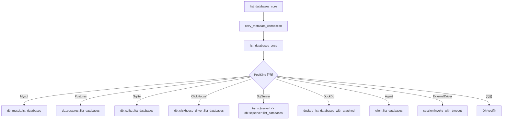
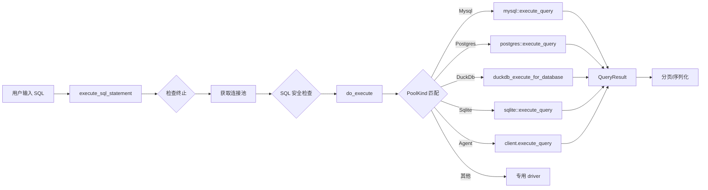

# DBX 源码阅读（五）：Schema 管理与查询引擎——从表结构到 SQL 执行

> 本文基于 dbx v0.1，主要分析 `crates/dbx-core/src/` 下 schema、query、query_cancel、query_execution_sql、query_result_sql 等模块

本文目标：理解 DBX 如何统一管理 20+ 种数据库的表结构（Schema Tree），如何设计可取消的查询执行管道，以及分页查询的策略选择。

---

## 一、整体架构学习

### 1.1 Schema Tree：统一的数据字典抽象

DBX 支持关系型数据库（MySQL、PostgreSQL、SQLite、SQL Server、Oracle）、NoSQL（MongoDB、Redis）、时序库（InfluxDB）、向量库（Qdrant、Milvus）等 20+ 种数据库。面对如此庞杂的数据源，一个统一的数据字典模型是架构的基石。

**核心类型（`types.rs`）：**

```rust
pub struct DatabaseInfo { pub name: String }

pub struct SchemaInfo {
    pub name: String,
    pub comment: Option<String>,
}

pub struct TableInfo {
    pub name: String,
    pub table_type: String,  // "TABLE" or "VIEW"
    pub comment: Option<String>,
    pub parent_schema: Option<String>,
    pub parent_name: Option<String>,
}

pub struct ColumnInfo {
    pub name: String,
    pub data_type: String,
    pub is_nullable: bool,
    pub column_default: Option<String>,
    pub is_primary_key: bool,
    pub extra: Option<String>,
    pub comment: Option<String>,
    pub numeric_precision: Option<i32>,
    pub numeric_scale: Option<i32>,
    pub character_maximum_length: Option<i32>,
    // ...
}
```

这个树形结构描述了 `Databases → Schemas → Tables → Columns` 的层级关系，是所有 Schema 操作的起点。

**架构决策的 WHY：**

为什么需要这个统一抽象？因为不同数据库的元数据获取方式天差地别：

- MySQL 用 `SHOW DATABASES` / `SHOW TABLES` / `SHOW COLUMNS`
- PostgreSQL 用 `information_schema.tables` / `pg_catalog` 系统表
- SQL Server 用 `sys.tables` 系统视图
- MongoDB 用 `adminCommand({listDatabases: 1})`
- DuckDB 用嵌入式 C API，查询 `information_schema.tables`

通过统一返回 `Vec<DatabaseInfo>` / `Vec<TableInfo>` 等，上层 UI 只需消费这些类型，不需关心底层差异。

### 1.2 Schema 加载模式：retry + dispatch

Schema 加载的核心模式是 `retry_metadata_connection` + 按 `PoolKind` 分派（dispatch）。以 `list_databases_once` 为例（`schema.rs:908`）：



每个 `list_xxx_core` 函数（`list_databases_core`, `list_schemas_core`, `list_tables_core`, `get_columns_core`）都遵循同一模式：

1. 上层调用 `retry_metadata_connection` 获取连接池
2. 内部 `xxx_once` 函数根据 `PoolKind` 枚举分派到对应的 driver
3. 返回统一类型

使用 `retry` 的原因是：数据库连接可能因网络抖动短暂断开，重试一次能显著提高元数据加载的可靠性。

### 1.3 Dispatcher 宏

代码中有几个精巧的宏来处理分派逻辑：

```rust
// 从连接池 Map 中提取特定类型的连接
macro_rules! extract_pool {
    ($connections:expr, $key:expr, $variant:ident) => {
        $connections.get($key).and_then(|v| match v {
            PoolKind::$variant(val) => Some(val.clone()),
            _ => None,
        })
    };
}

// 按 MySQL mode 分派（普通 MySQL vs OceanBase Oracle 模式）
macro_rules! dispatch_mysql {
    ($p:expr, $mode:expr, $mysql:path, $ob:path $(, $arg:expr)*) => {
        if *$mode == MysqlMode::OceanBaseOracle {
            $ob($p $(, $arg)*).await
        } else {
            $mysql($p $(, $arg)*).await
        }
    };
}

// SQL Server 专用的简写
macro_rules! try_sqlserver {
    ($connections:expr, $pool_key:expr, $method:ident $(, $arg:expr)*) => {
        if let Some(client) = extract_pool!(&$connections, $pool_key, SqlServer) {
            drop($connections);
            let mut client = client.lock().await;
            return db::sqlserver::$method(&mut client $(, $arg)*).await;
        }
    };
}
```

### 1.4 查询执行管道

查询执行是 DBX 最核心的路径，从用户输入 SQL 到返回结果，经历了多个阶段：



关键路径解析：

1. **入口**：`execute_sql_statement_with_options`（`query.rs:1705`）
2. **安全检查**：通过 `query_execution_sql.rs` 的 `check_read_only` 阻止写入只读连接
3. **获取连接池**：`get_or_create_pool_for_session` 支持按 session 隔离连接
4. **执行**：`do_execute` 根据 `PoolKind` 分派
5. **错误恢复**：`PoolErrorAction` 决定是丢弃连接、重连重试还是直接返回错误

**返回类型 `QueryResult`：**

```rust
pub struct QueryResult {
    pub columns: Vec<String>,
    pub column_types: Vec<String>,
    pub column_sortables: Vec<bool>,
    pub rows: Vec<Vec<serde_json::Value>>,
    pub affected_rows: u64,
    pub execution_time_ms: u128,
    pub truncated: bool,
    pub session_id: Option<String>,
    pub has_more: bool,
}
```

值得注意的是 `session_id` 和 `has_more`——这是分页能力的核心：当结果集超过 `MAX_ROWS (10000)` 时，`truncated=true`，客户端可以通过 `session_id` 继续获取下一页。

### 1.5 查询取消机制

这是 DBX 的一个亮点。不是通过简单的 flag 轮询，而是使用了两层取消机制（`query_cancel.rs`）：

```rust
#[derive(Clone)]
struct RunningTask {
    registration_id: u64,
    token: CancellationToken,        // 第一层: tokio 异步取消
    metadata: RunningTaskMetadata,
    pool_key: Option<String>,
}

#[derive(Clone, Default)]
pub struct RunningQueries {
    inner: Arc<Mutex<HashMap<String, RunningTask>>>,
    interrupts: Arc<Mutex<HashMap<String, InterruptFn>>>,  // 第二层: 回调
    next_registration_id: Arc<AtomicU64>,
}

type InterruptFn = Box<dyn Fn() + Send + 'static>;
```

**为什么需要两层？**

- `CancellationToken` 用于正交流程——检查 token 后主动放弃执行
- `InterruptFn` 用于强制中断——比如 MySQL 的 `KILL QUERY`、DuckDB 的 `interrupt()`、PostgreSQL 的 `pg_cancel_backend()`

每种数据库的注册方式不同。以 MySQL 为例：

```rust
// do_execute -> PoolKind::Mysql 分支
if let Some(ref execution_id) = options.execution_id {
    let kill_opts = conn.opts().clone();
    state.running_queries.register_interrupt(execution_id, move || {
        let kill_opts = kill_opts.clone();
        tokio::spawn(async move {
            if let Err(error) = db::mysql::kill_query_with_opts(kill_opts, connection_id).await {
                log::warn!("Failed to cancel MySQL query {connection_id}: {error}");
            }
        });
    });
}
```

**作用域取消：**

`RunningQueries` 支持按 `connection_id`、`client_session_id`、`owner_scope` 批量取消：

```rust
pub fn cancel_connection(&self, connection_id: &str) -> usize {
    self.cancel_matching(|task| task.metadata.connection_id.as_deref() == Some(connection_id))
}

pub fn cancel_client_session(&self, client_session_id: &str) -> usize { ... }
pub fn cancel_owner_scope(&self, owner_scope: &str) -> usize { ... }
pub fn cancel_all(&self) -> usize { ... }
```

`client_session_id` 的编码方式也体现设计意图——通过后缀标记任务类型：

```rust
fn task_kind_from_client_session_id(client_session_id: Option<&str>) -> RunningTaskKind {
    // "tab-1:count" -> Count
    // "tab-1:explain" -> Explain
    // "tab-1:export" -> Export
    // "tab-1" -> Query
}
```

同一个 tab 的查询和导出可以关联到同一个 `owner_scope`，关闭 tab 时一键取消所有关联操作。

### 1.6 分页查询策略（query_result_sql.rs）

不同数据库的 SQL 方言差异巨大，DBX 抽象了一个 `TablePaginationStrategy` 枚举来统一处理：

```rust
pub fn build_paginated_query_sql(options: PaginatedQuerySqlOptions) -> QuerySqlBuildResult {
    match pagination_strategy(options.database_type, PaginationContext::UserQuery) {
        TablePaginationStrategy::SqlServerTop => add_sql_server_offset_fetch(...),
        TablePaginationStrategy::QuestDbLimit => add_questdb_limit(...),
        TablePaginationStrategy::InformixFirst => add_informix_first_limit(...),
        TablePaginationStrategy::FirebirdRows => add_firebird_rows_limit(...),
        TablePaginationStrategy::Db2FetchFirst => add_fetch_first_limit(...),
        TablePaginationStrategy::Rownum => add_rownum_limit(...),
        TablePaginationStrategy::LimitOffset => add_limit_offset(...),
        // ...
    }
}
```

每个策略对应一种数据库的分页语法：
- **MySQL/PostgreSQL/SQLite**: `LIMIT x OFFSET y`
- **SQL Server**: `OFFSET ... FETCH NEXT ... ROWS ONLY`
- **Oracle**: `ROW_NUMBER() OVER (...) WHERE rn BETWEEN x AND y`
- **Informix**: `SELECT FIRST x SKIP y ...`
- **Firebird**: `ROWS x TO y`

---

## 二、优秀代码学习

### 2.1 模式：可取消查询的注册与 RAII 清理

`RegisteredQuery` 使用 RAII 模式，通过 `Drop` trait 自动清理注册：

```rust
pub struct RegisteredQuery {
    execution_id: String,
    registration_id: u64,
    token: CancellationToken,
    running_queries: RunningQueries,
}

impl Drop for RegisteredQuery {
    fn drop(&mut self) {
        self.running_queries.remove(&self.execution_id, self.registration_id);
    }
}
```

关键在于 `registration_id` 的防过期检查：当同一个 `execution_id` 被重新注册时（比如用户重新执行同一查询），旧的注册自动取消，新注册获得新的 `registration_id`。在 `remove` 时比较 ID，防止新注册被旧引用的 Drop 误清理：

```rust
fn remove(&self, execution_id: &str, registration_id: u64) {
    let removed = {
        let mut inner = self.inner.lock().unwrap_or_else(|e| e.into_inner());
        if inner.get(execution_id).is_some_and(|task| task.registration_id == registration_id) {
            inner.remove(execution_id);
            true
        } else {
            false
        }
    };
    // ...
}
```

**好在哪：** 不需要显式取消，不需要生命周期管理，`RegisteredQuery` 析构时自动完成清理。`registration_id` 解决了多线程环境下过期引用的问题。

### 2.2 模式：超时预算（操作预算）

`query.rs` 中定义的 `DbOperationBudget` 是一个很好的超时管理设计：

```rust
pub struct DbOperationBudget {
    pub checkout_timeout: Duration,   // 从连接池获取连接的超时
    pub connect_timeout: Duration,    // 新建连接的超时
    pub recycle_timeout: Duration,    // 回收连接的等待超时
    pub query_timeout: Option<Duration>,  // SQL 执行超时（可选，可以为 None）
    pub cancel_timeout: Duration,     // 取消操作超时
    pub cleanup_timeout: Duration,    // 清理超时
}
```

它为每个操作阶段赋予独立的超时，避免某一步卡死整条链路。`query_timeout` 可选为 `None`（允许用户跑长时间查询），但其他所有步骤都有硬上限。

### 2.3 骨架代码：自定义 Schema 遍历模式

当你需要实现一个支持多种后端的数据浏览器时，可以采用 DBX 的模式：

```rust
/// 骨架：多后端 Schema 遍历
pub async fn list_tables_core(
    state: &AppState,
    connection_id: &str,
    database: &str,
    schema: &str,
) -> Result<Vec<TableInfo>, String> {
    // 1. 重试包装
    retry_metadata_connection(state, connection_id, Some(database), || async {
        // 2. 获取连接池
        let pool_key = state.get_or_create_pool(connection_id, Some(database)).await?;
        let connections = state.connections.read().await;

        // 3. 按类型分派
        let tables = match connections.get(&pool_key) {
            Some(PoolKind::Mysql(p, _)) => db::mysql::list_tables(p, schema).await?,
            Some(PoolKind::Postgres(p)) => db::postgres::list_tables(p, schema).await?,
            Some(PoolKind::Sqlite(p)) => db::sqlite::list_tables(p).await?,
            // ... 其他后端
            _ => return Err("Unsupported".to_string()),
        };

        Ok(tables)
    }).await
}
```

### 2.4 骨架代码：可取消的异步操作注册

```rust
use std::sync::{Arc, Mutex};
use std::collections::HashMap;
use tokio_util::sync::CancellationToken;

type InterruptFn = Box<dyn Fn() + Send + 'static>;

#[derive(Clone)]
struct ManagedTask {
    id: u64,
    token: CancellationToken,
    interrupt: Option<InterruptFn>,
}

#[derive(Clone, Default)]
struct TaskManager {
    tasks: Arc<Mutex<HashMap<String, ManagedTask>>>,
    next_id: Arc<AtomicU64>,
}

impl TaskManager {
    fn register(&self, key: String) -> (CancellationToken, ManagedTaskGuard) {
        let token = CancellationToken::new();
        let id = self.next_id.fetch_add(1, Ordering::Relaxed);
        self.tasks.lock().unwrap().insert(key.clone(), ManagedTask { id, token: token.clone(), interrupt: None });
        (token, ManagedTaskGuard { manager: self.clone(), key, expected_id: id })
    }

    fn cancel(&self, key: &str) -> bool {
        let mut tasks = self.tasks.lock().unwrap();
        if let Some(task) = tasks.get(key) {
            task.token.cancel();
            if let Some(interrupt) = &task.interrupt { interrupt(); }
            true
        } else { false }
    }
}

struct ManagedTaskGuard {
    manager: TaskManager,
    key: String,
    expected_id: u64,
}

impl Drop for ManagedTaskGuard {
    fn drop(&mut self) {
        let mut tasks = self.manager.tasks.lock().unwrap();
        if tasks.get(&self.key).map_or(false, |t| t.id == self.expected_id) {
            tasks.remove(&self.key);
        }
    }
}
```

### 2.5 反模式警示：尽量不要在 reader lock 内 await

观察 `schema.rs` 中 `list_databases_once` 的模式：

```rust
// 先获取锁
let connections = state.connections.read().await;
// 提取对象后立刻 drop 锁
if let Some(client) = extract_pool!(&connections, connection_id, ClickHouse) {
    drop(connections);  // 重要！释放读锁后再 await
    return db::clickhouse_driver::list_databases(&client).await;
}
```

如果 `drop(connections)` 被遗漏，读锁会在整个 `.await` 期间保持，这会阻止其他线程获取写锁，造成锁竞争甚至死锁。这是 tokio `RwLock` 的常见陷阱——不要把 `.await` 放在持锁范围内。

---

**上一篇：** [MCP Server 与 CLI](04-mcp-cli.md)
**下一篇：** [数据传输引擎](06-data-transfer.md)
**返回：** [源码阅读](../index.md)
