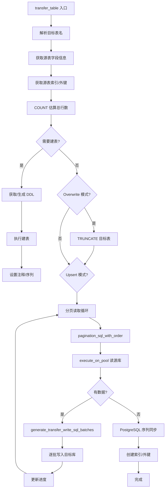
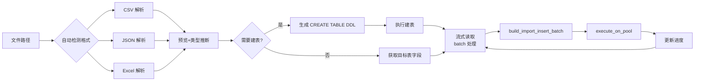
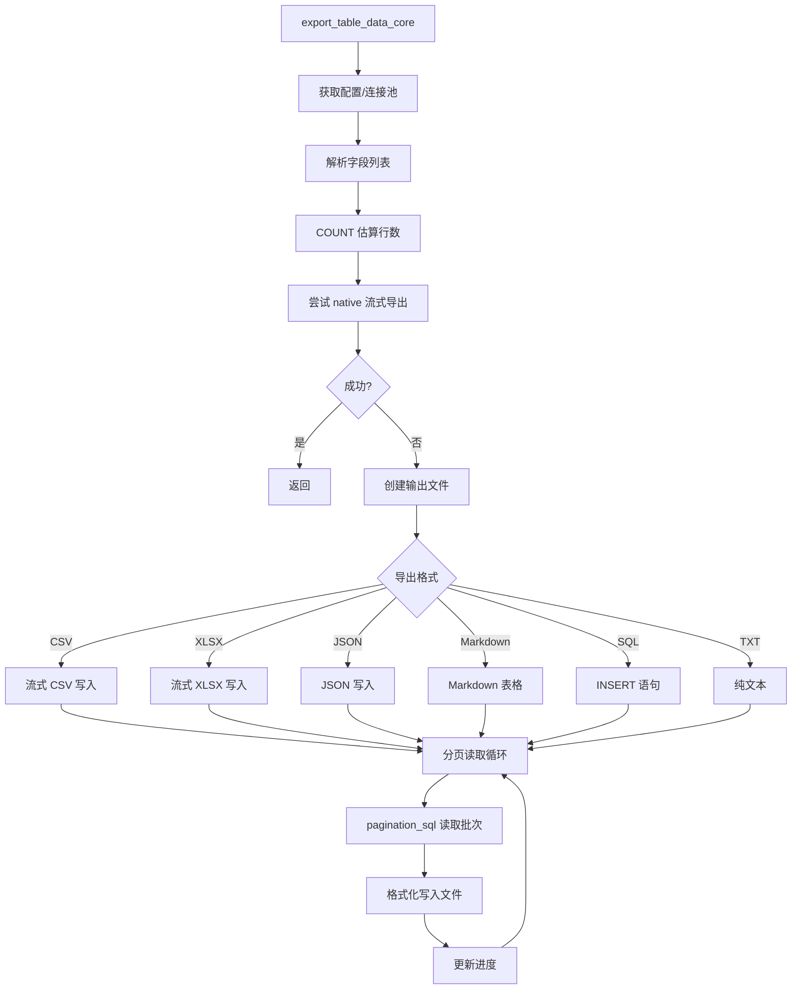

# DBX 源码阅读（六）：数据传输引擎——导入导出与跨库迁移

> 本文基于 dbx v0.1，分析 `crates/dbx-core/src/` 下 transfer、table_import、table_export、csv_export、xlsx_export、database_export 等模块

DBX 支持跨数据库类型的数据迁移（如 MySQL → PostgreSQL）、CSV/Excel/JSON 文件导入、多格式导出（CSV/XLSX/JSON/Markdown/SQL）以及整库备份。本文剖析这些能力的实现思路与架构设计。

---

## 一、整体架构学习

### 1.1 跨库迁移管道：读-写循环

数据传输引擎的核心是一个**批处理管道**——从源数据库分页读取数据，逐批写入目标数据库。以 `transfer_table`（`transfer.rs:4002`）为主线：



**为什么用分页循环而非一次性全量查询？**

- 处理大数据集时不耗尽内存
- 支持进度反馈（`progress_callback` 每次 batch 后触发）
- 单 batch 失败时定位到具体行（`parse_mysql_row_error` 解析行号）
- 支持取消检查（每次循环检查 `is_cancelled`）

**核心的批处理写函数（`transfer.rs:1823`）：**

```rust
pub fn generate_insert_typed(
    table: &str,
    schema: &str,
    columns: &[String],
    column_types: &[Option<String>],
    rows: &[Vec<serde_json::Value>],
    db_type: &DatabaseType,
) -> String {
    let col_list = columns.iter().map(|c| quote_identifier(c, db_type)).collect::<Vec<_>>().join(", ");
    let mut sql = format!("INSERT INTO {} ({}) VALUES ",
        qualified_transfer_table(table, schema, db_type), col_list);

    for (i, row) in rows.iter().enumerate() {
        if i > 0 { sql.push_str(", "); }
        sql.push('(');
        for (j, value) in row.iter().enumerate() {
            if j > 0 { sql.push_str(", "); }
            sql.push_str(&escape_value_typed(value, db_type, &column_types[j]));
        }
        sql.push(')');
    }
    sql
}
```

注意它拼接的是批量 INSERT（`INSERT INTO ... VALUES (...), (...)`），而非逐行插入，这大幅减少了网络往返。

### 1.2 传输模式与类型映射

`TransferMode` 支持三种模式：

```rust
pub enum TransferMode {
    Append,     // 追加写入
    Overwrite,  // TRUNCATE 后写入
    Upsert,     // 按主键 UPSERT
}
```

Upsert 的实现会降级：如果目标表无主键或目标数据库不支持（如 ClickHouse、Hive），自动 fallback 到 `Append`。

**跨 DB 类型映射**通过 `map_column_type` 函数（`transfer.rs:1481`）处理，它根据源和目标数据库类型做类型适配：

```rust
pub fn map_column_type(
    source_type: &str,
    _source_db: &DatabaseType,
    target_db: &DatabaseType,
) -> String {
    // PostgreSQL TEXT -> MySQL LONGTEXT
    // MySQL TINYINT(1) -> PostgreSQL BOOLEAN
    // SQL Server NVARCHAR -> MySQL VARCHAR
    // ...
}
```

### 1.3 文件导入管道

`import_table_file_core`（`table_import.rs:1934`）处理 CSV/TSV/JSON/Excel 文件的导入：



**支持的文件格式与编码：**

```rust
pub enum TableImportSourceFormat {
    Csv, Tsv, Delimited, Json, Excel,
}

pub enum TableImportTextEncoding {
    Auto, Utf8, Gbk, Utf16Le, Utf16Be,
}
```

DBX 会尝试自动检测文件编码（通过 BOM 和前 N 字节推断），也支持用户显式指定。处理 CSV 时使用 `csv` crate，Excel 用 `calamine` crate 读取 `.xlsx` / `.xls`。

**CSV 流式导入的精髓**在于非阻塞读取。解析时有一个 `preview_limit` 参数——先解析少量行用于类型推断和建表，然后打开新的 Reader 从头开始批量插入：

```rust
// 前 100 行用于类型推断
let parsed = parse_import_file_with_options(&path, ..., CREATE_TABLE_INFERENCE_ROWS).await?;
let plan = build_import_create_table_plan(&parsed, &mappings, ...)?;
execute_on_pool(state, pool_key, &plan.sql).await?;

// 重新打开 Reader 做批量插入
let (mut reader, config) = open_delimited_csv_reader(&path, format, &options)?;
for record in reader.records() {
    pending_rows.push(...);
    if pending_rows.len() >= batch_size {
        let batch = build_import_insert_batch(&pending_rows, ...)?;
        execute_on_pool(state, pool_key, &batch.sql).await?;
        pending_rows.clear();
    }
}
```

对于文本文件（CSV/TSV），大于 100MB 的文件使用流式解析（`open_delimited_csv_reader` 返回一个惰性 Reader），小于 100MB 的文件一次性读入内存：

```rust
pub const MAX_NON_STREAMING_IMPORT_BYTES: u64 = 100 * 1024 * 1024; // 100MB
```

### 1.4 数据导出管道

`export_table_data_core`（`table_export.rs:885`）是导出的主入口，按格式分派：



**分页方式有两种：**

1. **Keyset Pagination**——当结果集包含所有主键列时使用，使用 `WHERE (pk1, pk2) > (last1, last2) ORDER BY pk LIMIT n`，避免 `OFFSET` 的性能惩罚
2. **Offset-based Pagination**——作为 fallback（无主键或有关联过滤条件时）

```rust
// table_export.rs:941
let use_keyset = !has_custom_filter_or_order
    && !primary_keys.is_empty()
    && primary_keys.iter().all(|pk| col_names.contains(pk));
```

### 1.5 流式 XLSX 写入

Excel 导出是性能设计的一个亮点。一般做法是先在内存中构建完整的数据模型再写盘，但 DBX 使用**流式 XLSX 写入器**，逐行写入 ZIP 包中的 XML 流：

```rust
pub struct StreamingXlsxWriter<W: Write + Seek> {
    zip: zip::ZipWriter<W>,
    columns: Vec<String>,
    column_types: Vec<String>,
    next_row_number: usize,
    trailing_sheets: Vec<XlsxWorksheetData>,
}
```

它的工作方式：
1. 初始化时先写入 ZIP 骨架（`[Content_Types].xml`、`_rels/.rels`、`xl/workbook.xml` 等）
2. 写入 sheet1.xml 的 XML 头部（列宽、表头）
3. 逐行调用 `write_row`，每行追加 `<row>` XML 片段
4. 完成时调用 `finish` 封口

```rust
// 初始化骨架
write_zip_entry(&mut zip, "[Content_Types].xml", &content_types_xml_for_sheet_count(sheet_count))?;
write_zip_entry(&mut zip, "_rels/.rels", root_rels_xml())?;
write_zip_entry(&mut zip, "xl/workbook.xml", &workbook_xml_for_sheets(&sheet_names))?;
write_zip_entry(&mut zip, "xl/styles.xml", styles_xml())?;

// 开始 sheet1.xml 并写入表头
zip.start_file("xl/worksheets/sheet1.xml", xlsx_zip_options())?;
zip.write_all(b"<?xml version=\"1.0\" encoding=\"UTF-8\" standalone=\"yes\"?>")?;
zip.write_all(sheet_header_xml(sheet_name))?;
zip.write_all(cols_xml(&widths).as_bytes())?;
zip.write_all(header_row_xml(columns).as_bytes())?;

// 逐行写入数据
for row in rows {
    let xml = data_row_xml(next_row_number, columns, column_types, row);
    zip.write_all(xml.as_bytes())?;
    next_row_number += 1;
}
```

**为什么需要 `Write + Seek`？** 因为 ZIP 格式需要文件末尾写 `central directory`——这是所有 ZIP 条目的索引，必须在写完所有内容后回退到文件末尾写入。

### 1.6 CSV 导出的热路径优化

CSV 导出被反复调用，是性能敏感路径。在 `csv_export.rs` 中可以看到几处针对性优化：

1. **直接字符操作而非正则/替换**：转义 `"` 时手动查找并插入，避免了正则表达式的开销

```rust
fn push_csv_escaped_content(out: &mut String, value: &str) {
    let mut rest = value;
    while let Some(pos) = rest.find('"') {
        out.push_str(&rest[..=pos]);
        out.push('"');               // 再补一个 " 实现双写
        rest = &rest[pos + 1..];
    }
    out.push_str(rest);
}
```

2. **预分配容量**：估算行容量减少 String 扩容次数

```rust
fn estimated_rows_capacity(rows: &[Vec<Value>]) -> usize {
    // 每行 80 字节的平均估算，加上列数因子
    rows.len() * 80 + 1024
}
```

3. **`BufWriter` 包装 File**：减少系统调用次数

```rust
let file = std::fs::File::create(&request.file_path).map_err(...)?;
let mut file = BufWriter::new(file);
```

4. **BOM 写入**：CSV 文件开头写入 UTF-8 BOM（`\xEF\xBB\xBF`），确保 Excel 正确识别 UTF-8 编码

### 1.7 数据库整库备份

`database_export.rs` 实现了完整的数据库备份——生成 DDL + INSERT 语句的 SQL dump 文件：

```rust
pub struct DatabaseExportRequest {
    pub export_id: String,
    pub connection_id: String,
    pub database: String,
    pub schema: String,
    pub selected_tables: Vec<String>,
    pub excluded_tables: Vec<String>,
    pub include_structure: bool,
    pub include_data: bool,
    pub include_objects: bool,     // 存储过程、函数、触发器等
    pub drop_table_if_exists: bool,
    pub fail_on_error: bool,
    pub batch_size: usize,
}
```

导出时先写入对象定义（表结构、视图、函数等），后写入数据，每个 INSERT 语句包含最多 100 行数据。支持通过 `EXPORT_CANCELLED` 全局 HashSet 取消。

---

## 二、优秀代码学习

### 2.1 模式：跨库迁移的取消机制

transfer.rs 使用全局 `HashSet` 来标记取消请求：

```rust
static CANCELLED: std::sync::LazyLock<RwLock<HashSet<String>>> =
    std::sync::LazyLock::new(|| RwLock::new(HashSet::new()));

pub fn mark_transfer_cancelled(transfer_id: &str) {
    CANCELLED.write().unwrap_or_else(|e| e.into_inner()).insert(transfer_id.to_string());
}

pub async fn is_cancelled(transfer_id: &str) -> bool {
    CANCELLED.read().unwrap_or_else(|e| e.into_inner()).contains(transfer_id)
}

fn clear_transfer_cancelled(transfer_id: &str) {
    CANCELLED.write().unwrap_or_else(|e| e.into_inner()).remove(transfer_id);
}
```

**为什么用全局静态而非挂在 AppState 上？**

因为 `transfer_table` 函数可能需要被多个上下文调用，而且 `LazyLock` 开箱即用，代码更简洁。缺点是全局状态在测试中需要清理。

每次批处理循环开始时检查取消标识：

```rust
loop {
    if is_cancelled(&request.transfer_id).await {
        return Err("Cancelled".to_string());
    }
    // ... read batch, write batch
}
```

### 2.2 模式：database_export 的导出状态跟踪

导出状态复用了一种健壮的「进度回调」模式：

```rust
pub async fn export_database_core<F>(
    state: &AppState,
    request: &DatabaseExportRequest,
    progress_callback: F,
) -> Result<(), String>
```

`progress_callback` 是一个闭包，由调用方（一般是桌面 UI 或 WebSocket 处理函数）提供，负责将进度推送到前端。这种方式避免了在库内部耦合具体的传输层实现。

状态枚举覆盖了完整的生命周期：

```rust
pub enum ExportStatus {
    Running,
    Writing,
    Done,
    Error,
    Cancelled,
}
```

### 2.3 模式：transfer.rs 中 DDL 的健康处理

跨库迁移时最重要也最易出错的是建表 DDL。DBX 的设计很稳健：

1. **先尝试复用源表 DDL**（`can_reuse_source_ddl`）：当源和目标类型相同时，直接读取 `SHOW CREATE TABLE` 并做简单的 schema/表名替换
2. **如果失败或类型不同，使用 `generate_create_table_ddl`**：根据字段信息手工构建兼容的建表语句
3. **DDL 分解执行**：`transfer_ddl_statements` 将一条 DDL 拆为多条语句，分离外键索引等约束的创建时机，避免建表时引用不存在的表

```rust
async fn execute_transfer_ddl_on_pool(state: &AppState, pool_key: &str, sql: &str, db_type: &DatabaseType) -> Result<(), String> {
    for statement in transfer_ddl_statements(sql, db_type) {
        execute_on_pool(state, pool_key, &statement).await?;
    }
    Ok(())
}
```

4. **建表冲突容错**：`transfer_create_table_created` 将 "already exists" 类错误视为成功（返回 `Ok(false)` 表示表已存在），而不是直接失败

### 2.4 骨架代码：分页批处理写入器

跨数据库数据传输的核心骨架可以抽象为以下模式：

```rust
/// 骨架：带进度回调的分页批处理
async fn batch_transfer<F>(
    source: &SourcePool,
    target: &TargetPool,
    table: &str,
    schema: &str,
    batch_size: usize,
    on_progress: F,
) -> Result<u64, String>
where
    F: Fn(u64, Option<u64>),  // (transferred, total)
{
    let total = count_rows(source, table, schema).await?;
    let mut offset = 0u64;
    let mut transferred = 0u64;

    loop {
        // 1. 分页读取
        let sql = format!("SELECT * FROM {table} ORDER BY pk LIMIT {batch_size} OFFSET {offset}");
        let batch = execute_query(source, &sql).await?;
        let count = batch.rows.len();

        if count == 0 { break; }

        // 2. 批量写入
        let insert_sql = build_batch_insert(table, &batch.columns, &batch.rows);
        execute_query(target, &insert_sql).await?;

        // 3. 更新状态
        transferred += count as u64;
        offset += count as u64;
        on_progress(transferred, total);

        if count < batch_size { break; }
    }

    Ok(transferred)
}
```

### 2.5 骨架代码：流式文件导出器

DBX 的流式 XLSX 模式可以泛化为更通用的流式导出骨架：

```rust
/// 骨架：流式文件导出器
struct StreamingExporter<W: Write> {
    writer: W,
    header_written: bool,
    rows_exported: u64,
}

impl<W: Write> StreamingExporter<W> {
    fn new(writer: W) -> Self {
        Self { writer, header_written: false, rows_exported: 0 }
    }

    fn write_header(&mut self, columns: &[String]) -> Result<(), String> {
        // 写入格式特定的文件头
        self.header_written = true;
        Ok(())
    }

    fn write_batch(&mut self, columns: &[String], rows: &[Vec<Value>]) -> Result<(), String> {
        if !self.header_written {
            self.write_header(columns)?;
        }
        for row in rows {
            self.write_row(columns, row)?;
            self.rows_exported += 1;
        }
        Ok(())
    }

    fn write_row(&mut self, columns: &[String], row: &[Value]) -> Result<(), String> {
        // 由子类实现格式特定的行列写入
        Ok(())
    }

    fn finish(self) -> Result<(), String> {
        Ok(())
    }
}
```

### 2.6 反模式警示：大文件导入的前期推断

在 `table_import.rs` 中，有一个值得注意的设计权衡。当用户导入 CSV 并选择「创建新表」时，DBX 需要先推断列类型来生成 `CREATE TABLE` DDL。它采取的做法是：

1. 先读取前 100 行用于类型推断和建表
2. 重新打开文件进行全量流式导入

```rust
// 第一阶段：解析前 100 行建表
let parsed = parse_import_file_with_options(&path, ..., CREATE_TABLE_INFERENCE_ROWS).await?;

// 第二阶段：重新打开文件做流式导入
let (mut reader, config, _) = open_delimited_csv_reader(&path, format, &options)?;
```

这意味着大文件会被**完整读取两次**。为什么不能一次读完复用？因为 CSV 的 `Reader` 是迭代器式的，遍历一次后无法回退。如果要避免二次读取，需要在内存中缓存所有解析后的行——但这对大文件不可行。

目前 100MB 以下的文件采用非流式路径（直接在内存中操作），只有超 100MB 的文件才走流式路径。所以在当前阈值下，二次读取实际只发生在大型文件上，性能损失可接受。

---

**上一篇：** [Schema 管理与查询引擎](05-schema-query.md)
**返回：** [源码阅读](../index.md)
