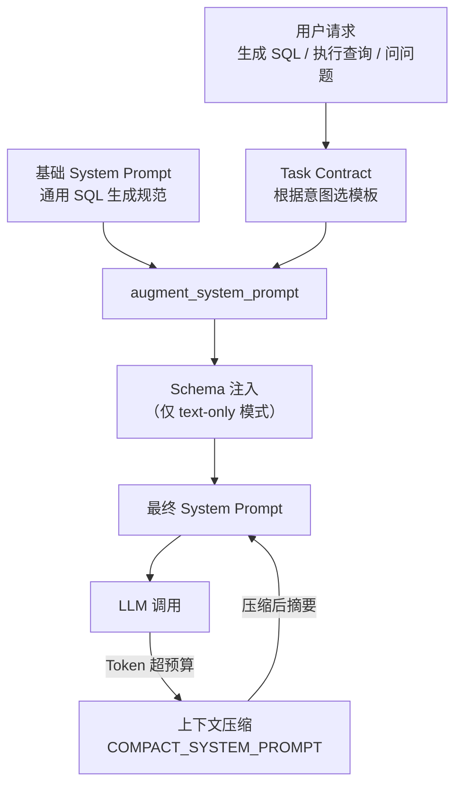

# DBX 源码阅读（七）：Prompt 系统——SQL 生成的完整指令链

> 基于 DBX v0.5.x。本文提取 DBX 中所有 LLM prompt 模板，中英双语对照。按功能分为四组：任务契约、Schema 注入、上下文压缩、Agent 包装。

## 一、任务契约（Task Contract）

任务契约是 DBX prompt 系统的核心——根据用户意图（写 SQL / 执行并解释 / 只问不执行）动态拼接不同的指令。

### 1.1 SQL 生成模式

**用途**：用户要求生成 SQL（不执行）。告诉 LLM 必须产出 fenced SQL code block。

**文件**：`crates/dbx-core/src/agent_loop.rs:488`

```
原文：
This is a SQL-producing action: produce the final SQL in a fenced ```sql
code block. Use tools only as intermediate evidence for schema/dialect;
do not stop at a tool-result summary. In Agent mode, execute a query only
when the original request explicitly asks for real data/results, not when
it merely asks to generate SQL.

译文：
这是一个生成 SQL 的任务：在 ```sql 代码块中输出最终 SQL。
工具仅用于获取 schema/方言等中间信息，不要在工具结果汇总处就停下。
在 Agent 模式下，只有当原始请求明确要求真实数据/结果时才执行查询，
仅仅要求"生成 SQL"时不执行。
```

### 1.2 执行并解释模式

**用途**：用户要求执行 SQL 并解释真实结果。

**文件**：`crates/dbx-core/src/agent_loop.rs:494`

```
原文：
This is an execute-and-explain task: call execute_query to run the
current SQL, then explain the real results.

译文：
这是一个执行并解释的任务：调用 execute_query 执行当前 SQL，
然后解释真实返回的结果。
```

### 1.3 只问模式（Ask Mode）

**用途**：用户只是问问题，不需要执行 SQL。

**文件**：`crates/dbx-core/src/agent_loop.rs:548`

```
原文：
In Ask mode, generate SQL and concise explanation only; do not claim
the SQL was executed.

译文：
在 Ask 模式下，只生成 SQL 和简洁解释；不要声称 SQL 已被执行。
```

### 1.4 Agent 模式变体

**用途**：Agent 模式下的执行并解释——强调先执行再解释。

**文件**：`crates/dbx-core/src/agent_loop.rs:546`

```
原文：
For this execute-and-explain task, run the current SQL via execute_query
and explain the real results.

译文：
对于这个执行并解释任务，通过 execute_query 运行当前 SQL，
并解释真实结果。
```

### 1.5 契约注入格式

**文件**：`crates/dbx-core/src/agent_loop.rs:501`

```
原文：
{system_prompt}

[TASK CONTRACT]
{contract_text}

译文：
{原始系统提示}

[任务契约]
{契约文本}
```

### 设计分析

**为什么用契约而不是硬编码多条 prompt**：

如果每种模式写一条完整的 prompt，改一个公共规则（比如"不要编造数据"）需要改 4 个地方。契约模式把 prompt 分成两层：
- **基础层**（system_prompt）：通用的 SQL 生成规范
- **契约层**（task_contract）：当前任务的具体约束

加新模式时只加一条契约文本，基础层不受影响。

## 二、Schema 注入

**用途**：在 text-only 模式下（没有 tool calling 能力时），把数据库的真实表结构注入 system prompt。

**文件**：`crates/dbx-core/src/agent_loop.rs:750-780`

```rust
// 伪代码表示
async fn build_schema_prompt(ctx, system_prompt) -> String {
    let tables = list_tables_core(ctx).await?;
    
    enriched = system_prompt + "\n\n## Database Schema\n";
    enriched += format!("Database: {}\n", ctx.database);
    enriched += "Tables:\n";
    for table in tables {
        enriched += format!("  - {} ({})", table.name, table.type);
        if table.has_comment {
            enriched += format!(" — {}", table.comment);
        }
    }
    return enriched;
}
```

**注入后的 prompt 结构**：

```
{原始 system_prompt}

## Database Schema (for context — no tools available)
Database: my_database
Tables:
  - users (BASE TABLE) — 用户表
  - orders (BASE TABLE) — 订单表
  - products (BASE TABLE)
```

**设计分析**：

这条不是手写的 prompt——是**程序化生成的**。DBX 没有把 schema 写死在 prompt 里，而是运行时查询真实的数据库结构然后注入。好处：换一个数据库，schema 自动更新，不需要手改 prompt。

## 三、上下文压缩（Compact）

**用途**：对话太长超出 context window 时，把历史对话压缩成结构化摘要。

**文件**：`crates/dbx-core/src/agent_loop.rs:875-878`

```
原文：
You are a conversation summarizer. Produce a concise structured summary
of the conversation provided. Format:
## Progress
## Key Decisions
## Critical Context
## Next Steps
Be factual. No commentary.

译文：
你是一个对话摘要生成器。为提供的对话生成简洁的结构化摘要。格式：
## 进展
## 关键决策
## 关键上下文
## 下一步
只写事实，不要评论。
```

**触发条件**：`estimated_tokens > context_window - reserved_budget`

当预估的总 token 数超过模型 context window 的预算时，触发压缩。保留最近的消息不动，把较早的消息用这个 prompt 压缩成四段式摘要。

## 四、Agent 包装 Prompt

**用途**：当 DBX 作为 CLI Agent（Claude Code、Codex 等）的 MCP provider 运行时，包装原始 system prompt。

**文件**：`crates/dbx-core/src/ai_cli_agent.rs:82-97`

```
原文：
You are running inside DBX Desktop as the {provider_label} CLI provider.
{数据库访问权限说明}
Do not modify files or run shell commands. The DBX MCP server is the
only intended tool surface.

## System instructions
{原始 system_prompt}

## Conversation
{对话历史}

译文：
你正在 DBX Desktop 中以 {provider_label} CLI provider 的身份运行。
{数据库访问权限说明}
不要修改文件或运行 shell 命令。DBX MCP server 是唯一应该使用的工具。

## 系统指令
{原始 system_prompt}

## 对话
{对话历史}
```

**数据库访问权限**有两种变体：

```
读/写模式（用户确认了危险操作）：
"The user explicitly confirmed the proposed database change. DBX MCP
tools may execute write and DDL SQL for this run only."
"用户已明确确认此数据库变更。DBX MCP 工具可在此次运行中执行写入和 DDL SQL。"

只读模式：
"Use the DBX MCP tools when you need live database schema or read-only
query results."
"需要实时数据库 schema 或只读查询结果时，使用 DBX MCP 工具。"
```

## 五、Prompt 架构全景



DBX 的 prompt 系统没有一条「万能 prompt」——它是**分层组装**的：

1. **基础层**——用户配置的 system prompt（可在设置里改）
2. **契约层**——根据任务意图（生成/执行/问答）动态拼接
3. **Schema 层**——运行时查询真实数据库结构注入
4. **压缩层**——对话太长时用独立 prompt 压缩历史
5. **包装层**——CLI Agent 模式额外包装一层安全和工具说明

## 小结

DBX 的 prompt 设计遵循三个原则：

1. **分层，不分叉**——基础 + 契约 + Schema，每层独立可替换
2. **程序化生成优于手写静态文本**——Schema 是运行时查的，不是写死的
3. **用 LLM 压缩 LLM 的对话**——COMPACT_SYSTEM_PROMPT 让 summarizer 把历史对话压缩成四段式摘要，然后作为上下文注入下一轮

---

**上一篇：** [数据传输引擎](06-data-transfer.md)
**返回：** [源码阅读](../index.md)
