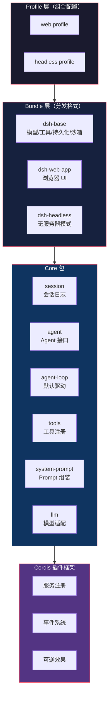
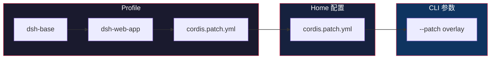
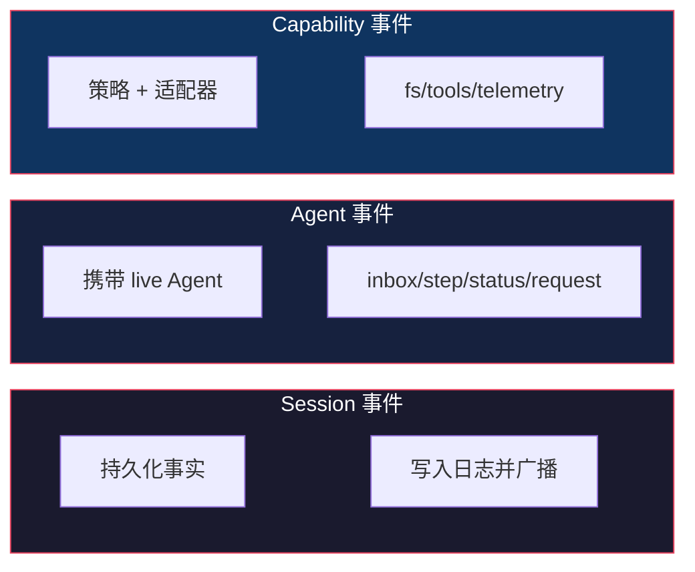

# DeepSeek Harness 架构全景

> 基于 [deepseek-harness](https://github.com/deepseek-ai/deepseek-harness) 源码分析。

## 一句话概括

DeepSeek Harness（`dsh`）是 DeepSeek 开源的 agent 框架，核心设计哲学是**一切皆插件**——模型适配器、工具注册、会话日志、agent 循环本身都是插件，可以随时替换。

底层基于 [Cordis](https://github.com/cordiverse/cordis) 插件框架，核心论文：[_A Programming Paradigm for Spatiotemporal Composability_](https://github.com/cordiverse/paper)。

## 整体架构



## 核心设计：Cordis 插件框架

Cordis 是 dsh 的骨架，五个核心概念：

### 1. 插件即服务

```typescript
// 一个插件就是一个实现了 Service 的对象
// 可以是函数，也可以是 Service 子类
export function apply(ctx: Context) {
  // 注册服务
  ctx.provide('tools', new ToolRegistry(ctx))
}
```

### 2. Context 是服务仓库

每个服务通过 `ctx.<key>` 注册，其他插件通过 key 查找，不直接 import 具体实现：

```typescript
// 注册
ctx.tools = new ToolRegistry(ctx)

// 使用（通过 key 查找）
const tools = ctx.tools
```

### 3. 依赖声明式加载

插件通过 `inject` 声明依赖的服务，Cordis 自动等待依赖就绪后再加载：

```typescript
export const inject = ['tools', 'llm']

export function apply(ctx: Context) {
  // tools 和 llm 就绪后才会执行到这里
}
```

### 4. 四种事件分发模式

| 模式 | 等待？ | 顺序 | 有返回值？ |
|------|--------|------|-----------|
| `emit` | 否 | 注册顺序 | 无 |
| `waterfall` | 否 | 注册顺序 | 有 |
| `parallel` | 是 | 并行 | 无 |
| `serial` | 是 | 注册顺序 | 有 |

`waterfall` 是中间件模式——监听器接收 `(...args, next)`，调用 `next()` 委托给下一个，不调用则短路。

### 5. 注册即效果，卸载即回滚

所有注册（prompt 段、工具 schema、适配器、监听器）都通过 `ctx.effect()` 或 `ctx.on()` 安装，插件卸载时自动反注册。

## Profile 与 Bundle

一个运行中的 `dsh` 是启动时从配置组装的插件树：



- **Profile**：命名的组合，列出它包含的 Bundle，持有用户自己的 patch
- **Bundle**：分发格式，包含配置行和对应的代码
- **Patch**：按 id 定位配置行，替换或插入新行

`dsh-base` 是所有 Profile 的第一层：模型适配器、工具、持久化、沙箱、审批策略、设置、凭证、遥测。

## 核心包

| 包 | 职责 | `ctx` key |
|---|------|-----------|
| `core/session` | 追加式 SessionEvent 日志 + 内存存储 | `ctx.sessions` |
| `core/system-prompt` | Prompt 段 + 工具 schema 组装 | `ctx.systemPrompt` |
| `core/tools` | 作用域工具注册 + 受保护执行管道 | `ctx.tools` |
| `core/agent` | Agent 接口 + 实时注册表 + `agent/*` 事件 | `ctx.agents` |
| `core/agent-loop` | 默认驱动，实现 Agent 接口 | `ctx.agentLoop` |
| `core/scope` | 每个 agent 的作用域注册原语 | 库，无 key |
| `llm/llm` | 消息/流词汇 + 适配器接口 | `ctx.llm` |

## 事件体系

事件是扩展点，分三个域：



- **Session 事件**：持久化事实，写入日志，跨重载存活
- **Agent 事件**：携带 live Agent 引用，观察/拦截进行中的工作
- **Capability 事件**：在接口边界挂载策略和适配器

## Turn 流程

一个 **Step** = 一次模型请求 + 它调用的工具。一个 **Turn** = 零或多个 Step。

```text
turn/start
  claim next-step input + 一条排队消息
  组装 prompt 段 + 工具 schema
  -> agent/pre-step                   reject | enter(messages)
     step/start
     追加 user/message
     从日志派生模型历史
     agent/request -> llm/stream -> assistant/chunk* -> assistant/message
     tool/call* -> tools/pre-execute -> tools/execute -> tools/post-execute -> tool/result*
     step/end
     工具欠另一个请求，或 next-step input 到达 -> claim -> next step
  -> agent/turn-stopping
turn/end
```

## 能力接口（Seam）

一个 **Seam** = 三个角色：**服务定义**（接口）、**服务提供者**（实现）、**消费者**（通常是面向模型的工具）。

为什么重要？因为一个提供者替换就能改变整个产品。文件系统和子进程共享同一个执行世界——把它们指向远程沙箱，Bash、PTY、LSP 一起迁移，不需要 fork 提供者。

## 优秀代码：插件式架构的骨架

### 源码

```typescript
// packages/core/agent/src/index.ts（简化）
export class AgentService {
  constructor(public ctx: Context) {
    // 注册为 ctx.agents
    ctx.provide('agents', this)
    // 监听事件
    ctx.on('agent/pre-step', this.onPreStep.bind(this))
    ctx.on('agent/request', this.onRequest.bind(this))
  }

  // 注册一个新 agent
  register(config: AgentConfig): Disposable {
    const agent = new Agent(this.ctx, config)
    this.agents.set(agent.id, agent)
    return () => this.agents.delete(agent.id) // 卸载时自动清理
  }
}
```

### 好在哪

1. **`ctx.provide` 注册服务**——其他插件通过 `ctx.agents` 查找，不直接 import
2. **`ctx.on` 监听事件**——事件驱动，不硬编码调用关系
3. **返回 Disposable**——注册即效果，卸载即回滚，不需要手动清理

### 模式

**Service Locator + Observer**：通过 Context 注册和查找服务，通过事件系统解耦通信。

### 骨架代码

```typescript
// 你的项目中：用同样的模式构建插件系统
class PluginContext {
  private services = new Map<string, any>()
  private listeners = new Map<string, Function[]>()
  private disposers: Function[] = []

  provide(key: string, service: any) {
    this.services.set(key, service)
    this.disposers.push(() => this.services.delete(key))
  }

  get<T>(key: string): T {
    return this.services.get(key) as T
  }

  on(event: string, handler: Function) {
    if (!this.listeners.has(event)) this.listeners.set(event, [])
    this.listeners.get(event)!.push(handler)
    this.disposers.push(() => {
      const list = this.listeners.get(event)
      if (list) list.splice(list.indexOf(handler), 1)
    })
  }

  emit(event: string, ...args: any[]) {
    this.listeners.get(event)?.forEach(fn => fn(...args))
  }

  dispose() {
    this.disposers.reverse().forEach(fn => fn())
  }
}
```

## 总结

DeepSeek Harness 的架构核心是 **Cordis 插件框架**——一切皆插件，通过 Context 注册服务、通过事件解耦通信、通过 Disposable 管理生命周期。Profile 和 Bundle 提供了组合式配置，Patch 机制让所有配置都可替换。

这和传统的"核心 + 插件"架构不同——dsh 没有特权核心，所有功能（包括 agent 循环本身）都是平等的插件。
